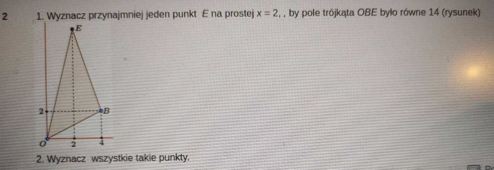

# Zadanie 2

Do rozwiązania tego zadania potrzebujemy znać zastosowanie iloczynu wektorowego. Iloczyn wektorowy jest operacją, która zwraca wektor prostopadły do dwóch wektorów. Długość wektora prostopadłego odpowiada polu powierzchni odpowiedniego równoległoboku tworzonego przez dwa wektory. Ponieważ omawiamy trójkąt, nie równoległobok, to pole powierzchni trójkąta jest połową pola równoległoboku.

Dane są dwa wektory (w postaci współrzędnych):

$$\vec a = \vec{OB}$$
$$\vec b = \vec{OE}$$

Znamy współrzędne wektora $\vec a$:

$$\vec a = (4,2)$$

Współrzędne wektora $\vec b$ znamy tylko częściowo:

$$\vec b = (2,y),$$

gdzie $y$ to nieznana wartość. Znamy również pole trójkąta $OBE = 14$. Pole trójkąta obliczamy ze wzoru:

$$P_{OBE} = \frac{1}{2}|\vec a \times \vec b|.$$

Wzór na iloczyn wektorowy (już w postaci trójwymiarowej) to:

$$\vec a \times \vec b = \begin{bmatrix} a_1 \\ a_2 \\ 0 \end{bmatrix} \times \begin{bmatrix} b_1 \\ b_2 \\ 0 \end{bmatrix} = \begin{bmatrix} 0 \\ 0 \\ a_1b_2 - a_2b_1 \end{bmatrix}.$$

Zatem długość wektora $\vec a \times \vec b$ to:

$$|\vec a \times \vec b| = \sqrt{(a_1b_2 - a_2b_1)^2} = |a_1b_2 - a_2b_1|.$$

Podstawiając znane wartości:

$$|\vec a \times \vec b| = |4\cdot y - 2\cdot 2| = |4y - 4|.$$

Wstawiając do wzoru na pole:

$$14 = \frac{1}{2}|4y - 4| = 2|y-1|.$$
$$ 7 = |y-1|.$$

Rozwiązując równanie otrzymujemy dwie wartości $y$:

$$y_1 = 8,$$
$$y_2 = -6.$$

Czyli, obydwa punkty:

$$E_1 = (2,8),$$
$$E_2 = (2,-6).$$
