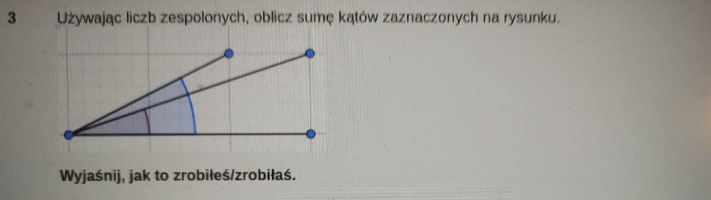
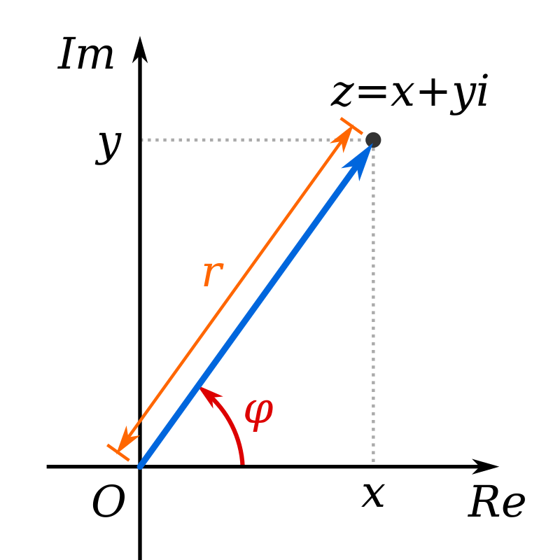

# Zadanie 3

Oznaczmy obydwa kąty jako $\alpha$ oraz $\beta$. Niech $\alpha$ będzie mniejszym z kątów. Dodatkowo, mamy cztery punkty, O (początek układu współrzędnych), A, B oraz C. Przekształcamy rysunek na:

Zamierzamy działać w doktrynie liczb zespolonych. Zauważamy, że mamy siatkę współrzędnych na podstawie której możemy wyliczyć współrzędne punktów A, B oraz C. Nie mamy jednostek, ale ze względu na podobieństwo trójkątów nie jest to istotne - zatem możemy przypisać punktom następujące współrzędne:

$$A = (3,0),$$
$$B = (3,1),$$
$$C = (2,1).$$

Ponieważ chcemy rozwiązać problem w dziedzinie liczb zespolonych, to przypiszemy punktom odpowiednie liczby zespolone:

$$A = 3$$
$$B = 3+i$$
$$C = 2+i$$

(zgodnie z konwencją, że współrzędne $(x,y)$ odpowiadają liczbie $z = x+iy$).

Liczby zespolone mogą być reprezentowane na dwa sposoby. Pierwszy z nich to przedstawiony wyżej $z = x+iy$, czyli współrzędne kartezjańskie. Drugi z nich to współrzędne biegunowe, gdzie liczba zespolona jest reprezentowana jako $z = r(\cos \theta + i\sin \theta)$, gdzie $r$ to odległość od początku układu współrzędnych, a $\theta$ to kąt między osią rzeczywistą a wektorem łączącym punkt z początkiem układu współrzędnych.

Współrzędne biegunowe mogą być również zwinięte do wyrażenia 

$$z = r\exp{\phi}.$$

Jeśli szukamy kąta między dwiema liczbami zespolonymi, to możemy skorzystać z wyrażenia:

$$\cos \theta = \frac{\Re(z_1 \cdot \overline{z_2})}{|z_1|\cdot|z_2|},$$

gdzie operator $\Re$ oznacza część rzeczywistą liczby zespolonej, a $\overline{z}$ to sprzężenie liczby zespolonej (czyli zastąpienie $x+iy$ wyrażeniem $x-iy$). 

Szukamy kąta $\alpha$, tj. kąta między $A$ oraz $B$.

W naszym przypadku, mamy:

$$z_1 = A = 3,$$
$$z_2 = B = 3+i.$$

Obliczamy iloczyn $z_1 \cdot \overline{z_2}$:

$$z_1 \cdot \overline{z_2} = 3 \cdot (3-i) = 9 - 3i.$$

Obliczamy wartości bezwzględne:

$$|z_1| = |3| = 3,$$
$$|z_2| = |3+i| = \sqrt{3^2+1^2} = \sqrt{10}.$$

Obliczamy wartość cosinusa kąta $\alpha$:

$$\cos \alpha = \frac{\Re(z_1 \cdot \overline{z_2})}{|z_1|\cdot|z_2|} = \frac{9}{3\sqrt{10}} = \frac{3}{\sqrt{10}}.$$

Zatem:

$$\alpha = \arccos \frac{3}{\sqrt{10}} \approx 18.43^\circ.$$

Analogicznie obliczamy kąt $\beta$:

$$z_1 = A = 3,$$
$$z_2 = C = 2+i.$$

Obliczamy iloczyn $z_1 \cdot \overline{z_2}$:

$$z_1 \cdot \overline{z_2} = 3 \cdot (2-i) = 6 - 3i.$$

Obliczamy wartości bezwzględne:

$$|z_1| = |3| = 3,$$

$$|z_2| = |2+i| = \sqrt{2^2+1^2} = \sqrt{5}.$$

Obliczamy wartość cosinusa kąta $\beta$:

$$\cos \beta = \frac{\Re(z_1 \cdot \overline{z_2})}{|z_1|\cdot|z_2|} = \frac{6}{3\sqrt{5}} = \frac{2}{\sqrt{5}}.$$

Zatem:

$$\beta = \arccos \frac{2}{\sqrt{5}} \approx 26.57^\circ.$$

Odpowiedź:

$$\alpha = 18.43^\circ,$$
$$\beta = 26.57^\circ.$$

$$\alpha + \beta \approx 45^\circ.$$

(zadanie można wykonać jeszcze inaczej, konstruując punkt D będący zbudowany o przekręcenie punktu C względem punktu A o $\alpha$, a następnie obliczając kąt dla liczby zespolonej $D$).

## Alternatywna metoda

Zauważmy, że sumę kątów możemy uzyskać w jeszcze jeden sposób, poprzez pomnożenie dwóch liczb zespolonych, zgodnie ze wzorem:

$$z_1 \cdot z_2 = r_1 \exp{i\phi_1} \cdot r_2 \exp{i\phi_2} = r_1r_2 \exp{i(\phi_1+\phi_2)}.$$

Zatem musimy pomnożyć liczby zespolone $B$ oraz $C$:

$$B = 3+i = \sqrt{10}\exp{i\arccos \frac{3}{\sqrt{10}}},$$
$$C = 2+i = \sqrt{5}\exp{i\arccos \frac{2}{\sqrt{5}}}.$$

Obliczamy iloczyn:

$$D = B \cdot C = (3+i)(2+i) = 6 + 5i - 1 = 5 + 5i$$

Kąt między $D$ oraz $A$ to:

$$\cos \gamma = \frac{\Re(D \cdot \overline{A})}{|D|\cdot|A|}$$

$$\cos \gamma = \frac{\Re((5+5i)\cdot 3)}{|5+5i||3|}$$

$$\cos \gamma = \frac{\Re(5+5i)}{\sqrt{10}}$$

$$\cos \gamma = \frac{5}{\sqrt{10}} = \frac{1}{\sqrt{2}} = \frac{\sqrt{2}}{2}$$   

$$\gamma = \arccos \frac{\sqrt2}{2} = 45^\circ$$