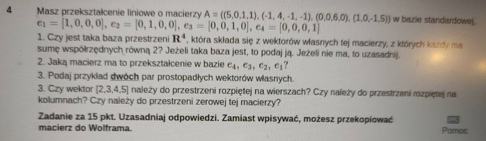

# Zadanie 4

Dana jest macierz $A$:

$$A = \begin{bmatrix} 5 & 0 & 1 & 1 \\ -1 & 4 & -1 & -1 \\ 0 & 0 & 6 & 0 \\ 1 & 0 & -1 & 5 \end{bmatrix}.$$

Zadanie wymaga znalezienia wektorów własnych tej macierzy, tj. takich wektorów, które będą spełniały wyrażenie:

$$A\vec v = \lambda \vec v,$$

gdzie $\lambda$ jest skalarem (liczbą), nazywaną **wartością własną**. Do znalezienia wektorów własnych potrzebujemy znaleźć najpierw wartości własne macierzy. Zrobimy to opierając się na równaniu:

$$\det(A - \lambda I) = 0,$$

(gdzie $I$ to macierz jednostkowa).

Zatem:

$$A - \lambda I = \begin{bmatrix} 5-\lambda & 0 & 1 & 1 \\ -1 & 4-\lambda & -1 & -1 \\ 0 & 0 & 6-\lambda & 0 \\ 1 & 0 & -1 & 5-\lambda \end{bmatrix}.$$

Obliczamy wyznacznik tej macierzy metodą Studenta, tj. przekopiowując do Wolframa:

$$\det(A - \lambda I) = \lambda^4 - 20\lambda^3 + 148\lambda^2 - 480\lambda + 576 = (\lambda-6)^2(\lambda-4)^2.$$

Oznacza to, że mamy dwa wektory o wartościach własnych $\lambda_1 = 6$ oraz dwa o wartościach własnych $\lambda_2 = 4$.

Poszukiwanie wektorów własnych polega na znalezieniu jądra macierzy $A - \lambda I$, tj. takich wektorów, które przemnożone przez macierz zwracają wektor $0$. Dla $\lambda_1 = 6$ mamy:

$$A - 6I = \begin{bmatrix} -1 & 0 & 1 & 1 \\ -1 & -2 & -1 & -1 \\ 0 & 0 & 0 & 0 \\ 1 & 0 & -1 & -1 \end{bmatrix}.$$

Natychmiast widzimy, że trzeci wiersz macierzy jest zerowy, zatem wektor własny dla $\lambda_1 = 6$ to $\vec v_1 = (0,0,1,0)$. Możemy sprawdzić, że po przemnożeniu przez macierz dostajemy zero.

Jeśli zignorujemy pierwszą i drugą kolumnę, to wszystkie wiersze są liniowo zależne, tj. można je uzyskać poprzez przemnożenie pierwszego wiersza przez $-1$. Zatem, wektor własny dla $\lambda_1 = 6$ to $\vec v_2 = (0,0,1,-1)$.

Wektory $\vec v_1$ oraz $\vec v_2$ są liniowo niezależne, zatem są to dwa wektory własne dla wartości własnej $\lambda_1 = 6$.

Dalej, liczymy jądro macierzy $A - 4I$:

$$A - 4I = \begin{bmatrix} 1 & 0 & 1 & 1 \\ -1 & 0 & -1 & -1 \\ 0 & 0 & 2 & 0 \\ 1 & 0 & -1 & 1 \end{bmatrix}.$$

Od razu nam się rzuca w oczy, że druga kolumna jest zerowa. Zatem, wektor własny dla $\lambda_2 = 4$ to $\vec v_3 = (0,1,0,0)$.

Ponownie, jeśli zignorujemy trzecią kolumnę, to wszystkie wiersze są liniowo zależne, zatem wektor własny dla $\lambda_2 = 4$ to $\vec v_4 = (1,0,0,-1)$.

Uzyskujemy zatem zestaw czterech wektorów własnych:

$$\vec v_1 = (0,0,1,0),$$
$$\vec v_2 = (0,0,1,-1),$$
$$\vec v_3 = (0,1,0,0),$$
$$\vec v_4 = (1,0,0,-1).$$

Sprawdzamy jeszcze raz, że dla oryginalnej macierzy A są one wektorami własnymi, tj. po przemnożeniu przez macierz zwracają ten sam, ale przemnożony przez liczbę, wektor:

$$A = \begin{bmatrix} 5 & 0 & 1 & 1 \\ -1 & 4 & -1 & -1 \\ 0 & 0 & 6 & 0 \\ 1 & 0 & -1 & 5 \end{bmatrix}.$$

$$A\vec v_1 = \begin{bmatrix} 5 & 0 & 1 & 1 \\ -1 & 4 & -1 & -1 \\ 0 & 0 & 6 & 0 \\ 1 & 0 & -1 & 5 \end{bmatrix} \begin{bmatrix} 0 \\ 0 \\ 1 \\ 0 \end{bmatrix} = \begin{bmatrix} 0 \\ 0 \\ 6 \\ 0 \end{bmatrix},$$

$$A\vec v_2 = \begin{bmatrix} 5 & 0 & 1 & 1 \\ -1 & 4 & -1 & -1 \\ 0 & 0 & 6 & 0 \\ 1 & 0 & -1 & 5 \end{bmatrix} \begin{bmatrix} 0 \\ 0 \\ 1 \\ -1 \end{bmatrix} = \begin{bmatrix} 0 \\ 0 \\ 6 \\ -6 \end{bmatrix},$$

$$A\vec v_3 = \begin{bmatrix} 5 & 0 & 1 & 1 \\ -1 & 4 & -1 & -1 \\ 0 & 0 & 6 & 0 \\ 1 & 0 & -1 & 5 \end{bmatrix} \begin{bmatrix} 0 \\ 1 \\ 0 \\ 0 \end{bmatrix} = \begin{bmatrix} 0 \\ 4 \\ 0 \\ 0 \end{bmatrix},$$

$$A\vec v_4 = \begin{bmatrix} 5 & 0 & 1 & 1 \\ -1 & 4 & -1 & -1 \\ 0 & 0 & 6 & 0 \\ 1 & 0 & -1 & 5 \end{bmatrix} \begin{bmatrix} 1 \\ 0 \\ 0 \\ -1 \end{bmatrix} = \begin{bmatrix} 4 \\ 0 \\ 0 \\ -4 \end{bmatrix}.$$

Mając wektory własne, możemy odpowiedzieć na pytanie, czy jesteśmy w stanie stworzyć taką bazę, w której suma współrzędnych każdego wektora zwraca 2. Nie, ponieważ $\vec v_4$ ma sumę współrzędnych równą 0.

### Podpunkt 2 - zmiana bazy

Zadane zostało pytanie, jak wyglądałaby oryginalna macierz $A$ w bazie $(e_4,e_3,e_2,e_1)$, tj, w bazie z odwróconą kolejnością wektorów. Oznacza to, że każda wartość z $n$ kolumny i $m$ wiersza powinna się znaleźć na $4-n$ kolumnie i $4-m$ wierszu. Zatem, macierz $A$ w nowej bazie to:

$$A' = \begin{bmatrix} 5 & -1 & 0 & 1 \\ 0 & 6 & 0 & 0 \\ -1& -1 & 4 & -1 \\ 1 & 1 & 0 & 5 \end{bmatrix}.$$

### Podpunkt 3 - dwie pary prostopadłych wektorów własnych

Prostopadłość wektorów oznacza, że ich iloczyn skalarny jest równy 0. Zatem, dla wektorów $\vec v_1$ oraz $\vec v_2$:

$$\vec v_2 \cdot \vec v_3 = (0,0,1,-1)\cdot (0,1,0,0) = 0$$
$$\vec v_1 \cdot \vec v_4 = (0,0,1,0)\cdot (1,0,0,-1) = 0$$

### Podpunkt 4 - przestrzeń rozpięta na wierszach, kolumnach, przestrzeń zerowa

**Przestrzeń rozpięta na wierszach** to przestrzeń wektorów, które można uzyskać poprzez liniową kombinację wierszy macierzy. W naszym przypadku, mamy macierz $A$:

$$A = \begin{bmatrix} 5 & 0 & 1 & 1 \\ -1 & 4 & -1 & -1 \\ 0 & 0 & 6 & 0 \\ 1 & 0 & -1 & 5 \end{bmatrix}.$$

więc wektory rozpinające przestrzeń to:

$$\vec v_1 = (5,0,1,1),$$   
$$\vec v_2 = (-1,4,-1,-1),$$
$$\vec v_3 = (0,0,6,0),$$
$$\vec v_4 = (1,0,-1,5).$$

Pytanie sprowadza się do tego, czy te wektory można zsumować do wektora $(2,3,4,5)$. Moglibyśmy oczywiście zgadywać, jednak jeśli rozwiązanie nie jest oczywiste, strasznie sie napracujemy. Ponieważ możemy sprawdzić, że wyznacznik macierzy $A$ jest niezerowy (wynosi 576), wiemy, że te wektory są liniowo niezależne, zatem rozpinają całą przestrzeń $\mathbb{R}^4$. Moglibyśmy kombinować, jak uzyskać z nich wektor $(2,3,4,5)$, ale pytanie było czy można to zrobić, nie natomiast, jak to zrobić.

Analogicznie, przestrzeń rozpięta na kolumnach to przestrzeń wektorów, które można uzyskać poprzez liniową kombinację kolumn macierzy:

$$\vec w_1 = (5,-1,0,1),$$
$$\vec w_2 = (0,4,0,0),$$
$$\vec w_3 = (1,-1,6,-1),$$
$$\vec w_4 = (1,-1,0,5).$$

W dalszym ciągu macierz oparta o te wektory ma niezerowy wyznacznik, zatem wektory te są liniowo niezależne, i rozpinają całą przestrzeń $\mathbb{R}^4$. Informuje to nas, że możemy uzyskać z nich wektor $(2,3,4,5)$ poprzez kombinacje liniowe.

Ostatnie pytanie, czy wektor $(2,3,4,5)$ jest w przestrzeni zerowej macierzy $A$, czyli - czy należy do jego jądra. Wektor należy do jądra macierzy, jeśli po przemnożeniu przez macierz daje wektor zerowy. Jednak, ponieważ wyznacznik macierzy jest niezerowy, to macierz jest odwracalna, zatem jądro macierzy jest przestrzenią zerową, składajacą się jedynie z punktu $0$. Zatem, wektor $(2,3,4,5)$ nie należy do jądra macierzy $A$.