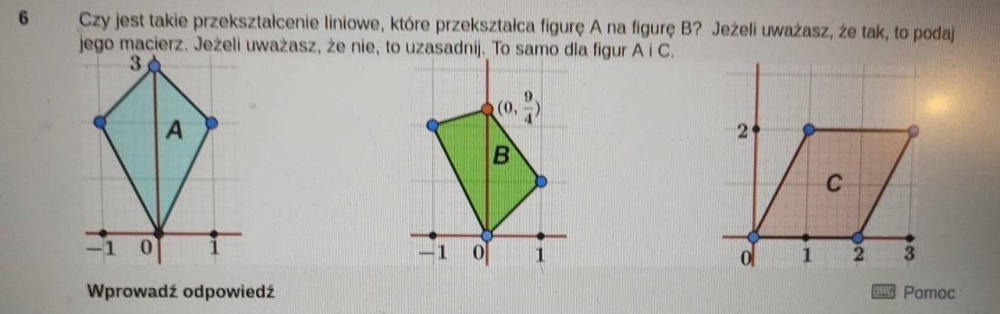

# Zadanie 6

Pytanie sprowadza się do znalezienia przekształcenia liniowego, które zestaw punktów:

\[
A = (-1,2),\\
B = (0,3),\\
C = (1,2),
\]

przekształca na zestaw punktów:

\[
A' = (-1,2),\\
B' = (0,2.25),\\
C' = (1,1),
\]

(punkt $(0,0)$ pomijam, jako że zawsze będzie się transformował na $(0,0)$).

Poszukujemy macierzy $\begin{bmatrix} a & b \\ c & d \end{bmatrix}$, która spełnia równania:

$$\begin{bmatrix} a & b \\ c & d \end{bmatrix} \begin{bmatrix} -1 \\ 2 \end{bmatrix} = \begin{bmatrix} -1 \\ 2 \end{bmatrix},$$
$$\begin{bmatrix} a & b \\ c & d \end{bmatrix} \begin{bmatrix} 0 \\ 3 \end{bmatrix} = \begin{bmatrix} 0 \\ 2.25 \end{bmatrix},$$
$$\begin{bmatrix} a & b \\ c & d \end{bmatrix} \begin{bmatrix} 1 \\ 2 \end{bmatrix} = \begin{bmatrix} 1 \\ 1 \end{bmatrix},$$

Czyli mamy układy równań:

$$\begin{cases} -a + 2b = -1,\\ 3b = 0,\\ a + 2b = 1,\end{cases}$$

oraz

$$\begin{cases} -c + 2d = 2\\ 3d = 2.25\\ c+2d = 1 \end{cases}.$$

Od razu widzimy, że wartość $b=0$, natomiast $a = \frac12$. Wartość $d = 0.75$, natomiast $c = -0.5$. Tak ustalone wartości spełniają równania, zatem macierz przekształcenia to:

$$\begin{bmatrix} 0.5 & 0 \\ -0.5 & 0.75 \end{bmatrix}.$$

Zatem figura $A$ może zostać przekształcona do figury $A'$ za pomocą przekształcenia liniowego.

## Drugi przypadek

W drugim przypadku poszukujemy kolejnego przekształcenia liniowego transformującego punkty:

\[
A = (-1,2),\\
B = (0,3),\\
C = (1,2),
\]

na:

\[
A'' = (1,2),\\
B'' = (3,2),\\
C'' = (2,0).
\]

Ponownie, poszukujemy macierzy $\begin{bmatrix} a & b \\ c & d \end{bmatrix}$, która spełnia równania:

$$\begin{bmatrix} a & b \\ c & d \end{bmatrix} \begin{bmatrix} -1 \\ 2 \end{bmatrix} = \begin{bmatrix} 1 \\ 2 \end{bmatrix},$$
$$\begin{bmatrix} a & b \\ c & d \end{bmatrix} \begin{bmatrix} 0 \\ 3 \end{bmatrix} = \begin{bmatrix} 3 \\ 2 \end{bmatrix},$$
$$\begin{bmatrix} a & b \\ c & d \end{bmatrix} \begin{bmatrix} 1 \\ 2 \end{bmatrix} = \begin{bmatrix} 2 \\ 0 \end{bmatrix},$$

Czyli mamy układy równań:

$$\begin{cases} -a + 2b = 1,\\ 3b = 3,\\ a + 2b = 2,\end{cases}$$

oraz

$$\begin{cases} -c + 2d = 2\\ 3d = 2\\ c+2d = 0 \end{cases}.$$

Od razu widzimy, że wartość $b=1$. Prowadzi to jednak do sprzeczności:

$$\begin{cases} -a + 2 = 1,\\ 3 = 3,\\ a + 2 = 2,\end{cases}$$

czyli $a = 0 = 1$, co jest sprzeczne. Zatem nie istnieje macierz przekształcenia, która spełniałaby równania. Zatem figura $A$ nie może zostać przekształcona do figury $A''$ za pomocą przekształcenia liniowego.