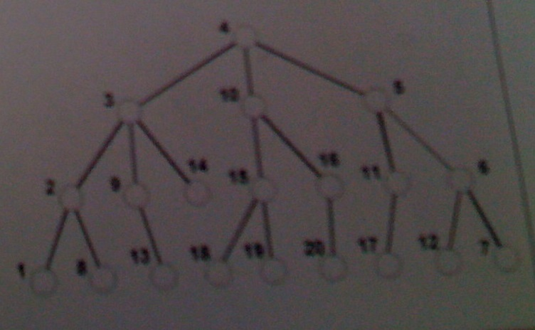
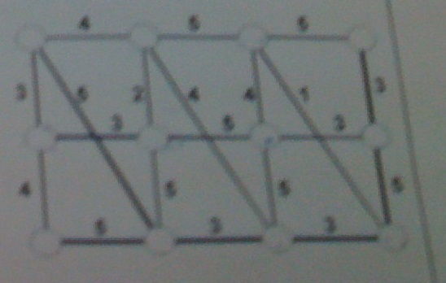
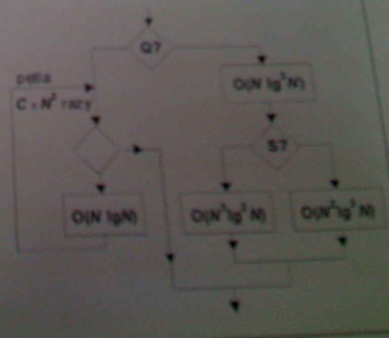
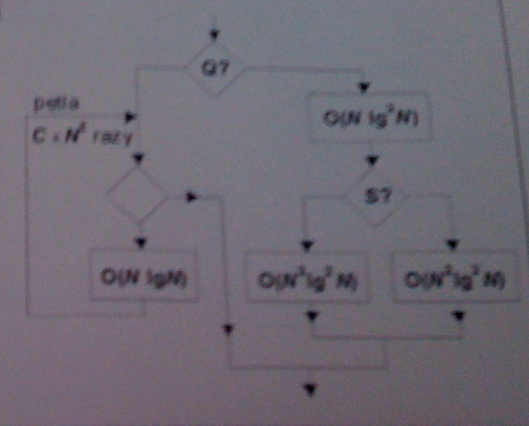

# Egzamin BAL 2009

## Zadanie 1

Dana jest tablica dwuwymiarowa TAB o N wierszach i M kolumnach oraz tablica jednowymiarowa SW o rozmiarze M. Tablicę TAB wypełniono liczbami. Narysuj schemat blokowy algorytmu, który wypełni zmienne w tablicy SW iloczynami liczb z kolejnych kolumn tablicy TAB, pod warunkiem, że te iloczyny są dodatnie, albo wartością 0 jeśli nie są.

Konstruując algorytm posługuj się pętlami warunkowymi typu "aż do". Odwołanie do elementu tablicy położonego w wierszu X i kolumnie Y oznacz TAB(X,Y), a odwołanie do zmiennej z tablicy jednowymiarowej przez SW(Y). Wprowadź odpowieednie zmienne pomocnicze.

## Zadanie 2

Zapisz w jakimkolwiek pseudojęzyku programowania i dodatkowo narysuj schemat blokowy algorytmu przeglądu drzewa wszerz, który ma ułożyć wszystkie jego wierzchołki w ciąg. Podaj kolejność wierzchołków w ciągu wyznaczonym za pomocą tego algorytmu dla podanego obok drzewa o ponumerowanych wierzchołkach (wierzchołek 4 jest jego korzeniem).

## Zadanie 3

Zademonstruj na podanej sieci połączeń jak działa algorytm zachłanny wyznaczajacy "najkrótszą sieć połączeń" pomiędzy węzłami tej sieci; narysuj jak wygląda sieć połączeń po każdej iteracji tego algorytmu. Podaj długość wyznaczonej na koniec sieci połączeń.

Wskaż te cechy użytego algorytmu, które wskazują na zastosowanie w nim metody zachłannej.

## Zadanie 4

Wyznacz oszacowanie rzędu złożoności O(.) w najgorszym przypadku dla algorytmu o podanym schemacie. Przyjmij, że N oznacza rozmiar rozwiązywanego zadania, a wybory warunkowe Q i S zależą od danych wejściowych Przy pętlach podano liczbę ich powtórzeń. Wartość C nie zależy od rozmiaru N.

Posługuj się rachunkiem O(.), formalnie porównuj rzędy złożoności i uzasadniaj postępowanie.

## Zadanie 5

Podaj różnice pomiędzy budową maszyny Turinga i budową automatu skończenie stanowego. Czy oba te modele są uniwersalnymi maszynami obliczeniowymi?

Skonstruuj diagram przejść dla automatu skończenie stanowego, który pracując nad alfabetem {x,y,z} potrafi stwierdzić w ciągu danych wejściowych wystąpienie przynajmniej raz sekwencji "zyyx".