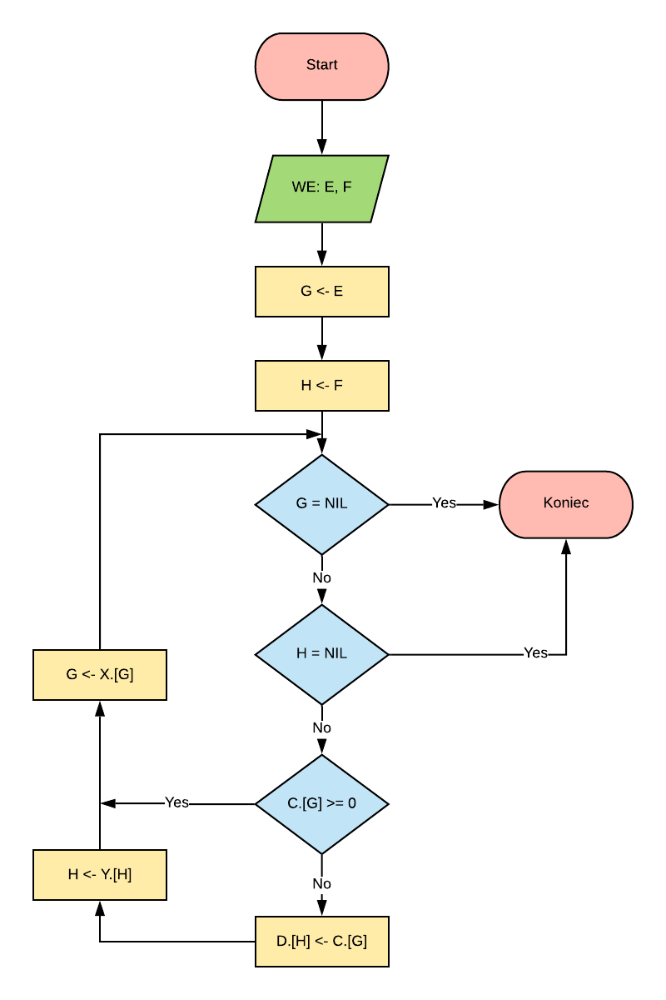
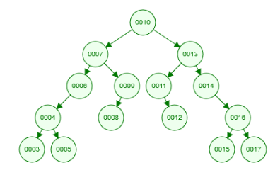
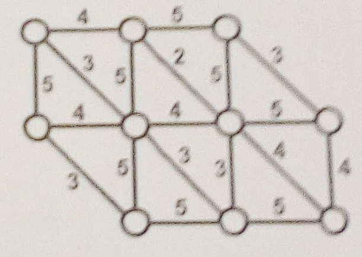
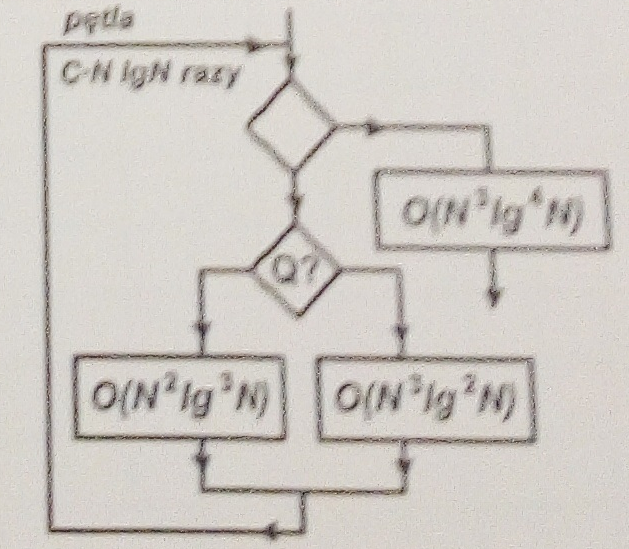

# Egzamin z BAL 2019-2020 - grupa A

## Zadanie 1

W pamięci utworzono dwie wskaźnikowe listy jednokierunkowe: pierwszą z rekordów o dwóch polach C i X i drugą z rekordów o polach D i Y. Pola C i D są zmiennymi typu liczbowego a pola X i Y są wskaźnikami na kolejny rekord. Wskaźnik E zawiera adres pierwszego rekordu w pierwszej liście a F - adres pierwszego rekordu w drugiej liście. W polach C we wszystkich rekordach pierwszej listy zapamiętano liczby całkowite. Pola D mają taki sam typ jak pola C. Nie są podane długości list. Pola wskaźnikowe w ostatnich rekordach obu list zawierają adres pusty NIL.

Narysuj schemat blokowy algorytmu, który przepisze kolejno liczby zapamiętane w polach kluczowych C pierwszej listy do pól kluczowych D w drugiej liście **pomijając liczby większe lub równe zero**. Uwzględnij w konstrukcji algorytmu zabezpieczenie przed sytuacją, w której liczba rekordów w drugiej liście będzie mniejsza niż ilość liczb zapamiętanych w pierwszej liście, które są ujemne.

Jeśli będziesz używał pomocniczych zmiennych wskaźnikowych, to muszą one mieć nazwy K (dla pierwszej listy) i L (dla drugiej listy). Przykładowe odwołanie do pola C w rekordzie wskazywanym przez adres odczytany ze wskaźnika K oznaczaj C.[K].

### Rozwiązanie

### Wskazówki

1. Nie nadpisywać wartości E i F
2. Nie łączyć warunków w jeden, niech będą osobno
3. Nie używać zmiennych pośrednich na wartości jeśli to nie jest konieczne. Na wskaźniki są konieczne.
4. Narysować kilka razy diagram, aby był uformowany w głowie w momencie rysowania na czysto.
5. Wejścia są w sumie dowolne, zapisać na wejściu wertości E i F, czy wpiszesz C,D,X,Y czy nie to w sumie wszystko jedno.

## Zadanie 2

Opisz z jakich obiektów i jak powiązanych jest zbudowana wskaźnikowa struktura danych zwana ukorzenionym drzewem **binarnym**.

Jaka struktura sterująca w algorytmie może w naturalny sposób współpracować z drzewiastą strukturą danych? Jakie cechy tych dwóch struktur powodują, że pasują do siebie?

Zbuduj drzewo BST dla:
a) ciągu liczb: **10,7,9,13,6,14,16,4,5,11,8,12,15,3,17**.
b) ciągu liczb **10,17,11,3,14,9,6,12,15,5,8,7,4,16,13**.

Podaj ile to drzewo ma liści i ile poziomów, jeśli uznajemy, że korzeń jest na pierwszym.

### Rozwiązanie

Ukorzenione drzewo binarne składa się z rekordów w których są przynajmniej trzy pola wskaźnikowe. Jedno zawiera adres rodzica (lub adres NIL jeśli jest to korzeń, czyli pierwszy rekord w drzewie), drugie i trzecie zawierają kolejno adresy lewego i prawego potomka (lub wartości NIL jeśli rekord jest liściem - lub nie posiada jednego z potomków, mówimy wtedy o drzewie niepełnym).

Strukturą sterującą w algorytmie która może naturalnie współpracować z drzewiastą strukturą danych jest rekurencja. Wynika to stąd, że struktura sterująca rekurencji wywołuje siebie samą dla mniejszych zbiorów danych. Struktura danych drzewa natomiast składa się z elementów, z których każdy może być interpretowany jako mniejsze drzewo - dlatego wywołanie funkcji rekurencyjnej może być analogiczne dla elementów potomnych jak i dla rodzica.

Drzewo binarne dla podanego zbioru danych:

### Wskazówki

1. Dać opis bez zbędnych dodatków. Im mniej słów tym lepiej.
2. Drzewo BST ma być niepoukładane.
3. Używać notacji "potomek-rodzic". Pusty wskaźnik ma wartość NIL.

## Zadanie 3

Podaj charakterystyczne cechy algorytmów opartych na metodzie **zachłannej**. Zapisz w pseudokodzie algorytm zachłanny do wyznaczania "najkrótszej sieci kolejowej łączącej wskazane miasta".

Narysuj **krok po kroku**, jak według tego algorytmu będzie wyznaczana "najkrótsza sieć połączeń" pomiędzy punktami w podanej obok sieci połączeń (narysuj sieci wyznaczane w kolejnych iteracjach algorytmu).

Podaj długość wyznaczonej sieci połączeń.

Wskaż te cechy użytego algorytmu, które wskazują na zastosowanie metody zachłannej.

### Rozwiązanie

Algorytmy oparte na metodzie zachłannej działają na zasadzie podejmowania najlepszej decyzji na dany moment, bez cofania się i poprawiania jej później.

Działanie dla przypadku znajdywania najkrótszej sieci połączeń:

1. Wybierz najkrótszy odcinek ze zbioru wszystkich odcinków.
2. Powtarzaj co następuje, aż do połączenia wszystkich węzłów:
2.1. Wybierz zbiór połączeń pomiędzy węzłami już połączonymi a węzłami jeszcze nie połączonymi.
2.2. Z tego zbioru wybierz połączenie o najniższej wartości.

(tutaj obrazek - powinno wyjść 29)

Długość wyznaczonej sieci połączeń wynosi 29.

O tym, że przedstawiony powyżej algorytm jest zachłanny świadczy, że w na każdym etapie wyznaczania sieci podejmowana była decyzja w oparciu o bieżące informacje - optymalizacja lokalna. Dla tego algorytmu doprowadziło to do uzyskania optymalnego rozwiązania - żadna inna sieć połączeń zawierająca wszystkie węzły nie mogłaby mieć niższej wartości sumy połączeń.

### Wskazówki

1. NARYSUJ ROZWIĄZANIE KROK PO KROKU
2. JAK UŻYJESZ ZWROTU "NAJOPTYMALNIEJSZY" TO PRZYJDZIE WRÓŻKA-ALGUSZKA I URWIE CI GŁOWĘ
3. Algorytm opisuj na ogólnym przypadku, nie na miastach i drogach.

## Zadanie 4

Wyznacz rząd pesymistycznej złożoności dla algorytmu o podanym obok schemacie. Przyjmij że N oznacza rozmiar zadania a C pewną stałą niezależną od danych wejściowych. Natomiast wybór warunkowy Q zależy od danych wejściowych. Przy pętlaf podano liczbę ich powtórzeń. Posługuj się rachunkiem O(.), formalnie (asymptotycznie) porównuj rzędy złożoności i uzasadniaj postępowanie.

### Rozwiązanie

Rozwiązujemy dla przypadku pesymistycznego - dla każdego przypadku wybieramy czynnik dominujący przy N -> nieskończoność.

Zaczynamy od warunku (instrukcja sterująca Q?)

O(N^3log^2N) ma wyższą złożoność od O(N^2log^3N), bo:

lim N^3log^2N / N^2log^3N = lim N/log N =H= lim 1/1/N = lim N = nieskończoność.

Oznacza to że N^3log^2N > N^2log^3N dla N -> nieskończoności.

Zatem wewnątrz pętli mamy O(N^3log^2N). Powtórzone to C N log N razy daje nam O (C N^4log ^3N). Notacja O duże pozwala na skrócenie tego do O(N^4log^3N).

Po wyjściu z pętli przechodzimy przez człon o złożoności O(N^3log^4N). Zatem mamy:

O(N^4log^3N) + O(N^3log^4N).

Człon o wyższej złożoności to O(N^4log^3N), bo:

lim N^4log^3N / N^3log^4N = lim N/logN =H= lim 1/1/N = lim N = infinity.

Oznacza to że dla N -> nieskończoność 
O(N^4log^3N) >> O(N^3log^4N). 

Zatem pesymistyczna złożoność to O(N^4log^3N).

### Wskazówki

1. Jak najmniej gadania, same obliczenia.
2. W przypadku wybierania czynnika dominującego **pokaż obliczanie** granic.
3. Użyj metody l'Hospitala.
4. Obliczenia przeprowadź redukując diagram krok po kroku.
5. Pisz wnioski z wyliczania granic.