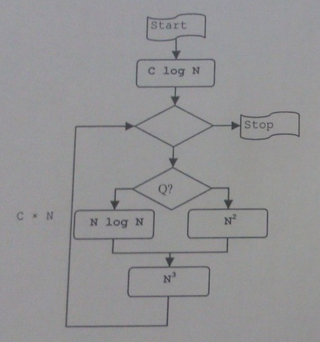
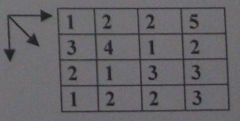

# Pytania egzaminacyjne ze Wstępu do Informatyki

## Zadanie 1

Narysuj schemat blokowy algorytmu, który zsumuje liczby parzyste zapisane w dwuwymiarowej tablicy T o rozmiarze N x M. Wykorzystaj **iterację ograniczoną** zrealizowaną za pomocą iteracji warunkowej "aż do". Omów działanie tej iteracji.

## Zadanie 2

Jakiego typu i jak jest zorganizowana struktura danych zwana stosem? Co należy zrobić, aby zrealizować stos z wykorzystaniem listy dynamicznej?

## Zadanie 3

Zapisz w pseudojęzyku programowania procedurę rekurencyjną realizującą lewostronne obejście drzewa w algorytmie sortowania drzewiastego. Na tym przykładzie wyjaśnij zasadę działania rekurencji.

## Zadanie 4

Jakie byłyby konsekwencje udowodnienia dla jednego z problemów NP-zupełnych, że można go rozwiązać algorytmem o złożoności N^6? Odpowiedź uzasadnij.

## Zadanie 5

Jaką złożoność w najgorszym wypadku miałby algorytm, którego schemat przedstawiono na rysunku poniżej? C oznacza stałą, N oznacza wielkość zadania. Warunek sterujący instrukcją warunkową zależy od danych wejściowych. Uzasadnij odpowiedź.

## Zadanie 6

Opisz metodę rozwiązywania problemów algorytmicznych zwaną "programowaniem dynamicznym". Zilustruj tę metodę wyznaczajac krok po kroku "najkrótszą drogę" z lewego górnego rogu mapy do prawego dolnego roku poruszając się tylko w dół, w prawo lub po skosie w dół na prawo.

