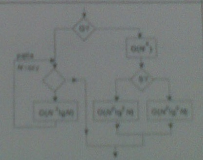

# Zadania

## Zadanie 1

Kwadratową tablicę dwuwymiarową TAB o N wierszach i N kolumach wypełniono liczbami. W oparciu o iterację warunkową typu "dopóki" narysuj schemat blokowy algorytmu, który wyznaczy wiersz, w którym znajduje się największa z liczb umieszczonych na przekątej tej tablicy oraz kolumnę w której znajduje się najmniejsza z tych liczb. Odwołanie do elementu tablicy poożonego w wierszu X i kolumnie Y oznacz TAB(X,Y).

Wprowadź odpowiednie zmienne do przekazania wyniku i zmienne pomocnicze.

## Zadanie 2

Zapisz w jakimkolwiek pseudojęzyku programowania i dodatkowo narysuj schemat blokowy algorytmu wyszukiwania binarnego (tzw. przez połowiczenie) podanego elementu na uporządkowanej liście. Ile razy w tym algorytmie element podany zostanie porównany ze środkowym elementem bieżąćej listy, jeśli elementu podanego nie ma na liście i zawiera ona 70 elementów?

## Zadanie 3

Podaj charakterystyczne cechy algorytmów oparych na metodzie "dziel i zwyciężaj". Opisz w pseudojęzyku programowania algorytm sortowania przez scalanie i wskaż te jego cechy, które wskazują na zastosowanie wymienionej metody. Algorytm wykorzystuje podstawową procedurę. Ile razy zostałaby ona wywołana przy sortowaniu listy zawierającej 13 elementów?

## Zadanie 4

Wyznacz oszacowanie rzędu złożoności O(.) w najgorszym przypadku dla algorytmu o podanym schemacie. Przyjmij, że N oznacza rozmiar zadania a wybory warunkowe Q i S zalezą od danych wejściowych. Przy pętlach podano liczbę ich powtórzeń.

Posługuj się rachunkiem O(.), formalnie porównuj rzędy złożoności i uzasadniaj postępowanie.

## Zadanie 5

Wyjaśnij związki pomiędzy klasami problemów algorytmicznych P, NP, i NP-zupełne. Posługując się maszyną Turinga wyjaśnij pojęcie niedeterministycznej złożoności wielomianowej.