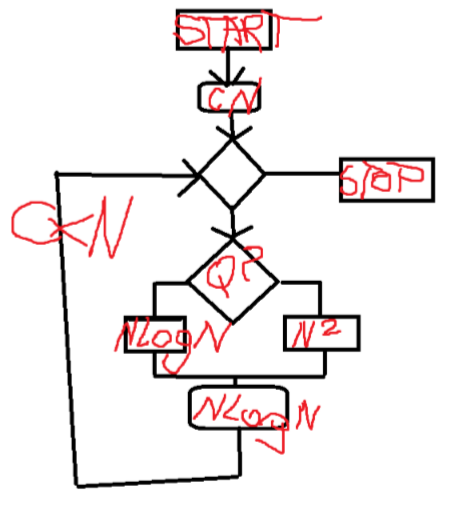
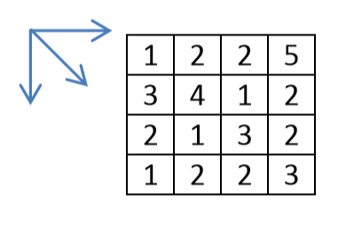

1. Narysuj schemat blokowy algorytmu, który sumuje liczby ujemne zapisane w dwu wymiarowej tablicy o rozmiarze NxM. Wykorzystaj iterację ograniczoną zrealizowaną za pomocą iteracji warunkowej „aż do”. Omów działanie iteracji.

2. Jakiego typu jest struktura danych zwana kolejką. Co należy zrobid aby zrealizowad kolejkę z wykorzystaniem listy dynamicznej. 

3. Zapisz w jakimś pseudo języku procedurę rekurencyjną realizującą prawostronne obejście drzewa w algorytmie sortowania drzewiastego. Wyjaśnij zasadę działania rekurencji.  
4. Mamy algorytm N^3 rozwiązujący zadany problem algorytmiczny. Wyjaśnij kiedy jest zamknięty a kiedy z luką algorytmiczną.  

5. Jaką złożonośd w najgorszym przypadku miałby algorytm (rys. poniżej). C- stała, N- wielkośd zadana(?). Warunek sterujący instrukcją zależy od danych wejściowych. Uzasadnij. 

6. Opisz metodę zachłanną. Zilustruj krok po kroku najkrótszą drogę z lewego górnego rogu mapy do prawego dolnego rogu mapy, poruszając się tylko w dół, w prawo lub po skosie w dół w prawo. 

