# Budowa i analiza algorytmów - ćwiczenia
## Raport z realizacji mini-projektu

Numer projektu: niestandardowy (Algorytm Dijkstry)

Autor: Nowicki Igor

Numer albumu: 18608

Numer grupy zajęciowej: IZ01P03

Termin oddania projektu: 2020.02.01

Termin obrony: -

---

## Treść zadania.

Dany jest graf ważony krawędziowo (o nieujemnych wagach), reprezentowany przez macierz kwadratową. Przykładowo, poniższy graf (rysunek po lewej) będzie reprezentowany przez macierz (rysunek po prawej). 

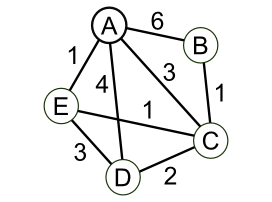 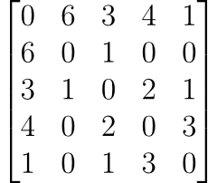

Węzłom A, B, C, D, E odpowiadają indeksy odpowiednio od 1 do 5, w macierzy wartość w i-tej kolumnie i j-tym wierszu odpowiada wadze połączenia między węzłami i oraz j. Brak połączenia jest reprezentowany jako wartość 0.

Stwórz funkcję `dijkstra(g, v1, v2)` która dla danego grafu `g` znajdzie połączenie o najniższej sumie wag pomiędzy parą wierzchołków o indeksach `v1` i `v2` implementując algorytm Dijkstry. Wynik będzie zwracany jako para elementów `lista, wagi`, gdzie `lista` jest listą indeksów wierzchołków optymalnej trasy, natomiast `wagi` to suma wag trasy.

## Opis słowny algorytmu

1. Wejście: 
    1. `GRAF`: N list N-elementowych,   
    2. `START`: numer startowego wierzchołka
    3. `KONIEC`: numer końcowego wierzchołka.

2. Stwórz następujące pojemniki na dane:
    1. Zbiór `NIEODWIEDZONE` zawierajacy wartości od `1` do `N`.
    2. Tablicę `POPRZEDNI` o rozmiarze N.
    3. Tablicę `KOSZT` o rozmiarze N, wypełnioną wartościami `inf`. Na pozycji `START` wpisz wartość `0`.
    4. Zmienną `OSTATNI` równą `-1`.
3. Potwarzaj co następuje tak długo, dopóki zbiór `NIEODWIEDZONE` nie będzie pusty:
    1. Stwórz zmienną `i` zawierajacą pierwszą wartość z `NIEODWIEDZONE`.
    2. Przejdź po wszystkich `j` z `NIEODWIEDZONE`:
        1. Jeśli `KOSZT[j] < KOSZT[i]`, to przypisz `i` wartość `j`.
    2. Wpisz w `POPRZEDNI[i]` wartość `OSTATNI`.
    3. Wpisz w `OSTATNI` wartość `i`.
    4. Wyrzuć ze zbioru `NIEODWIEDZONE` wartość `i`.
    5. Stwórz listę `SĄSIEDZI` w którą wstaw wartości z `GRAF[i]`.
    6. Powtórz co następuje dla wszystkich `j` z zakresu od `1` do `N`:
        1. Jeśli `j` nie istnienie w `NIEODWIEDZONE`, to pomiń to powtórzenie.
        2. Jeśli `SĄSIEDZI[j]` jest równe 0 to pomiń to powtórzenie.
        3. Stwórz `NOWA_WARTOŚĆ` równą `KOSZT[i] + SĄSIEDZI[j]`
        4. Jeśli `NOWA_WARTOŚĆ` jest niższa niż `KOSZT[j]`, to wpisz ją w `KOSZT[j]`. W `POPRZEDNI[j]` wpisz `i`.

4. Stwórz pustą listę `TRASA`.
5. Do zmiennej `OSTATNI` wpisz wartość `KONIEC`.
6. Powtarzaj co następuje:
    1. Jeśli wartość `OSTATNI` jest równa -1, zakończ pętlę
    2. Dopisz wartość `OSTATNI` na początek listy.
    3. Do zmiennej `OSTATNI` wpisz wartość `POPRZEDNI[OSTATNI]`.

7. Zwróć wartości `TRASA` oraz `KOSZT[OSTATNI]`.

## Schemat blokowy

Poniżej jest przedstawiona wersja ogólna dla poszukiwania trasy od wierzchołka start do dowolnego wierzchołka końcowego.

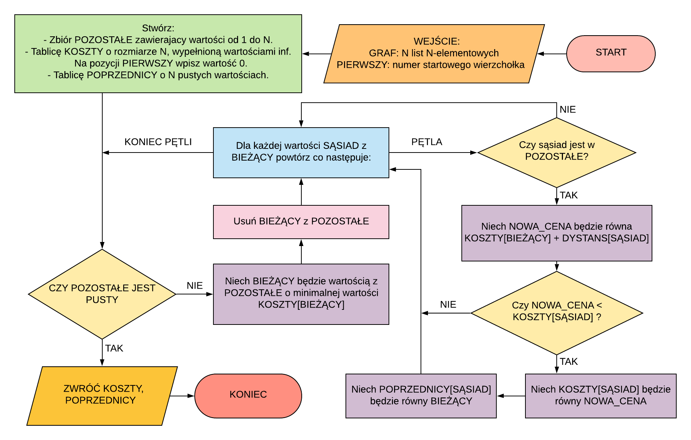

## Symulacja działania algorytmu

Dla podanego grafu:

Inicjalizacja:

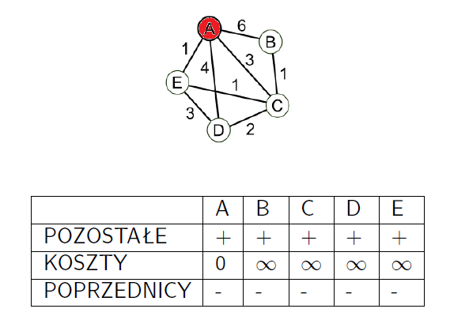

Krok pierwszy:

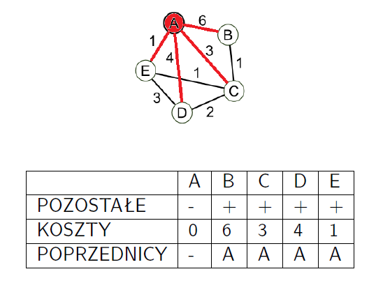

Krok drugi:

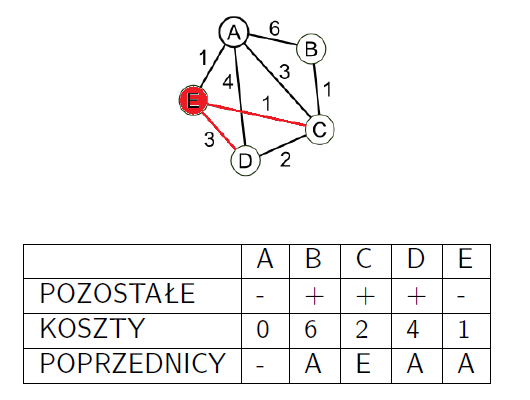

Krok trzeci:

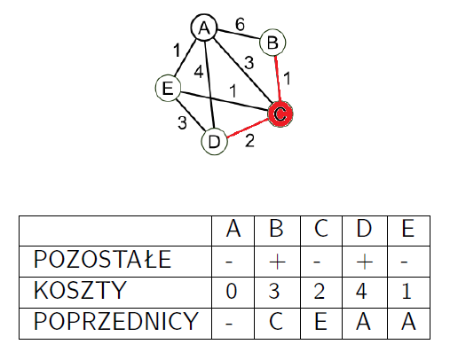

Krok czwarty:

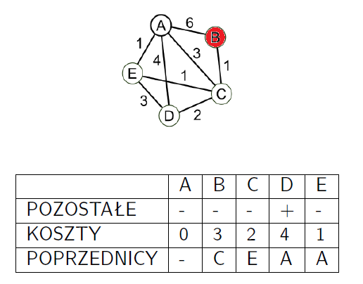

Krok piąty:

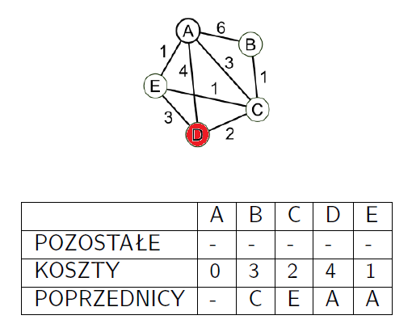

## Zapis algorytmu

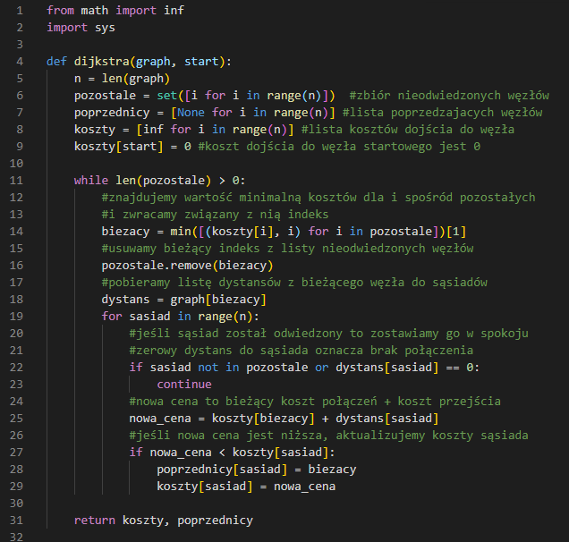

## Oszacowanie złożoności czasowej

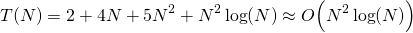

## Wykres zależności czasu liczenia od rozmiaru danych

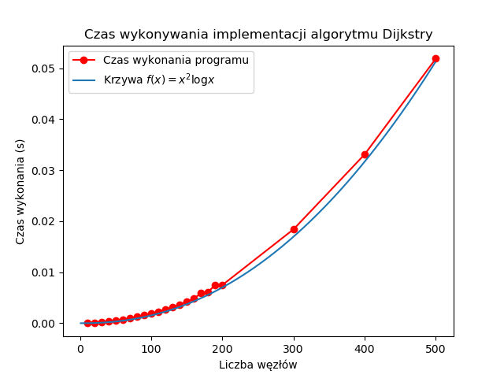

## Podsumowanie i wnioski

Algorytm Dijkstry w swojej poprawnej formie ma złożoność czasową rzędu N log(N), dzięki zastosowaniu struktur kopców. W tym wypadku byłem w stanie zastosować tylko przybliżoną formę, która oddaje ideę działania. Również można mieć uwagę że o ile oryginalna treść zadania mówiła o algorytmie `dijkstra(graf, v1, v2)`, to moja implementacja składała się z dwóch argumentów, `dijkstra(graf, v1)` - to ze względu na fakt, że z takiej funkcji uzyskuje się bardziej ogólne dane - listę `koszty` oraz `poprzednicy` - z których można uzyskać nie tylko trasę i koszt przejścia do pojedynczego węzła, ale do wszystkich węzłów z grafu (zaczynając od `v1`).

