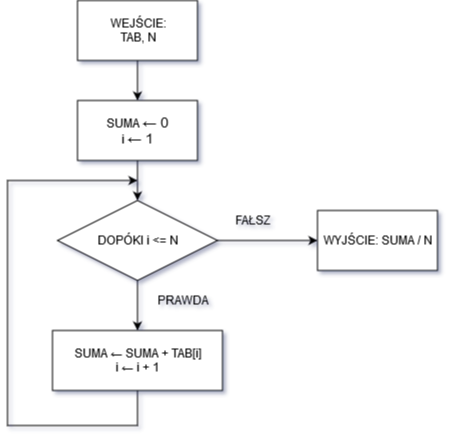

# Zadania

## Zadanie 1
Narysuj schemat blokowy algorytmu obliczania wartości średniej elementów jednowymiarowej tablicy TAB o długości N wykorzystując iterację warunkową typu "dopóki".

Na podstawie schematu blokowego algorytmu oblicz wartość średnią elementów następującej tablicy:

$$TAB[7] = \{6,4,8,3,7,2,5\}.$$

Zapisz w tabelce wartości uzyskiwane w kolejnych iteracjach, zgodnie z algorytmem. Określ funkcję złożoności czasowej algorytmu oraz jego rząd złożoności. Odpowiedź uzasadnij.


Schemat:



```
WEJŚCIE: TAB, N
I <- 1
SUMA <- 0
POWTARZAJ CO NASTĘPUJE DOPÓKI I <= N:
    SUMA <- SUMA + TAB[I]
    I <- I + 1
WYJŚCIE: SUMA / N
```

Obliczanie średniej z tablicy:

```
0. WEJŚCIE TAB = [6,4,8,3,7,2,5], N = 7
1. SUMA = 0, I = 1, N = 7
2. PĘTLA, WARUNEK: I <= N. I = 1
3. WARUNEK PĘTLI SPEŁNIONY (1<=7): SUMA = 6, I = 2
4. WARUNEK PĘTLI SPEŁNIONY (2<=7): SUMA = 10, I = 3
5. WARUNEK PĘTLI SPEŁNIONY (3<=7): SUMA = 18, I = 4
6. WARUNEK PĘTLI SPEŁNIONY (4<=7): SUMA = 21, I = 5
7. WARUNEK PĘTLI SPEŁNIONY (5<=7): SUMA = 28, I = 6
8. WARUNEK PĘTLI SPEŁNIONY (6<=7): SUMA = 30, I = 7
9. WARUNEK PĘTLI SPEŁNIONY (7<=7): SUMA = 35, I = 8
10. WARUNEK PĘTLI ZŁAMANY, WYJŚCIE Z PĘTLI
11. WYJŚCIE SUMA / N = 35 / 7 = 5
```

Funkcja złożoności algorytmu - dwie operacje przypisania, następnie N+1 operacji porównań, N operacji dodania do sumy, N operacji zwiększenia I o jeden. Na koniec jedna operacja dzielenia sumy przez liczbę elementów. Razem:

$$f(N) = 2+(N+1)+N+N+1 = 4 + 3N$$

Rząd złożoności jest liniowy: $O(N)$.

## Zadanie 2

Opisz algorytm sortowania bąbelkowego tablic jednowymiarowych. Przyjmij, że w algorytmie sekwencja jest przeglądana od lewej do prawej, a tablica jest porządkowana od elementu największego do najmniejszego, dla tablicy:

$$TAB[7]= \{6,4,8,3,7,2,5\}.$$

Podaj jak ona wygląda w trakcie działania tego algorytmu po zakończeniu każdego przebiegu iteracji wewnętrznej.

Określ funkcję złożoności czasowej algorytmu oraz jego rząd złożoności. Odpowiedź uzasadnij.

### Rozwiązanie

Opis sortowania bąbelkowego - następującą operację potwarzamy $n$ razy, gdzie $n$ jest liczbą elementów tablicy - przechodzimy po całej tablicy i porównujemy parami elementy. Jeśli elementy nie są w zadanej przez nas kolejności, to zamieniamy je miejscami.

Pseudokod:
```
WEJŚCIE: TAB, N
POWTARZAJ CO NASTĘPUJE N RAZY:
    J <- 0
    POWTARZAJ CO NASTĘPUJE N-1 RAZY:
        J <- J + 1
        A <- TAB[J]
        B <- TAB[J+1]
        JEŻELI A < B:
            TAB[J] = B
            TAB[J+1] = A
ZWRÓĆ TAB
```

Tablica będzie wyglądała następująco:

```
[6,4,8,3,7,2,5] - początek wykonania, przed przebiegiem
[4,8,6,7,3,6,2] - po pierwszym powtórzeniu
[8,6,7,4,6,3,2] - po drugim powtórzeniu
[8,7,6,6,4,3,2] - po trzecim powtórzeniu
[8,7,6,6,4,3,2] - po czwartym powtórzeniu
[8,7,6,6,4,3,2] - po piątym powtórzeniu
[8,7,6,6,4,3,2] - po szóstym powtórzeniu
[8,7,6,6,4,3,2] - po siódmym powtórzeniu
```

Funkcja złożoności czasowej - mamy N powtórzeń jednokrotnego przypisania J i następnie N-1 wewnętrznych powtórzeń co najmniej 3 operacji zmiany wartości oraz jedną operację porównania. Jeśli warunek jest spełniony, mamy dodatkowe dwie operacje przypisania do elementów tablicy. Rozważymy przypadek optymistyczny i pesymistyczny - w optymistycznym nigdy nie musimy robić dodatkowych przypisań, w pesymistycznym zawsze musimy.

$$f_{pesymistyczny} = N\cdot(1+ (N-1)\cdot(6)) = N + 6N^2 - 6N$$
$$f_{optymistyczny} = N\cdot(1+ (N-1)\cdot(4)) = N + 4N^2 - 4N$$

W obydwu przypadkach rząd złożoności jest równy $O(N^2)$.

## Zadanie 3
Przedstaw algorytm sortowania tablic binarnych. Określ funkcje złożoności czasowej algorytmu oraz jego rząd złożoności. Odpowiedź uzasadnij.

## Zadanie 4
Przedstaw algorytm iteracyjny obliczania N-tego wyrazu ciągu Fibonacciego. Korzystając z algorytmu oblicz (w tabelce) wartośc ciągu Fibonacciego dla N=6. Określ funkcję złożoności czasowej alorytmu oraz jego rząd złożoności. Odpowiedź uzasadnij.

