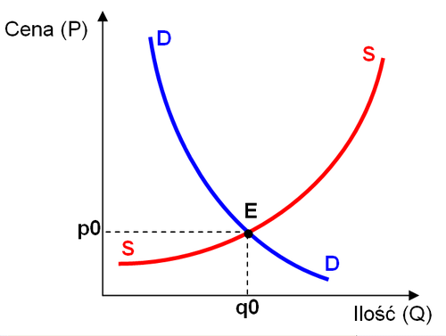

# Mikroekonomia - pytania egzaminacyjne

## Zadanie 1

### Pytanie

Bezpośrednimi czynnikami kształtującymi popyt na dany produkt są, między innymi:
    a) Ceny dóbr substytucyjnych
    b) podaż produktu
    c) sezonowość
    d) koszty produkcji

### Opracowanie

Popyt (demand, D) jest definiowany jako funkcyjna zależność między ceną produktu a ilością jaką są skłonni kupić nabywcy. Na tę skłonność składa się chęć (preferencje) oraz siła nabywcza - ekonomiczna możliwość nabywania produktu.

Czynniki kształtujące wielkość popytu:

- dochód nabywców,
- ceny substytutów,
- ceny dóbr komplementarnych,
- przewidywania co do kształtowania się cen w przyszłości,
- preferencje konsumentów,
- czynniki społeczne, demograficzne i geograficzne,
- sytuacja gospodarcza i polityczna.

### Odpowiedź

Z wyżej wymienionych, bezpośrednim czynnikiem kształtującym popyt jest **cena dóbr substytucyjnych**.

## Zadanie 2

Punkt równowagi rynku konkurencyjnego, to:
    a) Punkt, w którym przy danej cenie popyt i podaż są sobie równe
    b) Punkt optimum przesiębiorstwa
    c) Optimum konsumenta

### Opracowanie

Równowaga rynkowa – w mikroekonomii sytuacja na konkurencyjnym rynku, gdy krzywa popytu przecina krzywą podaży, wyznaczając cenę w równowadze i wielkość transakcji w równowadze. W takiej sytuacji rynek został oczyszczony, czyli wielkość popytu równa się wielkości podaży.

### Odpowiedź

Punkt równowagi rynku konkurencyjnego to **punkt gdzie dla danej ceny popyt i podaż są sobie równe.**

## Zadanie 3

Bezpośrednimi czynnikami kształtującymi podaż danego produktu są, między innymi:
    a) popyt na produkt
    b) koszty przeciętne dostarczenia dobra na rynek
    c) podatki pośrednie

### Opracowanie

Podaż (supply, S) – ilość dóbr, oferowana na rynku przez producentów. Podstawowym czynnikiem wpływającym na wysokość podaży jest cena, co jest prezentowane w formie graficznej za pomocą krzywej podaży.

W ekonomii terminu podaż używa się w dwóch kontekstach:

- wielkość podaży – ilość dobra oferowana na rynku. Zmiany wielkości podaży są obrazowane przez ruch wzdłuż krzywej podaży;
- funkcja podaży – różne ilości dobra, które będą oferowane na rynku w zależności od ceny dobra (zgodnie z prawem podaży). Zmiany funkcji podaży są obrazowane przez przesunięcia krzywej podaży.

Prawo podaży: Przy założeniu ceteris paribus (przy innych warunkach takich samych), wielkość podaży danego towaru zwiększa się, jeśli wzrasta jego cena, natomiast obniżaniu się ceny, towarzyszy spadek wielkości podaży. Poziom wielkości podaży, tak jak poziom wielkości popytu nie zależy tylko od ceny towaru. 

Podaż dowolnego dobra zależy od:
- ceny dobra
- cen czynników produkcji
- technologii produkcji
- opłacalności w innych gałęziach produkcji.

### Odpowiedź.

Możnaby zakładać, że podaż jest kształtowany przez popyt - jednak jest to kształtowanie pośrednie. Ostatecznie też w ekonomii w długim czasie wszystko zależy od wszystkiego. Natomiast bezpośrednio czynnikami kształtującymi podaż danego produktu są **koszty przeciętne dostarczenia dobra na rynek**.

## Zadanie 4

Zasady racjonalnego gospodarowania to:
    a) przy danych zasobach maksymalizacja korzyści, lub dla danego poziomu korzyści minimalizacja zużycia zasobów
    b) uzyskiwania maksymalnego zysku jak najmniejszym kosztem
    c) działania perypatetyczne

### Opracowanie

Zasada racjonalnego gospodarowania (optymalności). Według tej zasady optimum może być określone w dwojaki sposób:

a) przez wskazanie maksymalnej wielkości przewidywanych korzyści jakiegoś przedsięwzięcia (postawionego jako cel działania) przy danym nakładzie środków,
b) przez wskazanie wielkości, odpowiadającej minimalnemu nakładowi środków, przy założeniu osiągnięcia przewidywanych korzyści jakiegoś przedsięwzięcia.

Chcemy albo zmaksymalizować efekt, ALBO zminimalizować koszt dostarczania dobra. NIGDY OBYDWA.

### Odpowiedź

Zasady racjonalnego gospodarowania to **przy danych zasobach maksymalizacja korzyści, lub dla danego poziomu korzyści minimalizacja zużycia zasobów.**

## Zadanie 5

Krzywa obojętności to:

a) dowolna krzywa
b) poziomica dwuargumentowej funkcji użyteczności
c) izokwanta

### Opracowanie

Krzywa obojętności – zbiór takich kombinacji dóbr i usług, które sprawiają konsumentowi jednakowe zadowolenie, czyli dostarczają mu takiej samej użyteczności całkowitej.

Zazwyczaj zakłada się, że krzywe obojętności posiadają następujące właściwości:

- są ujemnie nachylone, co ma miejsce jeżeli żadne z dóbr nie jest niepożądane,
- spłaszczają się w miarę przesuwania się po nich w prawo, co ma miejsce jeżeli zachodzi prawo malejącej krańcowej stopy substytucji,

Ponieważ krzywa po prawej stronie jest bardziej pożądana od krzywej po stronie lewej (gdyż posiada wyższą użyteczność całkowitą), krzywe nie mogą się przecinać na mapie preferencji.

### Odpowiedź

Krzywa obojętności będzie krzywą na wykresie dwóch dóbr i usług, dla których funkcja użyteczności przyjmuje tę samą wartość. Taką krzywą nazywa się **poziomicą**. Zatem:

Krzywa obojętności to **poziomica dwuargumentowej funkcji użyteczności**.

## Zadanie 6

Efekt cenowy, to:
    a) wzrost cen spowodowany przez zwiększone zakupy
    b) zmiana popytu spowodowana przez zmianę cen
    c) inflacja

### Opracowanie

Efekt cenowy - wpływ jaki ma zmiana w wartości na popyt konsumenta na produkt lub usługę na rynku. Efekt cenowy może również się odnosić do wpływu jaki zdarzenie ma na cenę jakiegoś produktu. Efekt cenowy zawiera w sobie efekt substytucyjny i dochodowy.

### Odpowiedź

Efekt cenowy to **zmiana popytu spowodowana przez zmianę cen**.

## Zadanie 7

Efekt dochodowy, to:
a) wzrost cen spowodowany przez zwiększone dochody konsumenta
b) zmiana popytu spowodowana przez zmianę dochodów konsumenta
c) zmiana punktu optimum konsumenta spowodowana przez zmianę cen

### Opracowanie

Efekt dochodowy – efekt obrazujący wpływ zmiany ceny produktu na zmianę zgłaszanego zapotrzebowania na ten produkt, a spowodowanego zmianą siły nabywczej dochodu konsumenta.

Obniżenie ceny zwiększa dochód konsumenta, a tym samym umożliwia mu zakup większej ilości każdego produktu.

Podwyższenie ceny tymczasem powoduje spadek możliwej do zakupienia ilości produktów, spowodowany zmniejszeniem siły nabywczej dochodu. 

### Odpowiedź

Efekt dochodowy to **zmiana popytu spowodowana przez zmianę dochodów konsumenta**.

## Zadanie 8

Dobra Giffena, to:
a) produkty niższej jakości
b) dobra zaspokajające podstawowe potrzeby konsumenta
c) dobra, na które popyt spada wraz ze wzrostem dochodów konsumentów

### Opracowanie

Dobro Giffena - pojęcie z zakresu ekonomii będące odstępstwem od zasady elastyczności popytu, stworzone przez Roberta Giffena.

Oznacza dobro, którego ilość nabywana rośnie nawet w przypadku wzrostu jego ceny.

Dobrami Giffena mogą być w pewnych okolicznościach chleb, ryż, ziemniaki.

### Odpowiedź

Sprawa jest dość skomplikowana, bo można pomylić definicję z wytłumaczeniem zjawiska paradoksu Giffena. Formalnie uznaje się, że w miarę wzrostu dochodów popyt rośnie. Tutaj mamy odwrotną sytuację - w miarę wzrostu cen (czyli sytuacji gdy standardowo popyt powinien spadać) popyt rośnie. Wzrost cen jest równoważny spadkowi dochodów (ale nie cytujcie mnie przy tym, mogę się mylić).

Zatem: Dobra Giffena to **dobra, na które popyt spada wraz ze wzrostem dochodów konsumentów**.

## Zadanie 9

Funkcja produkcji określa:
a) zależność zdolności produkcyjnej od nakładów czynników produkcji
b) wielkość produkcji zapewniającą optymalny zysk
c) w krótkim okresie zależność zdolności produkcyjnych od nakładów pracy (siły roboczej)

### Opracowanie

Przez funkcję produkcji `Y = F (K, L)` rozumieć będziemy funkcję opisującą relację pomiędzy nakładami kapitału `(K)` i pracy `(L)` a wielkością wytworzonego produktu `(Y)`.

Alternatywnie, funkcję produkcji określamy jako zależność pomiędzy wielkością produkcji, a z drugiej strony - nakładami czynników produkcji, a więc jest to funkcja wielu zmiennych. Funkcja produkcji jest także jedną z kategorii teorii produkcji – jest to główna jej kategoria.

Wielkość produkcji – pochodna wielkości nakładów czynników produkcji. 

### Odpowiedź

Napieprzaliśmy te wykresy pół semestru, a ja dalej nie wiem jaka to jest odpowiedź. Na pewno jest to zdolność produkcyjna, bo optymalny zysk to dopiero się wylicza z funkcji produkcji. Mieliśmy również funkcje produkcji dla krótko, średnio i długookresowych analiz, więc odpada rozwiązanie z krótkim okresem.

Funkcja produkcji określa **zależność zdolności produkcyjnej od nakładów czynników produkcji**.

## Zadanie 10

Przeciętna wydajność pracy, to:

a) przeciętna ilość produkcji przypadająca na jednostkę nakładu pracy
b) pochodna wielkości produkcji po wielkości nakładów pracy
c) wzrost produkcji spowodowany przez wzrost nakładu pracy o jedną jednostkę

### Opracowanie

Wydajność (productivity) to miara skuteczności funkcjonowania systemu operacyjnego oraz wskaźnik sprawności i konkurencji danej firmy.

Formy wydajności określa następujący wzór:

wydajność = produkcja / nakłady

Ogółem wydajność czynników produkcji jest wskaźnikiem wykorzystania przez organizację wszystkich jej zasobów, takich jak: kapitał, praca, energia i materiały do wytwarzania jej produktów i usług. Czynniki produkcji obliczane są w jednostkach pieniężnych, ponieważ trudno dodawać w sensowny sposób godziny pracy do ilości surowców. Łączna wydajność czynników produkcji nie mówi zbyt wiele jakich zmian trzeba dokonać w celu poprawienia wydajności. Tak też, znaczna część organizacji uznaje, że bardziej przydatne jest obliczenie cząstkowego współczynnika wydajności, który uwzględnia jedną kategorię zasobów, np. wydajność pracy można obliczać na podstawie wzoru: wydajność pracy = produkcja / nakłady pracy bezpośredniej.

Z wartości bezpośrednich do przeciętnych przechodzimy przez uśrednienie po czynnikach. W ten sposób jeśli chwilowa wydajność to proporcja chwilowej produkcji do chwilowych nakładów, to średnia wydajność będzie proporcją średniej produkcji do średnich nakładów.

### Odpowiedź

Przeciętna wydajność pracy to **przeciętna ilość produkcji przypadająca na jednostkę nakładu pracy.**

## Zadanie 11

Minimalna wielkość kosztu zmiennego jest równa
    a) zero
    b) kosztowi stałemu
    c) kosztowi przeciętnemu

### Opracowanie

Koszty całkowite (total costs) rozbijają się na koszty stałe (fixed costs) i koszty zmienne (variable costs). Na początku - koszty definiujemy jako wydatki ponoszone w związku z wykorzystaniem danych zasobów. Mamy koszty stałe - niezależne od ilości wykorzystywanych zasobów - oraz koszty zmienne - bezpośrednio zależące od ilości wykorzystywanych zasobów, z założeniem że dla zera zasobów mamy zero kosztów.

### Odpowiedź

Minimalna wielkość kosztu zmiennego jest równa **zero.**

## Zadanie 12

12. Koszt krańcowy, to:
    a) maksymalny koszt całkowity
    b) maksymalny koszt przeciętny
    c) przyrost kosztu spowodowany przez wzrost produkcji/sprzedaży o jednostkę

### Opracowanie

Koszt krańcowy (koszt marginalny, ang. marginal cost, MC) - koszt jaki ponosi producent w związku ze zwiększeniem wielkości produkcji danego dobra o jedną jednostkę. Stanowi przyrost kosztów całkowitych związany z produkowaniem dodatkowej jednostki dobra.

Przy danej wielkości produkcji danego dobra producent ponosi określone koszty. Jeżeli zwiększy swoją produkcję o jedną jednostkę, wówczas koszty całkowite produkcji zwiększą się. Różnica w wielkości kosztów jakie producent ponosił wcześniej i kosztów jakie ponosi po zwiększeniu produkcji stanowi właśnie koszt krańcowy. Jest to inaczej koszt wyprodukowania dodatkowej jednostki dobra. 

Wzór: KC = KM = delta KC / delta W

### Odpowiedź

Koszt krańcowy to przyrost kosztu spowodowany przez wzrost produkcji/sprzedaży o jednostkę.

## Zadanie 13

Przychód krańcowy, to:
a) przychód maksymalny
b) utarg maksymalny
c) przyrost przychodu spowodowany przez wzrost produkcji/sprzedaży o jednostkę

### Opracowanie

Przychód krańcowy (ang. marginal revenue, w skrócie MR) to dodatkowy przychód jaki może przynieść sprzedaż dodatkowej jednostki produktu.

Bardziej formalnie, przychód krańcowy to pochodna przychodu całkowitego względem ilości sprzedanego produktu. Jeżeli przychód całkowity to TR i TR = P(Q) * Q, gdzie P(Q) to cena, a Q to ilość sprzedanego produktu, wówczas przychód krańcowy MR wyraża się wzorem: 

MR = delta TR / delta Q

### Odpowiedź

Najwyraźniej krańcowe rzeczy to zmiany w skrajnym przypadku kiedy zwiększamy jakiś czynnik o jednostkę.

Przychód krańcowy to **przyrost przychodu spowodowany przez wzrost produkcji/sprzedaży o jednostkę**.

## Zadanie 14

Celem przedsiębiorstwa prywatnego w gospodarce rynkowej w krótkim okresie jest:

a) maksymalizacja dochodu
b) maksymalizacja zysku
c) maksymalizacja przychodu i minimalizacja kosztu

### Opracowanie

Ponieważ nie można jednocześnie maksymalizować przychodu i minimalizować kosztu, skreślamy od razu trzecią odpowiedź. Zastanawiamy się teraz pomiędzy zyskiem a dochodem. Dochód to inaczej mówiąc zysk brutto. Dochód jest to różnica między przychodami a kosztami.

Dochód – podstawowa kategoria ekonomiczna, wyrażająca dodatni efekt zastosowania czynników wytwórczych: ziemi, pracy, kapitału rzeczowego, kapitału finansowego w procesie gospodarowania. Dochód jest rezultatem połączenia wymienionych czynników wytwórczych oraz przedsiębiorczości człowieka. Dochód w formie pieniężnej jest wyrazem towarów i usług, które podmioty go posiadające mogą za niego nabyć. 

Zysk całkowity (π) – różnica między całkowitymi przychodami (total revenue, TR) przedsiębiorstwa uzyskanymi ze sprzedaży produktów, a całkowitymi kosztami poniesionymi na wytworzenie tych produktów (total cost, TC), czyli 

π = TR - TC

### Odpowiedź

Maksymalizacja dochodu może nie być najlepszym pomysłem, bo może np. wziąć za sobą też bardzo wysokie koszty, co odbije się na zysku. Zatem zależy nam bardziej na maksymalizacji zysku.

Celem przedsiębiorstwa prywatnego w gospodarce rynkowej w krótkim okresie jest **maksymalizacja zysku**.

## Zadanie 15

W optimum ekonomicznym krótkookresowym przedsiębiorstwa:
a) zysk musi być dodatni
b) przychód krańcowy zrównuje się z kosztem krańcowym
c) przychód jest maksymalny a koszt minimalny

### Opracowanie

Optimum ekonomiczne – wielkość produkcji, która maksymalizuje zysk ekonomiczny przedsiębiorstwa lub minimalizuje jego stratę. Wyznacza się ją rozwiązując równanie MC = MR (MC – koszt krańcowy, MR – utarg krańcowy). Zysk jest osiągany w sytuacji gdy ATC (przeciętny całkowity koszt produkcji) dla danej wielkości produkcji musi być mniejsze od ceny (ATC <  P). Analogicznie: jest to punkt przecięcia krzywych MC(Q) i MR(Q) na wykresie zależności MC i MR od Q (wielkości produkcji). 

### Odpowiedź

Punkt przecięcia krzywych MC (mean costs) oraz MR (mean revenue) to miejsce gdzie obydwie wartości się zrównują.

W optimum ekonomicznym krótkookresowym przedsiębiorstwa **przychód krańcowy zrównuje się z kosztem krańcowym**.

# Część zaawansowana

## Zadanie 1

Opisz zjawisko malejących przychodów (korzyści) skali produkcji.

### Opracowanie

Przychód – pojęcie księgowe, które oznacza uzyskany lub należny wpływ wartości, korzyści materialnych w ramach prowadzonej działalności gospodarczej, działalności wykonywanej osobiście, pracy wykonywanej na podstawie stosunku służbowego, stosunku pracy, pracy nakładczej oraz spółdzielczego stosunku pracy oraz z nieruchomości, w tym ze sprzedaży takiej nieruchomości.

Prawo malejących przychodów polega na tym, iż w miarę dodawania dodatkowych porcji jakiegoś czynnika, przy utrzymywaniu innych czynników bez zmian, będziemy uzyskiwać coraz mniej dodatkowego produktu. Inaczej formułując te prawo, krańcowy produkt każdej jednostki czynnika zmniejsza się w miarę wzrostu ilości tego czynnika przy wszystkich innych czynnikach bez zmian.

### Odpowiedź

Funkcja produkcji pomiędzy minimum a maksimum przyjmuje kształt sigmoidy - na samym początku ma wartość zerową. O ile pierwsza pochodna jest przez cały czas nieujemna - tj. wzrost nakładu pracy na pewno nie generuje spadku produkcji - o tyle pierwsza pochodna najpierw rośnie od zera do wartości maksymalnej, a potem maleje z powrotem do zera.

Oznacza to, że druga pochodna jest najpierw dodatnia, potem ujemna - zeruje się w punkcie przegięcia. Opisywany efekt malejących przychodów następuje
po przekroczeniu owego punktu przegięcia - zwiększając ilość pracy uzyskujemy mniejszą niż wcześniej ilość produkcji. W skrajnym przypadku - blisko maksimum - zwiększając ilość pracy nie uzyskujemy wcale zwiększonej produkcji, bądź nawet ilość produkcji spada (jeśli przekroczymy maksimum).

## Zadanie 2

Na czym polega działanie karteli?

### Opracowanie

Kartel – porozumienie lub praktyki uzgodnione przez co najmniej dwóch konkurentów, mające na celu koordynację ich zachowań konkurencyjnych na rynku lub wpłynięcie na istotne czynniki konkurencji poprzez praktyki takie jak: ustalanie lub koordynacja cen nabycia lub sprzedaży bądź innych warunków transakcji, podział poziomu produkcji lub sprzedaży, podział rynków i klientów (w tym zmowa przetargowa), ograniczenia związane z przywozem lub wywozem lub działania antykonkurencyjne skierowane przeciwko innym konkurentom.

Tworzenie karteli pomiędzy przedsiębiorstwami jest nielegalne w Unii Europejskiej oraz w Stanach Zjednoczonych, jak również w wielu innych państwach świata.

### Odpowiedź

Kartel polega na utworzeniu przez kilku konkurentów porozumienia mającego na celu koordynację działań, np. w ustalaniu cen produktów lub świadczonych usług. Może to prowadzić do przypadku zawyżonych cen - kiedy wszyscy główni producenci decydują się nie schodzić pomiędzy arbitralnie ustalonej jednej ceny w celu uzyskania dodatkowego zysku.

## Zadanie 3

Na jednym wykresie przedstaw zależności popytu i podaży od ceny dla zwykłego dobra. Zaznacz punkt konkurencyjnej równowagi rynku. Na tym samym wykresie przedstaw sytuację po wzroście podatków pośrednich.

### Opracowanie

Wykresy popytu (demand) i podaży (supply) od ceny (price) są następujące:

Przeanalizujmy przypadek wzrostu podatków pośrednich, np. narzucenia akcyzy.

Zależnie od tego czy koszty wezmą na siebie dostawcy czy kupujący, mamy dwa przypadki:

Podatek pośredni płacą dostawcy - krzywa podaży przesunie się w lewo - dla tej samej ilości produktu cena będzie odpowiednio większa.

Podatek pośredni płacą kupujący - popyt spada dla tej samej ceny, zatem krzywa popytu przesuwa się w lewo.

## Zadanie 4

Zdefiniuj dobra wyższego rzędu.

### Opracowanie

Elastyczność popytu - miara względnej zmiany popytu, wywołanej względną zmianą określonego czynnika wpływającego na popyt.

W tym wypadku omawiamy zmianę popytu względem zmiany dochodu. Możemy wyróżnić trzy przypadki

- względna zmiana jest mniejsza niż 0
- względna zmiana jest pomiędzy 0 a 1
- względna zmiana jest większa niż 1

Dla przypadku mniejszego niż 0 mówimy o **dobrach niższego rzędu** - popyt na nie spada wraz ze wzrostem dochodów, jako że kupujący mogą sobie pozwolić na droższe (i ideowo, lepszej jakości) produkty.

Dla przypadku pomiędzy 0 a 1 mówimy o **dobrach zwykłych**.
Popyt rośnie ze wzrostem dochodów.

Dla przypadku większego od 1 mówimy o **dobrach wyższego rzędu**, tj. popyt rośnie szybciej niż proporcjonalnie w miarę zwiększania dochodu.

### Odpowiedź

Dobra wyższego rzędu - dobra na które popyt rośnie szybciej niż liniowo dla zwiększających się dochodów. Jest to związane ze współczynnikiem elastyczności większym od 1.

## Zadanie 5

Wyjaśnij zjawisko substytucyjności dóbr.

### Opracowanie

Dobra substytucyjne - to dobra i usługi, które dzięki podobnym cechom, funkcjom (zastosowaniu) czy właściwościom zastępują się wzajemnie w zaspokajaniu określonej potrzeby. Dobro substytucyjne konkuruje z danym dobrem i może je zastępować.

O dobrach substytucyjnych mówimy wówczas, gdy zmiana ceny jednego z nich (jej spadek lub wzrost), przy stałej cenie drugiego, powoduje przesunięcie popytu konsumentów w kierunku dobra tańszego.

### Odpowiedź

Substytucyjność dóbr polega na uzyskaniu tego samego efektu za pomocą różnych produktów - na wykładzie omawialiśmy różne typy alkoholów na uzyskaną satysfakcję (upojenie alkoholowe). Różne alkohole mają różny efekt i różne, niekoniecznie proporcjonalne do efektu ceny.

## Zadanie 6

Zilustruj efekt dochodowy wykresem dla zestawienia dwóch dóbr: niższego i wyższego rzędu.

### Opracowanie

Dobro niższego rzędu charakteryzuje się spadkiem popytu ze wzrostem dochodu - kupujący wybierają komplementarne dobra kiedy ich na to stać.

Alternatywnie, dobro wyższego rzędu to dobro na które popyt rośnie szybciej niż proporcjonalnie w miarę wzrostu dochodu.

Trzeci przypadek, dóbr podstawowych - dobra na które popyt rośnie ze wzrostem dochodu, ale nie szybciej niż propocjonalnie.

## Zadanie 7

Narysuj wykres krótkookresowej zależności (ustalone K, K=K0) zdolności produkcyjnej od nakładów pracy zaznaczając na wykresie poziomy nakładów, przy których:

a) przeciętna wydajność pracy osiąga maksimum
b) krańcowa wydajność pracy osiąga maksimum
c) produkcyjność kapitału osiąga maksimum

### Opracowanie

Krzywa zdolności produkcyjnej od nakładów pracy:

Funkcja przyjmuje wartości od 0 do maksymalnej. Dla uproszczenia nie będziemy patrzeć dalej niż maksimum pracy.

Pochodna funkcji również przyjmuje wartości od zera (początek wykresu) do maksimum (punkt przegiecia) oraz ponownie do zera (maksimum wykresu).

Przeciętna wydajność pracy to ilość zdolności produkcyjnej dzielona na ilość pracy. Maksimum przeciętnej zdolności produkcyjnej jest uzyskiwane dla punktu styku prostej i wykresu możliwości produkcyjnej.

K/L = max
K'/L - K/L^2 = 0
K'L = K

ostatnie równanie - współczynnik kierunkowy razy L musi być równy wartości produkcji. Takie miejsce jest jedynie w miejscu stylu wykresu z linią prostą.

Krańcowa wydajność pracy - pochodna zdolności produkcyjnych po ilości pracy.

Produkcyjność kapitału osiąga maksimum - maksimum funkcji możliwości produkcyjnych od nakładów pracy.

## Zadanie 8

Na wykresie przedstaw izokwantę dla ustalonej wielkości produkcji Q=Q0, linie jednakowego kosztu dla minimalnego kosztu uzyskania produkcji Q0 oraz punkt optimum długookresowego. Na tym samym wykresie przedsstaw nowy punkt optimum będący następstwem spadku płacy (ceny pracy).

## Zadanie 9

Na jednym wykresie przedstaw krótkookresowe zależności przychodu krańcowego, kosztu krańcowego i kosztu przeciętnego od wielkości produkcji w warunkach doskonałej konkurencji. Na tym samym wykresie zaznacz punkt optimum ekonomicznego przedsiębiorstwa.

## Zadanie 10

Na jednym wykresie przedstaw krótkookresowe zależności kosztu i przychodu od wielkości produkcji w warunkach doskonałej konkurencji. Zaznacz punkt, w którym przedsiębiorstwo uzyskuje maksimum zysku (optimum ekonomiczne).