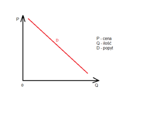

# Egzamin z ekonomii

Wybierz prawidłową odpowiedź zaznaczając jedną z odpowiedzi.

# Zadanie 1

Jeżeli cena jest wyższa od ceny równowagi, wówczas występuje:

a) nadwyżka popytu nad podażą
b) nadwyżka wielkości popytu nad wielkością podaży
c) nadwyżka podaży nad popytem

## Opracowanie

Dla ceny równowagi popyt i podaż są sobie równe, tj. zapotrzebowanie spotyka się z dostarczaniem. W przypadku jeśli cena rośnie, popyt się zmniejsza - działa to praktycznie dla wszystkich dóbr (poza dobrami Giffena i Veblena). Wtedy produkcja jest większa niż zapotrzebowanie (bo ta sama ilość jest produkowana, a mniejsza ilość jest kupowana). Zatem występuje wtedy nadwyżka podaży nad popytem.

## Rozwiązanie

Jeżeli cena jest wyższa od ceny równowagi, wówczas występuje **nadwyżka podaży nad popytem**.

# Zadanie 2

Wzrost ceny dobra spowoduje:
a) przesunięcie krzywej popytu na dobro a w lewo
b) przesunięcie krzywej popytu na dobro a w prawo
c) nie spowoduje przesunięcia krzywej popytu na dobro a, lecz ruch po krzywej popytu w górę i w lewo
d) nie spowoduje przesunięcia krzywej popytu na dobro a, lecz ruch po krzywej popytu w dół i w prawo

## Opracowanie

Krzywa popytu:

Ponieważ krzywa popytu jest bezpośrednio zależnością zapotrzebowania od ceny (aby było zabawniej, cena jest na osi pionowej, popyt na osi poziomej), cała krzywa nie przesuwa się przy zmianie ceny, przesuwa się punkt na krzywej. W tym wypadku cena idąca w górę wiąże się z popytem lecącym w dół, tj. w lewo.

## Odpowiedź

Wzrost ceny dobra **nie spowoduje przesunięcia krzywej popytu na dobro a, lecz ruch po krzywej popytu w górę i w lewo.**

# Zadanie 3a

Przedstaw na wykresie krzywą popytu (oznacz ją symbolem `d`), krzywą podaży (oznacz ją symbolem `s`) oraz punkt równowagi rynkowej (oznacz ten punkt literą `E`). Zaznacz na wykresie cenę równowagi rynkowej (oznacz ją symbolem `P_E`) i cenę minimalną (oznacz ją symbolem `P_min`).

# Zadanie 3b

Wprowadzenie przez państwo cen minimalnych służy:

a) ochronie wybranych grup konsumentów
b) ochronie wybranych grup producentów

# Zadanie 4

Kąt nachylenia linii budżetowej konsumenta zależy od:

a) preferencji konsumpcyjnych
b) relacji cenowych dóbr
c) poziomu dochodu dyspozycyjnego konsumenta

# Zadanie 5a

Początkowo cena na pewne dobro wynosiła 100 zł, a popyt 200 sztuk. Na skutek podwyżki ceny o 10 zł. popyt obniżył się o 30 sztuk. Oblicz elastyczność cenową popytu na to dobro. Przedstaw definicję słowną cenowej elastyczności popytu.

# Zadanie 5b

Co możesz powiedzieć o popycie na to dobro? Popyt jest:

a) nieelastyczny
b) elastyczny
c) o elastyczności równej -1 (wartość bezwzględna równa 1)
d) doskonale elastyczny
e) sztywny

# Zadanie 5c

Wzrost ceny spowoduje

a) wzrost utargu
b) spadek utargu
c) utarg nie ulegnie zmianie

# Zadanie 6

Minimalną wartość przeciętnego kosztu całkowitego przedsiębiorstwo osiąga, gdy:

a) występuje zrównanie utargu krańcowego z kosztem krańcowym
b) koszt krańcowy osiąga wartość minimalną
c) występuje zrównanie koszttu krańcowego z przeciętnym kosztem całkowitym
d) występuje zrównanie kosztu krańcoweo z przeciętnym kosztem zmiennym

# Zadanie 7

Odpowiedz, czy poniższe stwierdzenia są prawdziwe czy fałszywe. Oznacz prawdziwe zdanie literą P, a fałszywe - literą F.

a) miarą siły monopolu jest nadwyżka ceny nad kosztami krańcowymi.
b) rynek konsumenta charakteryzuje się występowaniem nadwyżki popytu.

# Zadanie 8

Podaj krótką definicję i interpretację kosztu krańcowego (marginalnego).

# Zadanie 9

Narysuj krzywą jednakowego produktu (izokwantę produkcji). Zaznacz na niej kapitałochłonną technikę produkcji (oznacz ten punkt literą A) oraz technikę produkcji charakteryzującą się najniższymi kosztami wytwarzania przy jednakowych cenach pracy i kapitału (oznacz ten punkt literą B).

# Zadanie 10

Zdefiniuj kategorie produktywności pracy (inaczej wydajności pracy): przeciętnej i krańcowej (marginalnej), a także przeciętną pracochłonność produkcji. Oblicz przeciętną i krańcową wydajność pracy oraz przeciętną pracochłonność produkcji dla danych przedstawionych w poniższej tabeli. Wyniki obliczeń wpisz w odpowiednie rubryki.

| Zatrudnienie | Wielkość produkcji | Przeciętna wydajność pracy | Krańcowa wydajność pracy | Przeciętna pracochłonność produkcji |
| ------------ | ------------------ | -------------------------- | ------------------------ | ----------------------------------- |
| 1            | 20                 |
| 2            | 48                 |
| 3            | 66                 |
| 4            | 72                 |
| 5            | 70                 |

# Zadanie 11

Omów jedno z podanych poniżej zagadnień:

- Rachunek ekonomiczny. Zasady racjonalnego gospodarowania.
- Rynek konkurencji doskonałej. Równowaga przedsiębiostwa w warunkach konkurencji doskonałej.
