# Zagadnienia podstawowe

## 1. Co to jest system operacyjny?

System operacyjny to program pośredniczący pomiędzy sprzętem komputerowym a użytkownikiem. Rolą systemu jest wykonywanie zadań zlecanych przez użytkownika jako procesów. Podczas wykonywania zadań system operacyjny przydziela procesom pamięć, czas procesora i zasoby dyskowe, oraz umożliwia dostęp do zasobów sprzętowych poprzez API.

## 2. Co oznacza wielodostępność, a co wielozadaniowość?

- Wielodostępność oznacza możliwość pracy wielu użytkowników w tym samym czasie na jednym systemie.
- Wielozadaniowość oznacza możliwość wykonywania i sprawowania kontroli nad wieloma procesami jednocześnie.
- Wielozadaniowość z wywłaszczeniem oznacza dodatkowo, że błędy powstające podczas wykonywania jednej aplikacji nie wywołują błędów w innych aplikacjach i nie powodują destabilizacji systemu.

## 3. Jakie funkcje spełnia wielodostępny system operacyjny i jakie podsystemy wchodzą w jego skład?

Wielodostępny system operacyjny może pośredniczyć pomiędzy sprzętem a wieloma użytkownikami jednocześnie.

W skład systemu operacyjnego wchodzą:

- programy obsługi sprzętu (sterowanie sprzętem)
- jądro systemu (kernel) - zarządzanie procesami, pamięcią, systemami plików
- interfejs odwołań do systemu (API - Application Programming Interface)
- powłoka (shell)
- programy systemowe (polecenia)
- programy użytkowe

## 4. Co jest przedmiotem standaryzacji w wielodostępnych systemach operacyjnych?

Przedmiotem standaryzacji otwartych systemów operacyjnych jest: określenie interfejsu systemu, a
<<<<<<< HEAD
nie jego implementacji. 

Głównymi celami standaryzacji jest: 
- przenośność, 
=======
nie jego implementacji.

Głównymi celami standaryzacji jest:

- przenośność,
>>>>>>> 98f41cffd3a7606190eca5d3e9b5e941ee025165
- możliwość współpracy oprogramowania działającego na różnych maszynach
- skalowalność – możliwość dostosowywania się systemu do różnych rodzajów (i rozmiarów) sprzętu.

## 5. Co to jest proces?

Procesem jest egzemplarz wykonywanego programu komputerowego.

Pamięć procesu można podzielić na trzy części:

- segment instrukcji, zawierający kod wykonywalny programu oraz stałe
- segment danych, zawierający dane zainicjowane i niezainicjowane
<<<<<<< HEAD
- segment stosu, zawierający zmienne automatyczne, rejestrowe i dane związane z wywoływaniem funkcji. 
=======
- segment stosu, zawierający zmienne automatyczne, rejestrowe i dane związane z wywoływaniem funkcji.
>>>>>>> 98f41cffd3a7606190eca5d3e9b5e941ee025165

Procesowi zostają przydzielone zasoby:

- czas procesora
- pamięć
- dostęp do urządzeń wejścia/wyjścia
- pliki

<<<<<<< HEAD
=======
Jednostka wykonywania w systemie Unix.

- Zawiera instrukcje programu oraz jego środowisko.
- Kiedy użytkownik rozpoczyna sesję, jądro przydziela mu proces interpretatora
  poleceń - login shell.
- Proces może powołać do życia inny proces - proces potomny.
- Proces, który utworzył dany proces jest dla niego procesem macierzystym lub
  procesem przodkiem.
- Proces ma jeden proces macierzysty, lecz może mieć wiele procesów potomnych.
- Jądro identyfikuje proces za pomocą numeru nazywanego identyfikatorem procesu
  PID.
- Identyfikator procesu przodka danego procesu oznaczany jest w skrócie PPID.
- Proces init, którego PID jest równe 1 jest przodkiem wielu innych procesów, np.
  interpretatora poleceń przydzielanego użytkownikom w momencie
  rozpoczynaniaa sesji.
- Proces demon jest procesem systemowym wykonywanym w tle - nie ma
  przydzielonego terminala, ani nie jest związany z żadnym shellem.

>>>>>>> 98f41cffd3a7606190eca5d3e9b5e941ee025165
## 6. Co to jest blok kontrolny procesu i do czego służy?

Blok kontrolny procesu (PCB) to reprezentacja danego procesu w systemie operacyjnym, zawierająca informacje cząstkowe na temat procesu, takie jak:

<<<<<<< HEAD
- identyfikator procesu PID
=======
- Stan procesu.
- Licznik rozkazów - wskazuje adres następnej instrukcji do wykonania.
- Rejestry procesora - w zależności od architektury komputera: akumulatory,
  rejestry indeksowe, wskaźniki stosu, rejestry ogólnego przeznaczenia, rejestry
  warunków. Blok kontrolny zawiera informacje pamiętane w rejestrach w celu
  kontynuacji wykonywania procesu po przerwaniu.
- Informacje związane z planowaniem przydziału czasu procesora – priorytet
  procesu, wskaźniki do kolejek porządkujących, inne parametry.
- Informacje dotyczące zarządzania pamięcią
- Informacje do rozliczeń - zużyty czas procesora, czas rzeczywisty, ograniczenia
  czasu, numery konta, zadań, procesów.
- Informacje o stanie operacji wejścia wyjścia - lista otwartych plików, wykaz
  urządzeń przydzielonych do procesu, informacja o niezrealizowanych
  zamówieniach na operacje we/wy.

<!-- - identyfikator procesu PID
>>>>>>> 98f41cffd3a7606190eca5d3e9b5e941ee025165
- stan procesu, określany przez system jako nowy, aktywny, oczekujący, gotowy
- rejestry procesora (w skład których wchodzi licznik rozkazów)
- informacje o planowaniu przydziału procesora
- informacje o zarządzaniu pamięcią
- informacje do rozliczeń
- informacje o stanie wejścia/wyjścia
- priorytet procesu
<<<<<<< HEAD
- wskaźnik na PCB kolejnego procesu

## 7. Co oznacza współbieżne wykonywanie procesów?

Współbieżne wykonywanie procesów oznacza wykonywanie kilku procesów jednocześnie poprzez naprzemienne przydzielanie zasobów komputera procesom. 

## 8. Jak powstaje nowy proces?

-

## 9. Jak proces jest kończony?

-

## 10. Jak działa funkcja systemowa exec?

-

## 11. Jak działa funkcja systemowa fork?

-

## 12. Co to są funkcje systemowe?

-

## 13. W jakich stanach może być proces?

- nowy - proces jest tworzony
- wykonywany
- gotowy do wykonania
- czekający (uśpiony)
- zakończony

## 14. Co to jest "shell"?

Program 'powłoki' pośredniczący pomiędzy jądrem a użytkownikiem.
=======
- wskaźnik na PCB kolejnego procesu -->

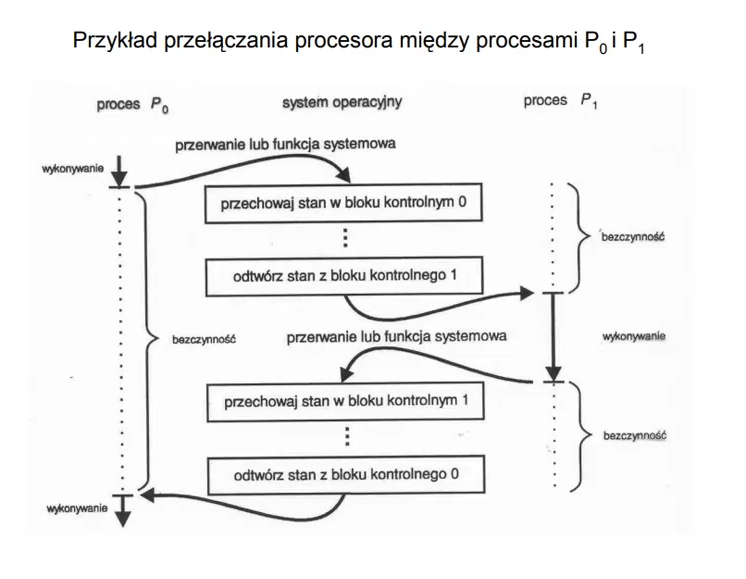

## 7. Co oznacza współbieżne wykonywanie procesów?

Współbieżne wykonywanie procesów oznacza wykonywanie kilku procesów jednocześnie poprzez naprzemienne przydzielanie zasobów komputera procesom.

W systemie wielodostępnym, pracującym z podziałem czasu jest jednocześnie
wiele procesów. Procesy działają współbieżnie co oznacza konieczność podziału
zdolności obliczeniowej procesora (przełączanie) między poszczególne procesy,
ponieważ w każdej chwili czasu wykonywany jest tylko jeden proces.
Proces wykonywany jest w sposób sekwencyjny tzn. w każdej chwili na
zamówienie procesu wykonywany jest jeden rozkaz kodu programu.

## 8. Jak powstaje nowy proces?

- Nowy proces tworzony jest przez wywołanie funkcji fork
- Proces wywołujący tę funkcję zwany jest procesem macierzystym, a proces utworzony - potomkiem.
- Potomek uzyskuje pozycję w tablicy procesów.
- Uzyskuje identyfikator (PlD).
- Tworzona jest kopia kontekstu procesu macierzystego (nowy proces zawiera kopię
  przestrzeni adresowej procesu macierzystego).
- Uaktualnione zostają liczniki odwołań do plików i-węzłów, z którymi związany jest
  potomek.
- Identyfikator potomka przekazywany jest procesowi macierzystemu,
- Potomek dziedziczy prawa dostępu do otwartych plików, a także dzieli dostęp do
  plików. Procesy mają identyczne kopie segmentów instrukcji, danych i stosu.
- Po wywołaniu funkcji fork wywoływana jest zwykle funkcja exec.
- Funkcja exec służy do wykonania określonego, innego programu. Umieszcza w
  obszarze pamięci procesu kopię pliku wykonywalnego i rozpoczyna jego
  wykonywanie. Zawartość kontekstu (obraz pamięci) procesu wywołującego
  funkcję exec zostaje zamazana.

## 9. Jak proces jest kończony?

Proces można przerwać wysyłając do niego odpowiedni sygnał. Można w tym celu skorzystać z polecenia `kill`, które powoduje wysyłanie sygnałów do procesów.

Składnia:

kill [-s nazwa sygnału I -numer sygnału] PID [PID ... ]
gdzie PID to identyfikator procesu.

Polecenie kill, w którym pominięto nazwę i numer sygnału wysyła do wskazanego
procesu sygnał o numerze 15 (SIGTERM). Taki sygnał może być przechwycony,
zignorowany lub zablokowany.

Sygnałem, którego nie można przechwycić, zignorować, ani zablokować jest sygnał o numerze 9 (SIGKILL).

Polecenie:
```
kill -9 PID
```
zawsze zakończy proces o podanym PID.

Przykłady sygnałów:

- `1 HUP` zerwanie łączności
- `2 INT` przerwanie (wysyłany również z klawiatury: Ctrl + C)
- `3 QUIT` zakończenie (wysyłany również z klawiatury: Ctrl + \\)
- `9 KILL` bezwarunkowe zakończenie procesu
- `15 TERM` programowe zakończenie procesu

Proces również kończy się w naturalny sposób, gdy wykona ostatnią instrukcję. Proces kończąc się wywołuje funkcję `exit`.
Proces przechodzi do stanu zombi, zwalnia swoje zasoby i oczyszcza kontekst, za wyjątkiem pozycji w tablicy procesów.
Proces macierzysty czekający na zakończenie potomka wykonuje funkcję wait.

Jądro szuka potomków takiego procesu, będących w stanie zombi. Jeśli znajdzie, to
przekazuje PlD potomka oraz parametr funkcji exit i dostarcza do procesu macierzystego.

Proces macierzysty uzyskuje informację, który z wielu możliwych potomków
zakończył pracę.

Jądro zwalnia następnie pozycję procesu potomnego w tablicy procesów.

Proces można przerwać wysyłając do niego odpowiedni sygnał. Można w tym celu
skorzystać z polecenia kill , które powoduje wysyłanie sygnałów do procesów.
Składnia:

```
kill [-s nazwa sygnału I -numer sygnału] PID [PID ... ]
```

gdzie PID to identyfikator procesu.

Polecenie kill, w którym pominięto nazwę i numer sygnału wysyła do wskazanego
procesu sygnał o numerze 15 (SIGTERM). Taki sygnał może być przechwycony,
zignorowany lub zablokowany.

Sygnałem, którego nie można przechwycić, zignorować, ani zablokować jest sygnał o
numerze 9 (SIGKILL).

Polecenie `kill -9 PID` zawsze zakończy proces o podanym PlD.

Przykłady sygnałów:
1 HUP - zerwanie łączności
2 INT - przerwanie (wysyłany również z klawiatury: Ctrl + C)
3 QUIT - zakończenie (wysyłany również z klawiatury: Ctrl + \)
9 KILL - bezwarunkowe zakończenie procesu
15 TERM - programowe zakończenie procesu

## 9a. Czym są sygnały?

Sygnały służą do informowania procesów o zdarzeniach asynchronicznych.
Sygnały związane są z:

- zakończeniem procesu (gdy proces wykonuje exit)
- wyjątkowymi sytuacjami spowodowanymi przez proces - próbą dostępu do niedozwolonego obszaru pamięci, próbą wykonania niedozwolonej instrukcji, błędami sprzętowymi, niespodziewanymi błędami przy wykonywaniu funkcji systemowej, np. pisaniu do
  potoku, który nie czyta, są także sygnały:
- wysyłane przez proces w trybie użytkownika, związane z interakcją z terminalem.
  Użytkownicy mogą wysyłać sygnały stosując polecenie kill,
  składnia: `kill [-s nazwa sygnału I-numer sygnału] PlD [PID]`,
  gdzie PID jest identyfikatorem procesu do którego wysyła się sygnał.

Niektóre sygnały mogą być wysyłane z klawiatury.

Obsługa sygnałów jest następująca: proces, który otrzymał sygnał, wykonuje exit,
albo ignoruje sygnał, albo wykonuje określoną funkcję użytkownika.
Sygnał nr 9 powoduje bezwarunkowe zakończenie procesu. Sygnały obsługiwane
są przez jądro.

W przypadku procesu wykonywanego w trybie jądra, odbywa się to wtedy, gdy
proces wraca z trybu jądra do trybu użytkownika.

W przypadku procesu w trybie użytkownika, jądro obsługuje sygnał bezpośrednio po
obsłużeniu przerwania, które go wywołało.

## 10. Jak działa funkcja systemowa exec?

Funkcja systemowa `exec()` ma za zadanie zamienić bieżący wykonywany proces na nowy, wskazany proces.

## 11. Jak działa funkcja systemowa fork?

Funkcja systemowa `fork()` powoduje podział wywołującego procesu na dwa procesy - jeden z nich jest procesem-rodzicem (parent process), drugi jest procesem-potomkiem (child process). Funkcja `fork()` przydziela procesowi potomnemu oddzielną przestrzeń adresową, w którym alokuje kopię danych procesu rodzica.

## 12. Co to są funkcje systemowe?

Funkcje systemowe stanowią interfejs pomiędzy wykonywanem programem a jądrem systemu operacyjnego. Przykładami funkcji systemowych będą funkcje odpowiedzialne za:

- dostęp do systemu plików,
- komunikację międzyprocesową,
- uruchamianie innych programów,
- sterowanie urządzeniami systemowymi,
- obsługiwanie komunikacji sieciowej.

Przykłady:

- open - otwiera plik o podanej nazwie
- read - czyta zawartość pliku
- write - zapisuje informacje do pliku
- stat - pokazuje stan systemu
- chown - zmiana właściciela pliku
- chmod - zmiana uprawnień dla pliku
- fork - tworzy kopię bieżącego procesu
- exec - podmienia bieżący proces na wskazany program
- exit - kończy bieżący proces
- wait - czeka ustaloną ilość czasu
- signal - przerwanie programowe generowane przez użytkownika, jądro, lub procesy między sobą

## 13. W jakich stanach może być proces?

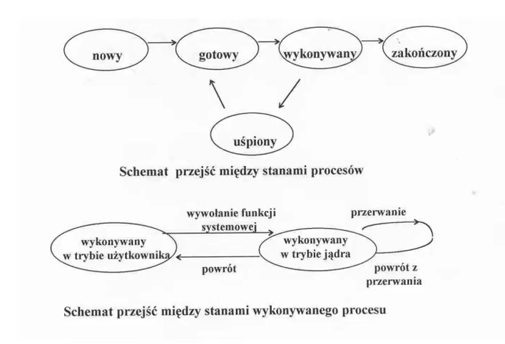

- nowy: proces jest tworzony,
- wykonywany:
  - w trybie użytkownika - wykonywane są instrukcje,
  - w trybie jądra - wykonywane są instrukcje,
- gotowy do wykonywania - proces czeka na przydział procesora przez program szeregujący, w tym stanie jest zwykle wiele procesów,
- czekający (uśpiony) - proces czeka na wystąpienie zdarzenia niezbędne-
  go do jego dalszego wykonywania, np. na zakończenie operacji we/wy.,
- zakończony - proces zakończył wykonywanie.

## 14. Co to jest "shell"?

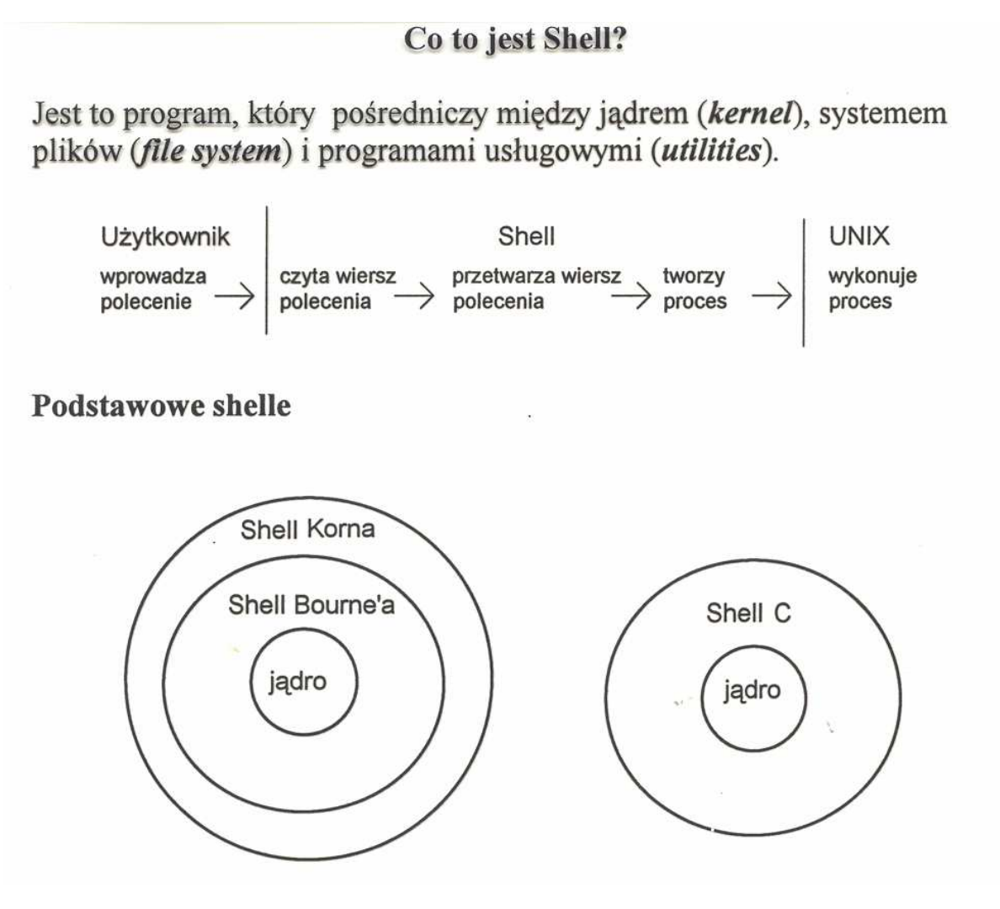

`Shell` jest programem pełniącym rolę pośrednika pomiędzy systemem operacyjnym a użytkownikiem, przyjmując jego polecenia i wyświetlając wyniki działania programu. Shell może używać interfejsu linii komend (CLI) lub interfejsu graficznego (GUI).

Podstawowe funkcje shella

- Przekazywanie sterowania do programu wybranego poleceniem
  użytkownika
- Wykonywanie wbudowanych poleceń
- Dostarczenie języka do pisania skryptów
- Ustawianie środowiska pracy
- Przywoływanie i edycja uprzednio wydanych poleceń
- Przeadresowywanie wejścia - wyjścia poleceń
- Generowanie nazw plików
- Umożliwienie łączenia poleceń w potok
- Umożliwienie przetwarzania w drugim planie (nie interakcyjnie)
>>>>>>> 98f41cffd3a7606190eca5d3e9b5e941ee025165

## 15. Podać przykłady programów shell i ich właściwości?

Przykłady:
<<<<<<< HEAD
=======

>>>>>>> 98f41cffd3a7606190eca5d3e9b5e941ee025165
- Bash
- Korn
- CShell

Właściwości:
<<<<<<< HEAD
=======

>>>>>>> 98f41cffd3a7606190eca5d3e9b5e941ee025165
- dostarcza język do pisania skryptów,
- zapewnia środowisko pracy
- pozwala na przywoływanie i edycję wcześniej zdefiniowanych poleceń
- przeadresowuje wejście/wyjście poleceń
- generuje nazwy plików
- łączy polecenia w potok
- umożliwia na przetwarzanie poleceń w tle

## 16. W jaki sposób program shell interpretuje polecenie?

Shell pozwala na następujące typy poleceń:

- plik wykonywalny zawierający kod wynikowy skompilowanego programu
- plik wykonywalny zawierający ciąg poleceń shella
- wewnętrzne polecenia shella

## 17. Na czym polega wykonywanie polecenia w tle (w drugim planie)?

W przypadku gdy na końcu polecenia pojawia się znak &, program tworzy zmienną lokalną i w pętli wykonuje proces czekania połączony ze sprawdzaniem wartości zmiennej.

## 18. Co to jest planowanie (szeregowanie) procesów?

Szeregowanie procesów polega na przydzieleniu procesom priorytetów w dostępie do zasobów procesora. Procesowi o najwyższym priorytecie przydzielany jest kwant czasu zgodnie z algorytmem rotacyjnym. Po upływie tego czasu proces jest wywłaszczany i czas procesora przydzielany jest kolejnemu procesowi w kolejce. Pozostałe procesy w kolejce mają zmieniany priorytet. Wywłaszczony proces jest umieszczany z powrotem w kolejce - gdy przychodzi na niego kolej, następuje wznowienie procesu i ponownie przydzielany jest mu kwant czasu.

## 19. Podać przykłady algorytmów szeregowania procesów i wyjaśnić ich działanie?

- FCFS (First Come, First Served) - procesy są obsługiwane w kolejności wywołania.
- SJF (Shortest Job First) - priorytetowość procesu jest przydzielana zgodnie z szzacowanym czasem wykonania, gdzie proces o najkrótszym czasie wykonania ma najwyższy priorytet.
- Planowanie priorytetowe - każdemu procesowi jest przydzielany pewien priorytet.
- Planowanie rotacyjne - procesy są obsługiwane jednocześnie poprzez przydzielanie kolejno kwantów czasu procesora (rzędu 10-100 ms). Kolejka procesów ma charakter cykliczny.

Działnie planowania rotacyjnego:
<<<<<<< HEAD
=======

>>>>>>> 98f41cffd3a7606190eca5d3e9b5e941ee025165
1. Wybierz proces o najwyższym priorytecie spośród procesów gotowych do wykonania i załadowanych do pamięci operacyjnej.
2. Jeśli kilka procesów ma ten sam priorytet, wybierz proces najdłużej oczekujący.
3. Jeśli nie ma procesów gotowych do wykonania, czekaj do następnego przerwania.
4. Wróć do kroku 1.

## 20. Jak rozwiązuje się zagadnienie planowania procesów w systemach typu UNIX?

<<<<<<< HEAD
-

## 21. Kiedy, po co i jak wykonywany jest proces ładowania systemu?


=======
Planowanie (scheduling) polega na określaniu w jakiej kolejności procesy uzyskują dostęp do
zasobów komputera: procesora, pamięci operacyjnej.

Celem planowania jest zwykle zapewnienie jak najlepszego wykorzystania procesora.
Procesy starając się o dostęp do procesora, czy konkretnego urządzenia czekają w kolejkach:

- kolejka zadań,
- kolejka procesów gotowych do procesora,
- kolejki do urządzeń we/wy.

Wykonywany proces może:

- zażądać operacji we/wy - zostanie wtedy umieszczony w kolejce do urządzenia we/wy,
- może utworzyć nowy proces i czekać na jego ukończenie,
- może wykorzystać cały kwant czasu, lub w wyniku przerwania zostać przeniesiony do kolejki procesów gotowych.

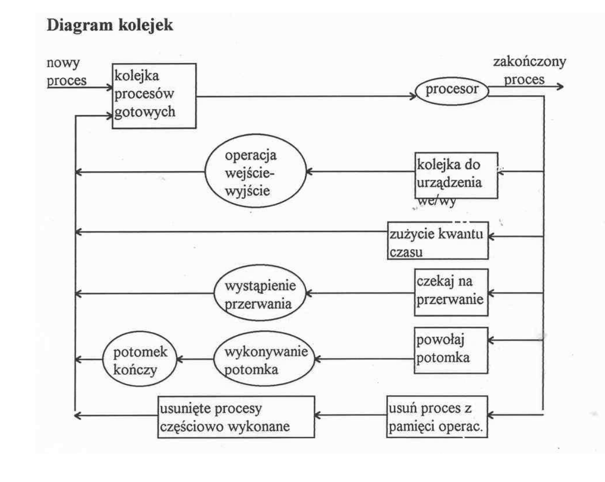

## 21. Kiedy, po co i jak wykonywany jest proces ładowania systemu?

Celem procesu ładowanie jest umieszczenie systemu operacyjnego w pamięci
operacyjnej i rozpoczęcie jego wykonywania. Składa się z kilku etapów:

1. Inicjalizacja i testowanie sprzętu.
2. Wczytanie i umieszenie w pamięci bloku systemowego (blok 0) z dysku.
3. Program zawarty w bloku systemowym ładuje jądro systemu operacyjnego z pliku
   systemowego (np. /stand/vmunix) do pamięci. Przekazuje sterowanie do
   pierwszej instrukcji jądra. Program jądra systemu zaczyna się wykonywać.
4. Wykrywanie i konfiguracja urządzeń, odnalezienie głównego katalogu plików.
5. Przygotowanie środowiska procesu 0. Wykonywanie programu systemu jako procesu 0 wykonywanego w trybie jądra. Utworzenie procesów jądra, np. procesów zarządzania pamięcią.
6. Rozwidlenie procesu 0 (wywołanie funkcji fork z jądra). Utworzony proces 1 tworzy
   kontekst poziomu użytkownika i przechodzi do trybu użytkownika.
7. Proces 1 wywołuje funkcję systemową exec wykonując program `/sbin/init`
8. Proces init wczytuje plik `/etc/inittab` i rozmnaża procesy.
9. Inicjacja wewnętrznych struktur danych jądra, tworzenie np. listy wolnych buforów,
   i-węzłów, kolejek; inicjacja struktur segmentów i tablic stron pamięci
10. Sprawdzenie głównego i pozostałych systemów plików (ew. uruchomienie fsck).
11. Wywoływane są procesy getty monitorujące konsolę i terminale systemu
    komputerowego, zgodnie z deklaracjami w pliku inittab, a proces init wykonuje
    funkcję systemową wait monitorując zakończenie procesów potomnych.
    Proces init tworzy również procesy demony.
>>>>>>> 98f41cffd3a7606190eca5d3e9b5e941ee025165

## 22. Jaki proces ma PID=1, jakie zadania wykonuje?

Proces o PID=1 to `init` sterujący procesem inicjującym. Jego głównym zadaniem jest tworzenie procesów w oparciu o skrypt z pliku `/etc/inittab`.

## 23. Co to są pliki i jakie typy plików występują w systemie UNIX?

Pliki są jednostkami logicznymi przechowywanej informacji, niezależnymi od formy i właściwości fizycznych urządzeń pamięciowych.

<<<<<<< HEAD
W systemach UNIX wyróżnia się różne typy plików, m.in.:
=======
W systemach UNIX wyróżnia się różne typy plików, m. in. :
>>>>>>> 98f41cffd3a7606190eca5d3e9b5e941ee025165

- pliki zwykłe,
- pliki specjalne,
- katalogi,
- dowiązania symboliczne
- potoki FIFO
- gniazda

## 24. Co to jest i-węzeł?

i-węzeł (ang. `i-node`) jest przyporządkowanym plikowi rekordem przechowującym informacje na temat rozmieszczenia danych zawartych w pliku w systemie plików, oraz dane na temat czasu jego utworzenia, ostatniej modyfikacji, odczytu etc.s

## 25. Jakie informacje są przechowywane w i-węźle?

W i-węźle przechowywane są:

<<<<<<< HEAD
- prawa dostępu do pliku
- liczba dowiązań
- id właściciela
- id grupy
=======
- typ pliku
- prawa dostępu do pliku
- liczba dowiązań
- id właściciela UID
- id grupy GID
>>>>>>> 98f41cffd3a7606190eca5d3e9b5e941ee025165
- rozmiar pliku w bajtach
- czas ostatniej modyfikacji
- czas ostatniego dostępu
- czas ostatniej zmiany informacji w i-węźle
- 12 wskaźników zawierających adresy bloków z danymi pliku (bloki adresowane bezpośrednio)
- wskaźnik zawierający adres bloku, w którym przechowywane są adresy bloków z danymi (adresowanie pośrednie jednostopniowe)
- wskaźnik adresowania pośredniego dwustopniowego
- wskaźnik adresowania pośredniego trójstopniowego

## 26. Jakie informacje przechowywane są w pliku typu "katalog"?

W katalogu przechowywane są nazwy plików łącznie z adresami odpowiadających tym plikom i-węzłom.

## 27. Co to jest katalog z punktu widzenia użytkownika, a co z punktu widzenia budowy systemu plików?

Katalog z punktu widzenia użytkownika jest pojemnikiem przechowującym pliki.

Z punktu widzenia systemu katalog jest plikiem przechowującym nazwy innych plików i stowarzyszone z nimi adresy i-węzłów.

## 28. Jaka jest różnica między adresowaniem bezpośrednim a adresowaniem pośrednim?

W adresowaniu bezpośrednim mamy listę 12 adresów znajdujących się bezpośrednio w strukturze i-węzła, zawierających informacje na temat lokalizacji fragmentów pliku w systemie plików. Pozwala to na szybki dostęp do pliku o małym rozmiarze.

W adresowaniu pośrednim w i-węźle mamy jedynie wskaźnik na miejsce w systemie plików gdzie zawarta jest informacja o lokalizacji reszty adresów pozostałych fragmentów pliku. Tak zastosowana struktura pozwala na przechowywanie plików o większych rozmiarach, jednak dostęp do nich przebiega wolniej.

## 29. Wyjaśnić mechanizm rozmieszczania bloków i fragmentów pliku w blokach na dysku?

Reguły przydzielania bloków i fragmentów:

1. Jeśli rozmiar pliku jest mniejszy niż rozmiar fragmentu, plikowi temu przydzielany jest pierwszy wolny fragment.
2. Jeśli rozmiar pliku jest większy niż rozmiar fragmentu, ale mniejszy niż rozmiar bloku, plikowi temu przydzielane są kolejne fragmenty należące do tego samego bloku.
3. Jeśli rozmiar pliku jest większy niż rozmiar bloku, plikowi temu przydzielana jest odpowiednia liczba bloków, niekoniecznie znajdująca się obok siebie, o łącznym rozmiarze nieprzekraczaącym rozmiaru pliku. Pozostała część pliku umieszczana jest w położonych obok siebie fragmentach należącychdo jednego bloku zgodnie z regułami 1 oraz 2.

## 30. Jak adresowane są bloki i fragmenty pliku na dysku?

<<<<<<< HEAD
## 31. Czym różni się przydział ciągły miejsca na dysku od przydziału listowego?

## 32. Co to jest tablica FAT?

## 33. Porównać przydział listowy miejsca na dysku z przydziałem indeksowym?

## 34. Co to jest i jak jest wykorzystywana pamięć operacyjna?

## 35. Wyjaśnić mechanizm wymiany (swapping) procesów?

## 36. Wyjaśnić mechanizm stronicowania na żądanie?

## 37. Wyjaśnić mechanizm segmentacji?

## 38. Podać przykłady algorytmów wymiany stron?

## 39. Kiedy występuje błąd strony i jak jest obsługiwany?

## 40. Na czym polega zarządzanie pamięcią wykonywane przez system operacyjny?

## 41. Jakie są zadania podsystemu wejście - wyjście?

## 42. Co to są pliki specjalne i do czego służą?

## 43. Co to jest tablica rozdzielcza urządzeń we-wy, jakie informacje zawiera i do czego służy?

## 44. Jak wykorzystywana jest pamięć podręczna do wydajniejszego korzystania z systemów dyskowych?

## 45. Jakie są typy plików specjalnych?

## 46. Jakie informacje są zapisane w plikach specjalnych i do czego służą?

## 47. Jaką rolę pełnią podprogramy obsługi urządzeń?

## 48. Co to jest pamięć współdzielona?
=======
Do przechowywania danych na dysku system UNIX używa bloków i fragmentów.
Fragment jest najmniejszą jednostką przestrzeni dyskowej zajmowanej przez plik.
Rozmiar bloku jest całkowitą wielokrotnością rozmiaru fragmentu (stosunek rozmiaru
bloku do rozmiaru fragmentu nie może jednak przekraczać 8):
np. rozmiar bloku wynosi 8 kB a rozmiar fragmentu 2kB

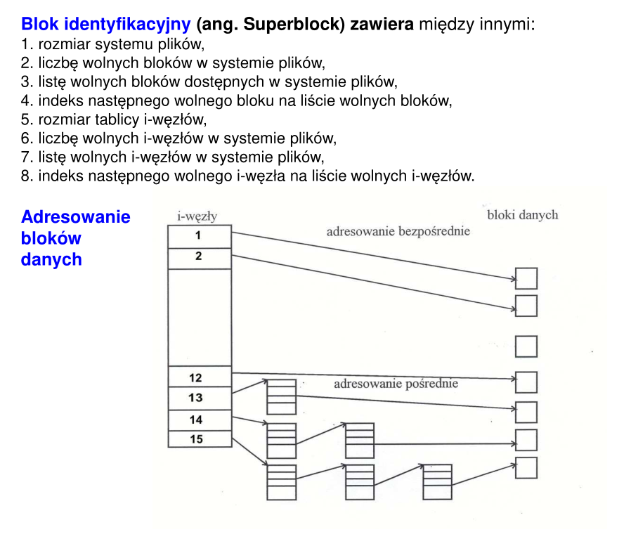

Adresowanie tylko bezpośrednie nie jest efektywne i znacznie ograniczyłoby rozmiary plików.
W systemie UNIX zastosowano następujące reguły:

- tablica adresów przechowywana w i-węźle ma 15 elementów (wskaźników) i każdy zajmuje 4 bajty,
- 12 pierwszych wskaźników zawiera adresy bloków z danymi,
- następny, 13 wskaźnik zawiera adres bloku, w którym znajdują się adresy bloków z danymi,
- 14 wskaźnik to adres bloku, w którym umieszczane są adresy bloków zawierających adresy bloków z danymi,
- 15 wskaźnik to adres bloku, w którym umieszczane są adresy bloków przeznaczonych na adresy następnych bloków zawierających adresy bloków z danymi.
- Przykład: jeśli blok zajmuje 4 kB, to
- adresowanie bezpośrednie pozwala na zaadresowanie danych plików o rozmiarach nie przekraczających: 48 kB,
- adresowanie pośrednie pozwala na zaadresowanie danych plików o rozmiarach nie przekraczających: 48 kB + 1024 * 4 kB = 4144 kB,
- podwójne adresowanie pośrednie pozwala na zaadresowanie danych plików o rozmiarach nie przekraczających: 48 kB + 1024 * 4 kB + 1024 * 1024 * 4 kB = 4198448 kB,
- adresowanie pośrednie pozwala na zaadresowanie danych plików o rozmiarach
  nie przekraczających: 48 kB + 1024 * 4 kB + 1024 * 1024 * 4 kB + 1024 * 1024 * 1024 * 4 kB,

## 31. Czym różni się przydział ciągły miejsca na dysku od przydziału listowego?

Przydział ciągły:

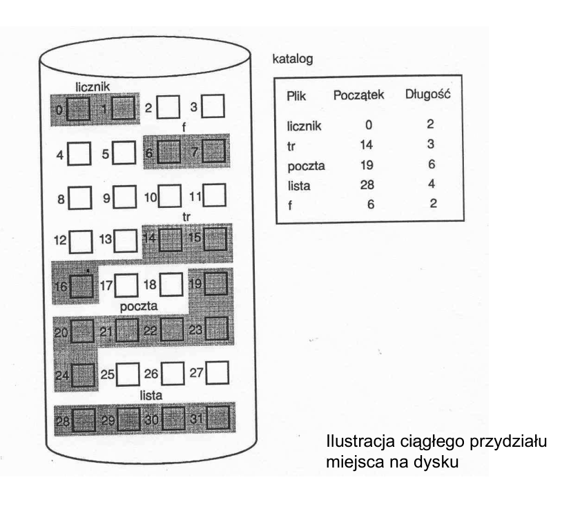

Przydział ciągły - pierwszy sposób przydziału miejsca na dysku. Idea jest nastpuąca - w katalogu mamy wpis informacji gdzie się zaczyna i jego rozmiar. Rozmiar jest przedstawiony w liczbie bloków dyskowych, a początek to w którym bloku się plik zaczyna. Na przykład (obrazek)) plik f zaczyna się w 6 a kończy w 7.

Plik musi zawierać ciag kolejnych adresów na dysku, a pozycja plików w katalogu zawiera adres bloku początkowego i długość pliku.

Zalety:

1. Dostęp do kolejnych bloków wymaga minimalnego ruchu głowicy
2. Minimalna liczba operacji przeszukiwania.
3. Łatwy dostęp do informacji pliku zarówno bezpośredni jak również sekwencyjny.

Wady:

1. zjawisko zewnętrznej fragmentacji wolnej przestrzeni dyskowej (sporo dziur przy usuniętych plikach do których nie można zapisać nowych plików. Przy zapisie nowego pliku system operacyjny musi przeszukiwać dysk w poszukiwaniu wolnego obszaru dla pliku)
2. Trudności znalezienia miejsca na nowe pliki w przypadku dużej liczby plików.
3. Trudność związana z powiększaniem rozmiaru pliku.

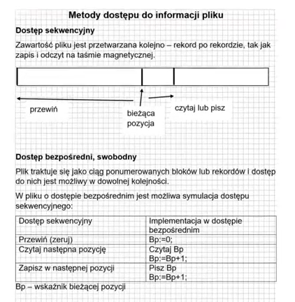

Przydział listowy:

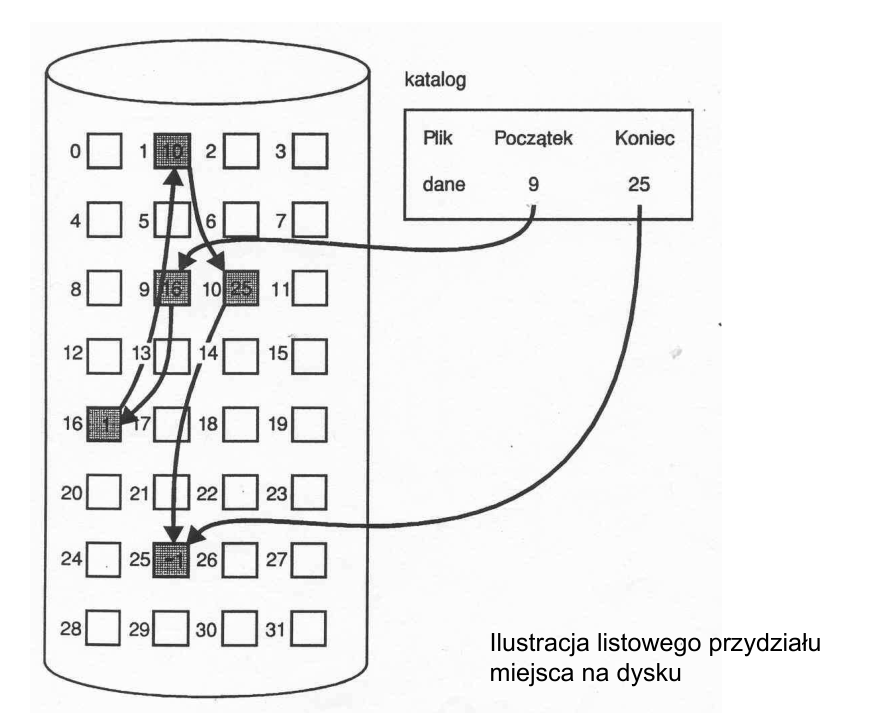

Plik stanowi listę powiązanych ze sobą bloków dyskowych. Bloki te mogą być rozrzucone na dysku. Informacja o adresie kolejnego bloku zapisywana jest na końcu bloku poprzedniego. W katalogu jest informacja o adresie bloku początkowego i bloku końcowego.

Zalety:

1. Każdy wolny blok może zostać wykorzystany do nowo utworzonego pliku - rozwiązuje problem zewnętrznej fragmentacji dysku
2. Nie wymaga deklarowania rozmiaru pliku w celu znalezienia odpowiednio dużego wolnego obszaru.

Wady:

1. Nie jest możliwy dostęp sekwencyjny do pliku - cofanie się na poprzednie bloki jest niemożliwe.
2. Nie jest możliwy dostęp bezpośredni.

## 32. Co to jest tablica FAT?

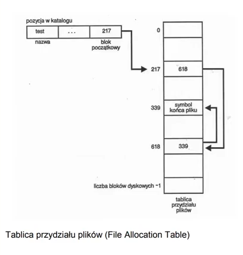

Rozwiązanie przydziału listowego w formie tablicy przydziałów. Na dysku wydzielana jest sekcja zawierająca tablicę przydziałów plików. W tablicy jest po jednej pozycji dla każdego bloku dyskowego. Tablica jest indeksowana za pomocą numerów bloków. Tablica ta zawiera listę powiązań dotyczącą każdego pliku.

Jak to działa? W katalogu mamy nazwę pliku, atrybuty etc, oraz adres - blok początkowy. W tablicy są zawarte informacje dotyczące wszystkich bloków na dysku. Dla konkretnego pliku działanie jest następujące: jeśli mamy blok 217, to w 217 wpisywany jest kolejny blok. W kolejnej pozycji 618 jest wpisywany adres kolejnego bloku. W 339 jest zaznaczony symbol końca pliku.

Taka struktura jest wykorzystywana do odczytu informacji zawartego w tym pliku.

Tego rodzaju system pozwala na rozrzuconą strukturę pliku.

https://youtu.be/jBIQPVmYY6c?t=2405

## 33. Porównać przydział listowy miejsca na dysku z przydziałem indeksowym?

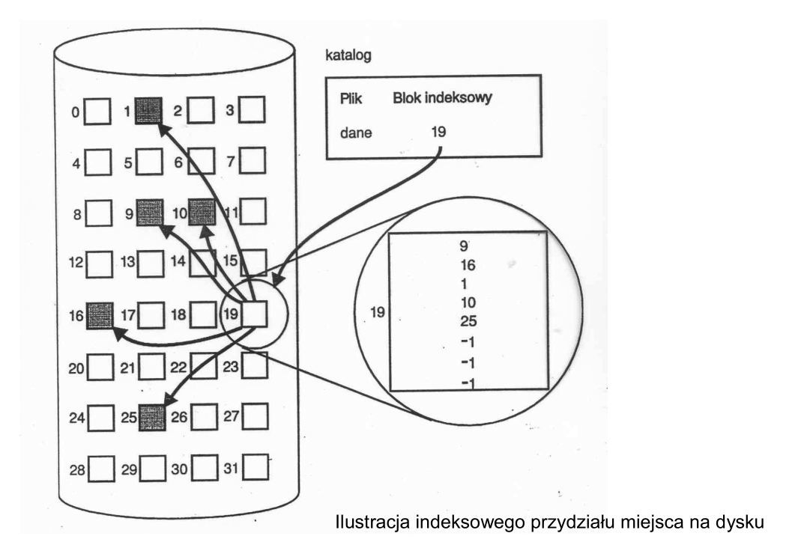

Też chcemy rozwiązać problem zewnętrznej fragmentacji dyskowej. Dla każdego pliku jest wydzielony specjalny blok indeksowy. W bloku indeksowym mamy zapisane adresy kolejnych bloków. Kolejność tych adresów jest dokładnie taka sama jak kolejność informacji zawartych w pliku.

Przewaga zapisu indeksowego nad listowym: przydział indeksowy pozwala na sekwencyjny dostęp do pliku będącego w postaci fragmentarycznej.

Wada zapisu indeksowego - w przypadku przydziału indeksowego możemy zapisać tyle bloków, ile mieści się w naszym bloku indeksowym.

## 34. Co to jest i jak jest wykorzystywana pamięć operacyjna?

Zainstalowana pamięć (operacyjna) nazywana jest pamięcią fizyczną.

Można ją interpretować jako tablicę bajtów, w której każdy element ma przyporządkowany jednoznaczny adres.
Wykonywane programy wraz danymi (procesy) przechowywane są, przynajmniej częściowo w pamięci.
Część pamięci fizycznej, w której umieszczane są procesy nazywana jest pamięcią dostępną dla procesów.

## 35. Wyjaśnić mechanizm wymiany (swapping) procesów?

Stronicowanie i wymienianie (swapping) jest mechanizmem rozdzielania dostępnej pamięci pomiędzy aktywne procesy, gdy ich łączne wymagania pamięciowe przekraczają fizyczną pamięć operacyjną. Swapping polega na zapisywaniu na dysku całego procesu - w ten sposób zwalniana jest cała związana z nim pamięć. Tak przeniesiony do obszaru swap proces musi być ponownie wczytany do pamięci w celu dalszego wykonania.

## 36. Wyjaśnić mechanizm stronicowania na żądanie?

Wykorzystuje zasadę lokalności odwołań. Do pamięci przesyłane są strony
niezbędne w danej chwili lub te, które niebawem mogą się okazać niezbędne.
Strony mogą więc znajdować się na dysku, w pamięci głównej lub w obszarze
wymiany.

Jeśli niezbędna jest strona znajdująca się na dysku, generowany jest błąd strony i
odpowiednie przerwanie. Wykonywanie procesu jest wstrzymywane, po czym
odnajdywana jest wolna ramka, do której przepisywana jest potrzebna strona.
Zwykle wymaga to zwolnienia ramki przez stronę innego procesu (wymiana stron,
ang. paging) - niezbędne więc są odpowiednie algorytmy zastępowania stron.

Zbiór roboczy to zbiór stron procesu jednocześnie znajdujących się w pamięci.
Brak strony w zbiorze roboczym generuje błąd strony.

## 37. Wyjaśnić mechanizm segmentacji?

Segmenty to semantycznie określone fragmenty programu, np. program główny,
podprogramy i biblioteki, tablica symboli, dane, stos.

Do podstawowych zalet segmentacji należą: możliwość powiązania ochrony
pamięci z wybranymi segmentami oraz współdzielenie wybranych segmentów przez
różne procesy.

Segmentacja umożliwia na przykład ustawienie bitu ochrony dla segmentów kodu
(tylko do odczytu) lub współdzielenie kodu edytora (np. vi) przez procesy edycji
wielu jednocześnie pracujących użytkowników. W tym przypadku, obrazy procesów
użytkowników zawierają (w uproszczeniu) segmenty danych i stosu oraz wskaźniki
do właściwego miejsca w segmencie programu.

Aby odwołać się do odpowiedniego segmentu, procesy korzystają z tablicy
segmentów. Każdy element tej tablicy można przedstawić w postaci pary, adres
bazowy danego segmentu oraz jego rozmiar. Tablicę segmentów przechowuje się
zwykle w pamięci głównej, a tylko pewną liczbę elementów tej tablicy przechowuje
się w rejestrach.

We współczesnych systemach operacyjnych stosuje się stronicowanie segmentów.

## 38. Podać przykłady algorytmów wymiany stron?

- Algorytm FIFO - wymieniana jest strona najstarsza
- Algorytm optymalny - potencjalny algorytm w którym wymieniana jest strona która w przyszłości byłaby używana najpóźniej
- Algorytm LRU - wymieniana jest strona która nie była używana od najdłuższego czasu.

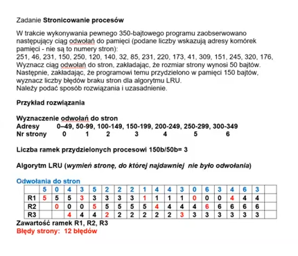

## 39. Kiedy występuje błąd strony i jak jest obsługiwany?

Błąd strony (page fault) pojawia się wtedy, gdy procesowi potrzebna jest strona pamięci, która rezyduje w fizycznej pamięci operacyjnej i musi zostać wczytana z dysku.

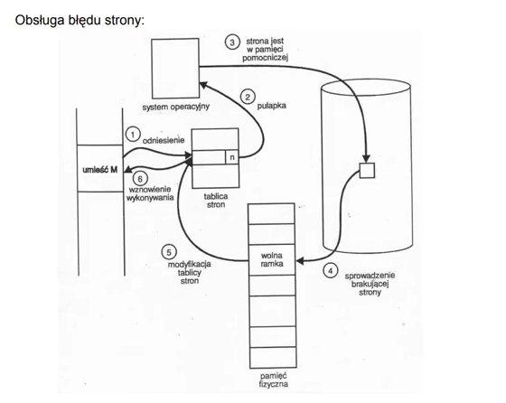

## 40. Na czym polega zarządzanie pamięcią wykonywane przez system operacyjny?

Zarządzanie pamięcią – sposób zarządzania pamięcią komputera z poziomu systemu komputerowego. Głównym wymaganiem stawianym procesowi zarządzania pamięcią jest dostarczenie możliwości dynamicznego alokowania pamięci oraz jej zwalniania, gdy już nie jest potrzebna. Jest to kluczowe wymaganie dla zaawansowanych systemów, w których jednocześnie uruchomionych jest wiele procesów.

W przypadku pojawienia się żądania alokacji pamięci, znajdowany jest blok nieużywanej pamięci, który ma odpowiedni rozmiar. Alokowana pamięć pochodzi z dużej puli pamięci, zwanej stertą. Zazwyczaj, podczas działania systemu, część sterty jest używana przez pracujące procesy, podczas gdy pozostała część jest wolna i to właśnie ona zostanie zaalokowana, gdy pojawi się żądanie.

Niestety, w procesie alokacji pamięci pojawia się kilka problemów. Jednym z nich jest zjawisko fragmentacji zewnętrznej. Jest ona związana z występowaniem wielu małych kawałków wolnej pamięci, pomiędzy obszarami już zaalokowanymi. Może się zatem zdarzyć sytuacja, w której łączna ilość wolnej pamięci byłaby wystarczająca na zaspokojenie żądania, jednak nie jest możliwy przydział spójnego kawałka pamięci o żądanej wielkości. W przypadku występowania fragmentacji zewnętrznej, konieczne staje się scalanie wolnych obszarów pamięci. Scalanie takie nazywane jest kompaktyfikacją lub upakowaniem.

## 41. Jakie są zadania podsystemu wejście - wyjście?

System operacyjny zarządza operacjami wejścia/wyjścia i sprawuje nadzór nad urządzeniami zewnętrznymi, które te operacje obsługują. Różnorodność urządzeń zewnętrznych jest ogromna. W tym wykładzie omówimy wspólne dla wszystkich urządzeń wejścia/wyjścia zagadnienia związane z systemem wejścia/wyjścia: podstawy sprzętowe, zasadnicze usługi świadczone przez system operacyjny, interfejs wejścia/wyjścia aplikacji oraz kwestie wydajnościowe.

## 42. Co to są pliki specjalne i do czego służą?

Pliki urządzeń lub pliki specjalne (ang. special files, device files) zapewniają
aplikacjom i użytkownikom współpracę z urządzeniami zewnętrznymi.


## 43. Co to jest tablica rozdzielcza urządzeń we-wy, jakie informacje zawiera i do czego służy?

Tablice rozdzielcze urządzeń opisują interfejs między jądrem systemu operacyjnego a programami obsługi urządzeń.

https://youtu.be/dfqqpjour4g?t=3670

## 44. Jak wykorzystywana jest pamięć podręczna do wydajniejszego korzystania z systemów dyskowych?

Niektóre sterowniki dysków mają pamięć podręczną, używają do przesyłania danych między systemem a sterownikiem i dyskiem. Przechowuje się tu ostatnio odczytane, zapisane dane. Gdy są jakieś dane potrzebne najpierw system szuka ich w pamięci podręcznej.

## 45. Jakie są typy plików specjalnych?

Pliki specjalne to pliki łączące urządzenia z interfejsem systemu.

Mamy dwa typy plików specjalnych - blokowe oraz znakowe.

## 46. Jakie informacje są zapisane w plikach specjalnych i do czego służą?

Charakterystyka plików urządzeń:

- typ pliku specjalnego: blokowy lub znakowy,
- położenie w strukturze katalogów: katalog /dev,
- określone zasady nazywania, np. /dev/dsk/clt4d0
- liczba główna, np. 17,
- liczba pomocnicza, np. 0x014000.

## 47. Jaką rolę pełnią podprogramy obsługi urządzeń?

Podprogramy obsługi urządzeń (drajwery) - moduły jądra przeznaczone do
sterowania pracą urządzeń zewnętrznych.

## 48. Co to jest pamięć współdzielona?

Pamięć współdzielona – pamięć do której może mieć jednoczesny dostęp
kilka procesów.

amięć współdzielona jest wykorzystywana do:

- komunikacja między procesami (inter-process communication)
- współdzielenie bibliotek

## 49. Jak procesor współpracuje z pamięcią operacyjną?

Procesor połączony jest z pamięcią szyną, która obejmuje linie adresowe, linie danych i linie
sterujące. Jest także protokół, który porządkuje informacje przesyłane przez szynę (żeby nie
było konfliktów).

Odczyt – W liniach adresowych procesor podaje adres bezwzględny pamięci. W liniach
sterujących informację, że chce odczytać. Pamięć robi odczyt wskazaną i wpisuje to w liniach
danych.

Zapis – procesor wpisuje w liniach sterujących zapisz, w liniach adresowych adres
bezwzględny, a w liniach danych te dane, które mają być zapisane. Pamięc operacyjna pod
tym adresem zapisuje. Jeśli było coś innego zapisane pod tym adresem, to zostanie
skasowane.

## 50. Na czym polega idea nakładkowania?

Overlaying – Niekoniecznie cały proces musi być w pamięci, żeby go wykonać. Część
procesu, która już się wykonała zostaje wysyłana na dysk, natomiast część, która jest w danej
chwili potrzebna do wykonania jest pobierana z dysku do pamięci. Stosuje się na ogół w
przypadku w procesach, które nie zmieściłyby się w całości do pamięci operacyjnej.

## 51. Na czym polega wykonywanie procesu w trybie użytkownika w porównaniu z wykonaniem w trybie jądra?

Proces w trybie jądra systemu wykonuje fragment kodu jądra systemu. Proces w trybie
użytkownika wykonuje reszta kodu. Może być to jeden i ten sam proces.

---

Tryb użytkownika składa się z podsystemów, które przekazują zamówienia wejścia/wyjścia do odpowiednich sterowników w trybie jadra przez menedżera wejścia/wyjścia (który działa w trybie jadra). Dwa podsystemy, na które składa się warstwa trybu użytkownika, to podsystem środowiska i podsystem integralności.

Podsystem środowiska został zaprojektowany do uruchamiania aplikacji napisanych dla wielu różnych systemów operacyjnych. Żaden z podsystemów środowiska nie może uzyskać bezpośredniego dostępu do sprzętu i musi złożyć zamówienie na dostęp do pamięci poprzez menedżera pamięci wirtualnej (Virtual Memory Manager), który działa w trybie jądra. Ponadto aplikacje otrzymują niższy priorytet niż procesy w trybie jądra. Tryb jądra ma pełny dostęp do sprzętu oraz zasobów systemowych komputera i wykonuje kod w obszarze pamięci chronionej. Kontroluje dostęp do szeregowania, priorytetyzację wątków, zarządzanie pamięcią i komunikację ze sprzętem. Tryb jądra blokuje dostęp usługom i aplikacjom trybu użytkownika do krytycznych obszarów systemu operacyjnego, mogą one jedynie zażądać od jadra wykonania tych czynności w ich imieniu. Tryb jadra składa się z usług egzekutora, które składają się z modułów przeznaczonych do wykonywania specyficznych czynności, sterowników jądra, jądra i HAL

(zródło: Architektura systemów NT)

## 52. Co to jest blok kontrolny procesu, do czego służy i jak jest wykorzystywany przez system operacyjny?

Blok kontrolny procesu jest to struktura systemu operacyjnego związana z zarządzaniem
procesami. Każdy proces ma swój (niezależny) blok kontrolny procesu. Blok kontrolny
reprezentuje proces w systemie operacyjnym. Zawiera wszystkie informacje niezbędne do
kontynuowania procesu wcześniej uśpionego.

Zawiera informacje obejmujące:
- Stan procesu.
- Licznik rozkazów - wskazuje adres następnej instrukcji do wykonania.
- Rejestry procesora - w zależności od architektury komputera: akumulatory,
rejestry indeksowe, wskaźniki stosu, rejestry ogólnego przeznaczenia, rejestry
warunków. Blok kontrolny zawiera informacje pamiętane w rejestrach w celu
kontynuacji wykonywania procesu po przerwaniu.
- Informacje związane z planowaniem przydziału czasu procesora – priorytet
procesu, wskaźniki do kolejek porządkujących, inne parametry.
- Informacje dotyczące zarządzania pamięcią
- Informacje do rozliczeń - zużyty czas procesora, czas rzeczywisty, ograniczenia
czasu, numery konta, zadań, procesów.
- Informacje o stanie operacji wejścia wyjścia - lista otwartych plików, wykaz
urządzeń przydzielonych do procesu, informacja o niezrealizowanych
zamówieniach na operacje we/wy.

## 53. Jakie informacje zawierają tablice rozdzielcze urządzeń i jak są wykorzystywane przez system operacyjny?

W systemie istnieją dwie tablice urządzeń (właściwie: podprogramów obsługi urządzeń): jedna dla urządzeń blokowych, druga dla znakowych. Każdemu podprogramowi obsługi odpowiada pozycja w tablicy (ten sam podprogram może wystąpić na paru pozycjach). Podprogram obsługi jest identyfikowany parą (litera, liczba).

Litera określa, w której z dwóch tablic, a liczba pod którym indeksem, znajduje się opisująca go struktura. W strukturze tej znajduje się wskaźnik do nazwy podprogramu obsługi oraz, co najważniejsze, wskaźnik do odpowiadającej mu struktury `file_operations` lub `block_device_operations`. Dostęp do podprogramu obsługi spoza jądra systemu przechodzi prawie zawsze przez funkcje, do których wskaźniki znajdują się w tej strukturze (ale są wyjątki, np. dla urządzenia mem).

Podprogram obsługi urządzenia jest zainstalowany w systemie tylko wtedy, gdy zajmuje jakąś pozycję w tablicy rozdzielczej. Ponieważ dostęp do urządzeń następuje przez pliki (pliki urządzeń są tradycyjnie umieszczane w katalogu `/dev`), więc każde urządzenie powinno mieć przypisany plik urządzenia z dobrze zdefiniowanym numerem. Gdyby tak nie było, to aby skorzystać z urządzenia, trzeba by najpierw znaleźć na podstawie nazwy jego numer, następnie stworzyć odpowiadający mu plik, a dopiero potem z niego korzystać. Dlatego większość urządzeń ma standardowe numery.

Oficjalnym rejestrem przydzielonych numerów urządzeń i węzłów w katalogu `/dev` jest plik `Documentation/devices.txt`.


## 54. Przejścia między procesami

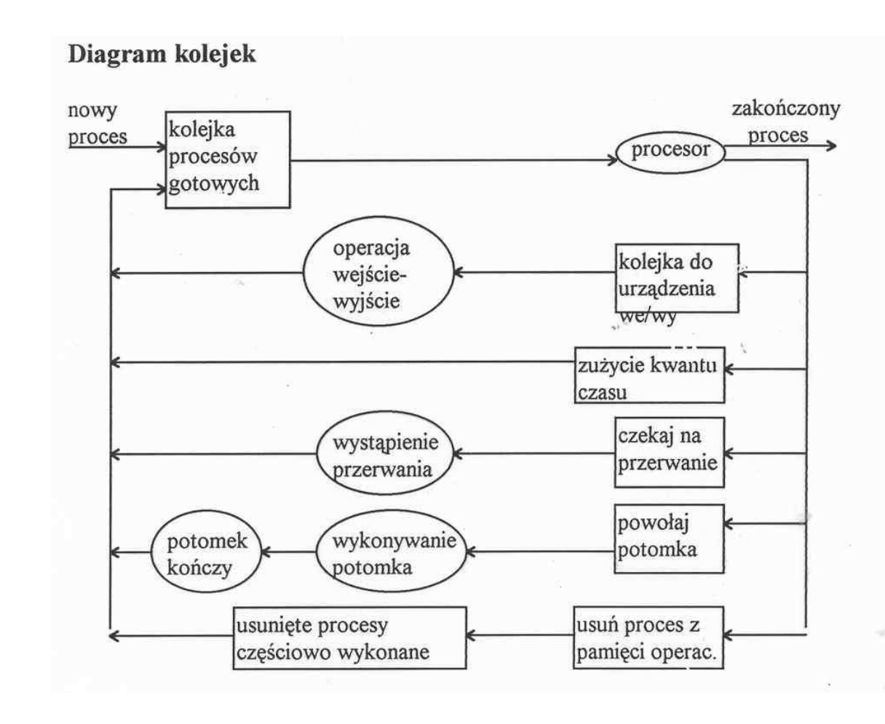

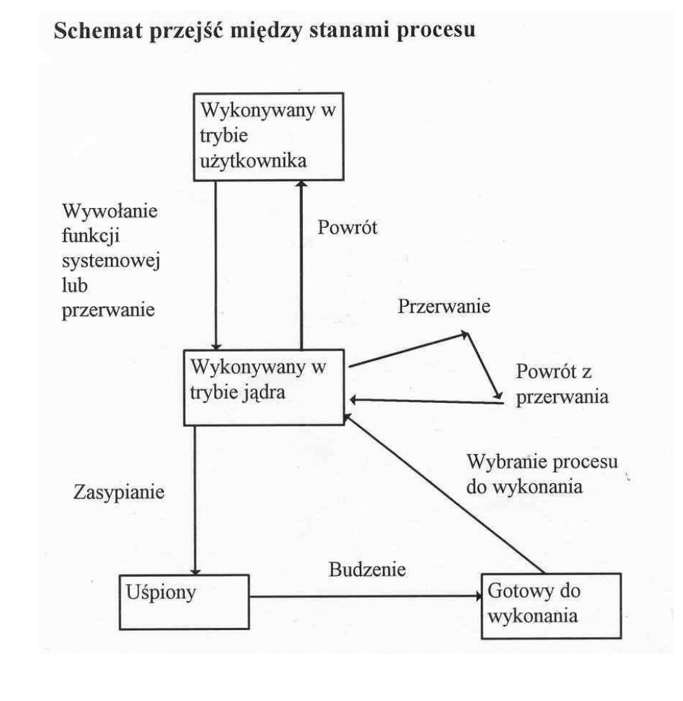

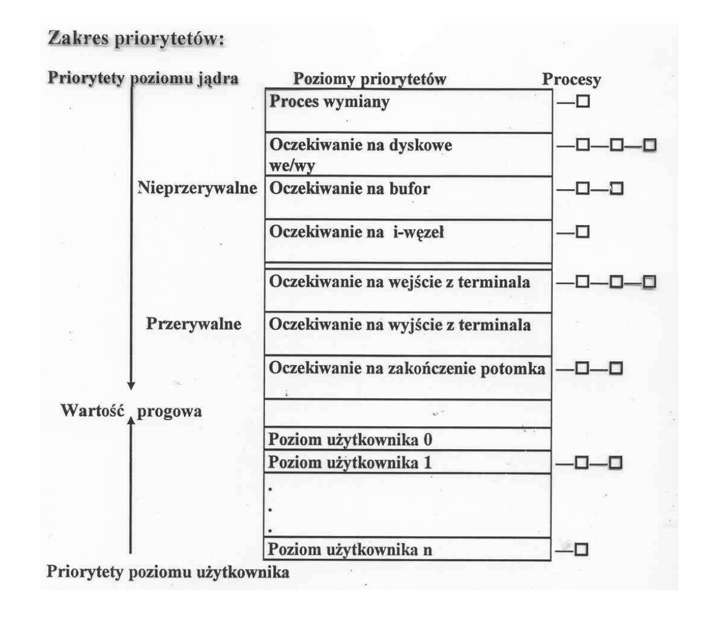
>>>>>>> 98f41cffd3a7606190eca5d3e9b5e941ee025165
