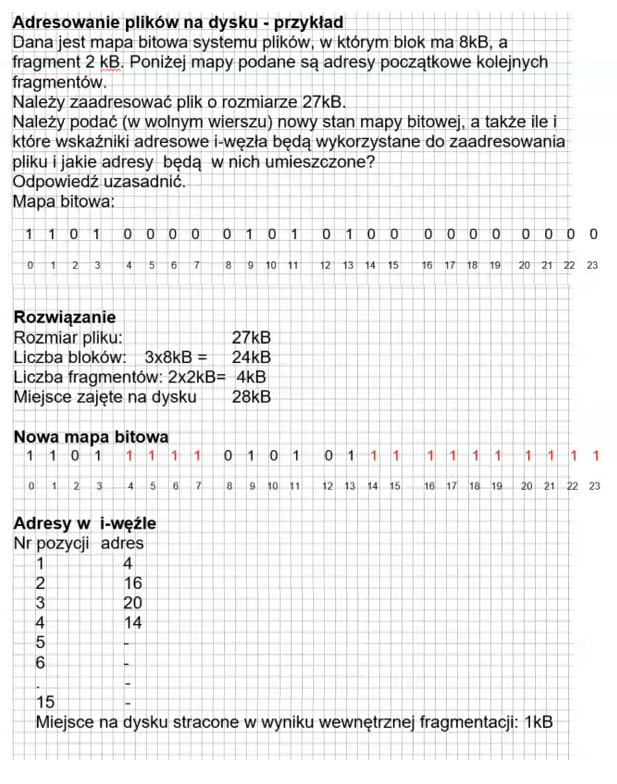
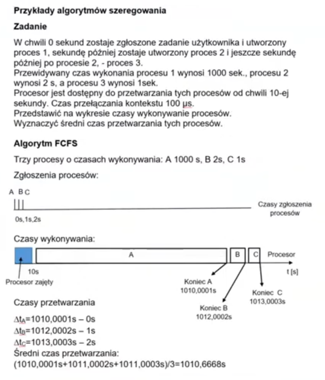

# Zagadnienia zaawansowane

## 1. Atrybuty plików

Polecenie `ll` (alias polecenia `ls -l`) pokazuje miedzy innymi czas ostatniej modyfikacji pliku. Polecenie to z opcją `-u` pokazuje czas ostatniego dostępu do pliku, natomiast z opcją `-c` pokazuje czas ostatniej zmiany informacji przechowywanych w i-węźle.

O godz. 19:00 poleceniem

```
$ /usr/bin/date > abc
```

utworzono plik abc, po czym sprawdzono atrybuty tego pliku:

```
$ ll abc
-rw-r--r--  1  user1	 users  29   Sep 13 19:00	  abc
```

Następnie o godz. 19:10 wydano polecenie:

```
$ /usr/bin/date >> abc
```

Podaj dokładnie co pokażą poniższe polecenia i uzasadnij odpowiedź.

```
$ ll abc
$ ll -u abc
$ ll -c abc
```

O godz. 19:20 wydano polecenie:

```
$ ln abc xyz
```

Podaj dokładnie co pokażą poniższe polecenia i uzasadnij odpowiedź.

```
$ ll abc
$ ll -u abc
$ ll -c abc
```

O godz. 19:25 wydano polecenie:

```
$ chmod +x abc
```

Podaj dokładnie co pokażą poniższe polecenia i uzasadnij odpowiedź.

```
$ ll xyz
$ ll -u xyz
$ ll -c xyz
```

### Rozwiązanie

>
> O godz. 19:00 poleceniem
> 
> ```
> $ /usr/bin/date > abc
> ```
> 
> utworzono plik `abc`, po czym sprawdzono atrybuty tego pliku:
> 
> ```
> $ ll abc -rw-r--r--  1  user1 users  29   Sep 13 19:00  abc
> ```
> 
> Następnie o godz. 19:10 wydano polecenie:
> 
> ```
> $ /usr/bin/date >> abc
> ```
> 
> Podaj dokładnie co pokażą poniższe polecenia i uzasadnij odpowiedź.

**Zmieniła się wielkość pliku dwukrotnie, ponieważ dopisujemy do pliku kolejną informację co powiększa Jego rozmiar, w każdym z przypadków.**

> ```
> $ ll abc-rw-r--r--  1  user1 users  58   Sep 13 19:10  abc
> ```
> 
> W tym przypadku czas się zmienia jako czas modyfikacji.
> 
> ```
> $ ll -u abc-rw-r--r--  1  user1 users  58   Sep 13 19:00  abc
> ```
> 
> Tutaj czas odczytu się nie zmienia, czyli to czas utworzenia.
> 
> ```
> $ ll -c abc-rw-r--r--  1  user1 users  58   Sep 13 19:10  abc
> ```

**Tutaj zmienia się czas, ponieważ przez modyfikację rozmiaru zmienia się także informacja o i-węźle.**

> O godz. 19:20 wydano polecenie:
> 
> ```
> $ ln abc xyz
> ```
> 
> Podaj dokładnie co pokażą poniższe polecenia i uzasadnij odpowiedź.

**Zmienia się liczba dowiązań na 2 oraz godzina na i-węźle**

```
$ ll abc-rw-r--r--  2  user1 users  58   Sep 13 19:10  abc
```

**Czas modyfikacji się nie zmienia.**

```
$ ll -u abc-rw-r--r--  2  user1 users  58   Sep 13 19:00  abc
```

**Czas dostępu również się nie zmienia.**

```
$ ll -c abc-rw-r--r--  2  user1 users  58   Sep 13 19:20  abc
```

**Czas na i-węźle się zmienia, ponieważ utworzono dowiązanie.**

> O godz. 19:25 wydano polecenie:
> 
> ```
> $ chmod +x abc
> ```
> 
> Podaj dokładnie co pokażą poniższe polecenia i uzasadnij odpowiedź.

**Zmieniają się uprawnienia dostępu, czyli plik staje się wykonywalny**

```
$ ll xyzRwxr -xr - x2  user1 users  58   Sep 13 19:10   xyz*
```

**Zmienia się nazwa pliku, czas modyfikacji pozostaje bez zmian**

```
$ ll -u xyzRwxr -xr - x2  user1 users  58   Sep 13 19:00    xyz*
```

**Zmienia się nazwa pliku, czas odczytu pozostaje bez zmian**

```
$ ll -c xyzRwxr -xr - x2  user1 users  58   Sep 13 19:25    xyz*
```

**Zmienia się nazwa pliku i czas na i-węźle, ponieważ zmieniliśmy uprawnienia do pliku.**

(Autor: Jan Berezowski)

## 2. Adresowanie plików na dysku

Dana jest mapa bitowa systemu plików, w którym blok ma 16 kB, a fragment 4 kB. Poniżej mapy podane są adresy początkowe kolejnych fragmentów.
Należy zaadresować plik o rozmiarze 58 kB.

Należy podać (w wolnym wierszu) nowy stan mapy bitowej, a także ile i które wskaźniki adresowe i-węzła będą wykorzystane do zaadresowania pliku i jakie adresy będą w nich umieszczone?
Odpowiedź uzasadnić.

Mapa bitowa:

```
1 1 0 1     1 0 0 0     0 1 0  0     0  0  0  0     0  0  0  0      0  0  0  0
0 1 2 3     4 5 6 7     8 9 10 11    12 13 14 15    16 17 18 19     20 21 22 23
```

### Rozwiązanie

Reguły przydzielania bloków i fragmentów:

1. Jeśli rozmiar pliku jest mniejszy niż rozmiar fragmentu, plikowi temu przydzielany jest pierwszy wolny fragment.
2. Jeśli rozmiar pliku jest większy niż rozmiar fragmentu, ale mniejszy niż rozmiar bloku, plikowi temu przydzielane są kolejne fragmenty należące do tego samego bloku.
3. Jeśli rozmiar pliku jest większy niż rozmiar bloku, plikowi temu przydzielana jest odpowiednia liczba bloków, niekoniecznie znajdująca się obok siebie, o łącznym rozmiarze nieprzekraczającym rozmiaru pliku. Pozostała część pliku umieszczana jest w położonych obok siebie fragmentach należących do jednego bloku zgodnie z regułami 1 oraz 2.



- Rozmiar pliku : 58 kb
- Liczba bloków: 3 - 16kb = 48kb
- Liczba fragmentów zajętych : 3 - 4kb = 12 kb
- Miejsce zajęte na dysku: 60 Kb

```
1 1 0 1     1 1 1 1     0 1 0  0      1  1  1  1        1  1  1  1        1  1  1  1
0 1 2 3     4 5 6 7     8 9 10 11     12 13 14 15       16 17 18 19       20 21 22 23
```

Adresy w i-węźle: (przeszukujemy od początku)

```
Nr pozycji  Adres

1           12
2           16
3           20
4           5
```

Od pozycji 12, 16, 20 system adresuje całe bloki, natomiast wybiera pozycję 5 na adresowanie fragmentów bo może je zaadresować wszystkie obok siebie.

Miejsce na dysku stracone wskutek wewnętrznej fragmentacji: 2 kb

(Autor: Jan Berezowski)

## 3. Szeregowanie procesów

W chwili 0 sekund zostaje zgłoszone zadanie użytkownika i utworzony proces 1, 15 sekund później zostaje utworzony proces 2 i jeszcze 28 s. później po procesie 2 - proces 3.

Przewidywany czas wykonania procesu 1 wynosi 40 sek, procesu 2 wynosi 60 sek., a procesu 3 wynosi 20 sek.

Procesor jest dostępny do przetwarzania tych procesów od chwili 25-tej sekundy. Czas przełączania kontekstu proszę pominąć.

Policzyć średni czas przetwarzania tych procesów dla

- algorytmu FCFS
- algorytmu SJF bez wywłaszczania
- algorytmu rotacyjnego przy kwancie czasu 10 s.

Należy podać sposób rozwiązania i uzasadnienie. Proszę na wykresie
czasu procesora zaznaczyć okresy wykonywania tych procesów.

### Rozwiązanie

Kryteria planowania

1. Wykorzystanie procesora, w % czasu.
2. Przepustowość - liczba procesów kończonych w jednostce czasu.
3. Czas cyklu przetwarzania - średni czas przetwarzania procesu od chwili utworzenia do
zakończenia.
4. Czas oczekiwania - średni czas oczekiwania w kolejkach.
5. Czas odpowiedzi - w systemach interakcyjnych - czas między zgłoszeniem zamówienia przez
użytkownika, a pierwszą odpowiedzią.




#### 1. Algorytm FCFS

FCFS (First Come, First Served) - pierwszy nadszedł - pierwszy obsłużony. Realizowany za
pomocą kolejki FIFO. Wady: efekt konwoju, kłopotliwy w systemach z podziałem czasu.
Jest algorytmem niewywłaszczającym.

Algorytm szeregowania jest uruchamiany zawsze wtedy gdy procesor jest zwalniany.

Algorytm wywłaszczający jest wtedy, gdy proces może być przez system operacyjny wyrzucony.

Algorytm niewywłaszczający jest wtedy, gdy system nie wyrzuca procesu przed jego zakończeniem.

Proces A 40s, B 60s, C 20s.

```
A    B    C
|____|____|__________________________________ Czasy zgłoszeń
0s   15s  43s (15+28)
```

Czasy wykonywania:

```
||||||||_|____A____|_|______B______|_|__C__|_____ Procesor___> t[s]
```

Procesor

Zajęty 25s

Czasy przetwarzania:

- Delta tA - (25+40) = 65s - 0s
- Delta tB - 125s (65+60) - 15s = 110s
- Delta tC - 145s (125 + 20) - 43s = 102s

Średni czas przetwarzania: ( 65 + 110 + 102)/3 = ok.92s

---

#### 2. Algorytm SJF

SJF (Shortest Job First) - najpierw najkrótsze zadanie. Procesor przydzielany jest procesowi o
najkrótszej następnej fazie procesora. Teoretycznie daje minimalny średni czas oczekiwania.
Wymaga jednak dokładnego oszacowania czasu przyszłej fazy procesora dla każdego procesu.
Szacowanie to wykonywane jest zwykle na podstawie pomiarów czasu faz poprzednich.
Może być wywłaszczający lub nie.

Proces A 40s, B 60s, C 20s.

```
A    B    C
|____|____|__________________________________ Czasy zgłoszeń
0s   15s  43s (15+28)
```

Algorytm wybiera procesy od najkrótszego. W tym wypadku najkrótszy jest proces C, ale jest on zgłoszony dopiero w 43 s, a więc po czasie kiedy procesor jest zajęty najkrótszym procesem jest proces A, następnie po przetworzeniu procesu A, najkrótszy będzie proces C (Bo został on już zgłoszony) i na końcu proces B.

```
||||||||_|____A____|_|__C__|_|______B______|______ Procesor___> t[s]
```

Procesor
Zajęty 25s

Czasy przetwarzania:

- Delta tA- 25 + 40 = 65s -0s
- Delta tB- 85s + 60 = 145s -15s = 130s
- Delta tC- 65 + 20 = 85s - 43s = 42s

Średni czas przetwarzania: ( 65+130 + 42)/3 = ok 79 s

---

#### 3. Algorytm rotacyjnego przy kwancie czasu 10 s

Planowanie rotacyjne - zaprojektowany dla systemów z podziałem czasu. Ustalony jest kwant
czasu (10-100 ms). Kolejka procesów ma charakter cykliczny. Kolejnym procesom przydzielany jest
co najwyżej kwant czasu.

Gdy tylko się zwalnia procesor, wykonywany jest ponownie algorytm szeregujący.

```
A    B    C
|____|____|__________________________________ Czasy zgłoszeń
0s   15s  43s (15+28)
```

Proces A 40s, B 60s, C 20s.

```
                         Koniec A
                         |
||||||||_A_B_A_C_B_A_C_B_A_B_B_B____Procesor____> t[s]
Procesor             |         |
                     Koniec C  Koniec B
```

Zajęty 25s

Czasy przetwarzania

- Delta tA: 25 + 90 = 115s - 0s
- Delta tB: 25 + 120 = 145s - 15s = 130 s
- Delta tC: 95 - 43s = 52s

Średni czas przetwarzania: (115 + 145 + 52)/3 = 99s

(Autor: Jan Berezowski)

## 4. Stronicowanie procesów

W trakcie wykonywania pewnego 700-bajtowego programu zaobserwowano
następujący ciąg odwołań do pamięci (podane liczby wskazują adresy komórek
pamięci - nie są to numery stron):

```

410, 245, 173, 450, 120, 231, 610, 309, 176, 234, 430, 185, 210, 551, 31, 245, 556, 434, 565, 650, 46, 458

```

Wyznacz ciąg odwołań do stron, zakładając, że rozmiar strony wynosi 100 bajtów.
Następnie, zakładając, że programowi temu przydzielono w pamięci 300 bajtów,
wyznacz liczby błędów braku stron dla algorytmu:

- FIFO
- Optymalnego
- LRU

Należy podać sposób rozwiązania i uzasadnienie.

### Rozwiązanie

Ponieważ każdy z adresów jest umieszczony na stronie mieszczącej 100 bajtów, można zastosować przekształcenie gdzie numer strony odpowiada liczbie setek dla numeru bajtu:

```

4 2 1 4 1 2 6 3 1 2 4 1 2 5 0 2 5 4 5 6 0 4

```

(ponieważ bajt numer `410` jest na stronie numer `4` (zawierającej bajty od `400` do `499`), bajt numer 245 jest na stronie numer `2` (bajty od `200` do `299`) i tak dalej).

```
FIFO
4 2 1 4 1 2 6 3 1 2 4 1 2 5 0 2 5 4 5 6 0 4

4 4 4       6 6   6 4 4   4 0 0   0 5 5 5 4

_ 2 2       2 3   3 3 1   1 1 2   2 2 6 6 6

_ _ 1       1 1   2 2 2   5 5 5   4 4 4 0 0

BŁĘDY: 16
```

Algorytm przebiega następująco. Na samym początku przy napotkaniu nowej strony uzupełniane są puste pola. Następnie - jeśli mamy odwołanie do strony w pamięci (300 bajtów - trzy wiersze), idziemy dalej (nie ma błędu, strona jest odczytywana). Jeśli następuje odwołanie do strony której nie ma aktualnie w pamięci, należy nadpisać jedną ze stron.

Przy FIFO idziemy metodą: `1-2-3-1-2-3-1-2-3` i tak dalej (od 1 do 3, i znowu od pierwszej). W ten sposób najpierw nadpisujemy 6 na miejsce numer 1, potem 3 na miejsce numer 2 i tak dalej. Każde z takich nadpisań zostało zainicjowane błędem wyświetlenia strony - reprezentowane jako uzupełniona kolumna. Zatem, w powyższym układzie, błędów jest 16.

---

```
OPTIMAL
4 2 1 4 1 2 6 3 1 2 4 1 2 5 0 2 5 4 5 6 0 4

4 4 4       6 3     4     4 0     0   0

_ 2 2       2 2     2     2 2     4   4

_ _ 1       1 1     1     5 5     5   6

BŁĘDY: 10
```

Tutaj prezentowany jest optymalny algorytm który gwarantuje najmniejszą liczbę możliwych błędów. Nadpisywana jest taka strona, która będzie wyświetlana dopiero najpóźniej w przyszłości. Ponieważ komputer nie ma dostępu do wyroczni mówiącej co będzie w przyszłości, algorytm jest teoretyczny i niemożliwy do zaimplementowania.

Ponownie, liczba błędów to liczba wpisanych kolumn.

---

```
LRU
4 2 1 4 1 2 6 3 1 2 4 1 2 5 0 2 5 4 5 6 0 4

4 4 4       6 6 6 2 2     2 2     2   6 6 6

_ 2 2       2 2 1 1 1     1 0     4   4 0 0

_ _ 1       1 3 3 3 4     5 5     5   5 5 4

BŁĘDY: 14
```

Inny algorytm, polegający nie na wpisywaniu nowych stron w ustalonej kolejności, jak FIFO, tylko na podstawie tego która ze stron została najwcześniej wyświetlona w przeszłości - zgodnie z założeniem, że jeśli jakaś strona dawno nie była wyświetlana, to prawdopodobnie nie będzie szybko wyświetlana ponownie.

W tym wypadku mamy 14 błędów.