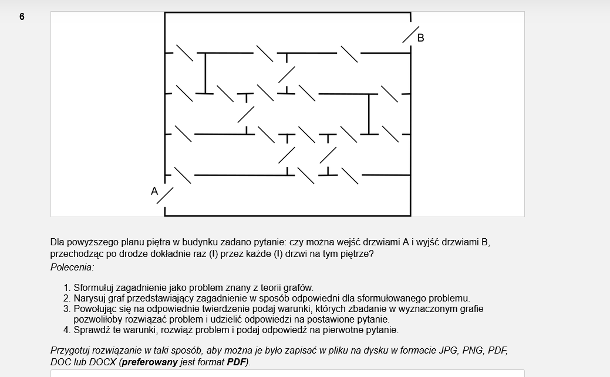
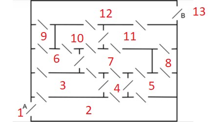
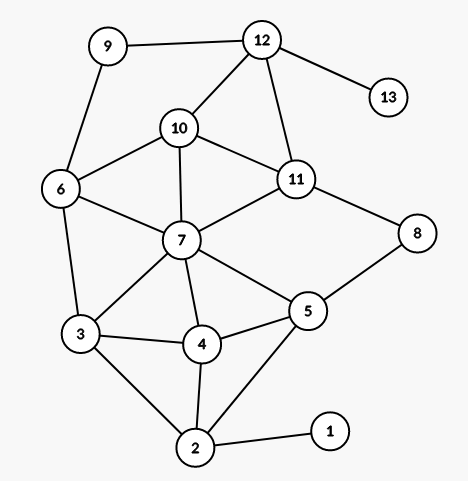
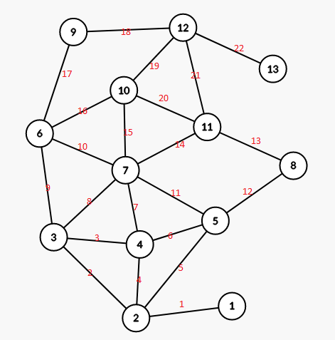
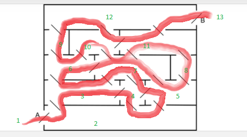

Zadanie można przedstawić w sposób analogiczny do problemu mostów w Królewcu, tj. rozpisać graf w którym wierzchołkami ("wyspami") będą pokoje, a krawędziami ("mostami") będą drzwi między pokojami. W takim ujęciu zadanie sprowadza się do stwierdzenia czy w grafie istnieje droga Eulera, tj. droga przechodząca przez wszystkie krawędzie dokładnie raz. Rozwiązanie przedstawione przez Eulera stwierdza, że warunkiem koniecznym i wystarczającym do istnienia takiej drogi jest by wszystkie poza dwoma wierzchołkami były stopnia parzystego.

Plan piętra:

odpowiada następującemu grafowi:

W tymże grafie wszystkie węzły (pokoje) poza 1 oraz 13 (czyli A oraz B) są stopnia parzystego. Istnieje zatem droga Eulera od A do B.

Ponieważ wiemy już, że w grafie istnieje droga Eulera od 1 do 13, możemy ją wyznaczyć:

(Kolejne krawędzie według czerwonej numeracji)

Co można przetłumaczyć na następującą ścieżkę przez pokoje:

