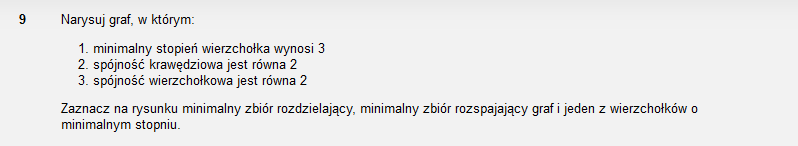
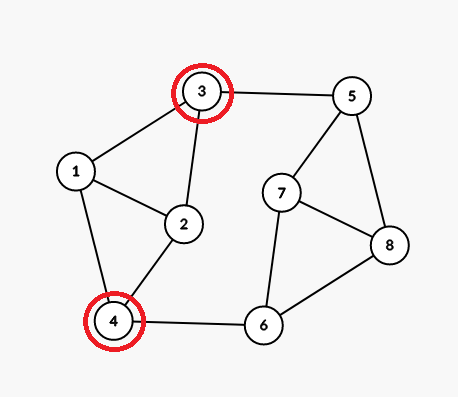
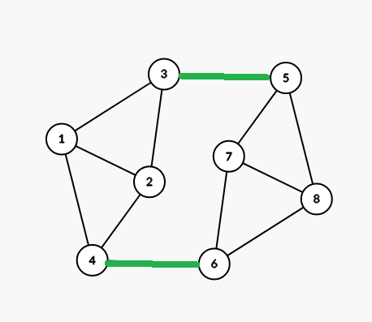
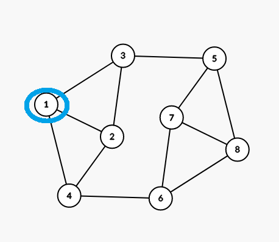

Propozycja grafu:

Jak widać, stopień wszystkich wierzchołków jest co najmniej 3. Wystarczy wyrzucić krawędzie 3-5 oraz 4-6 by rozspójnić graf, zatem spójność grawędziowa grafu jest 2. Ponieważ można również rozspójnić graf poprzez skasowanie wierzchołków 3 i 4 (lub 5 i 6), spójność wierzchołkowa jest również 2.

Minimalny zbiór rozdzielający:

Minimalny zbiór rozspajający:

Jeden z wierzchołków o minimalnym stopniu:

