# Kolokwium 2

## Zakres tematyczny

* Spójność, silna spójność grafów skierowanych.

Spójność (słaba spójność) występuje gdy graf pochodny (nieskierowany) jest spójny, tj. z każdego wierzchołka można dotrzeć do dowolnego innego wierzchołka. Silna spójność występuje, gdy podoba własność jest w grafie skierowanym.

Zbiór rozspajający - zbiór krawędzi, których usunięcie powoduje rozspójnienie grafu.

Minimalny zbiór rozspajający: żaden jego podzbiór własny nie jest rozspajający.

Spójność krawędziowa - najmniejsza moc zbioru rozspajającego.

* Cykle, drogi Hamiltona w grafach skierowanych. Twierdzenia Nasha-Williamsa, Meyniela.

Tw. Nasha-Williamsa: Jeśli dla każdego wierzchołka $w\in V$ spełnione jest: $d^+(w)\geq \frac n2, d^-(w)\geq \frac n2$ ($n$ to liczba wierzchołków), to $G$ jest hamiltonowski (posiada cykl Hamiltona).

Tw. Meyniela: Jeśli $G$ jest silnie spójny, to jeśli dla każdych $v, w\in V$ niezależnych spełnione jest $d(v)+d(w)\geq 2n-1$ ($d=d^++d^-$, $n$ - liczba wierzchołków), to graf jest hamiltonowski (posiada cykl Hamiltona).

* Turnieje. Cykle, drogi Hamiltona w turniejach - twierdzenia Redei, Camiona.

Turniej - graf skierowany gdzie pomiędzy każdymi dwoma wierzchołkami istnieje dokładnie jeden łuk. Turniej o $n$ wierzchołkach ma $n\cdot(n-1)/2$ łuków.

Tw. Redei: Jeśli $G$ to turniej, to $G$ posiada **drogę** Hamiltona.

Tw. Camiona: Jeśli $G$ jest turniejem oraz jest silnie spójny, to $G$ jest hamiltonowski (posiada **cykl** Hamiltona).

* Drzewa - kod Prufera (prosty, odwrotny). Cykle fundamentalne - operacja różnicy symetrycznej. Rozkład cyklu prostego na różnicę symetryczną cykli fundamentalnych.

Warunki równoważne dla drzew:

1. Graf $G$ jest drzewem.
2. Graf $G$ nie zawiera cykli elementarnych i ma $n-1$ krawędzi.
3. Graf $G$ jest spójny i ma $n-1$ krawędzi.
4. Graf $G$ jest spójny i każda krawędź jest mostem (usunięcie jej rozspójnia graf).
5. Dowolne dwa wierzchołki grafu $G$ są połączone dokładnie jedną drogą.
6. Graf $G$ nie zawiera cykli elementarnych, ale dołączenie dowolnej nowej krawędzi do $G$ tworzy dokładnie jeden taki cykl.

Wzór na liczbę wszystkich drzew: $n^{(n-2)}$.

* Spójność krawędziowa, wierzchołkowa - twierdzenia Mengera. 

   - Zbiór rozspajający $\lambda(G)$ - minimalny zbiór krawędzi, których usunięcie powoduje rozspójnienie grafu. 

    **Twierdzenie (Mengera w wersji krawędziowej)**: Maksymalna liczba dróg krawędziowo rozłącznych, łączących dwa różne wierzchołki $v$ i $w$ w grafie spójnym $G$, jest równa minimalnej liczbie krawędzi w zbiorze rozspajającym $v$ i $w$. 

   - Zbiór rozdzielający $\chi(G), \kappa(G)$ - minimalny zbiór wierzchołków, których usunięcie powoduje rozspójnienie grafu. 

    **Twierdzenie (Mengera w wersji wierzchołkowej)**: Maksymalna liczba dróg wierzchołkowo rozłącznych, łączących dwa różne wierzchołki niesąsiednie $v$ i $w$  w grafie spójnym $G$, jest równa minimalnej liczbie wierzchołków w zbiorze rozdzielającym $v$ i $w$. 

  Jeżeli w $G$ minimalny stopień wierzchołka wynosi $x$, to $\lambda(G) \leq x$.

* Sieci; funkcja przepływu. Przepływ maksymalny. Znajdowanie przepływu maksymalnego algorytmem ścieżek powiększających. Przekroje sieci; wyznaczanie przepływu maksymalnego i minimalnego przekroju - zastosowanie twierdzenia Forda-Fulkersona do dowodu, że przepływ jest  maksymalny. 

Sieć - graf skierowany $G = (V, E)$ ze stowarzyszonymi funkcjami $F$ (funkcja przepływu, *flux*) oraz $C$ (funkcja przepustowości, *capacity*), gdzie dla każdej krawędzi $e\in E$ jest $0\leq F(e)\leq C(e)$, dla każdego $v\in V$, gdzie $v\neq s, t$ spełniona jest zależność, że suma przepływu na łukach wchodzących jest równa sumie przepływu na łukach wychodzących.

$\sum(\text{co wpływa do } t) - \sum(\text{co wypływa z }t) = W(F)$

$\sum(\text{co wypływa z } s) - \sum(\text{co wpływa do }s) = W(F)$

* Skojarzenie w grafie - wyznaczanie skojarzeń maksymalnej mocy algorytmem opartym na tw. Berge'a. W grafach dwudzielnych: skojarzenia maksymalnej mocy; minimalna liczba wierzchołków pokrywających wszystkie krawędzie – wyznaczanie odpowiednich zbiorów krawędzi/wierzchołków. Tw. Königa.
* W prostych przypadkach wyznaczanie  parametrów  $\nu, \rho, \alpha, \tau$ oraz  wyznaczanie odpowiednich zbiorów wierzchołków/krawędzi związanych z tymi parametrami.

  + $\nu$ - skojarzenie maksymalnej liczności - liczba krawędzi w grafie bez wspolnych wierzcholkow
  + $\rho$ - minimalna liczba krawędzi pokrywających - krawędzi stykających się ze wszystkimi wierzchołkami
  + $\alpha$ - maksymalna liczba wierzchołków niezależnych (bez wspólnych krawędzi)
  + $\tau$ - minimalna liczba wierzchołków pokrywających wszystkie krawędzie.

  $\nu + \rho = \alpha + \tau = n$ (liczba wierzcholkow)

  Lemat Gallaia: 
  + $v(G) \leq \tau(G)$, 
  + $\alpha(G)\leq\rho(G)$ 

  Twierdzenie Koniga:
  Jeżeli graf jest dwudzielny, to $\nu(G) = \tau(G)$.

## Zad 01

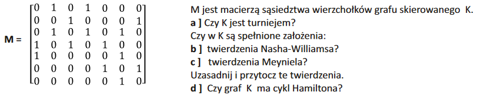

a) **Turniej** według definicji to graf skierowany w którym pomiędzy każdą parą wierzchołków jest dokładnie jeden łuk. Każdy z wierzchołków grafie K (reprezentowany jako wiersz/kolumna w macierzy) powinien mieć 6 sąsiadów, czyli suma elementów wiersza i kolumny powinna być równa $n-1$. Graf $K$ nie jest turniejem.

**Twierdzenie Nasha-Williamsa**: Jeżeli $D$ jest grafem skierowanym bez pętli, w którym $d^+(v)\geq \frac n2$ oraz $d^-(v)\geq\frac n2$ dla każdego wierzchołka $v$, to graf $D$ ma cykl Hamiltona.

b) Graf $K$ nie spełnia założeń twierdzenia Nasha-Williamsa, ponieważ istnieją wierzchołki posiadające mniej niż 4 wchodzące lub wychodzące łuki.

**Twierdzenie Meyniela**: Jeśli $D$ jest **silnie spójnym** grafem skierowanym bez pętli o $n\geq2$ wierzchołkach i dla dowolnej pary wierzchołków niezależnych zachodzi warunek $d(v) + d(w)\geq 2n-1$, to graf $D$ ma cykl Hamiltona.

c) Graf jest silnie spójny, ponieważ nie istnieje para wierzchołków dla której nie istniała by droga od jednego do drugiego. Należy teraz przeanalizować sumy stopni wszystkich par wierzchołków niezależnych. Stopnie są następujące: $d(1) = 4, d(2)=4, d(3)=5, d(4)=6, d(5)=4, d(6)=5, d(7)=3$. Wierzchołki 1 i 3 są niezależne (nie istnieje droga z 1 do 3 ani z 3 do 1), natomiast $d(1) + d(3) < 13$. Zatem graf $K$ nie spełnia założeń twierdzenia Meyniela.

d) Graf $K$ jest hamiltonowski. Przykład cyklu Hamiltona: $1\to 4\to3\to2\to7\to6\to5\to1$.

## Zad 02

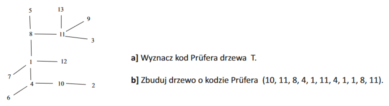

### Wyznaczanie kodu Prüfera

Algorytm wyznaczania kodu Prüfera na podstawie opisu drzewa. Z danego drzewa o zbiorze wierzchołków opisanym jako $\{1, 2, ..., n\}$ prowadzi do kodu Prüfera stanowiącego n-2 wyrazowy ciąg liczb ze zbioru $\{1, 2, ..., n\}$. 

1. Jeśli w drzewie jest więcej niż jedna krawędź, szukamy w drzewie wierzchołka stopnia jeden o jak najniższym numerze ze zbioru $\{1,2,...,n\}$ nazwijmy go $v$. Znajdujemy jedynego sąsiada tego wierzchołka, nazwijmy go $w$.
2. Do ciągu wyjściowego dopisujemy w, usuwamy krawędź $\{v,w\}$
3. Jeśli w drzewie została więcej niż jedna krawędź to przejść ponownie do punktu pierwszego. W przeciwnym wypadku, zapisany dotychczas ciąg jest ciągiem wyjściowym.

```python
from sympy.combinatorics.prufer import Prufer
tab = [[1,4], [1,7], [1,8], [1,12], [2,10], [3,11], [4,6], [4,10], [5,8], [8,11], [9,11], [11,13]]
tab2 = [[i-1, j-1] for i,j in tab]
p = Prufer(tab2).prufer_repr
print([i+1 for i in p])
# Wynik: [10, 11, 8, 4, 1, 11, 4, 1, 1, 8, 11]
```

### Wyznaczanie drzewa z kodu Prüfera

Algorytm wyznaczania opisu grafu na podstawie kodu Prüfera. Z danego kodu Prüfera stanowiącego n-2 wyrazowy ciąg liczb $(a_1, a_2, ..., a_{n-2})$ ze zbioru $\{1, 2, ..., n\}$ prowadzi do opisu drzewa o zbiorze wierzchołków $\{1, 2, ..., n\}$ z kodem Prüfera $(a_1, a_2 , ..., a_{n-2})$.

1. Tworzymy dwie listy $L_1=(a1,a2,...,a_{n-2}), L_2=\{1,2,...,n\}.$ Drzewo zaczynamy tworzyć od grafu o wierzchołkach ${1,2,...,n}$ i wyłącznie trywialnych składowych (pusty zbiór krawędzi). Wyznaczmy sobie liczbę $c=1$.
2. Wyznaczamy w $L_2$ najmniejszą wartość, która nie występuje w liście $L_1$ - nazwijmy ją $i$.
Dodajemy do drzewa krawędź $\{i, a_c\}$. Z listy $L_1$, usuwamy $a_c$. Z listy $L_2$, usuwamy element $i$.
3. Jeśli $L_1$ jest niepuste to definiujemy `c:=c+1` i wracamy do punktu 2. W przeciwnym wypadku $L_2$ zawiera jeszcze dwa elementy, nazwijmy je $l_1$ i $l_2$. Do zbioru krawędzi drzewa dodajemy krawędź $\{l_1, l_2\}$ i kończymy działanie algorytmu.

```python
from sympy.combinatorics.prufer import Prufer
tab = [10, 11, 8, 4, 1, 11, 4, 1, 1, 8, 11]
tab2 = [i-1 for i in tab]
p = Prufer(tab2).tree_repr
print([[i+1, j+1] for i,j in p])
# Wynik: [[2, 10], [3, 11], [5, 8], [4, 6], [1, 7], [9, 11], [4, 10], [1, 4], [1, 12], [1, 8], [8, 11], [11, 13]]
```

## Zad 03

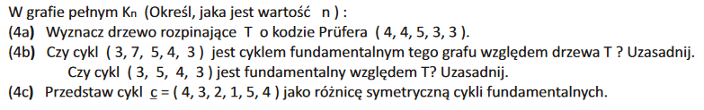

n jest równe 7 (ponieważ kod Prufera ma n-2 = 5 elementów).

a) Drzewo:

```
  1   6
  |   |
2-4-5-3-7
```

b) Cykl fundamentalny grafu względem drzewa T powstaje poprzez połączenie dwóch gałęzi drzewa T dodatkową krawędzią i wzięcie najmniejszego cyklu opartego o tę krawędź. Cykl (3, 7, 5, 4, 3) wymagałby dodania dwóch krawędzi do drzewa T, zatem nie jest on cyklem fundamentalnym. Cykl 3, 5, 4, 3 wymaga dodania do drzewa tylko jednej krawędzi (3, 4), i jest on najmniejszy możliwy, zatem jest on cyklem fundamentalnym.

c) Konstrukcja - rozkładam cykl $c$ na listę krawędzi i sprawdzam, których z tych krawędzi nie ma w drzewie $T$. Następnie na ich podstawie i na podstawie drzewa $T$ tworzę cykle fundamentalne: $c_{1, 2}\otimes c_{1, 5}\otimes c_{2, 3}\otimes c_{3, 4}$. Można sprawdzić, krawędzie cyklu $c$ będą się powtarzały w cyklach fundamentalnych nieparzystą liczbę razy, natomiast wszystkie pozostałe - parzystą; zatem różnica symetryczna cykli fundamentalnych stworzy szukany cykl.

## Zad 04

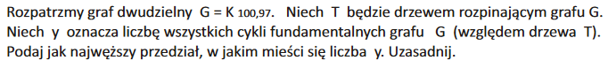

Graf dwudzielny $K_{n, m}$ zawiera $n\cdot m$ krawędzi. Drzewo o $n+m$ wierzchołkach zawiera $n+m-1$ krawędzi (każdy kolejny wierzchołek dodaje jedną krawędź). Zatem po utworzeniu drzewa rozpinającego dla $K_{n, m}$ mamy $n\cdot m - n - m +1$ brakujących krawędzi, tj. cięciw. Dodanie każdej z tych krawędzi do drzewa rozpinającego tworzy cykl fundamentalny. Zatem $y=n\cdot m - n - m +1 = 100\cdot97-100-97+1=9504.$

## Zad 05

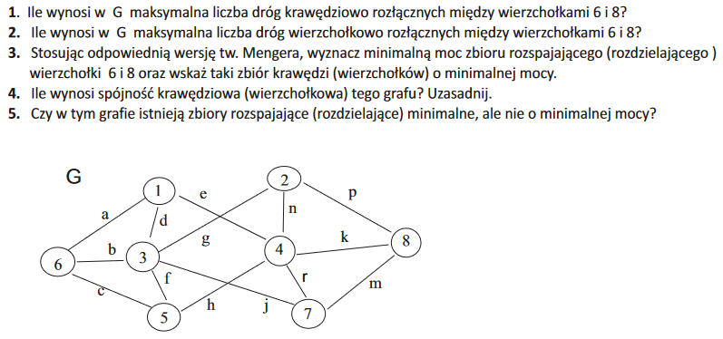

1. Trzy drogi.
2. Dwie drogi - należy przejść przez 3 lub 4 by dostać się z 6 do 8.

 - Zbiór rozspajający - minimalny zbiór krawędzi, których usunięcie powoduje rozspójnienie grafu. 
  **Twierdzenie (Mengera w wersji krawędziowej)**: Maksymalna liczba dróg krawędziowo rozłącznych, łączących dwa różne wierzchołki  v i w  w grafie spójnym G, jest równa minimalnej liczbie krawędzi w zbiorze rozspajającym v i w. 
 - Zbiór rozdzielający - minimalny zbiór wierzchołków, których usunięcie powoduje rozspójnienie grafu. 
  **Twierdzenie (Mengera w wersji wierzchołkowej)**: Maksymalna liczba dróg wierzchołkowo rozłącznych, łączących dwa różne wierzchołki niesąsiednie  v i w  w grafie spójnym G, jest równa minimalnej liczbie wierzchołków w zbiorze rozdzielającym v i w. 

Spójnością wierzchołkową $\kappa(G)$ grafu spójnego $G$ (dla $n\geq 2$) nazywamy najmniejszą moc jego zbioru rozdzielającego.

Graf jest k-spójny krawędziowo wtedy i tylko wtedy, gdy każda para różnych jego wierzchołków jest połączona co najmniej  k  drogami krawędziowo rozłącznymi. 

Graf o co najmniej  k+1 wierzchołkach jest k-spójny (wierzchołkowo) wtedy i tylko wtedy, gdy każda para różnych jego wierzchołków jest połączona co najmniej  k  drogami wierzchołkowo rozłącznymi. 

3. Minimalna moc zbioru rozspajającego to 3, minimalna moc zbioru rozdzielającego to 2.
4. Spójność krawędziowa to 3 (nie istnieje para wierzchołków, pomiędzy którymi byłyby mniej niż trzy drogi rozłączne krawędziowo), spójność wierzchołkowa to 2 (nie istnieje para wierzchołków, pomiędzy którymi byłoby mniej niż 2 drogi rozłączne wierzchołkowo).

5. Wierzchołkowa: $(1,3,5)$, krawędziowa: $(c,g,j,h)$.

## Zad 06

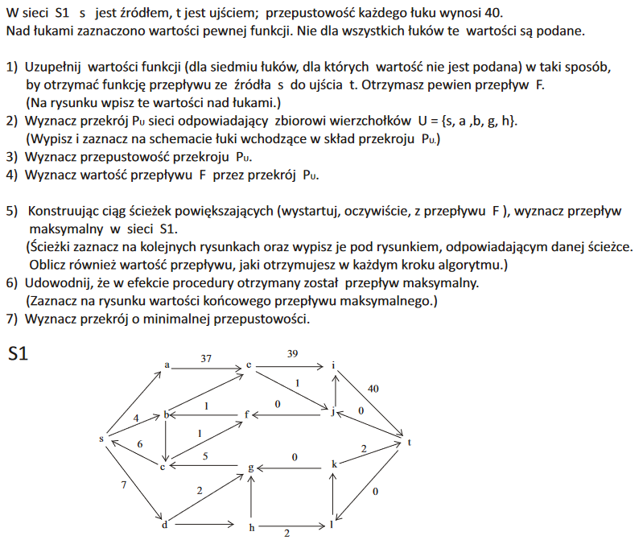

1) $(s, a) : 37, (b, e) : 3, (d, h):5, (l, k): 2, (h, g): 3$
2) Przekrój $P_U$ dla $U=\{s, a, b, g, h\}$ składa się z łuków **wychodzących** z wierzchołków $U$ do zbioru $V\setminus U$. W tym wypadku będą to łuki $(h, l), (g, c), (a, e), (b, c), (b, e), (s, d)$.
3) Przepustowość przekroju $P_U$ to suma przepustowości wszystkich łuków należących do $P_U$. Ponieważ $|P_U|=5$, to $C(P_U) = 6\cdot 40=240$.
4) Przepływ $F(P_U)$ jest równy $2 + 5 + 37 + 2 + 7 +3 = 56$.
5) Korzystając z twierdzenia Forda-Fulkersona wiemy, że maksymalna wartość przepływu jest równa przepustowości minimalnego przekroju. Wynik 80.
6) Wszystkie łuki wchodzące do $t$ są nasycone.
7) Łuki od zbioru wszystkich wierzchołków bez $t$.

## Zad 07

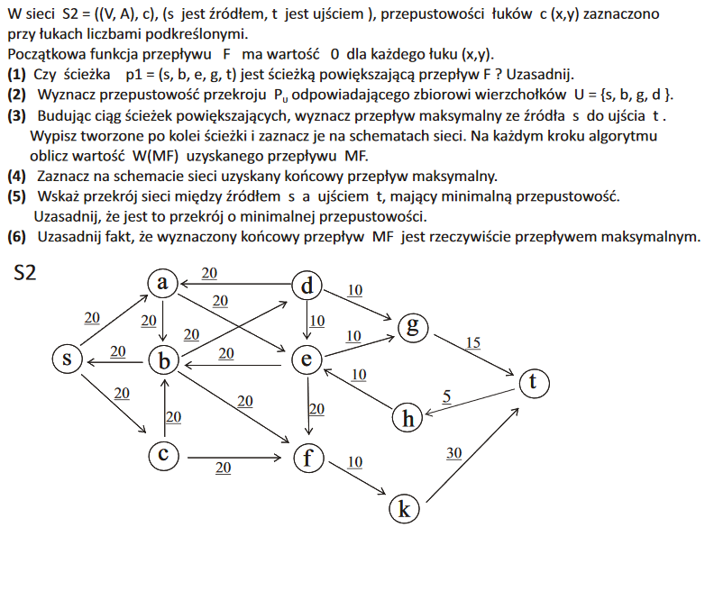

1) Wartość funkcji przepływu z $s$ do $b$ jest zero - nie jest.
2) Wychodzi nam 6 krawędzi: $(s, a), (s, c), (d, a), (d, e), (g, t), (b, f)$. Razem: 105.
3) Rysunek:

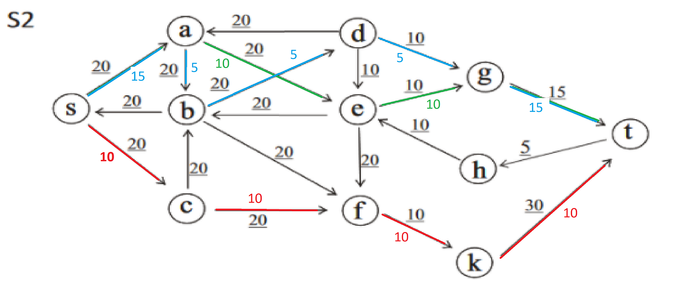

4) Całkowity przepływ: 25.
5) Wszystko bez $t, k$.
6) Wszystkie drogi są albo wychodzące maksymalne, albo wchodzące zerowe.

## Zad 08

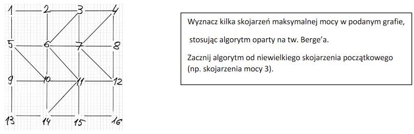

Twierdzenie Berge'a (Lemat Berge'a) - M jest skojarzeniem maksymalnej mocy wtedy i tylko wtedy, gdy nie istnieje droga powiększająca względem M.

Skojarzenie w grafie - podzbiór krawędzi grafu (oznaczany $M\subset E$) o tej własności, że każdy wierzchołek jest końcem co najwyżej jednej krawędzi.

Droga przemienna - droga prosta o krawędziach na przmian ze skojarzenia $M$ oraz nie ze skojarzenia (z $E\setminus M$).

Definicja: wierzchołki nasycone względem $M$ - wierzchołki incydentne z krawędziami z $M$.

Droga powiększająca względem $M$:

1) nie ma cyklu, 
2) jest przemienna (na zmianę nasycony i nienasycony wierzchołek), 
3) ma nienasycone końce.

Algorytm oparty na tw. Berge'a najpierw tworzy drogę przemienną przez wszystkie krawędzie $M$ (zaczynając i kończąc na krawędziach spoza $M$), po czym zamienia nasycenie krawędzi.

<!-- Algorytm postępowania - zacznijmy od następującego skojarzenia: (1, 2), (3, 4), (8, 7). Następnie tworzymy ścieżkę powiększającą (bez cykli) przechodzącą przez wszystkie krawędzie z $M$ na przemian z krawędziami spoza $M$, zaczynając i kończąc na krawędziach spoza: (5, 1, 2, 3, 4, 8, 7, 6). Odwracamy przynależność do skojarzenia, mamy następujący zestaw krawędzi: (5, 1), (2, 3), (4, 8), (7, 6). -->

## Zad 09

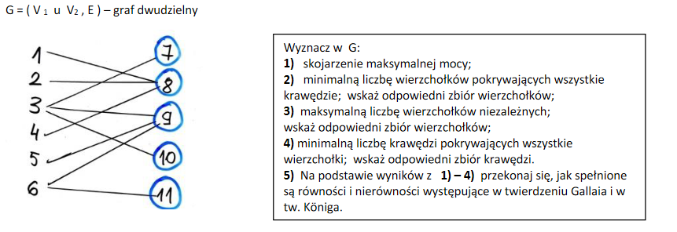

Skojarzenie maksymalne - największa wartość $\nu(G)$.

* $\nu$ - skojarzenie maksymalnej liczności - liczba krawędzi w grafie bez wspolnych wierzcholkow
* $\rho$ - minimalna liczba krawędzi pokrywających - krawędzi stykających się ze wszystkimi wierzchołkami
* $\alpha$ - maksymalna liczba wierzchołków niezależnych (bez wspólnych krawędzi)
* $\tau$ - minimalna liczba wierzchołków pokrywających wszystkie krawędzie.

$\nu + \rho = \alpha + \tau = n$ (liczba wierzcholkow)

Lemat Gallaia: 
* $v(G) \leq \tau(G)$, 
* $\alpha(G)\leq\rho(G)$ 

Twierdzenie Koniga:
Jeżeli graf jest dwudzielny, to $\nu(G) = \tau(G)$.

## Zad 10

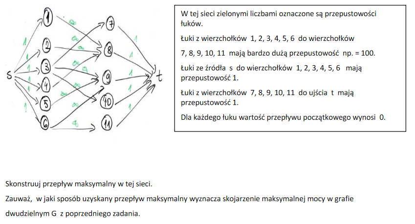

## Zad 11

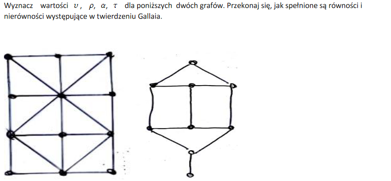

* $\nu$ - skojarzenie maksymalnej liczności - maksymalna liczba krawędzi w grafie bez wspólnych wierzchołków.
* $\rho$ - minimalna liczba krawędzi pokrywających - krawędzi stykających się ze wszystkimi wierzchołkami.
* $\alpha$ - maksymalna liczba wierzchołków niezależnych (bez wspólnych krawędzi).
* $\tau$ - minimalna liczba wierzchołków pokrywających wszystkie krawędzie.

$\nu + \rho = \alpha + \tau = n$ (liczba wierzcholkow)

Lemat Gallaia: 
* $v(G) \leq \tau(G)$, 
* $\alpha(G)\leq\rho(G)$ 

Twierdzenie Koniga:
Jeżeli graf jest dwudzielny, to $\nu(G) = \tau(G)$.


```
     3
     |
10-5-8-9-1
   |   |
   2   4-6
       |
       7

x, x, x, x, x, x, x, x

x, x, x, x, 5, x, x, x, x, 10


1-9

6-4-7
  |
1-9-8-5-10
    | |
    3 2

```