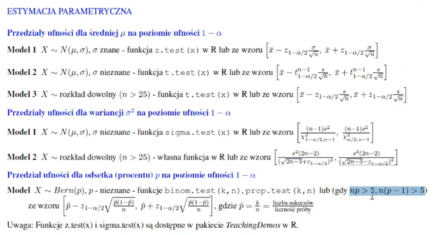

# Ściąga z R

- `c(a,b,c)` - wektor
- `is.logical`
- `is.numeric`
- `is.factor`
- `rep(a, n)` lub `rep(a, each=n)` - powtórz `a` `n` razy
- `as.numeric` - zmienia typ
- `sort` - sortuje wektor
- `length`
- `summary` - dane na temat min, max, kwartyli, mediany, średniej
- `sd` - standard deviation
- `quantile(x, 0.25, type=2)` - drugi kwartyl
- `quantile(x, 0.75, type=2)` - czwarty kwartyl
- `IQR` - interquantile range

- `x[a < 5 & a > 3]`
- `boxplot` - wykres skrzynkowy

- `getwd` - ścieżka do katalogu roboczego
- `read.csv2(path)` - odczytaj csv
- `dim` - podaje wymiary ramki danych
- `View` - wyświetla dane w tabeli
- `sapply(auta, typeof)` wykonuje funkcję na wszystkich elementach listy
- `auta$producent = factor(auta$producent)` - zamienia wartość na czynnik, tj. kategorię danych
- `levels(auta$producent) = c('A','B','C')` - przypisuje konkretnym kategoriom nowe wartości
- `sapply(auta, function(n) sum(is.na(n)))`

 - `par(mfrow=c(2,2))` - stwórz obrazek z miejscami dla 2x2 figur
 - `hist(auta$zp, col=3, breaks=5)` - histogram w kolorze 3, na 5 kolumn
 - `stem` - wykres łodygowo-liściowy dla danych
 - `mean` - średnia
 - `median` - mediana
 - `quantile` - kwantyl
 - `boxplot(x, horizontal=TRUE, col=2, ylim=c(5,16))`
 - `points(auta$zp, rnorm(150,1,0.02))` - rysuje punkty na osi z dodatkowym szumem
 - `var` - wariancja
 - `diff` - rozstęp

 - `install.packages` - instaluje paczkę
 - `library(e1071)`
 - `skewness(auta$zp)` - skośność
 - `kurtosis(auta$zp)` - kurtoza
 - `mean / sd` - współczynnik zmienności
 - `table` - zliczanie czynnika
 - `factor(x, ordered=TRUE, levels=c('', '', ''))` - stworzenie czynników o danych poziomach
 - `prop.table(table(x))` - odsetki

 - `barplot(table(x), col=5:7, ylab='liczba aut', xlab='kategoria spalania')` - wykres słupkowy
 - `pie` - wykres ciasteczkowy
 - `tapply(auta$zp, auta$producent, mean)` - stosujemy zbiorczo do list $zp dla różnych kategorii $producent funkcję `mean` biorącą średnią z całej listy.
 - `boxplot(x,y,names=c('a','b'), horizontal=TRUE,col=c(2,4), xlab='przysp')`
 - `quantile(x, 0.95)` - 95-ty percentyl, wartość której nie przekracza 95% wartości.
 - `abline(v=median(x), lty=2, col=2,lwd=2)` - dodaje linię do bieżącego wykresu.



---

Srednie wynagrodzenie 50 losowo wybranych programistów wyniosło 6000 zł. Wiadomo,że odchylenie standardowewynagrodzenia programistów wynosi 2100 zł. Wyznacz 95% przedział ufności dla średniego wynagrodzenia programistów, zakładając,że rozkład ich wynagrodzenie jest rozkładem normalnym.
```r
# Model 1
z = qnorm(1-0.05/2) # kwantyl rzędu 1-alpha/2 rozkładu N(0,1)
mu = 6000
sigma = 2100
n = 50
mu + c(-1,1)*z*sigma/sqrt(n) - 95% przedział ufności
```

---

Dla wybranego użytkownika zarejestrowano czasy między naciśnięciami klawiszy, gdy wpisywał login i hasło. Pobrano z nich losową próbę 18 pomiarów (w sekundach):

```
0.24, 0.22, 0.26, 0.34, 0.35, 0.32, 0.33, 0.29, 0.19, 0.36, 0.30, 0.15, 0.17, 0.28, 0.38, 0.40, 0.37, 0.27.
```

Zakładając,że czasy pochodzą z rozkładu normalnego, wyznacz 

a) 99% przedział ufności dla średniego czasu między naciśnięciami klawiszy tego użytkownika,

b)  95% przedział ufności dla odchylenia standardowego czasu między naciśnięciami klawiszy tego użytkownika.

Rozwiązanie

```r
# a) Model 2
install.packages('TeachingDemos')
library(TeachingDemos)
czas = c(0.24,0.22,0.26,0.34,0.35,0.32,0.33,0.29,0.19,0.36,0.30,0.15,0.17,0.28,0.38,0.40,0.37,0.27)
t.test(czas,conf.level=0.99)$conf.int # confidence interval
```

---

Zmierzono czas ́swiecenia 69 ́swietlówek i stwierdzono,że dla 14 z nich był on krótszy niż 1000 godzin, dla 15 był w przedziale[1000,2000), dla 29 ́swietlówek był dłuższy niż 2000, ale krótszy niż 3000 godzin, zaś dla pozostałych11 - czas ́swiecenia był dłuższy niż 3000, ale nie dłuższy niż 4000 godzin. Oszacuj przedziałowo ́srednią i odchyleniestandardowe czasu ́swiecenia ́swietlówek. Przyjmij poziom ufno ́sci 0.95.


# Testowanie hipotez

dostępne testy dla H0: mu=mu0: 
- t.test - test t-studenta dla:
  - rozkładu normalnego o nieznanej sigmie
  - lub dla dużej próby
- z.test dla znanej sigmy (TeachingDemos)

Jesli nie wiemy czy rozkład jest normalny, to mamy shapiro.test, z założeniem, że jeślo p > alpha to normalny.

dostępne testy dla weryfikacji hipotezy H0: sigma^2 = sigma_0^2
- sigma.test  (TeachingDemos) dla normalnych

dostępne testy dla weryfikacji hipotezy H0: p=p0
- binom.test
- prop.test
przypisujemy mu=mu0, stdev=sigma, sigma=sigma_0, p=p0, k=liczba sukcesów w próbie, n=liczność próby