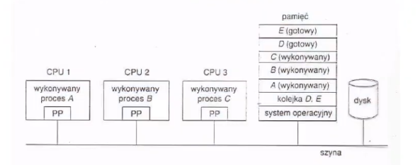

## Pytania podstawowe z zakresu koordynacji procesów (przykłady)

## 1. Błędy synchronizacji

Dlaczego mogą powstać błędy synchronizacji przy wykonywaniu procesów współbieżnych, korzystających z tych samych obiektów? Co jest powodem i jaki jest charakter tych błędów?

### Rozwiązanie

Jeśli mamy wiele procesów obsługiwanych przez system operacyjny i procesy dostają na zmianę kwanty czasu oraz dochodzą nowe procesy i inne kończą działanie, to przydzielanie kwantów czasu poszczególnym procesom prowadzi do tego, że w pewnych momentach procesor jest przełączany między różnymi procesami. Proces wykonuje się w pewnym zakresie instrukcji/rozkazu, a potem przestaje się wykonywać i procesor obsługuje inny proces. Problem polega na tym, że nie jest wiadome w którym momencie nastąpi przełączenie wykonywania jednego procesu na inny. Powodem tych zmian jest np. to, że dwa procesy korzystają lub modyfikują ten sam obiekt (np. plik). Gdy jeden proces zapisuje informacje do współdzielonego obiektu i zanim skończy dostęp do niego dostanie drugi proces to mogą powstać błędy. Charakter tych błędów jest losowy - mogą wystąpić lub nie.

### 1. Na czym polegają problemy koordynacji procesów współbieżnych?

Na zapewnieniu współbieżności działania procesów, rozwiązaniu problemu sekcji krytycznej, rozwiązaniu problemu zakleszczeń procesów, zapewnieniu właściwej synchronizacji procesów. 

W wielodostępnym systemie operacyjnym wiele procesów może być wykonywanych współbieżnie, przy czym użytkownik lub programista nie ma żadnego wpływu na kolejność ich wykonania ani możliwości przewidzenia tej kolejności. W takich przypadkach współbieżny dostęp do danych dzielonych pomiędzy pewną ilością procesów może powodować niespójność tych danych. Dlatego też w samym systemie operacyjnym muszą istnieć mechanizmy synchronizacji i wzajemnego komunikowania się procesów. 

### 2. Co to jest sekcja krytyczna?

Segment kodu (w każdym z procesów), w którym proces może zmieniać wspólne zmienne.

Rozpatrzmy kilka procesów, które korzystają z tego samego pliku. Jeśli dwa procesy próbują uzyskać dostęp i zmienić ten sam kawałek pliku, mogą wystąpić błędy.

Możemy stosować rozwiązania programowe lub środki sprzętowe, najczęściej wykorzystujemy rozwiązanie z wykorzystaniem semaforów.

Jest to segment kodu, w którym proces przetwarza współdzieloną zmienną. 

Jednym z najłatwiejszych sposobów programowania systemów zawierających wiele procesów jest użycie sekcji krytycznych. Zanim proces zacznie czytać lub aktualizować dzielone struktury danych, wkracza w sekcję krytyczną, aby uzyskać wzajemne wykluczanie i zapewnić sobie, że żaden inny proces nie bę­dzie używał dzielonych struktur danych w tym samym czasie. W systemach jednoprocesorowych sekcje krytyczne są chronione za pomocą semaforów, mo­nitorów i podobnych konstrukcji. Zapoznamy się obecnie z kilkoma przykładami implementowania sekcji krytycznych i wzajemnego wykluczania w systemach rozproszonych.

Najprostszy sposób osiągnięcia wzajemnego wykluczania w systemie rozproszo­nym polega na symulacji działań podejmowanych w tym celu w systemie jedno­procesorowym. Jeden z procesów zostaje obrany koordynatorem (np. taki, który pracuje na maszynie z najwyższym adresem sieciowym). Każdy proces, który chce wejść do sekcji krytycznej, wysyła do koordynatora zamówienie-prośbę, określające, do której z sekcji krytycznych chciałby uzyskać dostęp. Jeśli w da­nej sekcji nie przebywa aktualnie żaden inny proces, to koordynator odsyła mu odpowiedź, udzielając zezwolenia, co pokazano na rys. 5.13a). Po nadejściu tej odpowiedzi zainteresowany proces wkracza w sekcję krytyczną. Załóżmy teraz, że drugi proces, oznaczony na rys. 5.13b) numerem 2, ubiega się o pozwolenie wejścia do tej samej sekcji krytycznej. Koordynator wie, że inny proces jest już w sekcji krytycznej, nie może więc udzielić pozwolenia. Szczegóły metody odmawiania pozwoleń zależą od systemu. Na rysunku 5.13b) koordynator powstrzymuje się od odpowiedzi, blokując proces 2, który wła­śnie na nią oczekuje. Koordynator mógłby również wysłać odpowiedź o treści "odmowa pozwolenia". W każdym wypadku koordynator umieszcza zamówienie 2 w kolejce i czeka na następne komunikaty.
Segment kodu (w każdym z procesów), w którym proces może zmieniać wspólne zmienne.

Dane zawarte w sekcji krytycznej są wspólne dla wielu procesów wchodzących w skład systemu, ważną cechą każdego systemy jest to, że gdy jeden proces wykonuje swoją sekcję krytyczną, wówczas żaden inny proces nie jest dopuszczony do wykonywania swojej sekcji krytycznej.
Każdy proces ma segment kodu, zwany sekcją krytyczną, w którym może wymieniać wspólne dane np. z innym procesem, wówczas ażeby dwa procesy jednocześnie nie nadpisały sobie danych, przyjmuje się zasadę wzajemnego wyłączania, stąd tylko jeden proces naraz może wykonać swoją sekcje krytyczną. Każdy proces musi prosić o pozwolenie na wejście do swojej sekcji krytycznej. Fragment kodu realizujący taką prośbę nazywa się Sekcją wejściową (entry section), po sekcji krytycznej może następować sekcja wyjściowa (exit secion) pozostały kod nazywa się reszta (reminder section).
Sekcja krytyczna (angielskie critical section) - fragment kodu, który powinien być wykonany z zachowaniem niepodzielności tj. jednoetapowo, bez przerwań. Brak ochrony wykonywania sekcji krytycznej może powodować nieokreślone skutki w działaniu oprogramowania. Obsługę sekcji krytycznej organizuje się w procesach np. za pomocą semaforów, które z kolei są wspomagane sprzętowo, np. przez wyłączanie przerwań na czas wykonywania sekcji krytycznej albo za pomocą specjalnych, niepodzielnie wykonywanych rozkazów: zamień (swap) lub testuj i ustaw (test-and-set). Pierwszy z nich zamienia zawartość dwóch komórek pamięci, drugi bada stan komórki i określa jej nową wartość.

### 3. Na czym polega problem sekcji krytycznej?

Polega na skonstruowaniu takiego protokołu, który zapewniłby prawidłowy i bezkolizyjny dostęp do współdzielonych zmiennych zawartych w sekcjach krytycznych procesów. 

Mamy system złożony z n procesów $\{P_0, P_1, ..., P_{n-1}\}$. Każdy proces ma segment kodu zwany sekcją krytyczną, w którym może zmieniać wspólne zmienne. Gdy jeden proces wykonuje sekcję krytyczną, wtedy żaden inny nie jest dopuszczony do wykonywania swojej sekcji krytycznej (wzajemne wykluczanie). Problem polega na skonstruowaniu protokołu, który mógłby posłużyć do organizowania współpracy procesów. Każdy proces musi prosić o pozwolenie na wejście do swojej sekcji krytycznej.

### 4. Jakie są warunki prawidłowego rozwiązania problemu sekcji krytycznej?

* Warunek wzajemnego wyłączania:- jeśli jeden proces działa w sekcji krytycznej, to żaden inny nie może działać w tej sekcji.
* Warunek postępu:- jeśli żaden proces nie działa w sekcji krytycznej, i istnieją pewne procesy, które chcą wejść do sekcji krytycznej, to tylko procesy nie wykonywujące swoich reszt mogą kandydować jako następne do wejścia do sekcji krytycznej. Wyboru tego nie można odwlekać w nieskończoność.
* Warunek ograniczonego czekania:- Po zgłoszeniu gotowości wejścia danego procesu do sekcji krytycznej, liczba wejść innych procesów do ich sekcji krytycznych musi być ograniczona. 

* a. Wzajemne wykluczanie: Jeśli proces $P_i$ działa w swojej sekcji krytycznej, to żaden inny proces nie działa w sekcji krytycznej.
* b. Postęp: Jeśli żaden proces nie działa w sekcji krytycznej oraz istnieją procesy, które chcą wejść do sekcji krytycznej, to tylko procesy nie wykonujące swoich reszt mogą kandydować jako następne do wejścia do sekcji krytycznych i wybór ten nie może być odwlekany w nieskończoność.
* c. Ograniczone czekanie: musi istnieć wartość graniczna liczby wejść innych procesów do ich sekcji krytycznych po tym, gdy dany proces zgłosił chęć wejścia do swojej sekcji krytycznej i zanim uzyskał na to pozwolenie.

### 5. Wyjaśnić problem ograniczonego buforowania.

Problem związany z synchronizacją procesów np.; w modelu proces producent i proces konsument zakładamy wspólną pulę buforów (wykorzystując pamięć operacyjną). Tylko producent może zapełniać bufory i tylko konsument może je opróżniać. W przypadku ograniczonych buforów, gdy np.: bufory są zapełnione proces producent musi czekać aż proces konsument opróżni bufory. Gdyby nie było ograniczonych buforów proces producent nie musiałby czekać na opróżnienie buforów. 

Operujemy na puli n buforów, z których każdy mieści jedną jednostkę. Proces producenta wypełniający bufor danymi nie może w nieskończoność zapisywać do buforów, bo wystąpi przepełnienie. Z drugiej strony proces klienta pobierającego dane z bufora musi wiedzieć czy bufor jest wypełniony danymi, aby nie próbował czytać z pustego bufora.

### 6. Wyjaśnić powstawanie błędów synchronizacji.

Błędy synchronizacji powstają wtedy, gdy np. zapotrzebowanie na pewne zasoby jest większe od liczby dostępnych zasobów, kolejność wykonywania instrukcji w różnych procesach jest oparta na wadliwie działającym algorytmie przydziału zasobów. W konsekwencji błędy synchronizacji mogą doprowadzić do stanu blokady procesów. 

Najprościej można to wyjaśnić na przykładnie dwóch procesów: jeden jest producentem jakiś danych, które umieszcza we współdzielony buforze z procesem klienta pobierającego dane. Oba procesy działają współbieżnie i nie mamy wpływu na kolejność wykonania obu procesów. Producent może wyprodukować jednorazowo maksymalnie dane do wielkości pojemności bufora, potem musi czekać, aż klient odbierze te dane.

Konsument musi czekać na wyprodukowanie tego, co chce skonsumować, aby wystrzec się czytania z pustego bufora. Potrzebny jest więc mechanizm, który zapewniłby kolejność wykonywania instrukcji w procesie klienta i producenta.

### 7. Co to są semafory?

Są to pewne zmienne całkowite dostępne tylko za pomocą standardowych niepodzielnych operacji: czekaj i sygnalizuj. Służą do zapewnienia prawidłowej kolejności wykonywania instrukcji w różnych procesach. 

Semafor jest zmienną całkowitą, która – oprócz nadania wartości początkowej –
jest dostępna tylko za pomocą dwu standardowych, niepodzielnych operacji:
czekaj i sygnalizuj. Zmiany wartości całkowitych semafora muszą być wykonywane za pomocą operacji czekaj i sygnalizuj w sposób niepodzielny.
Oznacza to, że gdy jeden proces modyfikuje wartość semafora, wówczas żaden inny proces nie może jednocześnie wartości tej zmieniać. Ponadto podczas sprawdzania i zmieniania wartości semafora nie może nastąpić przerwanie.

### 8. Na czym polega problem czytelników i pisarzy?

Polega na takim podzieleniu obiektu danych (pliku, rekordu) między kilka współbieżnych procesów, aby niektóre procesy mogły tylko czytać (czytelnicy), a inne mogły uaktualniać (czytać i pisać- pisarze) gwarantując przy tym wyłączność dostępu pisarzy do obiektu w trakcie jego modyfikacji. Jedno z rozwiązań: żaden czytelnik nie powinien czekać, chyba że pisarz uzyskał dostęp do obiektu. 

Obiekt danych (plik lub rekord) ma podlegać dzieleniu między kilka procesów współbieżnych. Kiedy kilka procesów chce tylko czytać to nie powoduje to
żadnych szkodliwych skutków, natomiast jeśli jeden z procesów zacznie pisać, to
żaden inny proces (obojętnie czy czytelnik czy pisarz) nie może mieć dostępu do współdzielonego zasobu.

### 9. Co to są regiony krytyczne?

Jest to jedna z konstrukcji synchronizacji procesów w językach wysokiego poziomu utrudniająca powstawanie błędów synchronizacji. Deklarujemy specjalną zmienną ‘v’ dzieloną przez wiele procesów jednak ta zmienna jest dostępna tylko w obrębie specjalnej instrukcji region określającej zakres działania tej wspólnej zmiennej dla różnych procesów. 

Jedna z podstawowych konstrukcji synchronizujących implementowana w językach wysokiego poziomu. Wymaga się aby zmienną v typu T, która będzie używana wspólnie przez wiele procesów, deklarowano jak niżej:
var v: shared T; Zmienna v będzie dostępna tylko w instrukcji region o następującej postaci: region v do S; 
Konstrukcja ta oznacza, że podczas wykonywania instrukcji S żaden inny proces nie ma dostępu do zmiennej v. Przykład: dwa procesy współbieżne P0 i P1, 
zawierają instrukcje:
P0: region v do S1; 
P1: region v do S2; 
Wynik odpowiada sekwencyjnemu wykonaniu S1, S2 lub S2, S1

### 10. Porównać sposobu komunikacji procesów polegające na wykorzystaniu pamięci dzielonej i systemu komunikatów.

W systemie komunikatów określony jest pewien obiekt, zwany skrzynką pocztową, w którym procesy umieszczają swoje komunikaty. Skrzynka pocztowa może mieć tzw: pojemność zerową (wysłanie tylko jednego komunikatu), pojemność ograniczoną (wysłanie max pewnej liczby komunikatów), pojemność nieograniczoną (wysłanie dowolnej liczby komunikatów bez konieczności czekania na odpowiedź). Za to komunikacja z wykorzystaniem pamięci dzielonej polega na tym, że procesy współużytkowują pewne zmienne służące do komunikacji pomiędzy nimi. 

W metodzie pamięci dzielonej komunikujące się procesy muszą wspólnie użytkować pewne zmienne. Zakłada się, że za pomocą tych wspólnych zmiennych procesy będą wymieniać informacje. W systemach pamięci dzielonej odpowiedzialność za umożliwienie komunikacji spada na programistów aplikacji – system operacyjny powinien tylko zapewniać pamięć dzieloną. W systemie komunikatów procesy mogą wymieniać komunikaty za pomocą funkcji systemowych nadaj, odbierz. Bez użycia zmiennych dzielonych.
Odpowiedzialność za umożliwienie komunikacji ciąży na samym systemie operacyjnym.

### 11. Czym różni się komunikacja bezpośrednia od pośredniej?

W komunikacji bezpośredniej proces nadający (lub odbierający) komunikat jawnie określa odbiorcę (lub nadawcę), np.: nadaj (P, komunikat); gdzie P jest identyfikatorem odbiorcy. W komunikacji pośredniej procesy wykorzystują skrzynki pocztowe o jednoznacznej identyfikacji, np.: nadaj(A, komunikat); gdzie A jest identyfikatorem skrzynki pocztowej. Ogólnie różni się innym sposobem adresowania komunikatów. 

Komunikacja bezpośrednia – każdy proces, który chce się komunikować, musi jawnie nazwać odbiorcę lub nadawcę uczestniczącego w tej wymianie informacji.
W tym przypadku operacje elementarne nadaj i odbierz są zdefiniowane następująco:
Nadaj(P, komunikat) – nadaj komunikat do procesu P Odbierz(Q, komunikat) – odbierz komunikat od procesu Q. Cechy łącza:
ustanawiane automatycznie między dwoma procesami na podstawie ich identyfikatorów, dotyczy dokładnie dwóch procesów i jest dla każdej pary procesów tylko jedno. Jest dwukierunkowe.
Komunikacja pośrednia – komunikaty są nadawane i odbierane za pośrednictwem skrzynek pocztowych, nazwanych także portami. Abstrakcyjna skrzynka pocztowa jest obiektem, w którym procesy mogą umieszczać komunikaty i z którego komunikaty mogą być pobierane. Każda skrzynka ma jednoznaczną identyfikację. W tej metodzie proces może komunikować się z innym procesem za pomocą różnych skrzynek pocztowych. Możliwość komunikacji między dwoma procesami istnieje tylko wtedy, gdy mają one jakąś wspólna skrzynkę pocztową. Definicje operacji nadaj i odbierz przybierają postać:
Nadaj(A, komunikat) – nadaj komunikat do skrzynki A Odbierz(A, komunikat) – odbierz komunikat ze skrzynki A Cechy łącza: ustanawiane między procesami, gdy dzielą skrzynkę pocztową, 
może dotyczyć więcej niż dwóch procesów, każda para procesów może mieć kilka różnych łączy, może być jedno lub dwukierunkowe.

### 12. Wyjaśnić wystąpienia sytuacji wyjątkowych w systemach komunikatów i możliwości ich rozwiązywania.

Sytuacje wyjątkowe np.: przerwanie procesu w trakcie przesyłania komunikatów, utrata komunikatów, zniekształcenia komunikatów. Sposób rozwiązania: W przypadku zakończenia jednego procesu system musi powiadomić inne procesy, że ten zakończył działanie. W przypadku utraty jak i zniekształcenia komunikatu, system informuje nadawcę o utracie bądź zniekształceniu komunikatu. Systemie mogą wystąpić różne sytuacje wyjątkowe w trakcie wymiany komunikatów:

* Zakończenie procesu – nadawca lub odbiorca zakończył działanie przed zakończeniem przetwarzania komunikatów. Pozostaną wówczas komunikaty, których nikt nigdy nie odbierze, lub jakieś procesy będą czekać na komunikaty, które nigdy nie zostaną wysłane. Rozwiązanie: zakończenie drugiego procesu lub wysłanie do niego komunikatu o zakończeniu pierwszego procesu.
* Utrata komunikatów- komunikat nadany przez jeden proces może zaginąć w sieci komunikacyjnej z powodu awarii sprzętu lub linii komunikacyjnej.
Rozwiązanie: system operacyjny odpowiedzialny jest za wykrywanie takich zdarzeń i ponowne nadanie komunikatu, lub poinformowanie procesu wysyłającego o awarii komunikacji.
* Zniekształcenia komunikatów – komunikat może dojść do celu zniekształcony po drodze. Przypadek podobny do zagubienia komunikatu. Rozwiązanie:
system operacyjny wyśle powtórnie komunikat w pierwotnej postaci. Do wykrywania tego rodzaju błędów używa się sum kontrolnych.

Pytania podstawowe z zakresu zakleszczeń – blokad (deadlock)
procesów

## Pytania podstawowe z zakresu zakleszczeń – blokad (deadlock) procesów (przykłady)

### 1. Co to jest blokada – zakleszczenie (deadlock) procesów?

Jest to pewna sytuacja, w której procesy wzajemnie przetrzymują zasoby, do których chciałyby uzyskać dostęp. W sytuacji takiej procesy są w stanie oczekiwania, z którego nie mogą wyjść.

Zakleszczenie, blokada wzajemna (ang. deadlock) – sytuacja, w której co najmniej dwie różne akcje czekają na siebie nawzajem, więc żadna nie może się zakończyć.

W przetwarzaniu współbieżnym pojęcie zakleszczenia pojawia się, kiedy żaden z procesów nie napotyka warunków do przejścia do innego stanu (jak jest to opisane w automacie skończonym), przy czym kanały komunikacyjne pozostają puste. 

Problem zakleszczenia występuje w wielozadaniowych systemach operacyjnych, gdzie wiele zadań w tym samym czasie konkuruje o wyłączny dostęp do zasobów. Zjawisko jest również ważne w systemach zarządzania na przykład bazami danych. W pierwszym przypadku zasobami są struktury danych (często powiązane z fizycznymi urządzeniami takimi jak na przykład karta dźwiękowa lub magistrala), w drugim przypadku zasobami są obiekty bazy danych, na przykład relacje (tabele) lub poszczególne krotki. Zakleszczeniu mogą ulec zadania takie jak na przykład procesy lub wątki a w bazach danych poszczególne transakcje. Przykładem zakleszczenia w świecie fizycznym jest korek drogowy na skrzyżowaniu, z którego żaden samochód nie może zjechać, gdyż jest blokowany przez pozostałe.

Najprostsze zakleszczenie powstaje dla dwóch procesów. Każdy z nich utrzymuje w swojej wyłącznej dyspozycji pewien zasób i jednocześnie czeka na zwolnienie innego zasobu zajętego przez drugi z procesów. Druga możliwość wystąpienia jest taka, iż dwa lub większa liczba procesów czeka na zwolnienie zasobu w łańcuchu cyklicznym.

Blokada jest sytuacja, w której procesy wzajemnie przetrzymują zasoby, do których chciałyby uzyskać dostęp. W sytuacji takiej procesy są w stanie oczekiwania, z którego nie mogą wyjść.

Rozpatrzmy sytuację, gdy mamy dwa procesy i dwa zasoby. Możemy dotrzeć do takiej sytuacji, gdy P1 wymaga Z1 przetrzymywanego przez P2, podczas gdy P2 wymaga Z2 przetrzymywanego przez P1. Obydwa procesy "zakleszczają się", w oczekiwaniu na zwolnienie zasobów które nigdy nie zostają zwolnione.

### 2. Jakie są warunki konieczne wystąpienia blokady - zakleszczenia?

Wzajemne wyłączanie: - co najmniej jeden zasób jest niepodzielny, tylko jeden proces może korzystać z tego zasobu. Przetrzymywanie i oczekiwanie: - musi istnieć proces mający przydzielony pewien zasób i oczekujący na przydział dodatkowego zasobu, przetrzymywanego przez inny proces. Brak wywłaszczeń: - tylko proces przetrzymujący pewien zasób, może ten zasób zwolnić.
Czekanie cykliczne: - musi istnieć pewien zbiór oczekujących procesów taki, że każdy proces czeka na zasób przetrzymywany przez proces występujący za nim (P0 czeka na zasób przetrzymania przez P1 itd.).

Do zakleszczenia dojdzie, jeśli spełnione będą cztery warunki:

* Wzajemne wykluczenie - w danym czasie tylko jedno zadanie może z niego korzystać; w ogólności warunkiem do zakleszczenia jest też sytuacja w której do zasobu jest możliwy jednoczesny równoległy dostęp wielu zadań, lecz liczba jednocześnie zadanych żądań do zasobu jest większa od liczby maksymalnych równoległych dostępów do zasobu, które mogą zostać obsłużone; 
* Trzymanie zasobu i oczekiwanie - zadanie utrzymuje jeden z zasobów, ale do ukończenia pracy niezbędne jest także zaalokowanie zasobów innego typu; 
* Cykliczne oczekiwanie - zadania w taki sposób żądają zasobów, że powstaje cykliczny graf skierowany; 
* Brak wywłaszczania z zasobu - zadania dobrowolnie nie rezygnują z przydzielonych im zasobów; zwolnienie zasobów możliwe jest po zakończeniu zadania.

Jeśli system nie dysponuje żadnym mechanizmem, który może poradzić sobie z powstałą sytuacją, to następuje permanentne "zawieszenie" się zadań tworzących cykl. Możliwe jest wywłaszczenie zadania z zasobów przez system operacyjny, jednak może to powodować problemy z synchronizacją (np. wprowadzenie w stan nieprzewidziany przez projektanta). 

* Wzajemne wyłączanie 
 Co najmniej jeden zasób jest niepodzielny. Tylko jeden proces może korzystać z tego zasobu, inne procesy zamawiające ten zasób są opóźniane.
* Przetrzymywanie i oczekiwanie 
 Musi istnieć proces mający przydzielony pewien zasób (co najmniej jeden) i oczekujący na przydział dodatkowego zasobu, przetwarzanego przez inny proces.
* Brak wywłaszczeń 
 Tylko proces przetrzymujący określony zasób może ten zasób zwolnić.
* Czekanie cykliczne 
 Musi istnieć zbiór oczekujących procesów {P0, P1, ..., Pn-1}, takich, że P0 czeka na zasób przetrzymywany przez P1, P1 czeka na zasób przetrzymywany przez P2, itd., aż Pn-1 czeka na zasób przetrzymywany przez P0.

### 3. Co oznacza warunek czekania cyklicznego?

Musi istnieć zbiór oczekujących procesów {P0, P1, ..., Pn-1}, takich, że P0 czeka na zasób przetrzymywany przez P1, P1 czeka na zasób przetrzymywany przez P2, 
itd., aż Pn-1 czeka na zasób przetrzymywany przez P0

### 4. Na czym polega warunek przetrzymywania i oczekiwania?

Musi istnieć proces mający przydzielony pewien zasób (co najmniej jeden) i oczekujący na przydział dodatkowego zasobu, przetwarzanego przez inny proces

### 5. Na czym polegają metody zapobiegania blokadom-zakleszczeniom?

Metody zapobiegania wystąpienia blokady polegają na wyeliminowaniu co najmniej jednego z warunków koniecznych wystąpienia blokady (wzajemnego wykluczania, przetrzymywania i oczekiwania, braku wywłaszczeń, czekania cyklicznego)

Polegają na wyeliminowaniu, co najmniej jednego z warunków koniecznych powstawania blokady (warunki te to: -wzajemne wyłączanie- warunek ten można wyeliminować tylko w przypadku zasobów podzielnych, - przetrzymywanie i oczekiwanie; - brak wywłaszczeń; - czekanie cykliczne). 

Kluczowy i najważniejszy w zapobieganiu zakleszczeniom jest etap projektowania aplikacji oraz systemu.

Zakleszczenie na pewno nie wystąpi, jeśli chociaż jeden z czterech wymienionych warunków dotyczących zakleszczenia nie zostanie spełniony.

* Wzajemne wykluczenie - usunięcie warunku wzajemnego wykluczania oznacza, iż żaden proces nie może mieć wyłącznego dostępu do zasobu. Okazuje się to niemożliwe dla zasobów, które nie korzystają ze spoolingu. Dla tych zaś, które korzystają, zakleszczenie może w dalszym ciągu zajść. Algorytmy, które pozwalają uniknąć wzajemnego wykluczenia są nazywane algorytmami nieblokującymi synchronizacji. Przeważnie nie jest możliwe zapobieżenie sytuacji wzajemnego wykluczania, ponieważ obsługa urządzeń w większości przypadków realizowana jest w trybie wyłączności; 
* Trzymanie zasobu i oczekiwanie - zadanie może rozpocząć działanie dopiero w momencie dostępności wszystkich zasobów niezbędnych do jego zakończenia lub zadanie zwalnia wszystkie zajmowane zasoby przed żądaniem tych, które potrzebują (rozwiązanie niepraktyczne). Metoda ta jest podatna na zagłodzenie, dla procesów które żądają wielu zasobów. Środkiem zaradczym może być tymczasowe zwiększanie priorytetu takiego procesu po odrzuceniu żądania przydziału zasobu; 
* Cykliczne oczekiwanie - ustalenie określonej kolejności w jakiej muszą wystąpić żądania przydzielania konkretnych zasobów (zasoby są numerowane, indeksowane lub priorytetyzowane co określa jedyną możliwą kolejność ich zajmowania). Zapobieganie cyklicznemu oczekiwaniu pozwala procesom na oczekiwanie na zasoby, zapewniając jednakże, iż nie ma ono charakteru cyklicznego. Jednym z podejść jest przypisanie pierwszeństwa do każdego z zasobów i zmuszenie procesów do zajmowania zasobów zgodnie z wzrastającym pierwszeństwem. Jeśli proces zajmuje zasoby i najwyższym priorytetem tych zasobów jest m, to proces ten nie może żądać dostępu do innych zasobów o priorytecie niższym niż m. Implikuje to fakt, iż zasoby będą przyznawane w konkretnej, niecyklicznej kolejności. Drugim podejściem jest wyrażenie zgody na zajmowanie tylko jednego zasobu przez proces; jeśli proces żąda innego zasobu, musi wcześniej zwolnić aktualnie zajmowany. Niespełnienie warunku cyklicznego oczekiwania zapewniają algorytmy, które zawierają wyłączanie przerwań podczas sekcji krytycznych, wykorzystujące hierarchię do ustalenia częściowego porządku zasobów oraz wykorzystujące rozwiązanie Dijkstry (problem ucztujących filozofów); 
* Brak wywłaszczania zasobu – rozwiązaniem najprostszym jest arbitralne zakończenie zadania; przy tym rozwiązaniu system powinien kierować się "minimalizowaniem strat" np. przez wybieranie takich procesów, które mają bardzo krótki czas uruchomienia; znacznie trudniejsze, ze względu na spójność struktur danych związanych z zasobem. Algorytmami, które pozwalają na wywłaszczanie są blokuj-zwolnij, czekaj-zwolnij oraz algorytmy optymistycznej kontroli zbieżności.

### 6. W jaki sposób można wyeliminować warunek przetrzymywania i oczekiwania?

Należy zastosować odpowiedni protokół zapewniający, że proces zamawiający określony zasób nie powinien przetrzymywać innych zasobów. 

Aby zapewnić, że warunek przetrzymywania i oczekiwania nigdy nie wystąpi w systemie, musimy zagwarantować, że jeżeli kiedykolwiek proces zamawia zasób, to nie powinien mieć żadnych innych zasobów. Z drugiej strony można wymóc aby proces zamawiał i dostawał wszystkie swoje zasoby, zanim rozpocznie działanie. Wymóg ten można spełnić przez dopilnowanie, by wywołania funkcji systemowych dotyczących zamówień zasobów potrzebnych procesowi poprzedzały wywołania wszystkich innych funkcji systemowych.

### 7. W jaki sposób można wyeliminować warunek braku wywłaszczeń?

Poprzez zastosowanie odpowiedniego protokołu wywłaszczeniowego, który np.; będzie w stanie zwolnić określony zasób procesu będącego w stanie blokady. 

Musimy zastosować odpowiedni protokół wywłaszczeniowy. Na przykład: gdy proces mający jakieś zasoby zgłasza zapotrzebowanie na inny zasób, który nie może być mu natychmiast przydzielony (tzn. proces musiałby czekać), wówczas proces ten traci wszystkie dotychczasowe zasoby. Oznacza to, że zasoby te są zwalniane w sposób niejawny i dopisywane do listy zasobów, których proces oczekuje. Proces zostanie wznowiony dopiero wtedy, gdy będzie można mu przywrócić wszystkie jego dawne zasoby oraz dodać nowe, które zamawiał.

### 8. W jaki sposób można wyeliminować warunek czekania cyklicznego?

Poprzez uporządkowanie zasobów zastosowanie odpowiedniego protokołu przydzielania zasobów procesom (np.: protokół, w którym każdy może zamawiać zasoby tylko we wzrastającym porządku ich numeracji, tzn. zostanie mu przydzielony tylko ten zasób, który ma wyższe oznaczenie od zasobu już posiadanego przez ten proces). 

Jednym ze sposobów zagwarantowania, że czekanie cykliczne nigdy nie wystąpi, 
jest wymuszanie całkowitego uporządkowania wszystkich typów zasobów i wymaganie, aby każdy proces zamawiał zasoby we wzrastającym porządku ich numeracji(Każdemu zasobowi przypisujemy jakiś numer). To znaczy, że proces może początkowo zamówić dowolną liczbę egzemplarzy zasobu typu Zi. Potem proces może zamówić egzemplarze zasobu typu Zj, lecz wyłącznie wtedy gdy NUMER(Zj)>NUMER(Zi). Alternatywnie można wymagać aby proces zamawiający egzemplarz zasobu typu Zj, miał zawsze zwolnione zasoby Zi, takie
że NUMER(Zi)>=NUMER(Zj). Gdy stosuje się te protokoły wówczas warunek czekania cyklicznego nie może wystąpić.

### 9. Na czym polegają metody unikania blokad?

Polegają na tym, że przy każdym zamawianiu zasobów przez proces, system operacyjny decyduje czy ten proces ma czekać czy nie. Wymagana jest przez to wcześniejsza informacja jak procesy będą zamawiać i zwalniać zasoby. Na podstawie tych informacji, algorytmy przydziału zasobów tak przydzielają zasoby, aby system nie wszedł w stan bloka
dy. Algorytm dynamicznie sprawdza stan przydziału zasobów i decyduje o przydziale zasobów tak, aby nie dopuścić do spełnienia warunku czekania cyklicznego 

Metoda unikania zakleszczeń wymaga dodatkowych informacji o tym jak będzie następowało zamawianie zasobów. Mając wszystkie informacje na temat kolejności występowania zamówień i zwolnień dla każdego procesu, system operacyjny może decydować przy każdym zamówieniu, czy proces powinien czekać , czy też nie. Przy każdym zmówieniu system będzie musiał wziąć pod uwagę zasoby bieżąco dostępne, zasoby przydzielone każdemu z procesów oraz przyszłe zamówienia i zwolnienia ze strony każdego procesu, aby zdecydować, czy bieżące zamówienie może być zrealizowane, czy też musi zostać odłożone w celu uniknięcia zakleszczenia w przyszłości. Różne algorytmy wymagają rożnych ilości i typów informacji

### 10. Jakie informacje są niezbędne do opisania stanu systemu przydziału zasobów?

Liczba zasobów dostępnych (wolnych), liczba zasobów już przydzielonych, oraz max. zapotrzebowanie procesów na zasoby. 

Stan przydziału zasobów określony jest przez liczbę zasobów dostępnych, 
przydzielonych oraz przez maksymalne zapotrzebowania procesów.

### 11. Co to jest stan bezpieczny?

Jest to taki ciąg procesów, któremu możliwe jest przydzielenie zasobów w taki sposób, aby nie dopuścić do blokady procesów.

Stan systemu jest bezpieczny, jeśli istnieje porządek, w którym system może przydzielić zasoby każdemu procesowi (nawet w stopniu maksymalnym), stale unikając zakleszczenia. Mówiąc bardziej formalnie, system jest w stanie bezpiecznym tylko wtedy, gdy istnieje ciąg bezpieczny. 

Ciąg procesów P1, ..., Pn jest bezpieczny w danym stanie przydziałów, jeśli dla każdego procesu Pi jego potencjalne zapotrzebowanie na zasoby może być zaspokojone przez bieżąco dostępne zasoby oraz zasoby użytkowane prze wszystkie procesy Pj, przy czym `j<i` . Jeśli więc zasoby, których wymaga proces Pi, nie są natychmiast dostępne, to może on poczekać, aż zakończą się wszystkie procesy Pj. Po ich zakończeniu proces Pi może otrzymać wszystkie potrzebne mu zasoby, dokończyć przewidzianą pracę, oddać przydzielone zasoby i zakończyć działanie.

### 12. Co to jest stan zagrożenia?

Jest to taki ciąg procesów, któremu niemożliwe jest przydzielenie zasobów w taki sposób, aby nie dopuścić do blokady procesów (przeciwieństwo stanu bezpiecznego). 

System jest w stanie zagrożenia gdy nie istnieje porządek, w którym system może przydzielić zasoby każdemu procesowi, stale unikając zakleszczenia. Czyli nie istnieje ciąg bezpieczny w danym stanie przydziałów.

### 13. Podać ideę algorytmu bankiera.

Algorytm bankiera zawiera się w trzech krokach. Krok 1:- Sprawdź, czy zamówienia procesu ‘i’ na zasoby nie przekraczają zamówień innych procesów, jeśli nie przekraczają to przejdź do kroku 2, w przeciwnym wypadku wykonaj warunek błędu. Krok 2:- Znajdź taki proces, który jeszcze się nie skończył i którego potrzeby można spełnić. Gdy znajdzie to przejdź do kroku 3, w przeciwnym wypadku proces ‘i’ musi czekać. Krok 3:- Wykonaj próbę przydziału zasobów zgodnie z zamówieniem i sprawdź czy otrzymany stan jest stanem bezpiecznym. Jeśli tak to przydziel zasoby procesowi ‘i’ zgodnie z zamówieniem, jeśli nie to wróć do kroku 2. 

Proces gdy wchodzi do systemu, wówczas musi zadeklarować maksymalną liczbę egzemplarzy każdego typu zasobu, które będą mu potrzebne. Liczba ta nie może przekroczyć ogólnej liczby zasobów w systemie. Kiedy proces w trakcie wykonywania zamawia zbiór zasobów, wtedy system musi określić, czy ich przydzielenie pozostawi system w stanie bezpiecznym. Jeśli tak, to zasoby zostaną przydzielone; w przeciwnym razie proces będzie musiał poczekać, aż inne procesy zwolnią wystarczającą ilość zasobów.

### 14. Na czym polegają metody wykrywania i wychodzenia z blokady?

Metoda wykrywania blokady polega na zbudowaniu grafu (w przypadku zasobów pojedynczych) i stwierdzeniu czy graf ten zawiera cykl. Jeżeli zawiera cykl to istnieje blokada procesów (warunek konieczny i dostateczny istnienia blokady w grafie). Metody wychodzenia z blokad: - usunięcie jednego lub kilku procesów z blokady, - wywłaszczyć procesy z zasobów. 

W systemie, w którym nie stosuje się algorytmu zapobiegania zakleszczeniom ani ich unikania, może dojść do zakleszczenia. Potrzebne więc są mechanizmy wykrywające zakleszczenia i umożliwiające ich usuwanie:
Jeśli wszystkie zasoby mają tylko po jednym egzemplarzu, to można zdefiniować algorytm wykrywania zakleszczenia korzystający z odmiany grafu przydziałów zasobów, nazywanej grafem oczekiwań. Graf ten powstaje z grafu przydziału zasobów przez usunięcie węzłów reprezentujących typy zasobów i złączenie uwolnionych w ten sposób krawędzi. Jeżeli graf oczekiwania zawiera cykl to wtedy i tylko wtedy istnieje zakleszczenie.

### 15. W jaki sposób można zidentyfikować stan blokady?

Stan blokady można zidentyfikować sprawdzając w grafie oczekiwań, czy istnieje cykl (pętla) w tym grafie. Jeżeli istnieje cykl to istnieje też stan blokady. 

Groźba zakleszczenia występuje tylko wtedy, gdy jakiś proces zgłasza zamówienie, które nie może być natychmiast zrealizowane. Jest możliwe, że zamówienie takie jest finalna potrzebą, której zaspokojenie spowodowałoby zakończenie całego łańcucha czekających procesów. W skrajnym przypadku algorytm wykrywania zakleszczeń może być wywoływany za każdym razem, gdy zamówienie na przydział nie może być spełnione natychmiast. Można wówczas zidentyfikować nie tylko zbiór zakleszczonych procesów, lecz również proces, który do tego doprowadził.

### 16. W jaki sposób można wyjść z istniejącej blokady i jakie wiążą się z tym koszty?

Poprzez 
 a); Usunięcie jednego (lub kilku) procesów w celu przerwania cyklicznego czekania.
 + usunąć wszystkie procesy w blokadzie (znaczny koszt np.: duża strata czasu).
 + usuwać procesy pojedynczo, aż do usunięcia blokady(problem -który proces usunąć?).
 b).wywłaszczenie procesów z zasobów(problem – który wywłaszczyć, który wznowić po wywłaszczeniu, być może któryś trzeba głodzić?). 

Są dwa sposoby likwidowania zakleszczenia. Jednym jest usunięcie jednego lub kilku procesów w celu przerwania czekania cyklicznego. Może zaniechać wszystkich zakleszczonych procesów – rozerwany wtedy zostaje cykl zakleszczenia, lecz ponoszony przy tym koszt jest znaczny, ponieważ likwidowane procesy mogły wykonywać swoje obliczenia od dawna, a ich wyniki częściowe zostaną zniszczone. Możemy także usuwać procesy pojedynczo, aż do wyeliminowania cyklu zakleszczenia – wymaga to sporego nakładu pracy na powtarzanie wykonywania algorytmu wykrywania zakleszczenia po każdym usunięciu procesu w celu sprawdzenia czy pozostałe procesy nadal są zakleszczone.
Drugi polega na odebraniu pewnych zasobów jednemu lub kilku procesom, których dotyczy zakleszczenie. Jeśli zwalczamy zakleszczenia poprzez wywłaszczanie zasobów, to należy uwzględnić trzy kwestie:
Wybór ofiary – które zasoby i które procesy mają ulec wywłaszczeniu – kosztem jest tutaj liczba zasobów jakie przetrzymuje proces oraz czas zużyty przez proces na wykonanie swoich obliczeń.
Wycofanie – proces pozbawiony jednego z niezbędnych zasobów nie będzie mógł kontynuować swojej pracy. Trzeba więc go wycofać do jakiegoś bezpiecznego stanu, z którego można go będzie wznowić. Wymaga to przechowywania przez system większej ilości informacji o stanach wszystkich wykonywanych procesów.
Głodzenie – należy zapewnić żeby wywłaszczenie nie dotyczyło stale tego samego procesu, np. poprzez liczenie wycofań – to może doprowadzić do sytuacji, że proces nigdy nie zakończy swojej pracy

## Pytania podstawowe z zakresu wprowadzenia do systemów rozproszonych (przykłady)

### 1. Co to jest system rozproszony?

Jest to układ niezależnych komputerów, który sprawia wrażenie na jego użytkownikach, że jest jednym komputerem (wiele jednostek centralnych). 

W literaturze są podawane różne definicje systemów rozproszonych, z których żadna nie jest zadowalająca, ani też nie została uzgodniona. Do naszych celów wystarczy następująca ogólna definicja: System rozproszony jest to zestaw niezależnych komputerów, sprawiającyna jego użytkownikach wrażenie jednego, logicznie zwartego systemu.

System rozproszony jest zbiorem procesów, które nie dzielą pamięci ani zegara. Każdy procesor ma własną lokalna pamięć, a komunikacja między procesorami odbywa się za pomocą rozmaitych linii komunikacyjnych.

Możemy go także rozpatrywać jako układ niezależnych komputerów, który sprawia wrażenie na jego użytkownikach, że jest jednym komputerem.

Idea polega na tym, by ukryć przed użytkownikami fizyczne rozproszenie obiektu - użytkownik powinien mieć wrażenie, jakby działał na jednej maszynie.

### 2. Jakie są różnice między wieloprocesorami a multikomputerami?

Podstawowa różnica to taka, że system wieloprocesowy, jest to układ pewnej liczby procesorów, które dzielą tą samą pamięć operacyjną, natomiast w multikomputerach każdy procesor ma swoją pamięć operacyjną. 

Systemy wieloprocesorowe mają jedną wspólną cechę: wszystkim jednostkom centralnym udostępnia się bezpośrednio pamięć dzieloną. Wieloprocesory o or­ganizacji szynowej składają się z pewnej liczby jednostek centralnych (CPU) podłączonych do wspólnej szyny wraz z modułem pamięci. W prostej konfigu­racji występuje szybka tablica połączeń (płyta z interfejsem szyny), czyli płyta główna (ang. motherboard), w której możemy umocować karty CPU i pamięci.

W przeciwieństwie do wieloprocesorów zbudowanie multikomputera jest dość łatwe. Każda jednostka centralna ma bezpośrednie połączenie ze swoją pamięcią lokalną. Jedyny problem stanowi sposób komunikowania się jednostek central­nych między sobą. Mówiąc jaśniej, i tutaj są potrzebne jakieś schematy połączeń, ponieważ jednak chodzi teraz wyłącznie o komunikację procesor-procesor, ruch będzie kilka rzędów wielkości mniejszy niż w wypadku używania połączeń sie­ciowych również do ruchu procesor-pamięć.

Wieloprocesor to wiele procesorów, z których każdy ma własną pamięć podręczną i wszystkie mają wspólną pamięć ogólnie dostępną. Wszystkie procesory są na jednej szynie. Korzystają z jednej wspólnej pamięci systemowej (adresowej).
Multikomputer złożony jest ze stacji roboczych, w których każda ma pamięć lokalną. Stacje połączone są siecią LAN

### 3. Czym różni się architektura powiązań szynowych od przełączanych?

### Czym różni się połączenie szynowe od połączenia przełączanego?

W architekturze powiązanej szynowo mamy dostępną tylko jedną szynę danych łączącą procesory (posiadające własną pamięć podręczną) z główną pamięcią.

W architekturze przełączanej mamy pewną ilość procesorów i pewna ilość modułów pamięci. Każdy procesor jest połączony z każdym modułem pamięci przy pomocy wybieraka krzyżowego.

W architekturze powiązań szynowych wykorzystuje się stały szkielet połączeń, w którym jeden nośnik łączy wszystkie maszyny (BUS). W przełączanych trasa przekazywania informacji określana jest jawnie, w wyniku połączeń przy pomocy przełączników (switched). 

### 4. Co to jest szyna? Jak procesory korzystają z szyny porozumiewając się z pamięcią?

Jest to pewna magistrala komunikacyjna, oparta na stałym szkielecie powiązań z jednym nośnikiem łączącym wszystkie maszyny. Procesory porozumiewają się z pamięcią za pomocą linii adresowych, linii danych i linii sterujących. Wykorzystują jeszcze pamięć podręczną do przechowywania najczęściej używanych danych.

Szyna inaczej magistrala jest medium komunikacji między procesorami a pamięcią. Zawiera pewną liczbę linii adresowych, linii danych oraz linii kontrolnych. Z szyny korzystają wieloprocesory szynowe.

### 5. Wyjaśnić pojęcie spójności pamięci w wieloprocesorach.

Dane zapisane pamięci podręcznej powinny być takie same jak dane zapisane w pamięci operacyjnej. Np.; jeden procesor może zmodyfikować dane w pamięci oper. Ale w pamięci podręcznej innego procesora dane te będą niezmienione. Aby to wykluczyć potrzebne są odpowiednie algorytmy aktualizacji pamięci podręcznej. 

W wieloprocesorze, każdy procesor posiada własna pamięć podręczną oraz ogólną pamięć dla dostępna dla wszystkich procesorów. Muszą istnieć mechanizmy zapewniające przechowywanie takich samych informacji w pamięci podręcznej procesora i wspólnej pamięci wszystkich procesorów.

### 6. Jakie właściwości muszą posiadać pamięci podręczne w wieloprocesorach, aby zapewnić spójność pamięci?

Pamięć podręczna powinna być: 
* przepisywana (write throught) - gdy następuje aktualizacja danych w pamięci oper. które też są zawarte w pamięci podręcznej to dane w pamięci podręcznej również powinny zostać zaktualizowane. 
* podglądająca (snoopy)- tzn. powinna podsłuchiwać szynę czy nie przechodzą przez nią adresy danych które zawarte są również w pamięci podręcznej. Jeżeli takie adresy będą to pamięć podręczna powinna, albo uaktualnić modyfikowane dane albo wyrzucić ten adres i dane, przez co procesor będzie się odwoływał do danych zawartych w pamięci operacyjnej (a więc do tych najbardziej aktualnych).

Pamięć podręczna musi być: 
* przepisywalna – powinna przepisywać dane do pamięci ogólnej. 
* podglądająca – powinna podsłuchiwać szynę i sprawdzać czy dane zapisywane do pamięci ogólnej są aktualne z tymi przechowywanymi w pamięci podręcznej i w razie konieczności aktualizować dane.

### 7. Czy wieloprocesory szynowe mogą być budowane z większej liczby procesorów niż przełączane, czy z mniejszej? Wyjaśnić, dlaczego?

Wieloprocesory szynowe budowane są zwykle z mniejszej liczby procesorów niż wieloprocesory przełączane. Wynika to stąd, że zbyt duża liczba procesorów w szynowych powoduje zapychanie się szyny danych gdyż istnieje tutaj tylko jedna współdzielona pamięć operacyjna, do której przecież odwołują się wszystkie procesory. W przełączanych istnieje wiele modułów pamięci i wiele dróg połączeń między procesorami a tymi modułami, ograniczeniem może być dostępna liczba przełączników, która znacznie podnosi koszt takiej sieci. 

Wieloprocesory szynowe mogą być budowane z mniejszej liczby procesorów niż przełączane ze względu na charakter współpracy z pamięcią. W architekturze szynowej tylko jeden procesor może komunikować się w danej chwili z pamięcią, a w architekturze przełączanej każdy procesor może współpracować z odrębnym modułem pamięci w danej chwili, co jest bezpośrednim efektem użycia wybieraków krzyżowych.

### 8. Wyjaśnić ideę przełącznika krzyżowego stosowanego w wieloprocesorach.

Przełącznik krzyżowy dokonuje powiązania pomiędzy procesorem a szukanym modułem pamięci. Gdy liczba procesorów jest równa "n" to przełączników jest "n*n"(n-kwadrat). 

Przełącznik krzyżowy łączy proces z modułem pamięci. W przypadku gdy mamy dostępnych n procesorów i m modułów pamięci możemy skonstruować macierz n x m, gdzie na przecięciu każdego wiersza i kolumny umieszczamy jeden przełącznik krzyżowy. Umożliwia na to połączenie dowolnego z procesorów z dowolnym z dostępnych modułów pamięci.

### 9. Wyjaśnić ideę sieci "Omega" stosowaną w wieloprocesorach.

Ideą sieci omega jest zastosowanie takiej samej liczby przełączników jak i procesorów. W wyniku czego, czasami zapytanie wysłane przez procesor do modułu pamięci musi przejść przez kilka przełączników zanim trafi do tego modułu, również odpowiedź będzie biegła tą samą drogą. Zatem przełączniki spełniają też rolę pośredniczącą w wysyłaniu komunikatów. 

W sieci Omega dzięki zastosowaniu przełączników poczwórnych możemy stworzyć sieć przełączającą łącząca dowolny procesor z dowolnym modułem pamięci tylko przy użyciu tej samej liczby przełączników co procesorów czy modułów pamięci. Dodatkowo sposób łączenie przełączników z procesorami i modułami pamięci umożliwia zestawienie wielu bezkonfliktowych połączeń pomiędzy wybranymi procesorami a modułami pamięci

### 10. Czym różnią się prawdziwe systemy rozproszone od stosowanych obecnie powszechnie systemów sieciowych?

W systemach sieciowych istnieją stacje robocze połączone siecią LAN, każda maszyna ma własny system operacyjny, program użytkowy wykonywany tylko na lokalnej maszynie. W prawdziwych systemach rozproszonych istnieje wiele komputerów połączonych siecią, na których jest system operacyjny sprawiający wrażenie jednolitego (wirtualny monoprocesor). 

Sieciowe systemy operacyjne:
* Stacje robocze połączone są siecią LAN.
* Każda maszyna ma własny system operacyjny 

Prawdziwe systemy rozproszone:
* Wiele komputerów połączonych siecią 
* Wrażenie jednolitego systemu (wirtualny monoprocesor)
* Wszyscy wykonują jeden system operacyjny w n kopiach 
* Dzielenie plików na dobrze określoną semantykę.

### 11. Jak działa system operacyjny w przypadku wieloprocesora?

Działa w oparciu o wiele jednostek centralnych z pamięcią podręczną, jednak ze wspólną pamięcią operacyjną i wspólnymi dyskami połączonych szyną. Charakterystyczną cechą jest jedna kolejka uruchomień procesów, czyli lista procesów gotowych do działania przechowywana w pamięci operacyjnej. 

Wiele jednostek centralnych z pamięcią podręczną, wspólna pamięć dzielona, wspólny dysk (dyski), połączenie szyną, jedna kolejka uruchomień procesów.

### 12. Wyjaśnić pojęcie przezroczystości w systemach rozproszonych?

Przezroczystość oznacza, że system będzie sprawiał wrażenie jednolitego systemu tak jak system scentralizowany. A więc np.; dostęp do danych będzie się tak odbywał jak gdyby dane były na dysku lokalnym a nie gdzieś na innym serwerze (oczywiście użytkownik nie będzie o tym wiedział), będzie następowało automatyczne dzielenie zasobów między użytkowników- współbieżnie a nie sekwencyjnie, jak również zadania będą wykonywane równolegle bez wiedzy użytkowników. 

Pewne zjawiska zachodzą głęboko wewnątrz systemu operacyjnego bez wiedzy i udziału użytkowników systemu.

### 13. Co oznacza przezroczystość położenia (location transparency) w systemach rozproszonych?

Oznacza, że dostęp zarówno do lokalnych jak i zdalnych obiektów informacji jest dokonywany za pomocą takich samych działań, bez znajomości ich lokalizacji.

W rozproszonym systemie operacyjnym użytkownicy uzyskują dostęp do zasobów zdalnych w taki sam sposób jak do zasobów lokalnych, bez znajomości ich lokalizacji

### 14. Co oznacza przezroczystość zwielokrotnienia w systemach rozproszonych?

Oznacza, że użytkownicy nie mogą określić liczby istniejących kopii danych. Np.; na żądanie klienta plik będzie przekopiowany do serwera, który zapytał o ten plik, plik będzie, więc w dwóch egzemplarzach i klient będzie miał do dyspozycji tą kopię pliku jednak nie wiedząc ile i gdzie znajduje się kopii pliku. 

Podstawowym nakazem schematu zwielokrotniania jest umieszczanie replik zasobów w maszynach, które są od siebie niezależne w wypadku awarii.
Oznacza to, że na dostępność jednej kopii nie ma wpływu dostępność pozostałych kopii. Możliwe jest więc użycie wielu kopii obiektów informacji bez wiedzy użytkowników i programów użytkowych o zwielokrotnieniach.
Użytkownicy nie są w stanie określić liczby istniejących kopii, a stwierdzić faktu istnienia takich kopii.

### 15. Co oznacza przezroczystość wędrówki - migracji (migration transparency) w systemach rozproszonych?

Oznacza, że zasoby mogą być przemieszczane bez wpływu na działania użytkowników i programów użytkowych, tzn. że np.: w przypadku przeniesienia danych aplikacje powinny dalej funkcjonować.

Zasoby mogą być przemieszczane bez wpływu na działania użytkowników i programów użytkowych. Wędrówka danych i procesów z jednego stanowiska do innego odbywa się pod nadzorem systemu operacyjnego.

### 16. Jakie są dwie podstawowe koncepcje budowy operacyjnych systemów rozproszonych?

Niezawodność i Dostępność, w których nacisk położono na integralność danych, bezpieczeństwo danych i tolerowanie awarii wraz z mechanizmami ochrony przed utratą danych.

Sieciowe systemy operacyjne – użytkownicy są świadomi wielkości maszyn i w celu dostępu do zasobów muszą rejestrować się na zdalnych maszynach lub przesyłać dane z odległych maszyn do swoich.
Rozproszone systemy operacyjne – użytkownicy nie muszą być świadomi wielkości maszyn. Dostęp do zasobów zdalnych uzyskują oni tak samo jak do zasobów lokalnych.

Elastyczność oparta na dwóch strukturach systemów, w których:
* Każda maszyna wykonuje monolityczne jądro dostarczające większości usług.
* Idea mikrojądra zapewniającego nieliczne usługi, a większość usług zapewniana przez specjalizowane serwery poziomu użytkownika.

## 1. Jak realizowane jest szeregowanie procesów w systemie operacyjnym wieloprocesora?

W wieloprocesorowych systemach operacyjnych istnieje jedna kolejka uruchomień, wiele jednostek centralnych, wspólna pamięć dzielona, wspólny dysk (lub dyski) oraz połączenie szyną. Kiedy na jednym z procesorów kończy się kwant czasu, przekazywany jest do niego kolejny proces czekający w kolejce, natomiast bieżący proces przechodzi na koniec kolejki. Na początku kwantu czasu danego procesu przez szynę do procesora dodatkowo przekazywane są wszystkie dodatkowe informacje pamięci podręcznej, co powoduje wysokie obciążenie szyny.

## 2. Na czym polega przezroczystość położenia?

Dostęp do lokalnych i zdalnych obiektów informacji ma być uzyskiwany poprzez wykonywanie tych samych zadań, bez znajomości lokalizacji - pomimo tego, że zasoby użytkownika mogą być rozrzucone pomiędzy różnymi maszynami, użytkownik ma mieć wrażenie, że wszystkie dane znajdują się w jednym i tym samym systemie plików. Użytkownik nie musi wiedzieć który plik znajduje się na jakiej maszynie - podaje jedną ścieżkę w jednym systemie plików i uzyskuje żądany plik.

## 3. Co oznacza przezroczystość wędrówki?

Zasoby mogą być przemieszczane bez wpływu na działania użytkowników i programów użytkowych. Warunek przezroczystości wędrówki narzuca, że dostęp do zasobów po przeniesieniu ich na inny serwer jest dalej taki sam jak przed przeniesieniem - użytkownik ma dalej te same ścieżki dostępu do tych zasobów.

KOORDYNACJA PROCESÓW

### 1. Na czym polegają problemy koordynacji procesów współbieżnych?

W wielodostępnym systemie operacyjnym wiele procesów może być wykonywanych współbieżnie, przy czym użytkownik lub programista nie ma żadnego wpływu na kolejność ich wykonania ani możliwości przewidzenia tej kolejności. W takich przypadkach współbieżny dostęp do danych dzielonych pomiędzy pewną ilością procesów może powodować niespójność tych danych. Dlatego też w samym systemie operacyjnym muszą istnieć mechanizmy synchronizacji i wzajemnego komunikowania się procesów. 

### 2. Co to jest sekcja krytyczna?

Segment kodu (w każdym z procesów), w którym proces może zmieniać wspólne zmienne.
Dane zawarte w sekcji krytycznej są wspólne dla wielu procesów wchodzących w skład systemu, ważną cechą każdego systemy jest to, że gdy jeden proces wykonuje swoją sekcję krytyczną, wówczas żaden inny proces nie jest dopuszczony do wykonywania swojej sekcji krytycznej.
Każdy proces ma segment kodu, zwany sekcją krytyczną, w którym może wymieniać wspólne dane np. z innym procesem, wówczas ażeby dwa procesy jednocześnie nie nadpisały sobie danych, przyjmuje się zasadę wzajemnego wyłączania, stąd tylko jeden proces naraz może wykonać swoją sekcje krytyczną. Każdy proces musi prosić o pozwolenie na wejście do swojej sekcji krytycznej. Fragment kodu realizujący taką prośbę nazywa się Sekcją wejściową (entry section), po sekcji krytycznej może następować sekcja wyjściowa (exit secion) pozostały kod nazywa się reszta (reminder section).
Sekcja krytyczna (angielskie critical section) - fragment kodu, który powinien być wykonany z zachowaniem niepodzielności tj. jednoetapowo, bez przerwań. Brak ochrony wykonywania sekcji krytycznej może powodować nieokreślone skutki w działaniu oprogramowania. Obsługę sekcji krytycznej organizuje się w procesach np. za pomocą semaforów, które z kolei są wspomagane sprzętowo, np. przez wyłączanie przerwań na czas wykonywania sekcji krytycznej albo za pomocą specjalnych, niepodzielnie wykonywanych rozkazów: zamień (swap) lub testuj i ustaw (test-and-set). Pierwszy z nich zamienia zawartość dwóch komórek pamięci, drugi bada stan komórki i określa jej nową wartość.

### 3. Na czym polega problem sekcji krytycznej?

Mamy system złożony z n procesów {P0, P1, ..., Pn-1}. Każdy proces ma segment kodu zwany sekcją krytyczną, w którym może zmieniać wspólne zmienne. Gdy jeden proces wykonuje sekcję krytyczną, wtedy żaden inny nie jest dopuszczony do wykonywania swojej sekcji krytycznej (wzajemne wykluczanie). Problem polega na skonstruowaniu protokołu, który mógłby posłużyć do organizowania współpracy procesów. Każdy proces musi prosić o pozwolenie na wejście do swojej sekcji krytycznej.

### 4. Jakie są warunki prawidłowego rozwiązania problemu sekcji krytycznej?

Wzajemne wykluczanie - Jeśli proces Pi działa w swojej sekcji krytycznej, to żaden inny proces nie działa w sekcji krytycznej
Postęp - Jeśli żaden proces nie działa w sekcji krytycznej oraz istnieją procesy, które chcą wejść do sekcji krytycznej, to tylko procesy nie wykonujące swoich reszt mogą kandydować jako następne do wejścia do sekcji krytycznych i wybór ten nie może być odwlekany w nieskończoność
Ograniczone czekanie - Musi istnieć wartość graniczna liczby wejść innych procesów do ich sekcji krytycznych po tym, gdy dany proces zgłosił chęć wejścia do swojej sekcji krytycznej i zanim uzyskał na to pozwolenie.

### 5. Wyjaśnić problem ograniczonego buforowania.

Operujemy na puli n buforów, z których każdy mieści jedną jednostkę. Proces producenta wypełniający bufor danymi nie może w nieskończoność zapisywać do buforów, bo wystąpi przepełnienie. Z drugiej strony proces klienta pobierającego dane z bufora musi wiedzieć czy bufor jest wypełniony danymi, aby nie próbował czytać z pustego bufora.

### 6. Wyjaśnić powstawanie problemów synchronizacji.

Najprościej można to wyjaśnić na przykładnie dwóch procesów: jeden jest producentem jakiś danych, które umieszcza we współdzielonym buforze z procesem klienta pobierającego dane. Oba procesy działają współbieżnie i nie mamy wpływu na kolejność wykonania obu procesów. Producent może wyprodukować jednorazowo maksymalnie dane do wielkości pojemności bufora, potem musi czekać, aż klient odbierze te dane.
Konsument musi czekać na wyprodukowanie tego, co chce skonsumować, aby wystrzec się czytania z pustego bufora. Potrzebny jest więc mechanizm, który zapewniłby kolejność wykonywania instrukcji w procesie klienta i producenta.

### 7. Co to są semafory?

Semafor jest zmienną całkowitą, która – oprócz nadania wartości początkowej – jest dostępna tylko za pomocą dwu standardowych, niepodzielnych operacji: czekaj i sygnalizuj. Zmiany wartości całkowitych semafora muszą być wykonywane za pomocą operacji czekaj i sygnalizuj w sposób niepodzielny. Oznacza to, że gdy jeden proces modyfikuje wartość semafora, wówczas żaden inny proces nie może jednocześnie wartości tej zmieniać. Ponadto podczas sprawdzania i zmieniania wartości semafora nie może nastąpić przerwanie.

### 8. Na czym polega problem czytelników i pisarzy?

Obiekt danych (plik lub rekord) ma podlegać dzieleniu między kilka procesów współbieżnych. Kiedy kilka procesów chce tylko czytać to nie powoduje to żadnych szkodliwych skutków, natomiast jeśli jeden z procesów zacznie pisać, to żaden inny proces (obojętnie czy czytelnik czy pisarz) nie może mieć dostępu do współdzielonego zasobu, bo mogło by to wywołać nieprzewidywalne chaos.

### 9. Co to są regiony krytyczne?

Jedna z podstawowych konstrukcji synchronizujących implementowana w językach wysokiego poziomu. Wymaga się, aby zmienną v typu T, która będzie używana wspólnie przez wiele procesów, deklarowano jak niżej:
var v: shared T; Zmienna v będzie dostępna tylko w instrukcji region o następującej postaci: region v do S; 
Konstrukcja ta oznacza, że podczas wykonywania instrukcji S żaden inny proces nie ma dostępu do zmiennej v. Przykład: dwa procesy współbieżne P0 i P1, zawierają instrukcje:
P0: region v do S1; 
P1: region v do S2; 
Wynik odpowiada sekwencyjnemu wykonaniu S1, S2 lub S2, S1

### 10. Porównać sposoby komunikacji procesów polegające na wykorzystaniu pamięci dzielonej i systemu komunikatów. 

W metodzie pamięci dzielonej komunikujące się procesy muszą wspólnie użytkować pewne zmienne. Zakłada się, że za pomocą tych wspólnych zmiennych procesy będą wymieniać informacje. W systemach pamięci dzielonej odpowiedzialność za umożliwienie komunikacji spada na programistów aplikacji – system operacyjny powinien tylko zapewniać pamięć dzieloną. W systemie komunikatów procesy mogą wymieniać komunikaty za pomocą funkcji systemowych nadaj, odbierz. Bez użycia zmiennych dzielonych. Odpowiedzialność za umożliwienie komunikacji ciąży na samym systemie operacyjnym.

### 11. Czym różni się komunikacja bezpośrednia od pośredniej? 

Komunikacja bezpośrednia – każdy proces, który chce się komunikować, musi jawnie nazwać odbiorcę lub nadawcę uczestniczącego w tej wymianie informacji. W tym przypadku operacje elementarne nadaj i odbierz są zdefiniowane następująco:
Nadaj(P, komunikat) – nadaj komunikat do procesu P
Odbierz(Q, komunikat) – odbierz komunikat od procesu Q. Cechy łącza: ustanawiane automatycznie między dwoma procesami na podstawie ich identyfikatorów, dotyczy dokładnie dwóch procesów i jest dla każdej pary procesów tylko jedno. Jest dwukierunkowe.
Komunikacja pośrednia – komunikaty są nadawane i odbierane za pośrednictwem skrzynek pocztowych, nazwanych także portami. Abstrakcyjna skrzynka pocztowa jest obiektem, w którym procesy mogą umieszczać komunikaty i z którego komunikaty mogą być pobierane. Każda skrzynka ma jednoznaczną identyfikację. W tej metodzie proces może komunikować się z innym procesem za pomocą różnych skrzynek pocztowych. Możliwość komunikacji między dwoma procesami istnieje tylko wtedy, gdy mają one jakąś wspólna skrzynkę pocztową. Definicje operacji nadaj i odbierz przybierają postać:
Nadaj(A, komunikat) – nadaj komunikat do skrzynki A
Odbierz(A, komunikat) – odbierz komunikat ze skrzynki A
Cechy łącza: ustanawiane między procesami, gdy dzielą skrzynkę pocztową, może dotyczyć więcej niż dwóch procesów, każda para procesów może mieć kilka różnych łączy, może być jedno lub dwukierunkowe. 

### 12. Wyjaśnić wystąpienia sytuacji wyjątkowych w systemach komunikatów i możliwości ich rozwiązywania. 

Systemie mogą wystąpić różne sytuacje wyjątkowe w trakcie wymiany komunikatów:
Zakończenie procesu – nadawca lub odbiorca zakończył działanie przed zakończeniem przetwarzania komunikatów. Pozostaną wówczas komunikaty, których nikt nigdy nie odbierze, lub jakieś procesy będą czekać na komunikaty, które nigdy nie zostaną wysłane. Rozwiązanie: zakończenie drugiego procesu lub wysłanie do niego komunikatu o zakończeniu pierwszego procesu.
Utrata komunikatów - komunikat nadany przez jeden proces może zaginąć w sieci komunikacyjnej z powodu awarii sprzętu lub linii komunikacyjnej. Rozwiązanie: system operacyjny odpowiedzialny jest za wykrywanie takich zdarzeń i ponowne nadanie komunikatu, lub poinformowanie procesu wysyłającego o awarii komunikacji.
Zniekształcenia komunikatów – komunikat może dojść do celu zniekształcony po drodze. Przypadek podobny do zagubienia komunikatu. Rozwiązanie: system operacyjny wyśle powtórnie komunikat w pierwotnej postaci. Do wykrywania tego rodzaju błędów używa się sum kontrolnych. 

ZAKLESZCZENIA – BLOKADY PROCESÓW

### 1. Co to jest blokada – zakleszczenie procesów? 

Blokada jest sytuacja, w której procesy wzajemnie przetrzymują zasoby, do których chciałyby uzyskać dostęp. W sytuacji takiej procesy są w stanie oczekiwania, z którego nie mogą wyjść.

### 2. Jakie są warunki konieczne wystąpienia blokady – zakleszczenia? 

Wzajemne wyłączanie. Co najmniej jeden zasób jest niepodzielny. Tylko jeden proces może korzystać z tego zasobu, inne procesy zamawiające ten zasób są opóźniane. 
Przetrzymywanie i oczekiwanie. Musi istnieć proces mający przydzielony pewien zasób (co najmniej jeden) i oczekujący na przydział dodatkowego zasobu, przetwarzanego przez inny proces.
Brak wywłaszczeń. Tylko proces przetrzymujący określony zasób może ten zasób zwolnić.
Czekanie cykliczne. Musi istnieć zbiór oczekujących procesów {P0, P1, ..., Pn-1}, takich, że P0 czeka na zasób przetrzymywany przez P1, P1 czeka na zasób przetrzymywany przez P2, itd., aż Pn-1 czeka na zasób przetrzymywany przez P0.

### 3. Co oznacza warunek czekania cyklicznego? 

Musi istnieć zbiór oczekujących procesów {P0, P1, ..., Pn-1}, takich, że P0 czeka na zasób przetrzymywany przez P1, P1 czeka na zasób przetrzymywany przez P2, itd., aż Pn-1 czeka na zasób przetrzymywany przez P0.

### 4. Na czym polega warunek przetrzymywania i oczekiwania.

Musi istnieć proces mający przydzielony pewien zasób (co najmniej jeden) i oczekujący na przydział dodatkowego zasobu, przetwarzanego przez inny proces.

### 5. Na czym polegają metody zapobiegania blokadom – zakleszczeniom?

Metody zapobiegania wystąpienia blokady polegają na wyeliminowaniu conajmniej jednego z warunków koniecznych wystąpienia blokady (wzajemnego wykluczania, przetrzymywania i oczekiwania, braku wywłaszczeń, czekania cyklicznego)

### 6. W jaki sposób można wyeliminować warunek przetrzymywania i oczekiwania.

Aby zapewnić, że warunek przetrzymywania i oczekiwania nigdy nie wystąpi w systemie, musimy zagwarantować, że jeżeli kiedykolwiek proces zamawia zasób, to nie powinien mieć żadnych innych zasobów. Z drugiej strony można wymóc, aby proces zamawiał i dostawał wszystkie swoje zasoby, zanim rozpocznie działanie. Wymóg ten można spełnić przez dopilnowanie, by wywołania funkcji systemowych dotyczących zamówień zasobów potrzebnych procesowi poprzedzały wywołania wszystkich innych funkcji systemowych.

### 7. W jaki sposób można wyeliminować warunek braku wywłaszczeń.

Musimy zastosować odpowiedni protokół wywłaszczeniowy. Na przykład: gdy proces mający jakieś zasoby zgłasza zapotrzebowanie na inny zasób, który nie może być mu natychmiast przydzielony (tzn. proces musiałby czekać), wówczas proces ten traci wszystkie dotychczasowe zasoby. Oznacza to, że zasoby te są zwalniane w sposób niejawny i dopisywane do listy zasobów, których proces oczekuje. Proces zostanie wznowiony dopiero wtedy, gdy będzie można mu przywrócić wszystkie jego dawne zasoby oraz dodać nowe, które zamawiał.

### 8. W jaki sposób można wyeliminować warunek czekania cyklicznego.

Jednym ze sposobów zagwarantowania, że czekanie cykliczne nigdy nie wystąpi, jest wymuszanie całkowitego uporządkowania wszystkich typów zasobów i wymaganie, aby każdy proces zamawiał zasoby we wzrastającym porządku ich numeracji(Każdemu zasobowi przypisujemy jakiś numer). To znaczy, że proces może początkowo zamówić dowolną liczbę egzemplarzy zasobu typu Zi. Potem proces może zamówić egzemplarze zasobu typu Zj, lecz wyłącznie wtedy gdy NUMER(Zj)>NUMER(Zi). Alternatywnie można wymagać, aby proces zamawiający egzemplarz zasobu typu Zj, miał zawsze zwolnione zasoby Zi, takie że NUMER(Zi)>=NUMER(Zj). Gdy stosuje się te protokoły wówczas warunek czekania cyklicznego nie może wystąpić.

### 9. Na czym polegają metody unikania blokad?

Metoda unikania zakleszczeń wymaga dodatkowych informacji o tym jak będzie następowało zamawianie zasobów. Mając wszystkie informacje na temat kolejności występowania zamówień i zwolnień dla każdego procesu, system operacyjny może decydować przy każdym zamówieniu, czy proces powinien czekać, czy też nie. Przy każdym zmówieniu system będzie musiał wziąć pod uwagę zasoby bieżąco dostępne, zasoby przydzielone każdemu z procesów oraz przyszłe zamówienia i zwolnienia ze strony każdego procesu, aby zdecydować, czy bieżące zamówienie może być zrealizowane, czy też musi zostać odłożone w celu uniknięcia zakleszczenia w przyszłości. Różne algorytmy wymagają różnych ilości i typów informacji

### 10. Jakie informacje są niezbędne do opisania stanu systemu przydziału zasobów?

Stan przydziału zasobów określony jest przez liczbę zasobów dostępnych, przydzielonych oraz przez maksymalne zapotrzebowania procesów.

### 11. Co to jest stan bezpieczny?

Stan systemu jest bezpieczny, jeśli istnieje porządek, w którym system może przydzielić zasoby każdemu procesowi (nawet w stopniu maksymalnym), stale unikając zakleszczenia. Mówiąc bardziej formalnie, system jest w stanie bezpiecznym tylko wtedy, gdy istnieje ciąg bezpieczny. Ciąg procesów P1, ..., Pn jest bezpieczny w danym stanie przydziałów, jeśli dla każdego procesu Pi jego potencjalne zapotrzebowanie na zasoby może być zaspokojone przez bieżąco dostępne zasoby oraz zasoby użytkowane prze wszystkie procesy Pj, przy czym j<i. Jeśli więc zasoby, których wymaga proces Pi, nie są natychmiast dostępne, to może on poczekać, aż zakończą się wszystkie procesy Pj. Po ich zakończeniu proces Pi może otrzymać wszystkie potrzebne mu zasoby, dokończyć przewidzianą pracę, oddać przydzielone zasoby i zakończyć działanie.

### 12. Co to jest stan zagrożenia?

System jest w stanie zagrożenia, gdy nie istnieje porządek, w którym system może przydzielić zasoby każdemu procesowi, stale unikając zakleszczenia. Czyli nie istnieje ciąg bezpieczny w danym stanie przydziałów.

### 13. Podać ideę algorytmy bankiera.

Proces gdy wchodzi do systemu, wówczas musi zadeklarować maksymalną liczbę egzemplarzy każdego typu zasobu, które będą mu potrzebne. Liczba ta nie może przekroczyć ogólnej liczby zasobów w systemie. Kiedy proces w trakcie wykonywania zamawia zbiór zasobów, wtedy system musi określić, czy ich przydzielenie pozostawi system w stanie bezpiecznym. Jeśli tak, to zasoby zostaną przydzielone; w przeciwnym razie proces będzie musiał poczekać, aż inne procesy zwolnią wystarczającą ilość zasobów.

### 14. Na czym polegają metody wykrywania i wychodzenia z blokady?

W systemie, w którym nie stosuje się algorytmu zapobiegania zakleszczeniom ani ich unikania, może dojść do zakleszczenia. Potrzebne więc są mechanizmy wykrywające zakleszczenia i umożliwiające ich usuwanie:
Jeśli wszystkie zasoby mają tylko po jednym egzemplarzu, to można zdefiniować algorytm wykrywania zakleszczenia korzystający z odmiany grafu przydziałów zasobów, nazywanej grafem oczekiwań. Graf ten powstaje z grafu przydziału zasobów przez usunięcie węzłów reprezentujących typy zasobów i złączenie uwolnionych w ten sposób krawędzi. Jeżeli graf oczekiwania zawiera cykl to wtedy i tylko wtedy istnieje zakleszczenie.

### 15. W jaki sposób można zidentyfikować stan blokady?

Groźba zakleszczenia występuje tylko wtedy, gdy jakiś proces zgłasza zamówienie, które nie może być natychmiast zrealizowane. Jest możliwe, że zamówienie takie jest finalna potrzebą, której zaspokojenie spowodowałoby zakończenie całego łańcucha czekających procesów. W skrajnym przypadku algorytm wykrywania zakleszczeń może być wywoływany za każdym razem, gdy zamówienie na przydział nie może być spełnione natychmiast. Można wówczas zidentyfikować nie tylko zbiór zakleszczonych procesów, lecz również proces, który do tego doprowadził 

### 16. W jaki sposób można wyjść z istniejącej blokady i jakie wiążą się z tym koszty?

Są dwa sposoby likwidowania zakleszczenia. Jednym jest usunięcie jednego lub kilku procesów w celu przerwania czekania cyklicznego. Może zaniechać wszystkich zakleszczonych procesów – rozerwany wtedy zostaje cykl zakleszczenia, lecz ponoszony przy tym koszt jest znaczny, ponieważ likwidowane procesy mogły wykonywać swoje obliczenia od dawna, a ich wyniki częściowe zostaną zniszczone. Możemy także usuwać procesy pojedynczo, aż do wyeliminowania cyklu zakleszczenia – wymaga to sporego nakładu pracy na powtarzanie wykonywania algorytmu wykrywania zakleszczenia po każdym usunięciu procesu w celu sprawdzenia czy pozostałe procesy nadal są zakleszczone. 
Drugi polega na odebraniu pewnych zasobów jednemu lub kilku procesom, których dotyczy zakleszczenie. Jeśli zwalczamy zakleszczenia poprzez wywłaszczanie zasobów, to należy uwzględnić trzy kwestie: 
Wybór ofiary – które zasoby i które procesy mają ulec wywłaszczeniu – kosztem jest tutaj liczba zasobów jakie przetrzymuje proces oraz czas zużyty przez proces na wykonanie swoich obliczeń.
Wycofanie – proces pozbawiony jednego z niezbędnych zasobów nie będzie mógł kontynuować swojej pracy. Trzeba więc go wycofać do jakiegoś bezpiecznego stanu, z którego można go będzie wznowić. Wymaga to przechowywania przez system większej ilości informacji o stanach wszystkich wykonywanych procesów.
Głodzenie – należy zapewnić żeby wywłaszczenie nie dotyczyło stale tego samego procesu, np. poprzez liczenie wycofań – to może doprowadzić do sytuacji, że proces nigdy nie zakończy swojej pracy 

SYSTEMY ROZPROSZONE

### 1. Co to jest system rozproszony?

System rozproszony jest zbiorem procesów, które nie dzielą pamięci ani zegara. Każdy procesor ma własną lokalna pamięć, a komunikacja między procesorami odbywa się za pomocą rozmaitych linii komunikacyjnych. Możemy go także rozpatrywać jako układ niezależnych komputerów, który sprawia wrażenie na jego użytkownikach, że jest jednym komputerem. 

### 2. Jakie są różnice miedzy wieloprocesorami a multikomputerami?

Wieloprocesor to wiele procesorów, z których każdy ma własną pamięć podręczną i wszystkie mają wspólną pamięć ogólnie dostępną. Wszystkie procesory są na jednej szynie. Korzystają z jednej wspólnej pamięci systemowej (adresowej).
Multikomputer złożony jest ze stacji roboczych, w których każda ma pamięć lokalną. Stacje połączone są siecią LAN

### 3. Czym różni się architektura powiązań szynowych od przełączanych?

W architekturze powiązanej szynowo mamy dostępną tylko jedną szynę danych łączącą procesory (posiadające własną pamięć podręczną) z główna pamięcią.
W architekturze przełączanej mamy pewną ilość procesorów i pewna ilość modułów pamięci. Każdy procesor jest połączony z każdym modułem pamięci przy pomocy wybieraka krzyżowego.

### 4. Co to jest szyna? Jakie procesory korzystają z szyny porozumiewając się z pamięciami?

Szyna inaczej magistrala jest medium komunikacji między procesorami a pamięcią. Zawiera pewną liczbę linii adresowych, linii danych oraz linii kontrolnych. Z szyny korzystają wieloprocesory szynowe.

### 5. Wyjaśnij pojęcie spójności pamięci w wieloprocesorach.

W wieloprocesorze każdy procesor posiada własna pamięć podręczną oraz ogólną pamięć dla dostępna dla wszystkich procesorów. Muszą istnieć mechanizmy zapewniające przechowywanie takich samych informacji w pamięci podręcznej procesora i wspólnej pamięci wszystkich procesorów.

### 6. Jakie właściwości muszą posiadać pamięci podręczne w wieloprocesorach, aby zapewnić spójność pamięci?

Pamięć podręczna musi być przepisy walna – powinna przepisywać dane do pamięci ogólnej. Podglądająca – powinna podsłuchiwać szynę i sprawdzać czy dane zapisywane do pamięci ogólnej są aktualne z tymi przechowywanymi w pamięci podręcznej i w razie konieczności aktualizować dane

### 7. Czy wieloprocesory szynowe mogą być budowane z większej liczby procesorów niż przełączane, czy z mniejszej? Wyjaśnić dlaczego.

Wieloprocesory szynowe mogą być budowane z mniejszej liczby procesorów niż przełączane ze względu na charakter współpracy z pamięcią. W architekturze szynowej tylko jeden procesor może komunikować się w danej chwili z pamięcią, a w architekturze przełączanej każdy procesor może współpracować z odrębnym modułem pamięci w danej chwili, co jest bezpośrednim efektem użycia wybieraków krzyżowych.

### 8. Wyjaśnić ideę przełącznika krzyżowego stosowanego w wieloprocesorach.

Przełącznik krzyżowy łączy proces z modułem pamięci. W przypadku gdy mamy dostępnych n procesorów i m modułów pamięci możemy skonstruować macierz n x m, gdzie na przecięciu każdego wiersza i kolumny umieszczamy jeden przełącznik krzyżowy. Umożliwia na to połączenie dowolnego z procesorów z dowolnym z dostępnych modułów pamięci. 

### 9. Wyjaśnić ideę sieci „Omega” stosowaną w wieloprocesorach.

W sieci Omega dzięki zastosowaniu przełączników poczwórnych możemy stworzyć sieć przełączającą łącząca dowolny procesor z dowolnym modułem pamięci tylko przy użyciu tej samej liczby przełączników co procesorów czy modułów pamięci. Dodatkowo sposób łączenie przełączników z procesorami i modułami pamięci umożliwia zestawienie wielu bezkonfliktowych połączeń pomiędzy wybranymi procesorami a modułami pamięci   

### 10. Czym różnią się prawdziwe systemy rozproszone od stosowanych obecnie powszechnie systemów sieciowych?

Sieciowe systemy operacyjne:
Stacje robocze połączone są siecią LAN.
Każda maszyna ma własny system operacyjny

Prawdziwe systemy rozproszone:
Wiele komputerów połączonych siecią
Wrażenie jednolitego systemu (wirtualny monoprocesor)
Wszyscy wykonują jeden system operacyjny w n kopiach
Dzielenie plików na dobrze określoną semantykę.

### 11. Jak działa system operacyjny w przypadku wieloprocesora?

Wiele jednostek centralnych z pamięcią podręczną, wspólna pamięć dzielona, wspólny dysk (dyski), połączenie szyną, jedna kolejka uruchomień procesów.

### 12. Wyjaśnić pojęcie przezroczystości w systemach rozproszonych.

Pewne zjawiska zachodzą głęboko wewnątrz systemu operacyjnego bez wiedzy i udziału użytkowników systemu. 

### 13. Co oznacza przezroczystość położenia (location transparency) w systemach rozproszonych?

W rozproszonym systemie operacyjnym użytkownicy uzyskują dostęp do zasobów zdalnych w taki sam sposób jak do zasobów lokalnych, bez znajomości ich lokalizacji

### 14. Co oznacza przezroczystość zwielokrotnienia w systemach rozproszonych?

Podstawowym nakazem schematu zwielokrotniania jest umieszczanie replik zasobów w maszynach, które są od siebie niezależne w wypadku awarii. Oznacza to, że na dostępność jednej kopii nie ma wpływu dostępność pozostałych kopii. Możliwe jest więc użycie wielu kopii obiektów informacji bez wiedzy użytkowników i programów użytkowych o zwielokrotnieniach. Użytkownicy nie są w stanie określić liczby istniejących kopii, a stwierdzić faktu istnienia takich kopii. 

### 15. Co oznacza przezroczystość wędrówki – migracji (migration transparency) w systemach rozproszonych?

Zasoby mogą być przemieszczane bez wpływu na działania użytkowników i programów użytkowych. Wędrówka danych i procesów z jednego stanowiska do innego odbywa się pod nadzorem systemu operacyjnego. 

### 16. Jakie są dwie podstawowe koncepcje budowy operacyjnych systemów rozproszonych?

Sieciowe systemy operacyjne – użytkownicy są świadomi wielkości maszyn i w celu dostępu do zasobów muszą rejestrować się na zdalnych maszynach lub przesyłać dane z odległych maszyn do swoich.

Rozproszone systemy operacyjne – użytkownicy nie muszą być świadomi wielkości maszyn. Dostęp do zasobów zdalnych uzyskują oni tak samo jak do zasobów lokalnych.
