# Zagadnienia zaawansowane

## 2. Koordynacja procesów

Należy rozpatrzyć współbieżne procesy P1, P2, P3. Proces P1 zawiera sekcję krytyczną obiektu C, a następnie sekcję krytyczną obiektu Z. Proces P2 zawiera sekcję krytyczną obiektu N a następnie sekcję krytyczną obiektu C. Proces P3 zawiera sekcję krytyczną obiektu N, a następnie sekcję krytyczną obiektu Z. Wykorzystując semafory rozwiązać problem sekcji krytycznych tych procesów. Podać uzasadnienie.

### Rozwiązanie

1. Inicjalizacja semaforów `sem1 = 1, sem2 = 1, sem3 = 1`.
2. Wartości następujące:

```
P1:
    czekaj(sem1)
    SKC
    sygnalizuj(sem1)
    czekaj(sem2)
    SKZ
    sygnalizuj(sem3)

P2:
    czekaj(sem2)
    SKN
    sygnalizuj(sem2)
    czekaj(sem1)
    SKC
    sygnalizuj(sem1)

P3:
    czekaj(sem2)
    SKN
    sygnalizuj(sem2)
    czekaj(sem3)
    SKZ
    sygnalizuj(sem3)
```

3. Uzasadnienie:
    Nadanie samoforom wartości początkowej sprawia, że każdy z procesów, który ma akurat przydzielony w danym momencie kwant czasu procesora może rozpocząć wykonywanie kodu. 
    
    Na początku mamy 2 przypadki: albo kwant czasu zostanie przydzielony P1, albo P2 lub P3. 
    
    Przydzielenie kwantu czasu P1 nie koliduje w danym momencie z innym procesem a więc pozostaje nam przyjrzenie się procesowi 2 i 3. Niezależnie od tego czy kwant czasu zostanie przyznany P2 czy P3, rozpocznie on wykonywanie kodu, w momencie w którym dotrze do sekcji krytycznej N, zaczyna on jej wykonywanie (sem2 > 0) i obniża wartość sem2 do 0. 
    
    Wiedząc, że w trakcie zmiany wartości semafora nie może nastąpić przerwanie ani zmiana jego wartości przez inny proces mamy pewność, że warunek wzajemnej wyłączności jest spełniony (proces 3 nie zacznie wykonywać kodu). 
    
    W drugą stronę (tj. jeśli proces 3 dostanie kwant czasu przed procesem 2) sytuacja wygląda analogicznie. Po wykonaniu przez proces 2 lub proces 3 sekcji krytycznej N nastepuje zmiana wartości sem2 na 1, a co za tym idzie drugi z procesów działający na obiekcie N może rozpocząć pracę. 
    
    Ta sama sytuacja ma miejsce w sem1 oraz sem3.

## 3. Koordynacja procesów 2

Należy rozpatrzyć współbieżne procesy P1, P3, P4, P5. Proces P1 zawiera instrukcję S1, proces P3 instrukcję S3, proces P4 instrukcję S2 i po niej instrukcję S4, a proces P5 instrukcję S5. Wykorzystując semafory należy podać rozwiązanie zadania synchronizacji polegającego na wykonaniu instrukcji w kolejności określonym na podanym schemacie. Podać uzasadnienie.

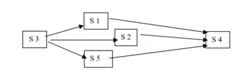

### Rozwiązanie

Inicjalizacja semaforów:

```
krok1 = 0
krok2 = 1
```

Operacje dostępne na semaforach:

```
czekaj(S):
    while S <= 0:
        wait
    S = S - 1

sygnalizuj(S):
    S = S + 1
```

Rozwiązanie z użyciem semaforów:

| P1                | P2                | P3            | P4                |
|-------------------|-------------------|---------------|-------------------|
| czekaj(krok1)     |                   | czekaj(krok1) | czekaj(krok1)     |
| S1                | S3                | S2            | S5                |
| sygnalizuj(krok2) | sygnalizuj(krok1) |               | sygnalizuj(krok2) |
|                   | sygnalizuj(krok1) | czekaj(krok2) |                   |
|                   | sygnalizuj(krok1) | S4            |                   |

### Inne rozwiązanie

```
sem1 = 0
sem2 = 0
sem3 = 0

P1:
    czekaj(sem1)
    S1
    sygnalizuj(sem2)

P3:
    S3
    sygnalizuj(sem1)
    sygnalizuj(sem2)
    sygnalizuj(sem3)

P4:
    czekaj(sem2)
    czekaj(sem3)
    S2
    czekaj(sem2)
    czekaj(sem3)
    S4

P5:
    czekaj(sem1)
    S5
    sygnalizuj(sem3)

```

Najpierw proces P3 wykonuje instrukcję S3, następnie wysyła sygnał do sem1, sem2, sem3.

Procesy P1, P4, P5 wiedzą, że mogą swoje instrukcje wykonywać. Procesy P1, p4, P5 wykonują się po sygnale z sem1, następnie sygnalizują sem2 i sem3, dzięki temu proces P4 wie, że musi wykonać instrukcje S4.

### Trzecie rozwiązanie

```
sem1 = 1
sem2 = 1
sem3 = 1

P1:
    czekaj(sem2)
    S1
    sygnalizuj(sem2)

P3:
    czekaj(sem1)
    S3
    sygnalizuj(sem1)

P4:
    czekaj(sem1)
    S2
    sygnalizuj(sem1)
    czekaj(sem1)
    S4
    czekaj(sem1)

P5:
    czekaj(sem2)
    S5
    sygnalizuj(sem2)

```

## 4. Zakleszczenia procesów 2

1. Narysować graf obrazujący następujący stan systemu przydziału zasobów:

    - System zawiera następujące typy zasobów:
      - Z1 w 4 egzemplarzach
      - Z2 w 2 egzemplarzach
      - Z3 w 1 egzemplarzu
      - Z4 w 1 egzemplarzu
      - Z5 w 2 egzemplarzach
    - Są 4 procesy:
      - P1 ma przydzielone 2 egzemplarze Z1, zamówił 1 egzemplarz Z2 i 1 egzemplarz Z3
      - P2 ma przydzielone 2 egzemplarze Z2, zamówił 1 egzemplarz Z4
      - P3 ma przydzielone 2 egzemplarze Z1 oraz 1 egzemplarz Z3, zamówił 1 egzemplarz Z5
      - P4 ma przydzielone 2 egzemplarze Z5, zamówił 1 egzemplarz Z2 i 1 egzemplarz Z3
2. Podać cykle w grafie (jeśli są).
3. Czy wszystkie procesy będą się mogły wykonać? Jeśli nie, to które procesy będą w zakleszczeniu i jak będzie wtedy wyglądał graf?

### Rozwiązanie

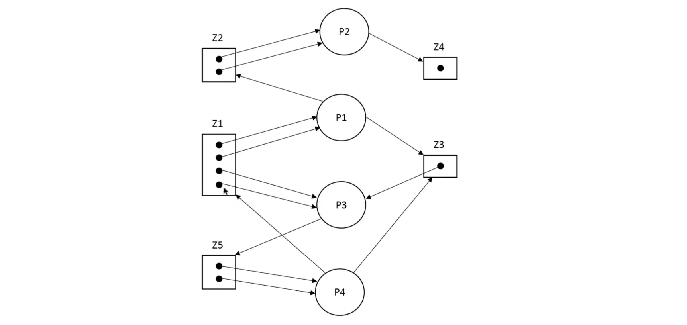
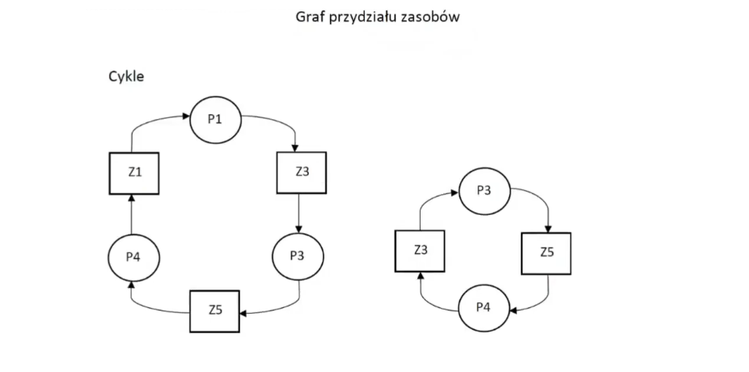

### Inne rozwiązanie

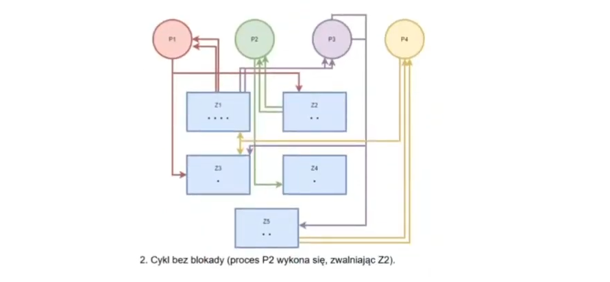

## Zakleszczenia procesów 3

Należy rozważyć system złożony z zasobów typu Z1 i typu Z2, dzielonych między cztery procesy P1, P2, P3, P4.

Zasób Z1 ma 3 egzemplarze, zasób Z2 ma 4 egzemplarze.

* Proces P1 potrzebuje 2 egz Z1 i 2 egz Z2.
* Proces P2 potrzebuje 2 egz Z1 i 2 egz Z2.
* Proces P3 potrzebuje 2 egz Z2
* Proces P4 potrzebuje 2 egz Z1 i 1 egz Z2.

Podać dwa różne stany blokady. Podać ciąg stanów umożliwiający uniknięcie blokady. Podać stan zagrożenia. Stosować grafy. Podać uzasadnienie.

### Rozwiązanie

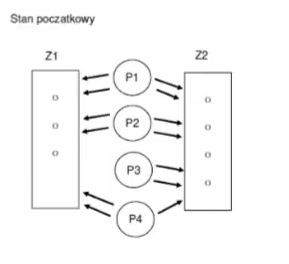
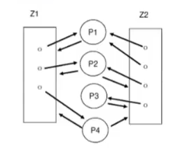
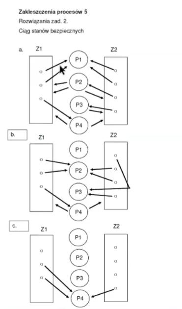
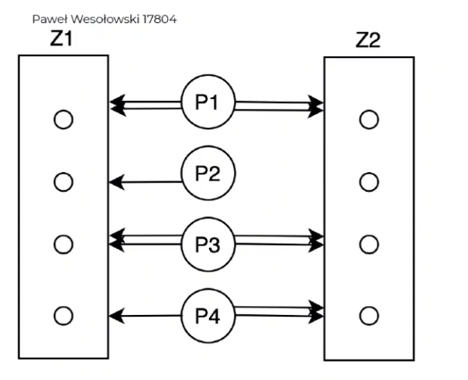
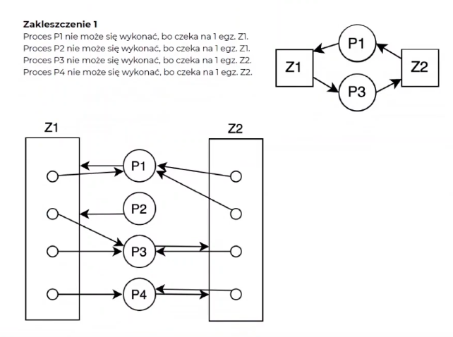

## Sieć Omega

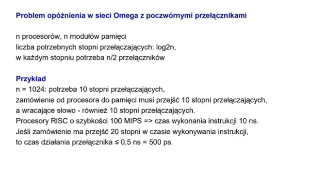
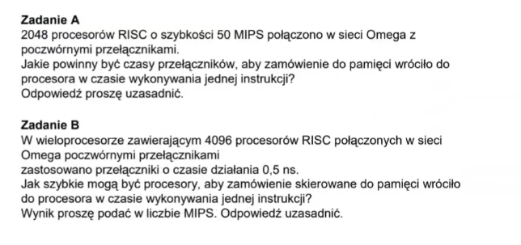

### Rozwiązanie

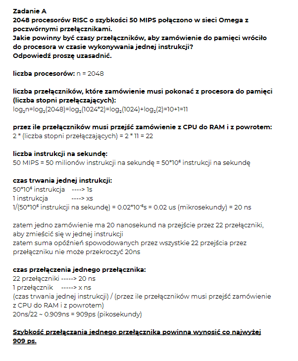
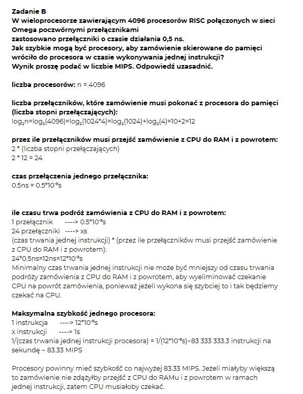

## Sieci

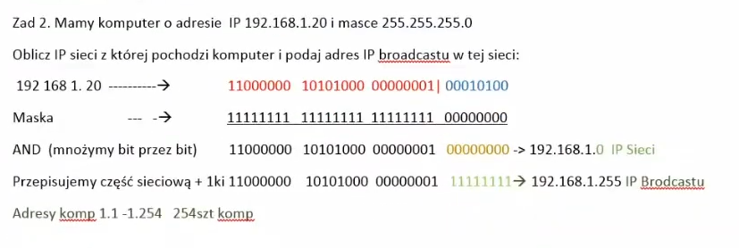
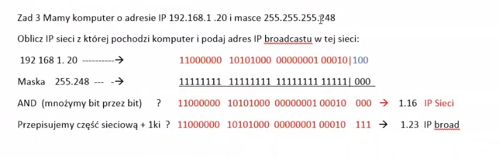
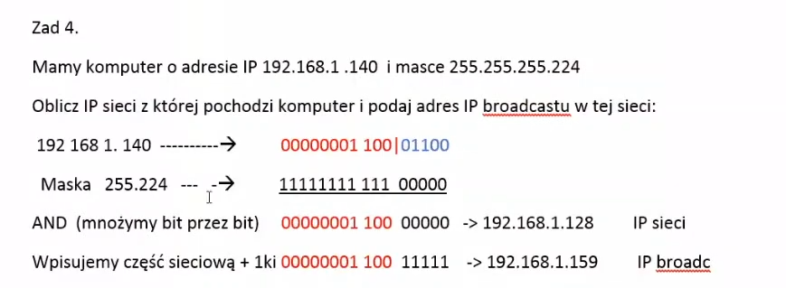

Zad 1
20 i 50 kompow

  a. b.c.0-95
198.10.5

dokonac podzialu na podsieci, 
podac numery podsieci, maski, zakres przyznanych IP, adres broadcast i routera

odp z tablicy:
IP podsieci
198.10.5.0      i 198.10.5.64

Maska
255.255.255.192 i 255.255.255.224

IP hostow
198.10.5.2-51   i 198.10.5.65(-85?)

Broadcast
198.105.63      i 198.10.5.95

Router
198.10.5.1      i 198.10.5.68 (86?)

Rezerwa
52-62           i 86-94

notatki do zadania:
zaczac od maski
Kompow - max
50     - 64  
20     - 32

(256-64=192 i 256-32=224, a 64 i 32 to odpowiednie 2^n)

-------------------------------------------------------
Zad 2

a.b.c.96-191
kompow:
61 => 64 
25 => 32

odp z tablicy
maska
255...192 i 255...224

IP hostow
a.b.c.130-190 i a.b.c.98-122

Broadcast
a.b.c.191 i a.b.c.127

Router
a.b.c.129 i a.b.c.97
-------------------------------------------------------
Zad 3
IP 198.10.5.96
maska 255.255.255.224
czy moze byc numerem hosta?
jakie nie moga byc numerami hosta?

odp:

|  224   |  
|11100000|  
  |  32  |  

0, 32, 64, ...   31, 63, ...   nie moga byc hostami
-------------------------------------------------------
