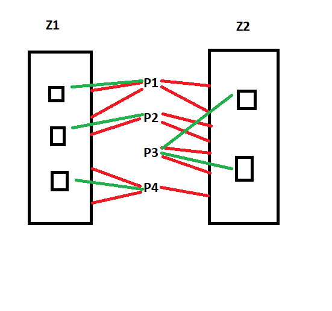

# Zadanie 5

Należy rozważyć system złożony z zasobów typu Z1 i typu Z2., dzielonych między cztery procesy P1, P2, P3 i P4. Zasób Z1 ma 3 egz., a Z2 ma 2 egz. Proces P1 potrzebuje 2 egz. Z1 i 2 egz. Z2, Proces P2 potrzebuje 1 egz. Z1 i 2 egz. Z2, P3 potrzebuje 2 egz. Z2 , a Proces P4 potrzebuje 2 egz. Z1 i 1 egz. Z2. Podać dwa różne stany blokady. Podać ciąg stanów umożliwiający uniknięcie blokady. Podać stan zagrożenia. Stosować grafy.  Podać uzasadnienie.

## Rozwiązanie

Możemy przedstawić stan początkowy systemu w następujący sposób:

Z1 x 3
z2 x 2

p1 <- 2xZ1 + 2xZ2
p2 <- 1xZ1 + 2xZ2
p3 <- 0xZ1 + 2xZ2
p4 <- 2xZ1 + 1xZ2

(czerwone linie oznaczają zapotrzebowania na procesy).

### Dwa różne stany blokady

#### Pierwszy ze stanów

(zielone linie oznaczają przydział zasobów do procesów)

W tym przypadku proces P1 oczekuje na zwolnienie egzemplarza zasobu Z1 przez P2, podczas gdy P2 oczekuje na zwolnienie egzemplarza zasobu Z2 przez P1.

Cykl blokady: P1 -> Z1 -> P2 -> Z2 -> P1 (tutaj strzałka wracająca na początek).

### Drugi z możliwych stanów blokady

Tutaj P1 oczekuje na zwolnienie zasobu Z2 przez P4, podczas gdy P4 oczekuje na zwolnienie zasobu Z1 przez P1.

P1 -> Z2 -> P4 -> Z1 -> P1 (znowu strzałka wracająca na początek).

### Ciąg stanów pozwalający na uniknięcie blokady

Stan początkowy:

System operacyjny przydziela zasoby Z2 do procesu P3 oraz po jednym egzemplarzu zasobów Z1 do P1, P2, P3.

Proces P3 wykonuje się w całości i kończy działanie, zwalniając dwa egzemplarze zasobu Z2. Obydwa egzemplarze Z2 są przypisywane procesowi P2.

Proces P2 wykonuje się w całości i kończy działanie, zwalniając 1 egzemplarz Z1 oraz 2 egzemplarze Z2. Egzemplarz Z1 i dwa egzemplarze Z2 są przypisywane P1.

Proces P1 wykonuje się w całości i kończy działanie, zwalniając 2 egzemplarze Z1 i 2 egzemplarze Z2. Procesowi P4 przypisywany jest 1 egzemplarz Z1 oraz 1 egzemplarz Z2.

Proces P4 wykonuje się w całości i kończy działanie, zwalniając zasoby.

