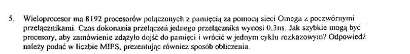

liczba procesorów $n = 2^{13}$
czas przełączania $t = 0.3 \text{ns}$

liczba stopni przełączających: 13
w każdym stopniu przełączającym n/2 przełączników - 4096.

Czas poświęcany na komunikację z RAM: $2\cdot 13 \cdot 0.3 ns = 7.8 ns$

maksymalna liczba połączeń na sekundę: $1 s / 7.8 ns = 128205128.2 \approx 128 MIPS$


```python
from math import log2

n = 8192
dt = 0.15*10**-9

n_stopni = log2(8192)

czas_pojedynczego_cyklu = 2*n_stopni*dt

max_ips = 1 / czas_pojedynczego_cyklu 
max_mips = max_ips / 1000000

print(max_mips)
```

Równanie:

$$MIPS = \frac{1}{2\cdot \log_2(n)\cdot \Delta t}\frac1{10^6}$$