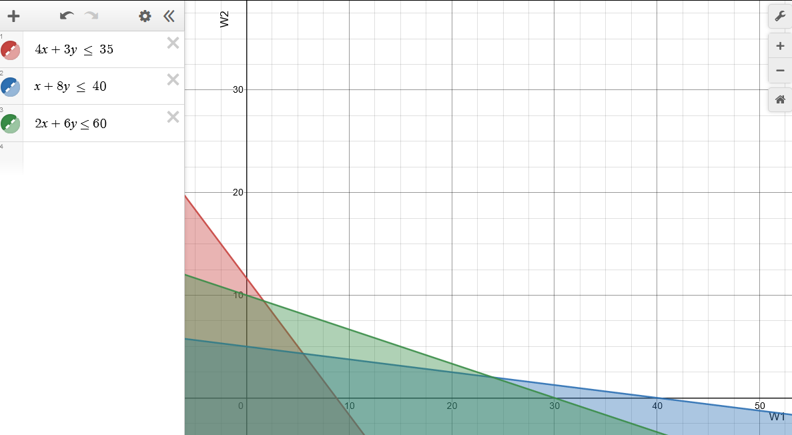
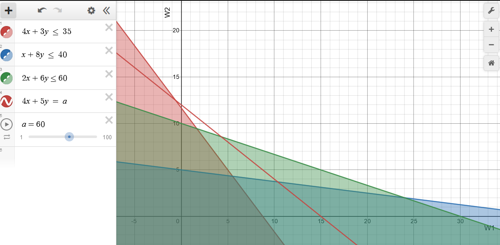
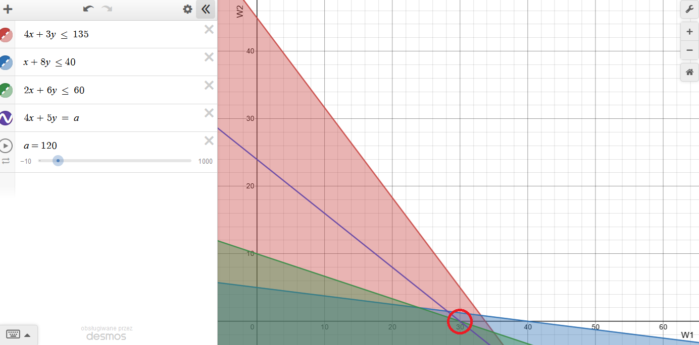

# BOP - Programowanie liniowe (numer 36)

## Problem 1
Zakład produkcyjny wytwarza dwa wyroby: W1 i W2. Do ich produkcji są potrzebne maszyny trzech typów: M1, M2 i M3, przy czym każdy wyrób wymaga użycia (kolejno) wszystkich typów maszyn. Czas wytwarzania tysiąca sztuk wyrobu Wi na maszynie typu Mj jest podany w tabeli (w godzinach):

| Wyrób/Maszyna | M1  | M2  | M3  |
| ------------- | --- | --- | --- |
| W1            | 4   | 1   | 2   |
| W2            | 3   | 8   | 6   |

W okresie planowania maszyny M1 są dostępne przez 35, M2 przez 40 i M3 przez 60 godzin. Przewiduje się, że wyroby będą przynosiły zysk jednostkowy c1 = 4 i c2 = 5 (złotych za sztukę). Należy opracować plan produkcji wyrobów W1 i W2 zapewniający największy zysk (wielkość produkcji nie musi być całkowitą wielokrotnością tysięcy sztuk).

### Podpunkt A

A. Sformułować zadanie programowania liniowego ZPL1, którego rozwiązaniem jest szukany plan produkcji.

```ampl
# Zapis w języku AMPL
var w1 >= 0;
var w2 >= 0;

maximize funkcja_celu:
4*w1 + 5*w2;

subject to ograniczenie1:
4*w1 + 3*w2 <= 35;
subject to ograniczenie2:
1*w1 + 8*w2 <= 40;
subject to ograniczenie3:
2*w1 + 6*w2 <= 60;
```

### Podpunkt B

B. Rozwiązać zadanie ZPL1:

1) Narysować obszar rozwiązań dopuszczalnych i zaznaczyć jego punkty wierzchołkowe i krawędzie. Narysować dwie lub trzy proste stałej wartości funkcji celu dla różnych wartości tej funkcji, zaznaczyć kierunek wzrostu wartości funkcji celu i wskazać na tej podstawie punkt Q1g odpowiadający rozwiązaniu optymalnemu. Obliczyć współrzędne tego punktu i wartość funkcji celu.

Obszar rozwiązań dopuszczalnych:



Punkty wierzchołkowe dla ograniczeń:
- ograniczenie 1 (czerwone) - od (0,11.667) do (8.75,0), przecięcie w (5.517, 4.31) z ograniczeniem 2, przecięcie w (1.667,9.444) z ograniczeniem 3
- ograniczenie 2 (niebieskie) - od (0,5) do (40,0), przecięcie w (24,2) z ograniczeniem 3
- ograniczenie 3 (zielone) - od (0,10) do (30,0)

Punkt optymalny (najdalszy od punktu (0,0)) jest w (2.963,4.63).

Linia stałej wartości funkcji celu dla zysku = 30 (czerwona):


Linia stałej wartości funkcji celu dla zysku = 60 (czerwona) :



Linia stałej wartości funkcji celu dla zysku = 43.62 (czerwona) :


Punkt Q1G = (5.517, 4.31)
Wartość maksymalna funkcji celu: 43.62

2) Zadanie programowania liniowego ZPL1 zapisać w pliku (tekstowym), a następnie wyznaczyć jego rozwiązanie optymalne za pomocą AMPL. Otrzymane rozwiązanie Q1 należy porównać z rozwiązaniem Q1g otrzymanym w p. B1.

```
ampl: model problem_1.mod;
ampl: solve;
MINOS 5.51: optimal solution found.
2 iterations, objective 43.62068966
ampl: display w1, w2;
w1 = 5.51724
w2 = 4.31034
```

```
Q1 = 43.62068966
```

### Podpunkt C

C. Sprawdzić, czy w przypadku zmiany zysku jednostkowego c1 z 4 zł na 15 zł plan produkcji Q1 wyznaczony w p. B pozostanie nadal rozwiązaniem optymalnym. W przypadku odpowiedzi negatywnej należy podać, jaki plan produkcji Q1C stałby się optymalnym przy danych wartościach c1 i c2 i o ile większy zysk by zapewniał w porównaniu z planem Q1.

Nowy model dla c1 = 15:

```
var w1 >= 0;
var w2 >= 0;

maximize funkcja_celu:
15*w1 + 5*w2;

subject to ograniczenie1:
4*w1 + 3*w2 <= 35;
subject to ograniczenie2:
1*w1 + 8*w2 <= 40;
subject to ograniczenie3:
2*w1 + 6*w2 <= 60;
```

Wynik:

```
ampl: model problem_1c.mod
ampl: solve
ampl? ;
MINOS 5.51: optimal solution found.
1 iterations, objective 131.25
ampl: display w1, w2;
w1 = 8.75
w2 = 0
```

Odpowiedź: plan produkcji się zmieni, nowy punkt Q1C = (8.75, 0) z zyskiem 131.25. Poprzedni punkt Q1 = (5.51724, 4.31034) przyniósłby mniejszy zysk równy 104.3103. Różnica w zyskach wynosi 26.9397.

### Podpunkt D

Dla każdego typu maszyn $i$ wyznaczyć eksperymentalnie dodatkowy zysk $\Delta_i$ (w stosunku do osiąganego przy planie Q1), jaki można by uzyskać za dodatkową godzinę pracy maszyn typu $i$. Zwiększyć o 100 godzin dostępność maszyny zapewniającej największy dodatkowy zysk, wyznaczyć rozwiązanie optymalne w tym przypadku, na wykresie zakreskować obszar rozwiązań dopuszczalnych oraz zaznaczyć znalezione rozwiązanie optymalne. Jak zmienił się maksymalny zysk w porównaniu do zysku dla planu Q1?

Dla maszyny M1:
```
var w1 >= 0;
var w2 >= 0;

maximize funkcja_celu:
4*w1 + 5*w2;

subject to ograniczenie1:
4*w1 + 3*w2 <= 36; # dodana 1 godzina do M1
subject to ograniczenie2:
1*w1 + 8*w2 <= 40;
subject to ograniczenie3:
2*w1 + 6*w2 <= 60;
```
Dla maszyny M2:
```
var w1 >= 0;
var w2 >= 0;

maximize funkcja_celu:
4*w1 + 5*w2;

subject to ograniczenie1:
4*w1 + 3*w2 <= 35;
subject to ograniczenie2:
1*w1 + 8*w2 <= 41; # dodana 1 godzina do M2
subject to ograniczenie3:
2*w1 + 6*w2 <= 60;
```
Dla maszyny M3:
```
var w1 >= 0;
var w2 >= 0;

maximize funkcja_celu:
4*w1 + 5*w2;

subject to ograniczenie1:
4*w1 + 3*w2 <= 35;
subject to ograniczenie2:
1*w1 + 8*w2 <= 40;
subject to ograniczenie3:
2*w1 + 6*w2 <= 61; # dodana 1 godzina do M3
```

Wyniki: 

```
Q1D1 = 44.5517241
Delta_1 = 44.5517241 - 43.62068966 = 0.93103444
Q1D2 = 43.89655172
Delta_2 = 43.89655172 - 43.62068966 = 0.27586206
Q1D3 = 43.62068966
Delta_3 = 43.62068966 - 43.62068966 = 0
```

Zatem dodanie pojedynczej godziny do maszyny M1 daje największy zysk.

Rozwiązania dla maszyny M1 z dodatkowymi 100 godzinami.

```
var w1 >= 0;
var w2 >= 0;

maximize funkcja_celu:
4*w1 + 5*w2;

subject to ograniczenie1:
4*w1 + 3*w2 <= 135; # dodane 100 godzin do M1
subject to ograniczenie2:
1*w1 + 8*w2 <= 40;
subject to ograniczenie3:
2*w1 + 6*w2 <= 60;
```

Wynik: zysk 120, dla punktu (30, 0).

Rysunek (ograniczenie 1 - czerwone, ograniczenie 2 - niebieskie, ograniczenie 3 - zielone, linia kosztów dla zysku = 120 - fioletowa, punkt optimum - czerwone kółko):



## Problem 2

Problem 2 jest podobny do Problemu 1, z tym że dotyczy produkowania czterech różnych wyrobów. Doszła możliwość produkowania na tych samych maszynach przy tym samym czasie ich pracy dodatkowych wyrobów W3 i W4 (oprócz wyrobów W1 i W2); wyroby W3 i W4 będą przynosiły zysk jednostkowy c3 = 6 i c4 = 5 (złotych za sztukę). Czas wytwarzania partii tysiąca sztuk wyrobów W3 i W4 jest następujący (w
godzinach):

| Wyrób/Maszyna | M1  | M2  | M3  |
| ------------- | --- | --- | --- |
| W3            | 3   | 8   | 6   |
| W4            | 1   | 4   | 6   |

Należy opracować plan produkcji Q2 czterech wyrobów W1, W2, W3 i W4 zapewniający największy zysk, posługując się modelem utworzonym w AMPL. Wyznaczony plan Q2 i odpowiadającą mu wartość funkcji celu porównać z planem optymalnym Q1 dla Problemu 1 sprawdzając, czy zysk całkowity zmniejszył się czy zwiększył, czy wyroby W3 i W4 zostały włączone do planu produkcji Q2 i czy charakter zmian zysku jest logicznie uzasadniony.

Model:

```
var w1 >= 0;
var w2 >= 0;
var w3 >= 0;
var w4 >= 0;

maximize funkcja_celu:
4*w1 + 5*w2 + 6*w3 + 5*w4;

subject to ograniczenie1:
4*w1 + 3*w2 + 3*w3 + 1*w4 <= 35;
subject to ograniczenie2:
1*w1 + 8*w2 + 8*w3 + 4*w4 <= 40;
subject to ograniczenie3:
2*w1 + 6*w2 + 6*w3 + 6*w4 <= 60;
```

Wynik:
```
ampl: model problem_2.mod
ampl: solve;
MINOS 5.51: optimal solution found.
3 iterations, objective 65.90909091
ampl: display w1,w2,w3,w4;
w1 = 6.81818
w2 = 0
w3 = 0
w4 = 7.72727
```

Zysk całkowity: Q2 = 65.90909091 dla produkcji (6.81818, 0, 0, 7.72727). W porównaniu do Q1 = 43.62068966 dodatkowy zysk jest równy 22.28840125.

Zysk całkowity w oczywisty sposób się zwiększył - nie mógł się zmniejszyć, mógł co najwyżej być ten sam dla w3 = 0, w4 = 0. Należy usunąć wyrób w2 oraz dodać wyrób w4 do produkcji.

### Problem 3

Sformułować zadanie programowania matematycznego (ZPL3) dla Problemu różniącego się od Problemu 1 w następujący sposób: 

1) maszyny nie "są dostępne" lecz "muszą być obciążone" produkcją wyrobów W1 i W2 przynajmniej przez podany czas (35, 40 i 60 godzin); 
2) współczynniki c1 i c2 wyrażają nie zysk jednostkowy, lecz koszt jednostkowy; 
3) trzeba znaleźć plan produkcji o najniższym koszcie całkowitym.

Na rysunku wykonanym w p. B 1 zaznaczyć obszar rozwiązań dopuszczalnych zadania 3 i w oparciu o wyznaczony kierunek wzrostu wartości funkcji celu wskazać punkt Q3g będący rozwiązaniem optymalnym zadania 3. Rozwiązać zadanie ZPL3 posługując się modelem utworzonym w AMPL i porównać otrzymane rozwiązanie optymalne Q3 z rozwiązaniem Q3g.

Nowy model zadania:

```
var w1 >= 0;
var w2 >= 0;

minimize funkcja_celu:
4*w1 + 5*w2;

subject to ograniczenie1:
4*w1 + 3*w2 >= 35;
subject to ograniczenie2:
1*w1 + 8*w2 >= 40;
subject to ograniczenie3:
2*w1 + 6*w2 >= 60;
```

Rysunek poglądowy (ograniczenie 1: czerwony, ograniczenie 2: niebieski, ograniczenie 3: zielony, linia kosztów: fioletowa):


Wyznaczony graficznie punkt optymalny kosztów ma wartość Q3G = 53.9 dla punktu (1.667, 9.444).

Wyznaczony numerycznie punkt optymalny kosztów:

```
ampl: model problem_3.mod;
ampl: solve;
MINOS 5.51: optimal solution found.
1 iterations, objective 53.88888889
ampl: display w1, w2;
w1 = 1.66667
w2 = 9.44444
```

Wynik to Q3 = 53.89 dla punktu (1.67, 9.44).