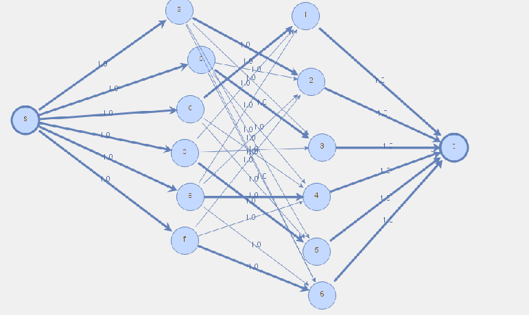
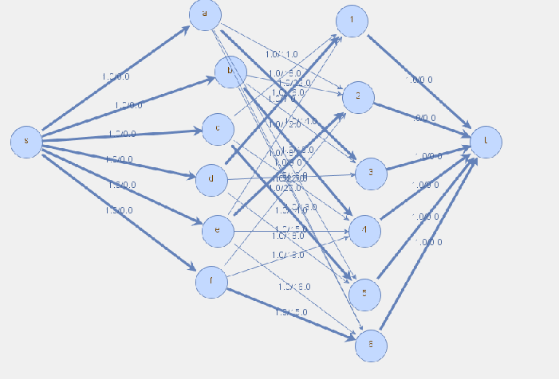
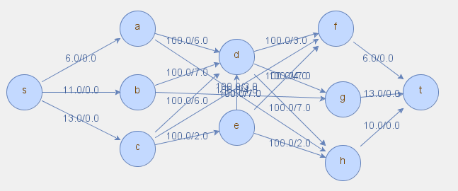

# Modele sieci przepływowych (zestaw 16)

## Problem A

Należy dokonać przydziału zadań do poszczególnych procesorów. Kryteria przydziału są podane w instrukcji. Czasy wykonywania zadań na poszczególnych procesorach są podane w poniższej tabeli.

. | a  | b  | c  | d  | e  | f
- | -- | -- | -- | -- | -- | --
1 | -  | -  | 18 | 7  | 12 | -
2 | 11 | 22 | -  | -  | 9  | 20
3 | 16 | 14 | -  | 10 | -  | -
4 | -  | 13 | 17 | -  | 15 | 19
5 | 18 | -  | 14 | 18 | -  | -
6 | 20 | 13 | -  | -  | 16 | 15

1. Dokonać przydziału zadań do procesorów w taki sposób, by przy spełnieniu warunków:

  - każde zadanie było przydzielone do maksymalnie jednego procesora;
  - każdy procesor był przydzielony do maksymalnie jednego zadania;

    liczba przydzielonych (obsługiwanych) zadań była jak największa. W tym celu:

    a) Sformułować i narysować model sieciowy, SP_A1, dla rozpatrywanego zagadnienia.

    

    b) Rozwiązać model za pomocą programu Modgraf, zapisać wyznaczony przydział zadań do procesorów w tabeli A1.

```
Tabela A1\. Przydział zadań do procesorów

Zadanie | Procesor
------- | --------
1       | c
2       | a
3       | b
4       | e
5       | d
6       | f

Liczba wykonywanych zadań wynosi: 6
```

1. Biorąc pod uwagę czasy wykonywania zadań przedstawione w tabeli danych, znaleźć taki przydział poszczególnych zadań do procesorów, aby przy spełnieniu warunków:

  - każde zadanie było przydzielone do dokładnie jednego procesora;
  - każdy procesor był przydzielony do dokładnie jednego zadania;

suma czasów wykonywania zadań była jak najmniejsza. W tym celu:

a) Sformułować i narysować model sieciowy, SP_A2, dla rozpatrywanego zagadnienia.



b) Rozwiązać model, za pomocą programu Modgraf, zapisać wyznaczony sumaryczny czas wykonania zadań oraz przydział zadań do procesorów w Tabeli A2

Tabela A2\. Przydział zadań do procesorów

Zadanie | Procesor
------- | --------
1       | d
2       | e
3       | a
4       | b
5       | c
6       | f

Sumaryczny czas wykonania zadań wynosi: 74

1. Dla przydziału otrzymanego w puncie 2b podać czas wykonania całej grupy zadań. Określić minimalny czas potrzebny na wykonanie całej grupy zadań oraz podać odpowiadający mu sumaryczny czas wykonania zadań

Tabela A3\. Czas wykonania całej grupy zadań

-                                            | Sumaryczny czas wykonania zadań | Czas wykonania całej grupy zadań
-------------------------------------------- | ------------------------------- | --------------------------------
Dla punktu 2b                                | 74                              | 16
Po minimalizacji czasu wykonania grupy zadań | 75                              | 15

(dla maksymalnego czasu wykonania = 14 nie jesteśmy w stanie wykonać zadania 6)

## Problem B

W centrum dyspozytorskim planuje się dostawy węgla z określonych kopalń do elektrowni. Rozważana jest możliwość dostaw węgla kamiennego z trzech kopalń A, B, C do trzech elektrowni F, G, H za pomocą sieci kolejowej z dwiema stacjami pośrednimi D i E.

Jednostkowe koszty transportu na poszczególnych odcinkach wynoszą:

- | D | E | F | G | H
- | - | - | - | - | -
A | 6 | - | - | - | 7
B | 7 | - | - | 7 | -
C | 6 | 2 | 3 | - | -
D | - | - | 3 | 7 | 7
E | 4 | - | 4 | - | 2

Zdolności wydobywcze kopalń wynoszą (w tys. ton na dobę): WA = 6, WB = 11, WC = 13.

Średnie zużycie dobowe węgla przez elektrownie wynosi (w tys. ton): ZF = 6, ZG=13, ZH=10

Należy wyznaczyć plan codziennych dostaw węgla zaspokajający zapotrzebowania elektrowni i minimalizujący sumaryczne koszty transportu. Plan ma określać wielkości dostaw i trasy przejazdu, tak by można było określić obciążenia poszczególnych odcinków sieci.

1. Wyznaczyć (za pomocą alg. Dijkstry) najtańsze trasy połączeń między dostawcami a odbiorcami oraz jednostkowe koszty transportu dla tych połączeń; zapisać je w tabeli (trasy i koszty).



Tabela B1\. Najtańsze trasy oraz jednostkowe koszty transportu po tych trasach.

-          | Odbiorca F | Odbiorca G | Odbiorca H
---------- | ---------- | ---------- | ------------
Dostawca A | a,d,f (9)  | a,d,g (13) | a, h (7)
Dostawca B | b,d,f (10) | b,g (7)    | b, d, h (14)
Dostawca C | c,f (3)    | c,d,g (13) | c, e, h (4)

1. Korzystając z wartości najmniejszych kosztów transportu między dostawcami a odbiorcami, które zostały wyznaczone w punkcie B5, sformułować zadanie transportowe z uwzględnieniem tylko dostawców i odbiorców. Zapisać to zadanie w postaci modelu programowania liniowego, ZPL_B i rozwiązać korzystając z języka AMPL. Zapisać otrzymane rozwiązanie: minimalny koszt transportu oraz ilości towaru przesyłane między poszczególnymi dostawcami i odbiorcami.

Minimalny koszt transportu wynosi: 170

Tabela B2\. Liczba przesłanych jednostek towaru.

-          | Odbiorca F | Odbiorca G | Odbiorca H
---------- | ---------- | ---------- | ----------
Dostawca A | 0          | 2          | 3
Dostawca B | 0          | 11         | 0
Dostawca C | 6          | 0          | 7
