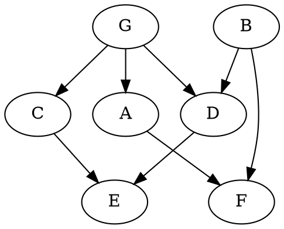
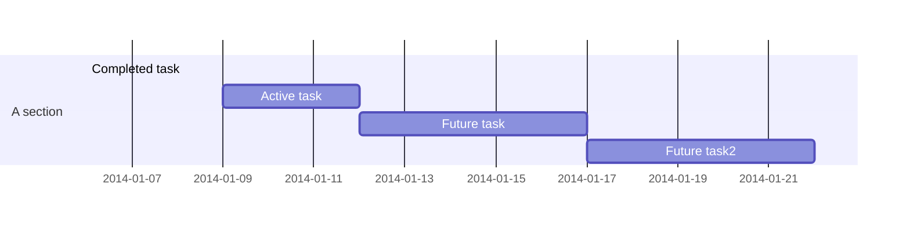

```dot
digraph base_flow {

    G -> D;
    G -> A;
    G -> C;
    B -> D;
    C -> E;
    D -> E;
    A -> F;
    B -> F;
    }
```

```mermaid
gantt

section A section
Completed task            :    des1, 2014-01-06,2014-01-08
Active task               :  des2, 2014-01-09, 3d
Future task               :         des3, after des2, 5d
Future task2               :         des4, after des3, 5d
```