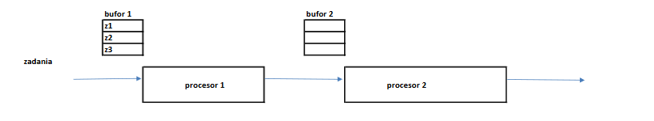

# Ćwiczenia

## Zadanie 1

Rozważany jest system obsługi, w którym 5 zadań jest obsługiwanych kolejno przez dwa procesory. 
 
 
 
 Każdy procesor może w danej chwili obsługiwać tylko jedno zadanie. Przed każdym z procesorów znajduje się bufor, w którym zadania mogą czekać na obsługę, gdy procesor jest zajęty obsługą innego zadania. Z pierwszego bufora zadania mogą być pobierane w dowolnej kolejności; w chwili początkowej bufor ten mieści wszystkie zadania. W buforze drugim przechowywane są zadania opuszczające pierwszy procesor; zadania przebywające w tym buforze opuszczają go w takiej samej kolejności, w jakiej do niego wchodzą. 

Czasy wykonywania zadań na poszczególnych procesorach podane są w tabeli: 
 
|            | Zadanie 1 | Zadanie 2 | Zadanie 3 | Zadanie 4 | Zadanie 5 |
| ---------- | --------- | --------- | --------- | --------- | --------- |
| Procesor 1 | 5         | 5         | 35        | 8         | 3         |
| Procesor 2 | 7         | 2         | 5         | 35        | 4         |
 
A. Przeprowadzić symulację obsługi zadań na dwóch procesorach, przy nieograniczonej pojemności drugiego bufora i różnych regułach kolejności pobierania zadań z bufora pierwszego. 
Wyznaczyć długość uszeregowania, $T$, oraz średni czas przebywania zadania w systemie SCP. 
 
Zadania ustawione są w kolejności: 
1. naturalnej 
2. według niemalejących czasów obsługi na procesorze 1 (SPT) 
3. zgodnie z regułą Johnsona 

B. Dla kolejności SPT1 przeprowadzić symulację obsługi zadań przy założeniu braku bufora przed procesorem drugim (bufor ma pojemność 0). 

### Rozwiązanie

