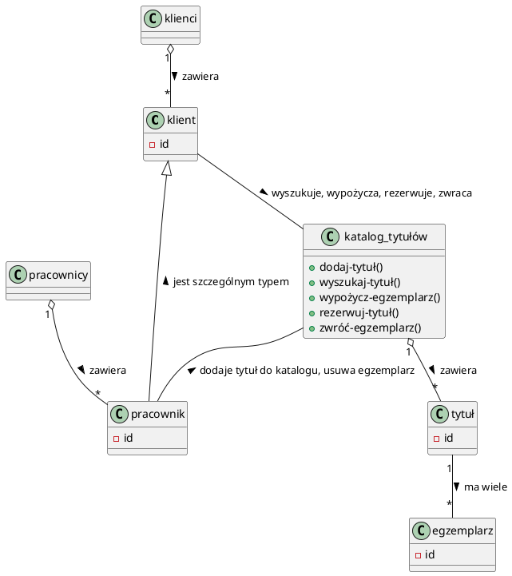

```plantuml
@startuml
class klient{
    -id
}

class pracownik{
    -id
}

class pracownicy
class pracownik
class klienci
class tytuł{
    -id
}

class egzemplarz{
    -id
}
class katalog_tytułów{
    +dodaj-tytuł()
    +wyszukaj-tytuł()
    +wypożycz-egzemplarz()
    +rezerwuj-tytuł()
    +zwróć-egzemplarz()
}

klient <|-- pracownik : jest szczególnym typem <

pracownicy "1" o-- "*" pracownik : zawiera >
klienci "1" o-- "*" klient : zawiera >
katalog_tytułów "1" o-- "*" tytuł : zawiera >
tytuł "1" -- "*" egzemplarz : ma wiele >

katalog_tytułów -- pracownik : dodaje tytuł do katalogu, usuwa egzemplarz <
klient -- katalog_tytułów : wyszukuje, wypożycza, rezerwuje, zwraca >
@enduml
```