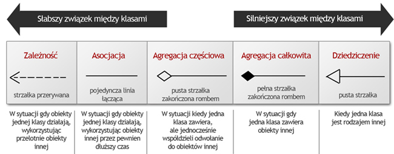
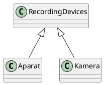
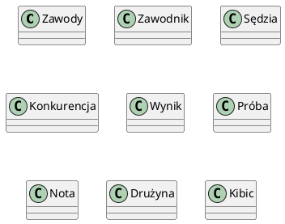
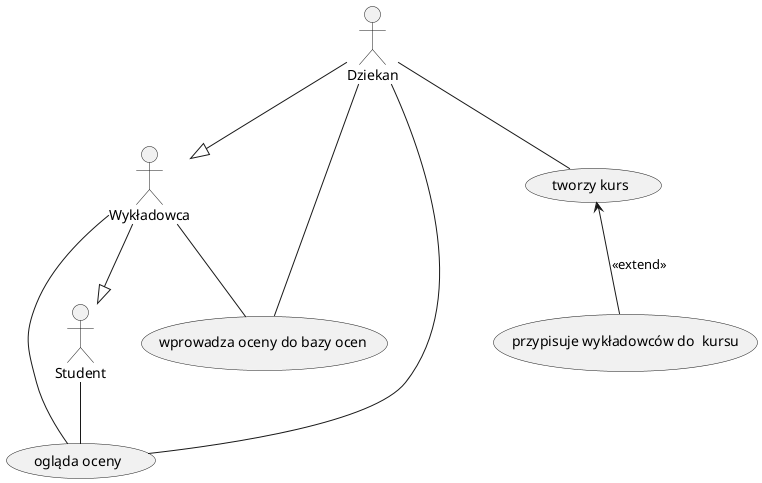

# Inżynieria oprogramowania

## Informacje wstępne

### Czym zajmuje się inżynieria oprogramowania?

- rozwój oprogramowania
- analiza oprogramowania
- procedury i kontrola jakości oprogramowania
- analizą i rozwojem systemów informatycznych,
- technikami szacowania kosztów i harmonogramowania tworzenia oprogramowania,
- metodami analizy i projektowania systemów,
- technikami zwiększania niezawodności oprogramowania,
- sposobami testowania systemów i szacowania ich niezawodności,
- sposobami przygotowywania dokumentacji technicznej i użytkowej,
- procedurami kontroli jakości,
- technikami pracy zespołowej.

### Miary niezawodności oprogramowania

- odporność na błędy
- MTBF - mean time between failures
- wysoki średni czas pomiędzy błędami
- łatwy do rozwijania, łatwy do pielęgnowania
- łatwy w obsłudze (przyjazne międzymordzie)

Miara 1 Jako miarę niezawodności przyjmuje się prawdopodobieństwo błędnego wyko-nania podczas realizacji transakcji. Każde błędne wykonanie powoduje zerwanie całej transakcji. Miarą jest więc częstość występowania transakcji, które nie powiodły się wskutek błędów. Miara 2 Jako miarę niezawodności przyjmuje się częstotliwość występowania błędnych wykonań, czyli liczbę błędów w jednostce czasu. Na przykład 0,1/h oznacza, że w ciągu godziny liczba spodziewanych błędnych wykonań wynosi 0,1\. Miara ta jest stosowana w przypadku systemów, które nie mają charakteru transakcyjnego. Miara 3 Jako miarę niezawodności przyjmuje się średni czas między błędnymi wykona-niami - odwrotność miary 2\. Miara 4 Jako miarę niezawodności przyjmuje się dostępność, czyli prawdopodobień-stwo, że w danej chwili system będzie dostępny do użytkowania. Miarę tę można oszacować na podstawie stosunku czasu, którym system jest dostępny, do czasu od wystąpienia błędu do powrotu do normalnej sytuacji. Miara zależy nie tylko od błęd-nych wykonań, ale także od narzutu błędów na niedostępność systemu.

1. Kryteria związane ze sposobem działania:

  - przyjazność interfejsu
  - bezpieczeństwo - kontrola uprawnień dostępu
  - wydajność
  - poprawność - stopień realizacji wymagań
  - kompletność i logiczność implementacji
  - zgodność działania ze specyfikacją
  - niezawodność - odporność na błędy

2. Kryteria zwiazane z możliwością wprowadzenia zmian i poprawek:

  - pielęgnowalność - stopień przystosowania do poprawienia, modyfikacji, rozszerzania, adaptowania
  - elastyczność - możliwości rozbudowywania oprogramowania o nowe funkcje oraz uniwersalność zaimplementowanych rozwiązań
  - testowalność

3. Kryteria związane z mobilnością:

  - przenośność - zdolność do łatwego uruchamiania na innych systemach
  - uniwersalność - odnosi się do możliwości wykorzystania istniejącego oprogramowania lub jego fragmentów do konstrukcji innych systemów (reuse)
  - otwartość - stopień przystosowania programu do współpracy lub wymiany informacji z innymi systemami komputerowymi

# Wymień typy relacji w UML

- asocjacja (jednostronna, dwustronna)
- generalizacja
- kompozycja
- agregacja
- zależność (klasa korzysta z obiektów innej klasy)

# Jak strukturalizować diagramy use case w UML

- include
- extend
- generalizacja

# Objaśnij krótko iteracyjny model produkcji orpgoramowania

Fazy:

1. Określanie wymagań
2. Projekt ogólny
3. Powtarzaj co następuje:

  - 3.1\. Wybór funkcji
  - 3.2\. Projekt / implementacja / testy
  - 3.3\. Dostarczenie części systemu -> powrót wyboru funkcji.

Kryteria wyboru funkcji do realizacji:

- priorytet dla klienta
- łatwość realizacji
- przydatność dla kolejnych iteracji

Zalety:

- częsty kontakt z klientem
- możliwość wczesnego wykorzystywania części systemu

Wady:

- dodatkowy koszt związany z realizacją fragmentów systemu (pisanie szkieletów modułów)

## Kiedy stosuje się prototypowanie?

Celem prototypu jest wykrycie: ⚫ trudnych usług ⚫ braków w specyfikacji ⚫ nieporozumień między klientem a projektantami Prototyp pozwala na: ⚫ demonstrację pracującego systemu ⚫ daje możliwości szkolenia zanim zostanie zbudowany pełen system

zdarzenie          | stan   | akcje
------------------ | ------ | -------------------------------
utworzenie obiektu | stan 1 | A1/entry; A3/do
E2                 | stan 1 | A5/E2; A3/do
E3                 | stan 1 | A6/E3; a3/do
E1                 | stan 2 | A2/exit;A4/E1; A7/entry; A9/do;

zdarzenie          | stan   | akcje
------------------ | ------ | -------------------------------
utworzenie obiektu | stan 1 | A1/entry; A3/do
E3                 | stan 1 | A6/E3; A3/do
E2                 | stan 1 | A5/E2; a3/do
E1                 | stan 2 | A2/exit;A4/E1; A7/entry; A9/do;
E3                 | stan 2 | A10/E3;A9/do;

## Segmenty spirali w modelu spiralnym

1. Planowanie
2. Analiza ryzyka
3. Konstrukcja
4. Testowanie

5. Określenia celów, identyfikacja ograniczeń, poszukiwanie alternatywnych rozwiązań.

6. Analiza ryzyka związanego z proponowanymi rozwiązaniami, redukcja ryzyka np. w przypadku ryzyka związanego z wymaganiami budowa prototypu.
7. Po określeniu ryzyka wybiera się najlepsze rozwiązanie (o najmniejszym ryzyku).
8. Planowanie następnej spirali, podjęcie decyzji dotyczącej kontynuacji.

COCOMO - jakaś choroba

Metoda estymacji kosztów przez machanie martwym kurczakiem. Na początku liczymy współczynnik UFC - unajusted function point. Mnożymy dostarczone wartości przez współczynniki i obliczamy wynik:

- EIF (external interface file): 4 (zewnętrzne zbiory danych)
- ILF (internal interface file): 6 (wewnętrzne zbiory danych)
- EI (external input): 10 (wejścia zmieniające dane systemu)
- EO (external output): 12 (raporty dla użytkownika)
- EQ (external query): 20 (interakcje z użytkownikiem nie zmieniającymi danych systemu)

$$UFC = \sum_iw_ix_i = 7\cdot4+5\cdot6+3\cdot10+4\cdot12+3\cdot20 = 196$$

Dalej: przemnażamy UFC przez AFC (average number of lines of code) i obliczamy wynik. Ponieważ AFC = 50 LOC/FP dla bieżącego projektu, wynik jest równy $LOC = 196\cdot50 = 9800$, zatem $KDSI = 9.8$.

Wysiłek (PM) potrzebny na wykonanie tego projektu w osobo/miesiącach wyliczamy na podstawie modelu COCOMO dla małego projektu:

$$PM = C\cdot KDSI^S\cdot M,$$

gdzie dla małego projektu:

- $C = 2.4$,
- $M = 1$,
- $s = 1.05$. Prosty projekt:

PM - person/month

KDSI - kilo delivered source instructions

- Dla projektów małych: $PM = 2.4(KDSI)^{1.05}\cdot M$
- Dla projektów średnich: $PM = 3.0(KDSI)^{1.12}\cdot M$
- Dla projektów złożonych: $PM = 3.6(KDSI)^{1.20}\cdot M$

Czas trwania projektu:

- Dla projektów prostych: $TDEV = 2.5(PM)^{0.38}$
- Dla projektów średnich: $TDEV = 2.5(PM)^{0.35}$
- Dla projektów złożonych: $TDEV = 2.5(PM)^{0.32}$

## Zalety stosowania specyfikacji formalnych

W systemach krytycznych pozwala na niski poziom błędów

Wady:

- cholernie trudne do wyspecyfikowania

### Na czym polega testowanie strukturalne?

Testy strukturalne (white box) - testy nastawione na wykrywanie błędów, wyprowadzone na podstawie znajomości struktury programu. Twórca testu wie jak zostało zaimplementowane rozwiązanie i opisuje, czego spodziewa się po działaniu.

### Jakie są narzędzia modelowania systemu w metodach strukturalnych?

Metoda projektowania systemu informatycznego

budowa dwóch modeli systemu:

- danych (pasywna część)
- funkcji (aktywna część)

- model przepływu danych

- drzewo struktur

ERD DFD, STD, DSP

- system realizuje złożone funkcje na prostych danych
- system służy do przechowywania i wyszukiwania złożonych danych

- diagram przepływu danych (DFD) - ilustruje funkcje które musi realizować system

- diagram związków encji (ERD) - uwypukla związki między danymi
- diagram sieci przejść (STD) - koncentruje się na charakterystyce czasowej
- diagram struktury (structure charts) - opisuje strukturę oprogramowania

diagram przepływu danych (DFD) - ilustruje funkcje które musi realizować system

- diagram związków encji (ERD) - uwypukla związki między danymi
- diagram sieci przejść (STD) - koncentruje się na charakterystyce czasowej
- diagram struktury (structure charts) - opisuje strukturę oprogramowania Pokazuje jak dane przepływają z jednej jednostki przetwarzającej do następnej. Nie zawierają informacji sterujących. Autorzy stosują różne notacje graficzne.
- Procesy (centra transformacji danych) bąble, elipsy, kółka Oznacza się je mnemonikami opisującymi rodzaj transformacji. Reprezentują realizowane funkcje
- Przepływy przedstawiane strzałkami. Określają kierunek przepływu danych, oznaczenia opisują przepływające dane. Tworzą związek między procesami Magazyny danych (data store) linie równoległe, prostokąty Pokazują zbiory danych, które system przechowuje.
- Terminatory, interakcje kółka Przedstawiają zewnętrzne obiekty z którymi komunikuje się system (osoby, komputery) Modelowanie gromadzonych danych
- Typy obiektów
- Typ obiektu reprezentuje zbiór lub kolekcję obiektów ze świata rzeczywistego, które mają znaczenie dla budowanego systemu, mogą być jednoznacznie zidentyfikowane i opisane przez atrybuty, zazwyczaj oznaczane prostokątami.
- Związki
- Reprezentują zbiór powiązań między typami obiektów. Przedstawiane za pomocą rombów
