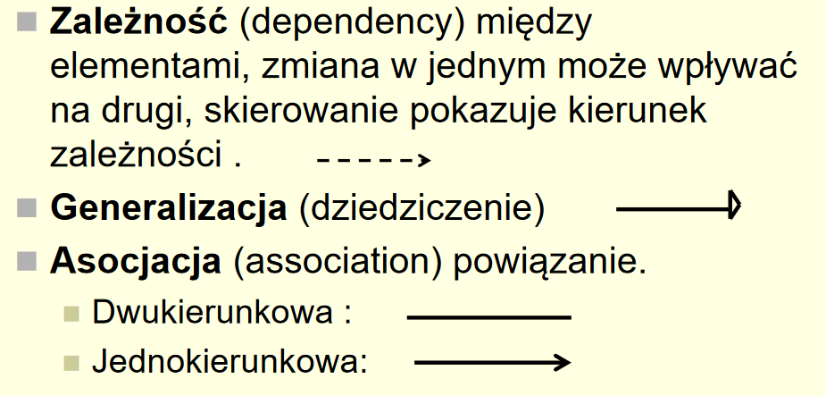
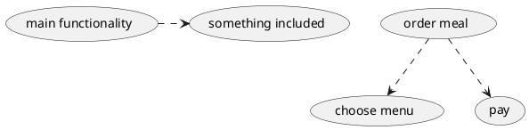
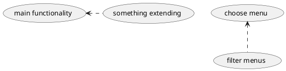
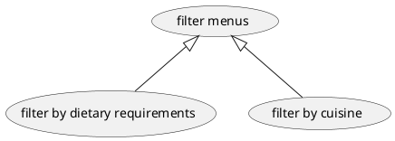
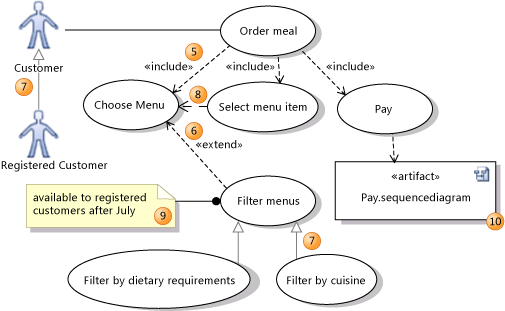
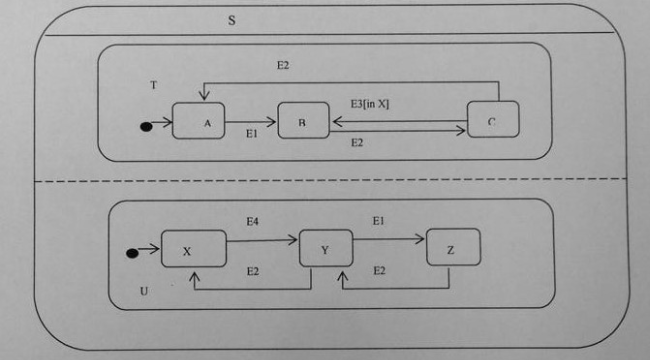

# Inżynieria oprogramowania

## Informacje wstępne

### Czym zajmuje się inżynieria oprogramowania?

Inżynieria oprogramowania zajmuje się:

- analizą i rozwojem systemów informatycznych,
- technikami szacowania kosztów i harmonogramowania tworzenia oprogramowania,
- metodami analizy i projektowania systemów,
- technikami zwiększania niezawodności oprogramowania,
- sposobami testowania systemów i szacowania ich niezawodności,
- sposobami przygotowywania dokumentacji technicznej i użytkowej,
- procedurami kontroli jakości,
- technikami pracy zespołowej.

### Miary niezawodności oprogramowania

1. Kryteria związane ze sposobem działania:

  - przyjazność interfejsu
  - bezpieczeństwo - kontrola uprawnień dostępu
  - wydajność
  - poprawność - stopień realizacji wymagań
  - kompletność i logiczność implementacji
  - zgodność działania ze specyfikacją
  - niezawodność - odporność na błędy

2. Kryteria zwiazane z możliwością wprowadzenia zmian i poprawek:

  - pielęgnowalność - stopień przystosowania do poprawienia, modyfikacji, rozszerzania, adaptowania
  - elastyczność - możliwości rozbudowywania oprogramowania o nowe funkcje oraz uniwersalność zaimplementowanych rozwiązań
  - testowalność

3. Kryteria związane z mobilnością:

  - przenośność - zdolność do łatwego uruchamiania na innych systemach
  - uniwersalność - odnosi się do możliwości wykorzystania istniejącego oprogramowania lub jego fragmentów do konstrukcji innych systemów (reuse)
  - otwartość - stopień przystosowania programu do współpracy lub wymiany informacji z innymi systemami komputerowymi

### Jakie są cechy oprogramowania wysokiej jakości?

### Jakie można stosować kryteria oceny oprogramowania?

### Jakie cechy oprogramowania są związane z jego działaniem?

### Co oferuje inżynieria oprogramowania?

### Dlaczego ważniejsza jest niezawodność oprogramowania, niż efektywność?

### Jakie cechy powinien posiadać prawidłowo zaprojektowany interfejs systemu informatycznego?

### Jakie są poziomy modelowania systemu (widzenia systemu) w UML?

1. Model use case (przypadki użycia)

  - przedstawia system z punktu widzenia użytkownika
  - modeluje zachowanie systemu w odpowiedzi na polecenia użytkownika
  - określa CO system robi i kto może z niego skorzystać.

2. Poziom logiczny - co jest w systemie?

  - przedstawia system w postaci klas, powiązań i interakcji między nimi, zachowań obiektów należących do tych klas oraz sekwencji działań systemu
  - tworzone są diagramy:

    - klas, obiektów
    - sekwencji (interfakcji)
    - współpracy
    - przejść stanów

  - określa CO JEST w systemie, JAK system działa

3. Poziom implementacyjny - jak działa system?

  - model implementacyjny - przedstawia system jako moduły, podsystemy, zadania. Na tym etapie powstaje diagram komponentów
  - model wdrożeniowy (deployment) - modeluje fizyczne rozmieszczenie modułów systemu na komputerach. Uwzględnia wymagania

4. Poziom fizyczny - rozmieszczenie i instalacja systemu

## Diagramy use case

### Jak można strukturalizować aktorów?

### Jak można strukturalizować diagramy use case w UML?

Opisujemy pewne zachowanie systemu, interakcje systemu ze środowiskiem zewnętrznym (człowiekiem lub innym systemem). Opisujemy ciąg wykonywanych przez system akcji, które na żądanie aktora realizują jego cele i dostarczają mierzalne wyniki. Opisujemy również wymagania funkcjonalne oczekiwane od systemu. Opisujemy CO system robi, ale nie JAK system to robi.

Diagramy use case budujemy z następujących elementów:

- aktorów (osób, systemów wewnętrznych):

  - korzysta z systemu
  - dostarcza/odbiera dane do/z systemu
  - administruje systemem

  Aktor: przyczyna napędzająca przypadki użycia, sprawca zdarzeń powodujących uruchomienie przypadku użycia, odbiorca danych wyprodukowanych przez przypadki użyci. Osoba, organizacja, inny system komputerowy. Grupa osób pełniących pewną rolę, ale nie konkretna osoba.

- przypadków użycia

  -

- relacji (asocjacji, zależności)

- przykład użycia może być specjalizacją innego (generalizacja)

- przykład użycia może być włączany jako część innego (`<<include>>`)

- przykład użycia może rozszerzać zachowanie innego (`<<extend>>`)

### Wymień typy relacji na diagramie klas w UML.

- Zależność (dependency) między elementami, zmiana w jendym może wpływać na drugi, skierowanie pokazuje kierunek zależności.
- Generalnizacja (dziedziczenie)
- Asocjacja (association) powiązanie:

  - dwukierunkowa
  - jednokierunkowa

Kierunki relacji w use case:

`<<include>>`

`<<extend>>`

`generalizacja`

## Diagramy klas

### Podać przykład relacji agregacji, narysuj go i objaśnij.

### Podać przykład relacji generalizacji, narysuj go i objaśnij.

### Podaj przykład relacji zależności na diagramie klas.

### Określ i narysuj w notacji UML typy relacji pomiędzy obiektami w poniższych zdaniach. Nazwij typ relacji i objaśnij powód użycia danego typu).

- Student uczęszcza na wykład prowadzony przez wykładowcę
- Plik jest plikiem zwykłym lub katalogowym
- Poligon składa się z uporządkowanego zbioru punktów
- Modem, klawiatura są urządzeniami wejścia/wyjścia
- Obiekty klasy mają pewne atrybuty

  ### Podać przykład relacji agregacji, narysuj go i objaśnij.

## Diagramy zmian stanów

Wykład 7, 1:00:00

- Pozwala na opis na wysokim poziomie a następnie na uszczegóławianie na coraz niższych poziomach.
- Tworzona jest struktura hierarchiczna z dziedziczeniem wspólnego zachowania i struktury.
- Stan może mieć diagram maszyny stanowej, który dziedziczy przejścia superstanu. Przejście, akcja superstanu dotyczy wszystkich jego podstanów (chyba, że zostanie przysłonięte przez przejście w podstanie).

Wybór "L" w dowolnym podstanie "do przodu" powoduje przejście do stanu "luz". Wybór "F" powoduje przejście do stanu "pierwszy". Zdarzenie "stop" w dowolnym podstanie "do przodu" powoduje przejście do stanu "pierwszy".

### Podaj przykład generalizacji stanów, w diagramach stanów w UML, objaśnij.

### Jak można strukturalizować diagram zmian stanów?

### Podaj przykład generalizacji stanów, w diagramach stanów w UML, objaśnij

### Przekształć podany niżej strukturalizowany diagram stanów w diagram "płaski" - bez strukturalizacji.

### Jakie znasz ograniczenia relacji w UML?

## Modele procesu produkcji systemów informatycznych

### Opis i charakterystyka struktur SI

Modele o dobrej obserwowalności:

- wodospadowy,
- formalnych transformacji (każda transformacja kończy się dokumentem, raportem),
- spiralny (w każdym segmencie spirali powstaje dokument).

Modele o słabej obserwowalności:

- Montaż z gotowych komponentów
- Najmniejsza możliwość obserwowania procesu produkcji jest w modelu ewolucyjnym

### Czym jest i kiedy można stosować model wodospadowy (kaskadowy)?

### Jakie są "deliverable" w modelu wodospadowym ?

Model wodospadowy jest modelem procesu produkcji, który opiera się na rozdzieleniu procesu produkcji na następujące etapy:

1. Specyfikacja wymagań
2. Projektowanie oprogramowania (design)
3. Implementacja (implementation, coding)
4. Testowanie (testing)
5. Użytkowanie i pielęgnacja (maintenance)

Zalety:

- łatwość zarządzania przedsięwzięciem (planowanie, harmonogramowanie, monitorowanie)
- narzucanie kolejności wykonywania prac

Wady:

- narzucanie kolejności wykonywania prac
- wysoki koszt błędów popełnionych we wczesnych fazach
- długa przerwa w kontaktach z klientem

Rezultaty faz modelu:

- Analiza wymagań - studium wykonalności, „zgrubne" wymagania
- Definicja wymagań - dokument opisujący wymagania
- Specyfikacja systemu - funkcjonalna specyfikacja systemu, plan testów akceptacyjnych, szkic podręcznika użytkownika
- Projektowanie architektury - specyfikacja architektury, testy systemowe
- Projektowanie interfejsów - specyfikacja interfejsów, testy integracyjne
- Projektowanie jednostek - projekt szczegółowy, testy jednostkowe
- Kodowanie - kod programu
- Testowanie jednostek - raport testowania
- Testowanie modułów - raport testowania
- Testowanie integracyjne - raport testowania integracyjnego, podręcznik użytkownika
- Testowanie systemowe - raport testowania
- Testowanie akceptacyjne - system i dokumentacja

### Na czym polega walidacja? Na czym polega weryfikacja?

Weryfikacja:

- czy właściwie budujemy produkt?
- czy spełnia wymagania?

Walidacja:

- czy budujemy właściwy produkt?
- czy funkcje produktu są takie jak klient naprawdę oczekiwał?

### Czym jest model ewolucyjny?

Model ewolucyjny, odkrywczy (exploratory), stosujemy wtedy, gdy określenie dokładnych wymagań jest niemożliwe.

### Opisać i scharakteryzować model z prototypem SI. Kiedy stosuje się prototypowanie?

Prototypowanie jest stosowane najczęściej wtedy, gdy nie możemy określić dokładnych wymagań. Prototypowanie pozwala na określenie szczegółów wymagań, dokładnego wyglądu interfejsu użytkownika, wykrywanie trudnych usług, braków w specyfikacji. Prototypowanie pozwala na wykrycie nieporozumień pomiędzy klientem a projektantami. Prototyp pozwala na demonstrację pracującego systemu, daje możliwości szkolenia zanim zostanie zbudowany pełen system.

Fazy:

- ogólne określenie wymagań
- opracowanie szybko działającego prototypu
- walidacja prototypu przez klienta
- określenie szczegółowych wymagań
- opracowanie pełnego systemu

### Formalne transformacje - czym są, kiedy się stosuje, jakie są zalety?

Wymagania wobec systemu są zapisywane w języku formalnym. Podlegają one automatycznym przekształceniom do programu.

Zalety:

- wysoka niezawodność (brak błędów przy transformacjach)

Wady:

- trudności formalnego specyfikowania
- mała efektywność kodu

Systemy safety critical (błąd może powodować bardzo poważne konsekwencje) wymagają zapisywania większości specyfikacji formalnych w języku formalnym.

Przykłady:

- Z notation (Z-schema)
- B-method (metoda B)
- Vienna Development Method

### Czym jest realizacja przyrostowa (incremental development) - iteracyjny model produkcji oprogramowania? Jakie kryteria wyboru funkcji do realizacji możemy stosować w modelu iteracyjnym?

Fazy:

1. Określanie wymagań
2. Projekt ogólny
3. Powtarzaj co następuje:

  - 3.1\. Wybór funkcji
  - 3.2\. Projekt / implementacja / testy
  - 3.3\. Dostarczenie części systemu -> powrót wyboru funkcji.

Kryteria wyboru funkcji do realizacji:

- priorytet dla klienta
- łatwość realizacji
- przydatność dla kolejnych iteracji

Zalety:

- częsty kontakt z klientem
- możliwość wczesnego wykorzystywania części systemu

Wady:

- dodatkowy koszt związany z realizacją fragmentów systemu (pisanie szkieletów modułów)

### Czym jest montaż z gotowych elementów (off-shell programming, reuse)? Jakie są wady i zalety modelu COTS?

W montażu z gotowych elementów (ang. reuse, off-shell programming) korzysta się z gotowych, dostępnych komponentów i tworzy się kod integrujący je.

COTS ang. Commercial Off The Shelf

Stosowanie :

- bibliotek
- języków czwartej generacji
- pełnych aplikacji

Proces produkcji:

- Specyfikacja wymagań.
- Analiza komponentów - poszukiwanie komponentów spełniających funkcje systemu, zwykle komponenty spełniają tylko część wymagań.
- Modyfikacja wymagań – dostosowanie wymagań do znalezionych komponentów, w przypadku wymagań bardzo istotnych dla systemu, dla których nie znaleziono komponentów, poszukiwanie rozwiązań alternatywnych.
- Projektowanie systemu z komponentami – zaprojektowanie „połączeń" między komponentami, ewentualne zaprojektowanie kodu realizującego wymagania, dla których komponenty nie były dostępne.
- Realizacja systemu i integracja – implementacja i testowanie zaprojektowanego kodu i integracja komponentów.

Zalety:

- wysoka niezawodność
- narzucenie standardów
- małe koszty, wysoka szybkość tworzenia oprogramowania

Wady:

- dodatkowy koszt przygotowania elementów do ponownego użycia
- ryzyko uzależnienia od dostawcy komponentu
- wysokie koszty pielęgnowania
- nie w pełni realizowane wymagania klienta.

### Czym jest model spiralny systemu informatycznego? Wymień segmenty każdej spirali w modelu spiralnym.

Segmenty:

1. Planowanie - co ma być zrealizowane?
2. Analiza ryzyka - jakie ryzyko występuje?
3. Konstrukcja - jakie komponenty są potrzebne?
4. Testowanie - jakie testy powinny być wykonane?

Każda spirala składa się z czterech sektorów:

1. Określenia celów, identyfikacja ograniczeń, poszukiwanie alternatywnych rozwiązań.
2. Analiza ryzyka związanego z proponowanymi rozwiązaniami, redukcja ryzyka np. w przypadku ryzyka związanego z wymaganiami budowa prototypu.
3. Po określeniu ryzyka wybiera się najlepsze rozwiązanie (o najmniejszym ryzyku).
4. Planowanie następnej spirali, podjęcie decyzji dotyczącej kontynuacji.

W modelu spiralnym można włączać inne modele. Np. prototypowanie można zastosować do wykrycia braków w wymaganiach, formalne specyfikacje do budowy fragmentów systemu, dla których są wymagane bardzo wysokie parametry niezawodnościowe, a model wodospadowy dla podsystemów o dobrze określonych wymaganiach.

### W jakich modelach procesu produkcji oprogramowania zajmujemy się analizą ryzyka?

### Jaki model procesu produkcji oprogramowania należy zastosować przy bardzo złożonych systemach?

### Do czego służy diagram kontekstowy SI?

## Inżynieria wymagań

## Testowanie

### Na czym polega testowanie funkcjonalne?

Testy funkcjonalne (black box) - testy nastawione na wykrywanie błędów, wyprowadzone ze specyfikacji programu. Twórca testu nie wie, jak został zaimplementowany program, wie natomiast czego powinien się spodziewać po jego funkcjonalności.

### Na czym polega testowanie strukturalne?

Testy strukturalne (white box) - testy nastawione na wykrywanie błędów, wyprowadzone na podstawie znajomości struktury programu. Twórca testu wie jak zostało zaimplementowane rozwiązanie i opisuje, czego spodziewa się po działaniu.

## Analiza i projektowanie strukturalne

### Scharakteryzować ERD i DFD.

Entity elations diagram - diagram zwiazków encji, uwypukla związki między danymi, modeluje gromadzone dane. Dzieli się na:

- typy obiektów - typ obiektu reprezentuje zbiór lub kolekcję obiektów ze świata rzeczywistego, które mają znaczenie dla budowanego systemu, mogą być jednoznacznie zidentyfikowane i opisane przez atrybuty, zazwyczaj oznaczane prostokątami.
- związki - Reprezentują zbiór powiązań między typami obiektów. Przedstawiane za pomocą rombów.

Data flow diagram - model przepływu danych, ilustruje funkcje które musi realizować system.

Diagram przepływu danych pokazuje jak dane przepływają z jednej jednostki przetwarzającej do następnej. Nie zawierają informacji sterujących. Autorzy stosują różne notacje graficzne.

Diagramy przepływu danych pokazują transformacje bez robienia założeń jak są one implementowane.

### Podaj przykład diagramu DFD, objaśnij.

### Jakie są metody specyfikacji procesów na najniższym poziomie w metodach strukturalnych?

### Co to jest integralność BD i integralność referencyjna?

### Jakie są różnice pomiędzy systemem informacyjnym i systemem informatycznym?

### Co to jest selekcja?

### Co to jest projekcja?

### Jakie są przykłady przekształceń związków pomiędzy encjami: M:N, 1:N?

### Co to jest COCOMO?

Prosty projekt:

PM - person/month

KDSI - kilo delivered source instructions

- Dla projektów małych: $PM = 2.4(KDSI)^{1.05}\cdot M$
- Dla projektów średnich: $PM = 3.0(KDSI)^{1.12}\cdot M$
- Dla projektów złożonych: $PM = 3.6(KDSI)^{1.20}\cdot M$

Czas trwania projektu:

- Dla projektów prostych: $TDEV = 2.5(PM)^{0.38}$
- Dla projektów średnich: $TDEV = 2.5(PM)^{0.35}$
- Dla projektów złożonych: $TDEV = 2.5(PM)^{0.32}$