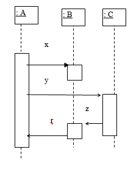
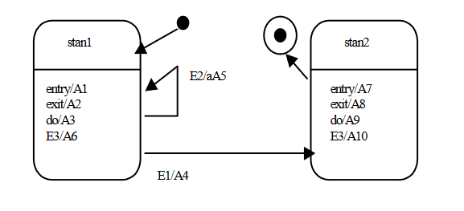

# Inżynieria oprogramowania

1. Czym zajmuje się inżynieria oprogramowania?

2. Kiedy można stosować model wodospadowy?

3. Podać przykład relacji generalizacji, narysuj go i objaśnij.

4. Podaj przykład relacji zależności na diagramie klas.

5. Kiedy stosuje się specyfikacje formalne?

6. Narysuj diagram klas dla następującego zdania. Nazwij i uzasadnij zastosowaną relację: **Egzamin zawiera 10 pytań**.

7. Kiedy stosuje się prototypowanie?

8. Jakie są różnice pomiędzy systemem informacyjnym i systemem informatycznym?

9. Wymień typy relacji na diagramie klas w UML.

10. Jak można strukturalizować diagramy use case w UML?

11. Podać przykład relacji agregacji, narysuj go i objaśnij.

12. Objaśnij krótko iteracyjny model produkcji oprogramowania.

13. Co to jest selekcja?

14. Co to jest projekcja?

15. Co to jest integralność BD i integralność referencyjna?

16. Jakie są przykłady przekształceń związków pomiędzy encjami: M:N, 1:N?

17. Co to jest COCOMO?

18. Jakie są zalety stosowania specyfikacji formalnych?

19. Scharakteryzować ERD i DFD.

20. Opis i charakterystyka struktur SI.

21. Czym jest model spiralny SI?

22. Wymień segmenty każdej spirali w modelu spiralnym (co się w nich robi)?

23. Do czego służy diagram kontekstowy SI?

24. Opisać i scharakteryzować model kaskadowy SI.

25. Opisać i scharakteryzować model z prototypem SI.

26. Jakie cechy powinien posiadać prawidłowo zaprojektowany interfejs SI?

27. Narysuj diagram klas, nazwij i uzasadnij zastosowane relacje dla następującego zdania: **Kamera i aparat fotograficzny są urządzeniami rejestrującymi obraz**.

28. Narysuj diagram klas, nazwij i uzasadnij zastosowane relacje dla następującego zdania: **W szafce znajdują się talerze, kubki, miski**.

29. Narysuj fragment diagramu klas (klasy, relacje, operacje), wynikający z podanego poniżej diagramu sekwencji. Uzasadnij swoje rozwiązanie.

  

30. Podaj przykład diagramu DFD, objaśnij.

31. Podaj przykład generalizacji stanów, w diagramach stanów w UML, objaśnij.

32. Na czym polega testowanie strukturalne?

33. Jakie znasz ograniczenia relacji w UML?

34. Dla podanego programu przedstawić diagram Nassi-Shneidermana.

  ```c++
  unsigned P(int i)
  // Przekazuje i-tą liczbę pierwszą
  {
  unsigned int n,pp,k;
  n=tp[mtp];
  while(mtp<i)
  {
  n+-2;k=2;pp=3; /* pp=tp[k] */
  while(pp*pp<=n)
  if (n%pp) pp=tp[++k];
  else {n+=2; k=2;pp=3;}
  tp[++mtp]=n;
  }
  return tp[i];
  }
  ```

35. Określ i narysuj w notacji UML typy relacji pomiędzy obiektami w poniższych zdaniach. Odpowiedź należy uzasadnić.

  - a) Klient kupił bilet na autobus
  - b) Listonosz dostarcza paczki i listy polecone
  - c) Sprzedawca sprzedaje pralki i lodówki
  - d) W walizce znajdują się spodnie, swetry, buty.
  - e) Kamera, smartfon, tablet są urządzeniami do rejestracji obrazu.

36. Jakie są wady modelu wodospadowego?

37. Jakie są metody specyfikacji procesów na najniższym poziomie w metodach strukturalnych?

38. Wymień znane Ci miary niezawodności oprogramowania.

39. Podaj przykład diagramu DFD, objaśnij.

40. Podaj przykład generalizacji stanów, w diagramach stanów w UML, objaśnij.

41. Na czym polega testowanie strukturalne?

42. Jakie znasz ograniczenia relacji w UML?

43. Kiedy stosujemy prototypowanie ?

44. Czym zajmuje się inżynieria oprogramowania ?

45. Wymień segmenty każdej spirali w modelu spiralnym (co się w nich robi)

46. Co to jest COCOMO ?

47. Zalety stosowania specyfikacji formalnych

48. Na podstawie podanego poniżej zbioru słów opracuj spójny diagram klas w UML, pokazujący co najmniej 10 relacji między obiektami klas. Należy podać typ relacji (powinny występować wszystkie typy relacji), jej nazwę ewentualnie krotność. Należy uzasadnić zastosowany typ relacji . Można dodać klasę, jeżeli wpłynie to korzystnie na diagram klas. {zawodnicy, sędziowie, konkurencje, wynik, próba, nota, ocenia, startuje, zawody, wykonuje próbę, drużyna, kibice}

49. Narysuj diagram klas dla następującego zdania: Aparat fotograficzny, kamera są urządzeniami rejestrującymi obraz

50. Poniżej podano diagram zmian stanów dla pewnej klasy. Podaj jakie czynności będą kolejno wykonane przez obiekt tej klasy dla następującej sekwencji zdarzeń: utworzenie obiektu, E3, E1, E2\. Uzasadnij swoje rozwiązanie. Co możesz powiedzieć o tej klasie (jej atrybutach, operacjach)?

51. (10p) Poniżej podano diagram zmian stanów dla pewnej klasy. Podaj jakie czynności będą kolejno wykonane przez obiekt tej klasy dla następującej sekwencji zdarzeń: utworzenie obiektu, E2, E1, E3\. Uzasadnij swoje rozwiązanie.



1. (10p) Narysuj fragment diagramu klas (klasy, relacje, operacje), wynikający z podanego poniżej diagramu sekwencji. Uzasadnij swoje rozwiązanie.


1. (3p) Narysuj diagram klas, nazwij i uzasadnij zastosowane relacje dla następującego zdania:

Kamera i aparat fotograficzny są urządzeniami rejestrującymi obraz.

1. (3p) Narysuj diagram klas, nazwij i uzasadnij zastosowane relacje dla następującego zdania: W szafce znajdują się talerze, kubki, miski.

2. (4p) Podaj przykład diagramu DFD, objaśnij

3. (3p) Podaj przykład generalizacji stanów, w diagramach stanów w UML, objaśnij

4. Zaprojektuj strukturę BD w postaci diagramów związków encji dla systemu ewidencji rezultatów zawodów sportowych na uczelni. Nazwa konkurencji sportowej (może być wiele), dane osoby prowadzącej zajęcia z danej konkurencji (jedna dla danej konkurencji), i wyniki dla studentów. Podać atrybuty wszystkich encji i niezbędne klucze.

5. Na podstawie podanego poniżej zbioru słów opracuj spójny diagram klas w UML, pokazujący co najmniej 10 relacji między obiektami klas. Należy podać typ relacji (powinny występować wszystkie typy relacji), jej nazwę ewentualnie krotność. Należy uzasadnić zastosowany typ relacji . Można dodać klasę, jeżeli wpłynie to korzystnie na diagram klas. {zawodnicy, sędziowie, konkurencje, wynik, próba, nota, ocenia, startuje, zawody, wykonuje próbę, drużyna, kibice}
