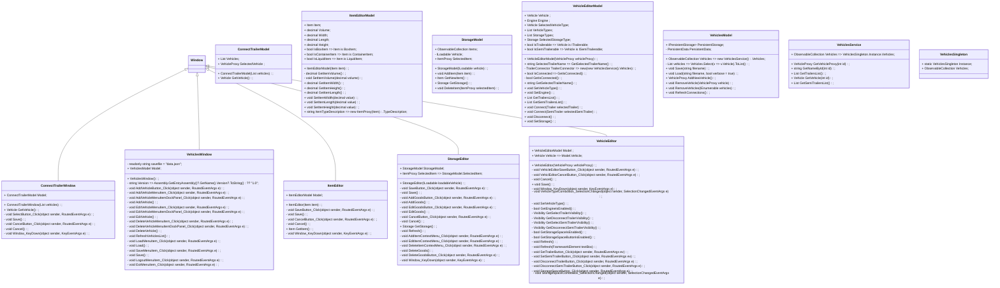

```mermaid
classDiagram

Window <|-- ConnectTrailerWindow
Window <|-- VehiclesWindow
Window <|-- ItemEditor
Window <|-- StorageEditor
Window <|-- VehicleEditor

class ConnectTrailerWindow {
    + ConnectTrailerWindow(List<VehicleProxy> vehicles);
    + ConnectTrailerModel Model;
    + Vehicle GetVehicle();
    - void SelectButton_Click(object sender, RoutedEventArgs e);
    - void Save();
    - void CancelButton_Click(object sender, RoutedEventArgs e);
    - void Cancel();
    - void Window_KeyDown(object sender, KeyEventArgs e);
}

class ConnectTrailerModel {
    + ConnectTrailerModel(List<VehicleProxy> vehicles);
    + List<VehicleProxy> Vehicles;
    + VehicleProxy SelectedVehicle ;
    + Vehicle GetVehicle();
}

class ItemEditor {
    + ItemEditor(Item item);
    + ItemEditorModel Model;
    - void SaveButton_Click(object sender, RoutedEventArgs e);
    - void Save();
    - void CancelButton_Click(object sender, RoutedEventArgs e);
    - void Cancel();
    + Item GetItem();
    - void Window_KeyDown(object sender, KeyEventArgs e);
}

class ItemEditorModel {
    + ItemEditorModel(Item item);
    + Item Item;
    + decimal Volume;
    + decimal Width;
    + decimal Length;
    + decimal Height;
    - decimal GetItemVolume();
    - void SetItemVolume(decimal volume);
    + decimal GetItemWidth();
    + decimal GetItemHeight();
    + decimal GetItemLength();
    + void SetItemWidth(decimal value);
    + void SetItemLength(decimal value);
    + void SetItemHeight(decimal value);
    + bool IsBoxItem => Item is BoxItem;
    + bool IsContainerItem => Item is ContainerItem;
    + bool IsLiquidItem => Item is LiquidItem;
    + string ItemTypeDescription => new ItemProxy(Item).TypeDescription;
}

class StorageEditor {
    + StorageEditor(ILoadable loadableVehicle);
    + StorageModel StorageModel;
    + ItemProxy SelectedItem => StorageModel.SelectedItem;
    - void SaveButton_Click(object sender, RoutedEventArgs e);
    - void Save();
    - void AddGoodsButton_Click(object sender, RoutedEventArgs e);
    - void AddGoods();
    - void EditGoodsButton_Click(object sender, RoutedEventArgs e);
    - void EditGoods();
    - void CancelButton_Click(object sender, RoutedEventArgs e);
    - void Cancel();
    + Storage GetStorage();
    - void Refresh();
    - void AddItemContextMenu_Click(object sender, RoutedEventArgs e);
    - void EditItemContextMenu_Click(object sender, RoutedEventArgs e);
    - void DeleteItemContextMenu_Click(object sender, RoutedEventArgs e);
    - void DeleteGoods();
    - void DeleteGoodsButton_Click(object sender, RoutedEventArgs e);
    - void Window_KeyDown(object sender, KeyEventArgs e);
}

class StorageModel {
    + StorageModel(ILoadable vehicle);
    + ObservableCollection<ItemProxy> Items;
    - ILoadable Vehicle;
    + ItemProxy SelectedItem;
    + void AddItem(Item item);
    + Item GetNewItem();
    + Storage GetStorage();
    + void DeleteItem(ItemProxy selectedItem);
}

class VehicleEditor {
    + VehicleEditor(VehicleProxy vehicleProxy);
    + VehicleEditorModel Model ;
    + Vehicle Vehicle => Model.Vehicle;
    - void VehicleEditorSaveButton_Click(object sender, RoutedEventArgs e);
    - void VehiclEditorCancelButton_Click(object sender, RoutedEventArgs e);
    - void Cancel();
    + void Save();
    - void Window_KeyDown(object sender, KeyEventArgs e);
    - void VehicleTypeComboBox_SelectionChanged(object sender, SelectionChangedEventArgs e);
    - void SetVehicleType();
    - bool GetEngineIsEnabled();
    - Visibility GetSelectTrailerVisibility();
    - Visibility GetDisconnectTrailerVisibility();
    - Visibility GetSelectSemiTrailerVisibility();
    - Visibility GetDisconnectSemiTrailerVisibility();
    - bool GetStorageSpaceIsEnabled();
    - bool GetStorageSpaceButtonIsEnabled();
    - void Refresh();
    - void Refresh(FrameworkElement textBox);
    - void SetTrailerButton_Click(object sender, RoutedEventArgs ev);
    - void SetSemiTrailerButton_Click(object sender, RoutedEventArgs ev);
    - void DisconnectTrailerButton_Click(object sender, RoutedEventArgs e);
    - void DisconnectSemiTrailerButton_Click(object sender, RoutedEventArgs e);
    - void StorageSpaceButton_Click(object sender, RoutedEventArgs e);
    - void StorageSpaceComboBox_SelectionChanged(object sender, SelectionChangedEventArgs e);
}

class VehicleEditorModel {
    + VehicleEditorModel(VehicleProxy vehicleProxy);
    + string SelectedTrailerName => GetSelectedTrailerName();
    + Vehicle Vehicle ;
    + Engine Engine ;
    + Vehicle SelectedVehicleType;
    + List<Vehicle> VehicleTypes;
    + List<Storage> StorageTypes;
    + Storage SelectedStorageType;
    - TrailerConnector TrailerConnector => new(new VehiclesService().Vehicles);
    + bool IsTrailerable => Vehicle is ITrailerable;
    + bool IsConnected => GetIsConnected();
    + bool IsSemiTrailerable => Vehicle is ISemiTrailerable;
    - bool GetIsConnected();
    + string GetSelectedTrailerName();
    + void SetVehicleType();
    + void SetEngine();
    + List<VehicleProxy> GetTrailersList();
    + List<VehicleProxy> GetSemiTrailersList();
    + void Connect(Trailer selectedTrailer);
    + void Connect(SemiTrailer selectedSemiTrailer);
    + void Disconnect();
    + void SetStorage();
}

class VehiclesModel {
    + IPersistentStorage<List<Vehicle>> PersistentStorage;
    - PersistentData PersistentData;
    + ObservableCollection<VehicleProxy> Vehicles => new VehiclesService().Vehicles;
    - List<Vehicle> vehicles => Vehicles.Select(v => v.Vehicle).ToList();
    + void Save(string filename);
    + void Load(string filename, bool verbose = true);
    + VehicleProxy AddNewVehicle();
    + void RemoveVehicle(VehicleProxy vehicle);
    + void RemoveVehicles(IEnumerable<VehicleProxy> vehicles);
    + void RefreshConnections();
}

class VehiclesService {
    + ObservableCollection<VehicleProxy> Vehicles => VehiclesSingleton.Instance.Vehicles;
    + VehicleProxy GetVehicleProxy(int id);
    + string GetNameById(int id);
    + List<VehicleProxy> GetTrailersList();
    + Vehicle GetVehicle(int id);
    + List<VehicleProxy> GetSemiTrailersList();
}

class VehiclesSingleton {
    + static VehiclesSingleton Instance;
    + ObservableCollection<VehicleProxy> Vehicles;
}


class VehiclesWindow {
    - readonly string savefile = "data.json";
    + VehiclesWindow();
    - string Version => Assembly.GetEntryAssembly()?.GetName().Version?.ToString() ?? "1.0";
    + VehiclesModel Model;
    - void AddVehicleButton_Click(object sender, RoutedEventArgs e);
    - void AddVehicleMenuItem_Click(object sender, RoutedEventArgs e);
    - void AddVehicleMenuItemDockPanel_Click(object sender, RoutedEventArgs e);
    - void AddVehicle();
    - void EditVehicleMenuItem_Click(object sender, RoutedEventArgs e);
    - void EditVehicleMenuItemDockPanel_Click(object sender, RoutedEventArgs e);
    - void EditVehicle();
    - void DeleteVehicleMenuItem_Click(object sender, RoutedEventArgs e);
    - void DeleteVehicleMenuItemDockPanel_Click(object sender, RoutedEventArgs e);
    - void DeleteVehicle();
    - void RefreshVehiclesList();
    - void LoadMenuItem_Click(object sender, RoutedEventArgs e);
    - void Load();
    - void SaveMenuItem_Click(object sender, RoutedEventArgs e);
    - void Save();
    - void LogoutMenuItem_Click(object sender, RoutedEventArgs e);
    - void ExitMenuItem_Click(object sender, RoutedEventArgs e);
}
```