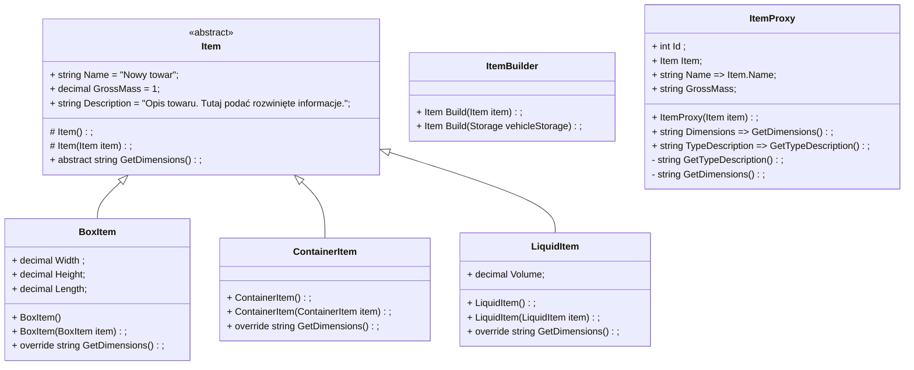

```mermaid
classDiagram

Item <|-- BoxItem
Item <|-- ContainerItem
Item <|-- LiquidItem

class BoxItem {
    + BoxItem()
    + BoxItem(BoxItem item);
    + decimal Width ;
    + decimal Height;
    + decimal Length;
    + override string GetDimensions();

}

class ContainerItem {
    + ContainerItem();
    + ContainerItem(ContainerItem item);
    + override string GetDimensions();
}

class Item {
    <<abstract>>
    # Item();
    # Item(Item item);
    + string Name = "Nowy towar";
    + decimal GrossMass = 1;
    + abstract string GetDimensions();
    + string Description  = "Opis towaru. Tutaj podać rozwinięte informacje.";
}

class ItemBuilder {
    + Item Build(Item item);
    + Item Build(Storage vehicleStorage);
}

class ItemProxy {
    + int Id ;
    + ItemProxy(Item item);
    + Item Item;
    + string Name => Item.Name;
    + string GrossMass;
    + string Dimensions => GetDimensions();
    + string TypeDescription => GetTypeDescription();
    - string GetTypeDescription();
    - string GetDimensions();
}

class LiquidItem {
    + LiquidItem();
    + LiquidItem(LiquidItem item) ;
    + decimal Volume;
    + override string GetDimensions();
}

```