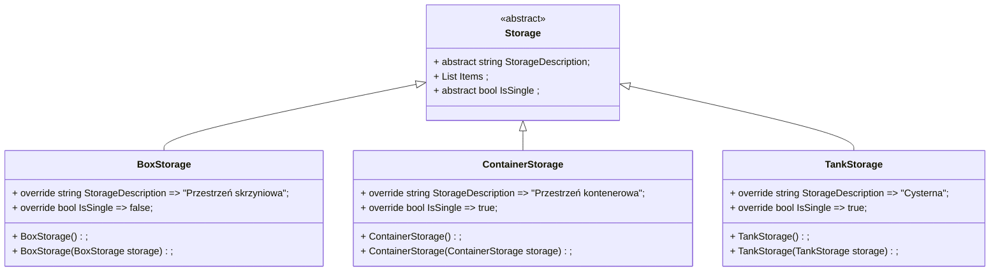

```mermaid
classDiagram

Storage <|-- BoxStorage
Storage <|-- ContainerStorage
Storage <|-- TankStorage

class BoxStorage {
    + BoxStorage();
    + BoxStorage(BoxStorage storage);
    + override string StorageDescription => "Przestrzeń skrzyniowa";
    + override bool IsSingle => false;
}

class ContainerStorage {
    + ContainerStorage();
    + ContainerStorage(ContainerStorage storage);
    + override string StorageDescription => "Przestrzeń kontenerowa";
    + override bool IsSingle => true;
}

class Storage {
    <<abstract>>
    + abstract string StorageDescription;
    + List<Item> Items ;
    + abstract bool IsSingle ;
}

class TankStorage {
    + TankStorage();
    + TankStorage(TankStorage storage);
    + override string StorageDescription => "Cysterna";
    + override bool IsSingle => true;
}
```