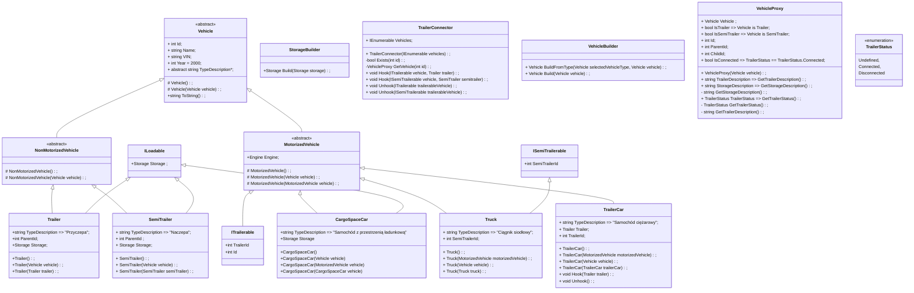

```mermaid
classDiagram
MotorizedVehicle <|-- CargoSpaceCar
ILoadable <|-- CargoSpaceCar
Vehicle <|-- MotorizedVehicle
Vehicle <|-- NonMotorizedVehicle
NonMotorizedVehicle <|-- SemiTrailer
ILoadable <|-- SemiTrailer
NonMotorizedVehicle <|-- Trailer
ILoadable <|-- Trailer
MotorizedVehicle <|-- TrailerCar
MotorizedVehicle <|-- ITrailerable
MotorizedVehicle <|-- Truck
ISemiTrailerable <|-- Truck

class CargoSpaceCar{
    +CargoSpaceCar()
    +CargoSpaceCar(Vehicle vehicle)
    +CargoSpaceCar(MotorizedVehicle vehicle)
    +CargoSpaceCar(CargoSpaceCar vehicle)
    +string TypeDescription => "Samochód z przestrzenią ładunkową"
    +Storage Storage
}

class StorageBuilder{
    +Storage Build(Storage storage);
}


class ILoadable{
    +Storage Storage ;
}

class ISemiTrailerable {
    +int SemiTrailerId
}

class ITrailerable {
    +int TrailerId 
    +int Id 
}

class MotorizedVehicle{
    <<abstract>>
    # MotorizedVehicle();
    # MotorizedVehicle(Vehicle vehicle);
    # MotorizedVehicle(MotorizedVehicle vehicle);
    +Engine Engine;
}

class NonMotorizedVehicle{
<<abstract>>
    # NonMotorizedVehicle();
    # NonMotorizedVehicle(Vehicle vehicle);
}

class SemiTrailer{
    + SemiTrailer();
    + SemiTrailer(Vehicle vehicle);
    + SemiTrailer(SemiTrailer semiTrailer);
    + string TypeDescription => "Naczepa";
    + int ParentId ;
    + Storage Storage;
}

class Trailer{
    +Trailer();
    +Trailer(Vehicle vehicle);
    +Trailer(Trailer trailer);
    +string TypeDescription => "Przyczepa";
    +int ParentId;
    +Storage Storage;
}

class TrailerCar{
    + TrailerCar();
    + TrailerCar(MotorizedVehicle motorizedVehicle);
    + TrailerCar(Vehicle vehicle);
    + TrailerCar(TrailerCar trailerCar);
    + string TypeDescription => "Samochód ciężarowy";
    + Trailer Trailer;
    + void Hook(Trailer trailer);
    + int TrailerId;
    + void Unhook();
}

class TrailerConnector    {
    + TrailerConnector(IEnumerable<VehicleProxy> vehicles);
    + IEnumerable<VehicleProxy> Vehicles;
    -bool Exists(int id);
    -VehicleProxy GetVehicle(int id);
    + void Hook(ITrailerable vehicle, Trailer trailer);
    + void Hook(ISemiTrailerable vehicle, SemiTrailer semitrailer);
    + void Unhook(ITrailerable trailerableVehicle);
    + void Unhook(ISemiTrailerable trailerableVehicle);
}

class Truck {
    + Truck();
    + Truck(MotorizedVehicle motorizedVehicle);
    + Truck(Vehicle vehicle);
    + Truck(Truck truck);
    + string TypeDescription => "Ciągnik siodłowy";
    + int SemiTrailerId;
}

class Vehicle {
    <<abstract>>
    # Vehicle();
    # Vehicle(Vehicle vehicle);
    + int Id;
    + string Name;
    + string VIN;
    + int Year = 2000;
    + abstract string TypeDescription*;
    +string ToString();
}

class VehicleBuilder {
    + Vehicle BuildFromType(Vehicle selectedVehicleType, Vehicle vehicle);
    + Vehicle Build(Vehicle vehicle);
}

class VehicleProxy {
    + VehicleProxy(Vehicle vehicle);
    + Vehicle Vehicle ;
    + bool IsTrailer => Vehicle is Trailer;
    + bool IsSemiTrailer => Vehicle is SemiTrailer;
    + string TrailerDescription => GetTrailerDescription();
    + string StorageDescription => GetStorageDescription();
    + int Id;
    + int ParentId;
    + int ChildId;
    - string GetStorageDescription();
    + bool IsConnected => TrailerStatus == TrailerStatus.Connected;
    + TrailerStatus TrailerStatus => GetTrailerStatus();
    - TrailerStatus GetTrailerStatus();
    - string GetTrailerDescription();
}

class TrailerStatus {
    <<enumeration>>
    Undefined,
    Connected,
    Disconnected
}


```