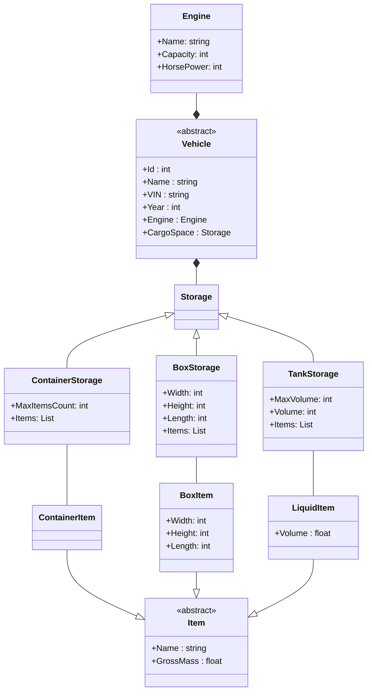
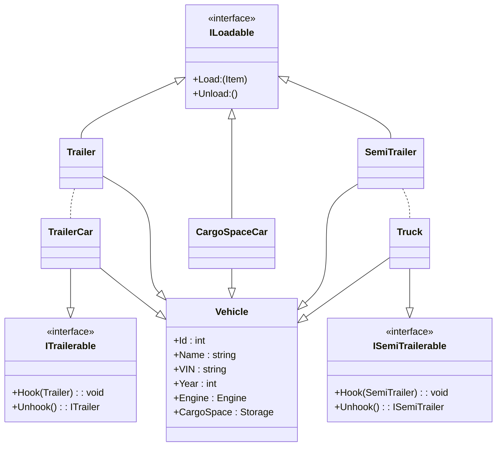
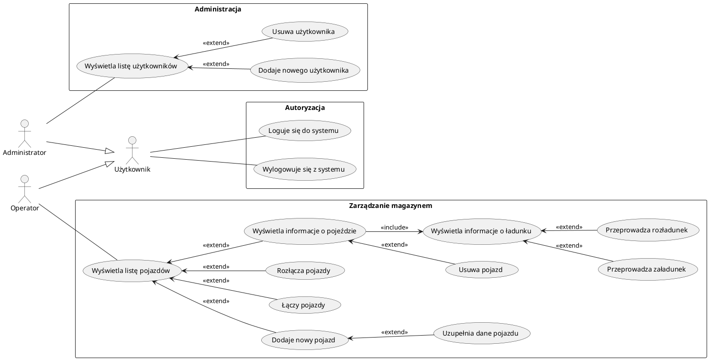

### Diagramy klas

```mermaid
classDiagram
    Engine --* Vehicle
    Vehicle *-- Storage
   
    Storage <|-- ContainerStorage
    Storage <|-- BoxStorage
    Storage <|-- TankStorage

    <<abstract>> Vehicle

    class Engine{
      +Name: string
      +Capacity: int
      +HorsePower: int
    }

    class ContainerStorage{
      +MaxItemsCount: int
      +Items: List<ContainerItem>
    }

    class BoxStorage{
      +Width: int
      +Height: int
      +Length: int
      +Items: List<BoxItem>
    }

    class TankStorage{
      +MaxVolume: int
      +Volume: int
      +Items: List<LiquidItem>
    }

    class Item{
      +Name : string
      +GrossMass : float
    }

    class LiquidItem{
      +Volume : float
    }

    class BoxItem{
      +Width: int
      +Height: int
      +Length: int
    }

    <<abstract>> Item

    ContainerStorage -- ContainerItem
    BoxStorage -- BoxItem
    TankStorage -- LiquidItem
    ContainerItem --|> Item
    BoxItem --|> Item
    LiquidItem --|> Item

    class Vehicle{
      +Id : int
      +Name : string
      +VIN : string
      +Year : int
      +Engine : Engine
      +CargoSpace : Storage
    }
    
```

```mermaid
classDiagram

    class ILoadable{
      +Load: (Item)
      +Unload: ()
    }

    <<interface>> ILoadable

    class ITrailerable{
      +Hook(Trailer) : void
      +Unhook() : ITrailer
    }
    <<interface>> ITrailerable

    class ISemiTrailerable{
      +Hook(SemiTrailer) : void
      +Unhook() : ISemiTrailer
    }

    <<interface>> ISemiTrailerable

    TrailerCar --|> ITrailerable
    Trailer .. TrailerCar
    Trailer --|> Vehicle
    Truck --|> Vehicle
    Truck  --|>  ISemiTrailerable
    SemiTrailer --|> Vehicle
    SemiTrailer .. Truck
    CargoSpaceCar --|> Vehicle
    TrailerCar --|> Vehicle

    ILoadable <|-- Trailer
    ILoadable <|-- CargoSpaceCar
    ILoadable <|-- SemiTrailer

  
    class Vehicle{
      +Id : int
      +Name : string
      +VIN : string
      +Year : int
      +Engine : Engine
      +CargoSpace : Storage
    }
```

### Diagramy przypadków użycia

```plantuml
@startuml

left to right direction

  actor "Administrator" as admin
  actor "Użytkownik" as user
  actor "Operator" as operator
admin --|> user
operator --|> user

rectangle "Administracja" {
  usecase "Wyświetla listę użytkowników" as A1
  admin -- A1
  A1 <-- (Dodaje nowego użytkownika) : <<extend>>
  A1 <-- (Usuwa użytkownika) : <<extend>>
}


rectangle "Autoryzacja" {
  user -- (Loguje się do systemu)
  user -- (Wylogowuje się z systemu)
}

rectangle "Zarządzanie magazynem" {
  usecase "Wyświetla listę pojazdów" as M1
  usecase "Dodaje nowy pojazd" as M2
  usecase "Łączy pojazdy" as M3
  usecase "Rozłącza pojazdy" as M4
  usecase "Wyświetla informacje o pojeździe" as M5
  usecase "Uzupełnia dane pojazdu" as M6
  usecase "Usuwa pojazd" as M7
  usecase "Przeprowadza załadunek" as M8
  usecase "Przeprowadza rozładunek" as M9
  usecase "Wyświetla informacje o ładunku" as M10
  
  operator -- M1

  M1 <-- M2 : <<extend>>
  M1 <-- M3 : <<extend>>
  M1 <-- M4 : <<extend>>
  M1 <-- M5 : <<extend>>

  M2 <-- M6 : <<extend>>
  M5 <-- M7 : <<extend>>
  M5 --> M10 : <<include>>
  M10 <-- M8 : <<extend>>
  M10 <-- M9 : <<extend>>

}


@enduml
```