# Specyfikacja wymagań dla projektu Samochody ciężarowe, wersja 0.0.7

## Autor: Igor Nowicki

## 1\. Opis systemu

System służy do przechowywania definicji pojazdów ciężarowych i ich zespołów, wraz z informacjami o załadunku. Przewidziana jest możliwość przechowywania pojazdów różnego rodzaju (samochody z przestrzenią ładunkową, ciągniki siodłowe, przyczepy, naczepy), z różnego rodzaju przestrzeniami ładunkowymi (zdefiniowane jako skrzyniowa, kontenerowa, cysterna). Program przewiduje mechanizm przechowywania danych na temat pojazdu pomiędzy sesjami poprzez zapis i odczyt z i do pliku dyskowego w formacie JSON.

Program realizuje następujące działania:

- Logowanie i wylogowanie operatora
- Logowanie i wylogowanie administratora
- Wczytanie stanu systemu z repozytorium do pamięci
- Zapis stanu systemu z pamięci do repozytorium
- Wprowadzenie nowego pojazdu
- Skasowanie istniejącego pojazdu
- Zarządzanie pojazdami przez operatora:

  - dodawanie pojazdów
  - edycja pojazdów
  - usuwanie pojazdów
  - wyświetlanie danych o pojazdach
  - łączenie i rozłączanie pojazdów w zespoły pojazdów według zdefiniowanych zasad
  - ładunek i rozładunek pojazdów z przestrzenią ładunkową według zdefiniowanych zasad

- Zarządzanie operatorami przez administratora:

  - dodawanie operatorów
  - edycja operatorów
  - usuwanie operatorów
  - wyświetlanie danych o operatorach

## Słownik dziedziny problemu

- Pojazd (Vehicle) - abstrakcyjny obiekt określających dowolną jednostkę jeżdżącą.
- Pojazd silnikowy (Motorized Vehicle) - abstrakcyjny obiekt dziedziczący z Pojazdu, opisujący dowolny pojazd posiadający silnik.
- Pojazd bezsilnikowy (Non Motorized Vehicle) - abstrakcyjny obiekt dziedziczący z Pojazdu, opisujący dowolny pojazd nieposiadający silnika.
- Pojazd ładunkowy (Loadable) - abstrakcyjny pojazd posiadający możliwość przechowywania ładunku.
- Pojazd przyczepowy (Trailerable) - abstrakcyjny pojazd posiadający możliwość doczepienia przyczepy.
- Pojazd naczepowy (Semi-Trailerable) - abstrakcyjny pojazd posiadający możliwość doczepienia naczepy.
- Przyczepa (Trailer) - pojazd bezsilnikowy, ładunkowy, z możliwością bycia przyczepionym do pojazdu przyczepowego.
- Naczepa (SemiTrailer) - pojazd bezsilnikowy, ładunkowy, z możliwością bycia przyczepionym do pojazdu naczepowego.
- Ciągnik siodłowy (Truck) - pojazd silnikowy, naczepowy.
- Samochód ciężarowy (TrailerCar) - pojazd silnikowy, przyczepowy.
- Samochód z przestrzenią ładunkową (Cargo Space Car) - pojazd silnikowy, ładunkowy.
- Operator - użytkownik z możliwością zarządzania bazą danych pojazdów.
- Administrator - użytkownik z możliwością zarządzania bazą danych użytkowników.

### 2.1\. OBIEKTY BIZNESOWE

#### Pojazd (Vehicle)

Opis: Abstrakcyjny obiekt określających dowolną jednostkę jeżdżącą.

Każdy pojazd opisywany jest zestawem parametrów:

- Id (int) - Identyfikator (liczba całkowita dodatnia)
- Name (string) - Nazwa (tekst na podstawie pozycji katalogowej producenta)
- VIN (string) - Vehicle Identification Number (15 lub 17 znaków alfanumerycznych)
- Year - Rok produkcji (czterocyfrowa liczba całkowita w zakresie od roku 1900 do roku bieżącego)

#### Pojazd silnikowy (MotorizedVehicle)

Opis: Abstrakcyjny obiekt dziedziczący z Pojazdu, opisujący dowolny pojazd posiadający silnik.

- Engine (Engine) - parametry silnika (poniżej)

#### Silnik (Engine)

Opis: Obiekt definiowany wewnątrz pojazdu silnikowego. Definiowany następującymi parametrami:

- Name (string) - Nazwa (tekst na podstawie pozycji katalogowej producenta)
- Capacity (int) - Pojemność (liczba całkowita dodatnia, cm3)
- Power (int) - Liczba koni mechanicznych (liczba całkowita dodatnia)

### Pojazd bezsilnikowy (NonMotorizedVehicle)

Opis: Abstrakcyjny obiekt dziedziczący z Pojazdu, opisujący dowolny pojazd nieposiadający silnika.

### Pojazd ładunkowy (Loadable)

Opis: Interfejs zawierający przestrzeń ładunkową dla pojazdu.

- Storage (Storage) - Przestrzeń ładunkowa (poniżej)

#### Przestrzeń ładunkowa (Storage)

Opis: Abstrakcyjny obiekt definiowany wewnątrz pojazdu z którego dziedziczą opisane poniżej typy przestrzeni ładunkowej.

- StorageDescription (string) - Opis przestrzeni ładunkowej. Definiowany na poziomie definicji klasy.
- Items (List of Items) - Lista towarów.
- IsSingle (bool) - Czy przestrzeń ładunkowa może zawierać jeden typ towarów.

#### Towar (Item)

Abstrakcyjny obiekt opisujący dowolną jednostkę towarową. Wyszczególnione są następujące obiekty pochodne:

- BoxItem - Towar typu skrzyniowego
- ContainerItem - Towar typu kontenerowego
- LiquidItem - Towar typu płynnego

Parametry:

- Name (string) - Nazwa towaru
- GrossMass (decimal) - Waga brutto towaru
- Description (string) - Opis towaru

Metody:

- GetDimensions (string) - abstrakcyjna funkcja definiowana na poziomie funkcji pochodnych zwracająca opis fizycznej przestrzeni zajmowanej przez towar.

#### Skrzyniowa przestrzeń ładunkowa (BoxStorage)

Opis: Typ przestrzeni ładunkowej. Umożliwia załadunek towaru typu skrzyniowego.

- StorageDescription (string) - parametr, zwraca "Przestrzeń skrzyniowa"
- IsSingle (bool) - zwraca "fałsz"

#### Towar typu skrzyniowego (BoxItem)

Typ towaru, ładowany do skrzyniowej przestrzeni ładunkowej.

- Nazwa (Name) (tekst na podstawie pozycji katalogowej producenta)
- Masa brutto (GrossMass) (liczba zmiennoprzecinkowa, w tonach).
- Width - Szerokość (w cm)
- Height - Wysokość (w cm)
- Length - Długość (w cm)

#### Kontenerowa przestrzeń ładunkowa (ContainerStorage)

Opis: Typ przestrzeni ładunkowej. Umożliwia załadunek towaru typu kontenerowego. Opisywany następującymi parametrami:

- StorageDescription (string) - parametr, zwraca "Przestrzeń kontenerowa"
- IsSingle (bool) - parametr, zwraca "prawda"

#### Towar typu kontenerowego (ContainerItem)

Typ towaru, ładowany do kontenerowej przestrzeni ładunkowej. Metody:

- GetDimensions() - zwraca "-" (standardowy wymiar kontenera)

#### Cysternowa przestrzeń ładunkowa (TankStorage)

Opis: Typ przestrzeni ładunkowej. Umożliwia załadunek towaru typu płynnego.

- StorageDescription (string) - parametr, zwraca "Cysterna".

#### Towar typu płynnego (LiquidItem)

Typ towaru, ładowany do cysternowej przestrzeni ładunkowej. Opisywany listą parametrów:

- Volume - Objętość (w litrach, opisywana liczbą całkowitą dodatnią)

### Aktorzy Biznesowi

Aktorzy biznesowi przetwarzają obiekty biznesowe lub są z nimi w interakcji.

Id | Nazwa         | Opis
-- | ------------- | -----------------------------------------------------------------------------------------------------------------------------------------------------------------------------------------------------------
A1 | Operator      | Podstawowy użytkownik aplikacji. Może przeglądać listy pojazdów i informacje na temat każdego z pojazdów. Może przeprowadzać załadunek i rozładunek pojazdów oraz łączenie i rozłączanie zespołów pojazdów.
A2 | Administrator | Użytkownik z uprawnieniami administratora. Może zarządzać użytkownikami systemu – dodawać, usuwać, edytować informacje i wyświetlać listę zarejestrowanych użytkowników i administratorów systemu.

### Reguły Biznesowe

ID | Definicja reguły                                                                       | Typ          | Źródło
-- | -------------------------------------------------------------------------------------- | ------------ | -----------------------
A1 | Do skrzyniowej przestrzeni ładunkowej można ładować jedynie towary typu skrzyniowego   | ograniczenie | Definicja
A2 | Do kontenerowej przestrzeni ładunkowej można ładować jedynie towary typu kontenerowego | ograniczenie | Definicja
A3 | Do cysternowej przestrzeni ładunkowej można ładować jedynie towary typu płynnego       | ograniczenie | Definicja
B1 | Skrzyniowa przestrzeń ładunkowa może przechowywać wiele towarów.                       | definicja    | Rozmowa w trakcie zajęć
B2 | Kontenerowa przestrzeń ładunkowa może przechowywać tylko jeden towar.                  | ograniczenie | Rozmowa w trakcie zajęć
B3 | Cysterna może być załadowana jednym rodzajem płynu.                                    | ograniczenie | Rozmowa w trakcie zajęć
C1 | Przyczepę można przyczepić jedynie do pojazdu typu przyczepowego                       | ograniczenie | -
C2 | Naczepę można przyczepić jedynie do pojazdu typu naczepowego                           | ograniczenie | -

### Wymagania Funkcjonalne

Rozdział zawiera spis wymagań funkcjonalnych dla tworzonego produktu informatycznego.

ID  | Nazwa                                               | Priorytet | Proces biznesowy
--- | --------------------------------------------------- | --------- | ------------------------------------------------------------------------
F1  | Operator może wyświetlać listę pojazdów.            | Wysoki    | Operator może wyświetlać listę pojazdów.
F2  | Operator może wyświetlać dane pojedynczego pojazdu. | Wysoki    | Operator może wyświetlać dane pojedynczego pojazdu.
F3  | Operator może stworzyć nowy pojazd.                 | Wysoki    | Operator może stworzyć nowy pojazd.
F4  | Operator może zaktualizować dane pojazdu.           | Wysoki    | Operator może zaktualizować dane pojazdu.
F5  | Operator może skasować pojazd.                      | Wysoki    | Operator może skasować pojazd.
F6  | Złączanie pojazdów (przyczepa)                      | Wysoki    | Operator może złączyć pojazd typu ciągnikowego z przyczepą.
F7  | Rozłączanie pojazdów (przyczepa)                    | Wysoki    | Operator może rozłączyć pojazd typu ciągnikowego z przyczepą.
F8  | Złączanie pojazdów (naczepa)                        | Wysoki    | Operator może złączyć pojazd typu siodłowego z naczepą.
F9  | Rozłączanie pojazdów (naczepa)                      | Wysoki    | Operator może rozłączyć pojazd typu siodłowego z naczepą.
F10 | Załadunek pojazdu                                   | Wysoki    | Operator może przeprowadzić załadunek pojazdu z przestrzenią ładunkową.
F11 | Rozładunek pojazdu                                  | Wysoki    | Operator może przeprowadzić rozładunek pojazdu z przestrzenią ładunkową.
F12 | Zapis i odczyt z pliku                              | Wysoki    | Operator może zapisać/odczytać dane do/z pliku.
F13 | Autoryzacja użytkownika                             | Wysoki    | Operator autoryzuje się przed rozpoczęciem pracy.
F14 | Dodawanie użytkownika                               | Wysoki    | Administrator może dodać użytkownika do systemu
F14 | Usuwanie użytkownika                                | Wysoki    | Administrator może usunąć użytkownika z systemu.

## Wymagania Niefunkcjonalne

W tym rozdziale należy umieścić wszystkie wymagania niefunkcjonalne pamiętając, aby tak je sformułować, aby w przyszłości była możliwość ich weryfikacji.

ID | Nazwa                           | Priorytet | Proces biznesowy
-- | ------------------------------- | --------- | ------------------------------------------------------------------------------
N1 | Platforma Windows 10            | Wysoki    | Program ma działać na platformie Windows 10
N1 | Windows Presentation Foundation | Wysoki    | Program ma zostać zaprojektowany dla platformy Windows Presentation Foundation
N2 | Interfejs graficzny             | Wysoki    | Interfejs programu ma być w postaci graficznej (GUI)
N3 | Wymagania zapisu                | Wysoki    | Program ma automatycznie zapisywać stan magazynu przy zmianach
N3 | Wymagania odczytu               | Wysoki    | Program ma automatycznie wczytywać stan magazynu przy zmianach

## Diagramy Use Case

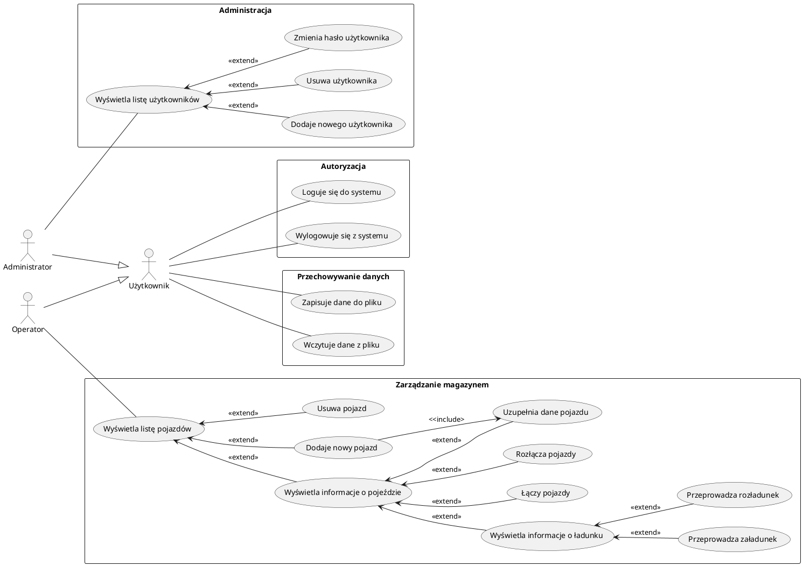

## Diagram klas

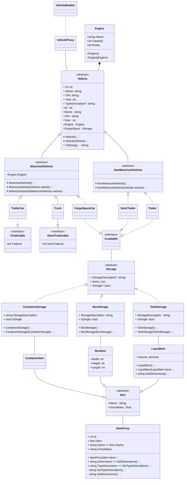

## Diagramy sekwencji

### Get Vehicle

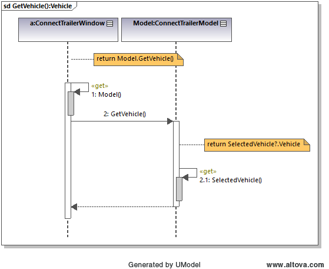

### Connect Trailer

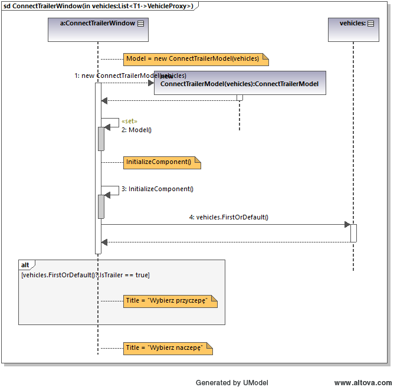

### Save

### Add Item

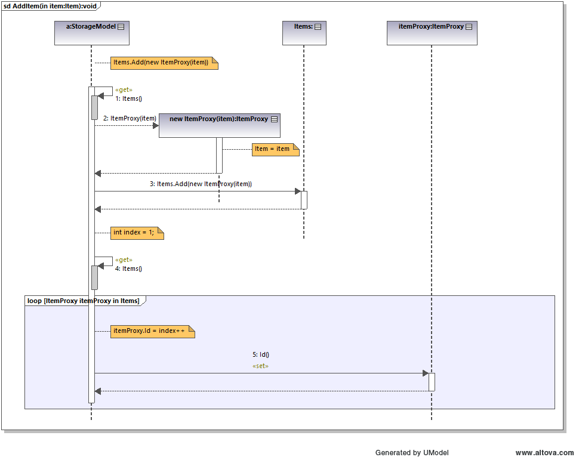

### Add Goods

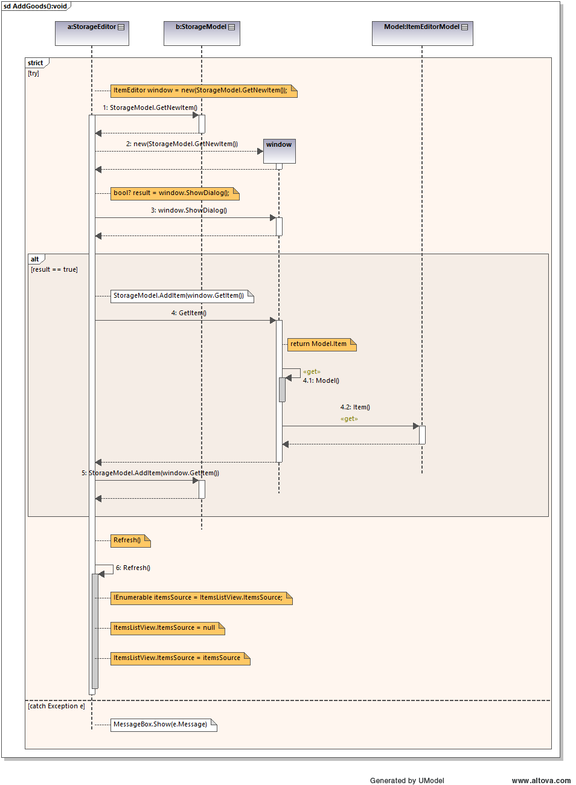

### Disconnect Trailer

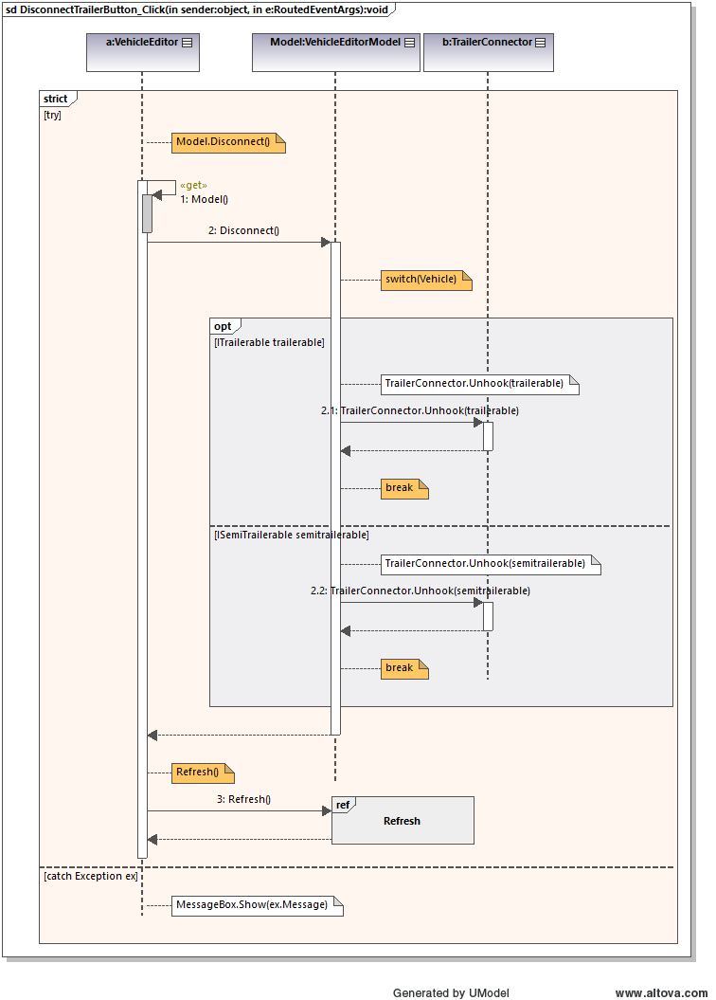

## Set Storage

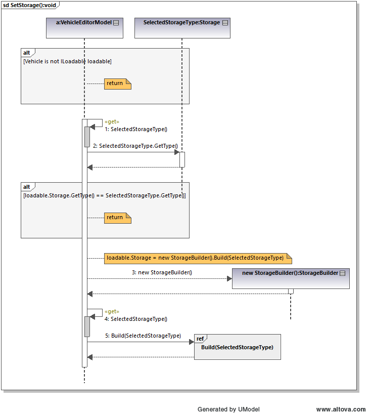

### Change password

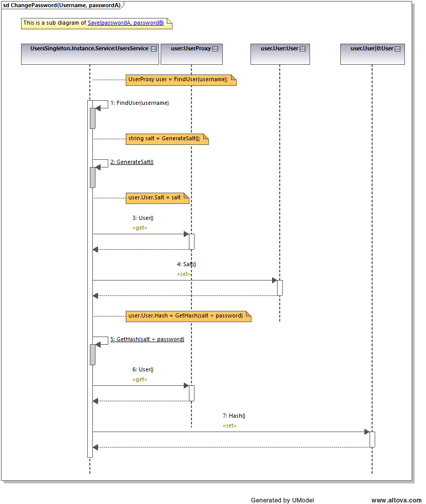

## Diagramy maszyny stanowej i czynności

### Logowanie do programu

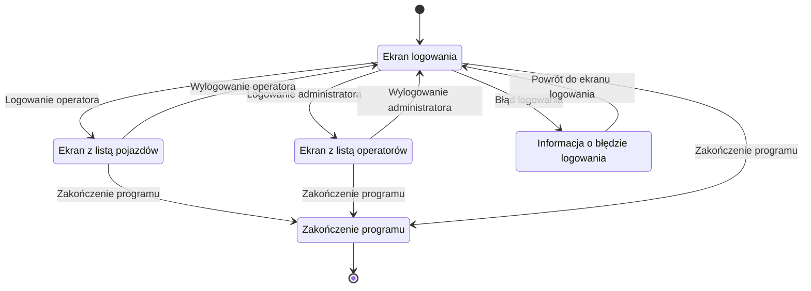

### Okno administratora

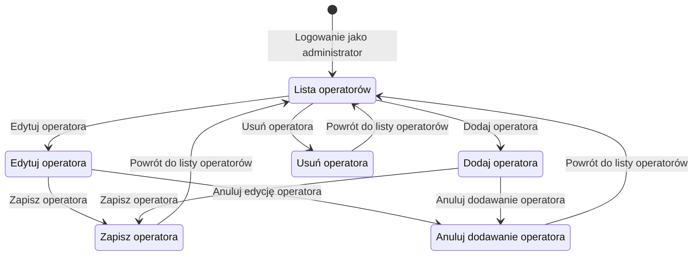

### Okno operatora pojazdów

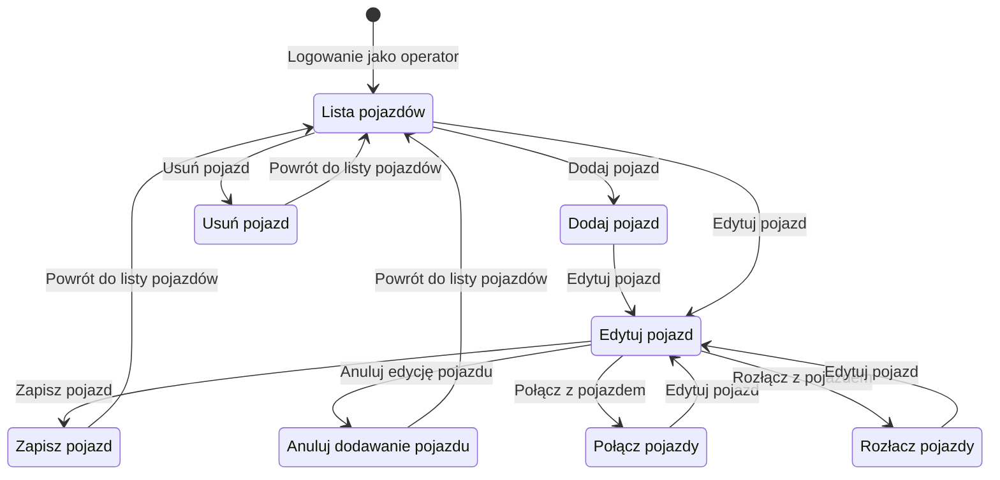

### Okno dodawania towarów

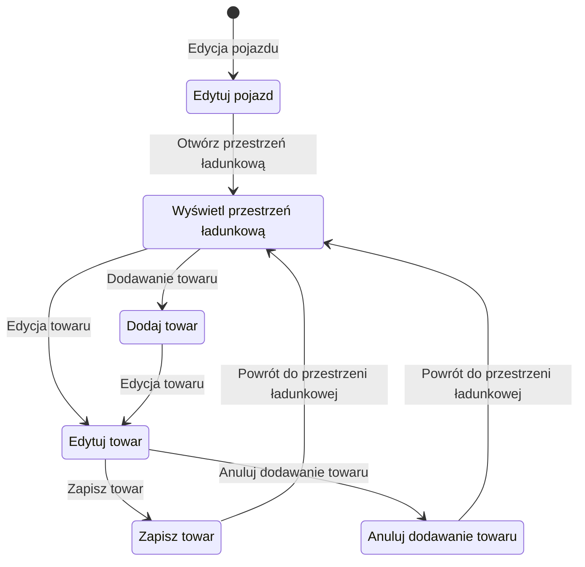
