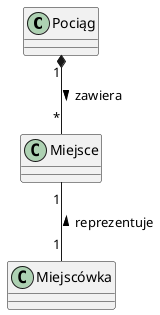

# Zadania

## Zadanie 1 - COCOMO

Ze specyfikacji prostego projektu wynika, że

- będzie on korzystał z 10 wejść zmieniających dane systemu,
- generuje 12 raportów dla użytkownika,
- ma 20 interakcji z użytkownikiem nie zmieniających danych systemu,
- korzysta z 6 wewnętrznych oraz 4 zewnętrznych zbiorów danych.

Jaki jest rozmiar tego projektu wyrażony w punktach funkcyjnych?

Funkcja           | Prosta | Średnia | Złożona
----------------- | ------ | ------- | -------
EIF - pliki zew.  | 7      | 10      | 15
ILF - pliki wew.  | 5      | 7       | 10
EI - wejścia zew. | 3      | 4       | 6
EO - wyjścia zew. | 4      | 5       | 7
EQ - interakcje   | 3      | 4       | 6

- Współczynnik AFC - średnia liczba linii kodu na punkt - wynosi 50 LOC/FP.
- Przyjmując podstawowy model COCOMO dla prostego projektu, podać ile wynosi wysiłek potrzebny na wykonanie tego projektu [w osobo/miesiącach] oraz
- ile czasu zajmie wykonanie tego projektu [w miesiącach] (wystarczy podać wyrażenia z podstawionymi liczbami).

### Rozwiązanie

Na początku liczymy współczynnik UFC - unajusted function point. Mnożymy dostarczone wartości przez współczynniki i obliczamy wynik:

- EIF (external interface file): 4 (zewnętrzne zbiory danych)
- ILF (internal interface file): 6 (wewnętrzne zbiory danych)
- EI (external input): 10 (wejścia zmieniające dane systemu)
- EO (external output): 12 (raporty dla użytkownika)
- EQ (external query): 20 (interakcje z użytkownikiem nie zmieniającymi danych systemu)

$$UFC = \sum_iw_ix_i = 7\cdot4+5\cdot6+3\cdot10+4\cdot12+3\cdot20 = 196$$

Dalej: przemnażamy UFC przez AFC (average number of lines of code) i obliczamy wynik. Ponieważ AFC = 50 LOC/FP dla bieżącego projektu, wynik jest równy $LOC = 196\cdot50 = 9800$, zatem $KDSI = 9.8$.

Wysiłek (PM) potrzebny na wykonanie tego projektu w osobo/miesiącach wyliczamy na podstawie modelu COCOMO dla małego projektu:

$$PM = C\cdot KDSI^S\cdot M,$$

gdzie dla małego projektu:

- $C = 2.4$,
- $M = 1$,
- $s = 1.05$.

Podstawiając wartości, dostajemy $PM = 2.4\cdot9.8^{1.05}\cdot 1 = 26.36$.

Czas wykonania tego projektu w miesiącach wyliczamy na podstawie modelu COCOMO dla małego projektu:

$$TDEV = 2.5\cdot(PM)^{0.38}.$$

W tym wypadku, $TDEV = 8.66$. Projekt zajmie ok. 8-9 miesięcy.

## Zadanie 2 - COCOMO 2

Ile wyniosą koszt i czas wykonania projektu A oszacowane według COCOMO 2 po zakończeniu projektowania, jeśli:

- projekt A przewiduje 100 klas,
- średnia liczba linii kodu dla klasy wynosi 80,
- wykładnik dla typowego projektu w danej firmie wynosi 1.14, ale w projekcie A występuje większe ryzyko (o 1 poziom większe niż w typowym projekcie),
- przewidywane jest implementacja mechanizmów tolerowania błędów (1.5).

Wyniki uzasadnić.

- Jak zwolnienie jednej osoby w firmie wpłynie na obliczony czas wykonania projektu A?

### Rozwiązanie

Liczba linii kodu $LOC = 8000$, co daje nam $KDSI = 8.0$. Korzystamy z kompletnie arbitralnych parametrów metody COCOMO 2 które zostały wyznaczone przez machanie martwym kurczakiem i podstawiamy wartości do wzorów:

$$PM = 2.94\cdot (KDSI)^s\cdot M,$$

$$TDEV = 3\cdot(PM)^{0.33+0.2\cdot(s-1.01)}$$

gdzie $M = 1.5$ (współczynnik tolerowania błędów), natomiast wykładnik $s$ ma wartość bazową $1.14 + 0.01$ (bo 1 poziom wyższe ryzyko oznacza $+0.01$). Obliczony wysiłek:

$$PM = 2.94\cdot (8)^{1.15}\cdot 1.5 = 48.19 \text{ osobo/miesięcy}.$$

Czas wykonania projektu wynosi:

$$TDEV = 3\cdot(48.19)^{0.33+0.2\cdot(s-1.01)}=12\text{ miesięcy}.$$

Zwolnienie jednej osoby w firmie prawdopodobnie wydłuży czas wykonania projektu.

## Zadanie 3 - COCOMO 2

Na podstawie specyfikacji projektu wyznaczono, że jego realizacja wymaga 2000 punktów obiektowych. Średnia produktywność pracowników wynosi 20 op/miesiąc. Jaki jest przewidywany koszt tego projektu w modelu COCOMO 2?

### Rozwiązanie

Stosujemy wzór:

$$PM = NOP \cdot (1-R) / PROD,$$

gdzie $NOP$ to liczba punktów obiektowych, $R$ to ukłamek procentowego użycia gotowych komponentów, $PROD$ to średnia produktywność pracowników. Na podstawie tego uzyskujemy wartość $PM = 100 \text{ osobo/miesiąc}$.

## Zadanie 4 - COCOMO 2

Ile w modelu COCOMO 2 wyniesie koszt oszacowany po zakończeniu projektowania oraz jaki jest przewidywany nominalny czas wykonania jeśli:

1. projekt przewiduje 19000 linii kodu,
2. na podstawie doświadczeń wykładnik w danej firmie wynosi 1.16, ale w obecnym projekcie występuje większe ryzyko (o 1 poziom większe niż poprzednio),
3. przewidywane są maksymalne wymagania niezawodnościowe (1.66).

Rozwiązanie uzasadnić.

### Rozwiązanie:

$$PM = 2.94\cdot(19)^{1.17}\cdot1.66$$ $$TDEV = 3\cdot(PM)^{0.33+0.2\cdot0.16}$$

## Zadanie 5 - COCOMO 2

Wysiłek potrzebny na wykonanie pewnego projektu policzony wg podstawowego modelu COCOMO wynosi 1200 osobo/miesięcy. Podaj ile osobo/miesięcy wyniesie on przy założonych współczynnikach:

1. niezawodność 1.3, narzędzia 1.1, normalny harmonogram 1.1
2. niezawodność 0.8, narzędzia 0.9, przyspieszony harmonogram 1.2

### Rozwiązanie

Korzystamy z modelu średniego COCOMO. Współczynnik określamy w zakresie od 0.7 do 1.66.

1. Współczynnik: $1.3\cdot1.1\cdot1.1 = 1.573$, zatem $PM = 1200\cdot1.573 = 1887.6 \text{ osobo/miesięcy}$.

2. Współczynnik: $0.8\cdot0.9\cdot1.2 = 0.864$, zatem $PM = 1200\cdot0.864 = 1036.8 \text{ osobo/miesięcy}$.

## Zadanie 6 - UML

Opracuj diagram klas w UML, pokazujący co najmniej 10 relacji między obiektami klas. Należy podać typ relacji, jej nazwę ewentualnie krotność. Odpowiedź należy uzasadnić. Nazwy klas:

- Szkoła, boisko, dyrektor, klasa, uczeń, nauczyciel, grono nauczycielskie, stołówka, sala, stół, krzesło, tablica, książka, biblioteka


## Zadanie 6 - UML

Listy kandydatów do parlamentu są zgłaszane przez partie. W każdym okręgu są zarejestrowane listy tylko tych partii, które uzyskały wymagany procent głosów. Dla każdego kandydata udostępnione są jego dane personalne. Kandydat może modyfikować swoje dane. Dane kandydatów danej partii może zmieniać również przewodniczący tej partii.

- Narysować przykładowy diagram klas.


## Zadanie 7 - UML

Dziennik zajęć przedmiotu zawiera zbiór danych dla poszczególnych studentów (w tym listę obecności oraz oceny). Dziennik może być modyfikowany przez prowadzącego zajęcia lub po uzgodnieniu z prowadzącym przez dziekana wydziału.

- Narysować przykładowy diagram klas.


## Zadanie 8 - UML

Określ i narysuj w notacji UML typy relacji pomiędzy obiektami w poniższych zdaniach. Odpowiedź należy uzasadnić

1. Miejscówka określa miejsce w pociągu



1. Poligon składa się z uporządkowanego zbioru
2. Aparat fotograficzny, kamera są urządzeniami rejestrującymi obraz
3. W plecaku znajdują się zeszyty, książki

## Zadanie 9 - testowanie

- Dla poniższego grafu przepływu sterowania oblicz złożoność cyklomatyczną Mc Cabe'a i podaj wszystkie ścieżki niezależne.
- Węzeł 1 jest węzłem początkowym a węzeł 13 jest węzłem końcowym.


## Zadanie 10 - Testowanie

Operacja `Execute(int n, int y)` posiada specyfikację w postaci diagramu czynności. Zaproponować taki minimalny zestaw danych testowych, żeby pokryć wszystkie liniowo niezależne ścieżki dla danej operacji. Określić te ścieżki.


## Zadanie 11 - Testowanie obiektowe

Dla podanego modelu określić, jak powinniśmy testować klasę Y.


## Zadanie 12 - Miary niezawodności

Ile wynosi miara dostępności systemu pracującego 10 godzin na dobę, jeśli wiadomo, że średni czas naprawy błędu wynosi 15 minut, żądane jest 100 usług dziennie w godzinach pracy, a `POFOD=0.001`

### Rozwiązanie

- POFOD - Probability Of Failure On Demand - szansa na błąd podczas wykonywania żądania.
- Miara dostępności: $\text{czas poprawnego działania systemu} / \text{całkowity czas działania systemu}$

1 żądanie na 1000 powoduje usterkę, której naprawienie zajmuje 15 minut. Zatem w ciągu 10 dni system pracuje 100 godzin i wykonuje 1000 żądań, z których jedno powoduje przerwę w działaniu na 15 minut. Oznacza to, że miara dostępności wynosi: $MD = 99.75 / 100 = 0.9975$

## Zadanie 13

Dla podanego programu przedstawić diagram Nassi-Shneidermana:

```c++
/* Przekazuje i-tą liczbę pierwszą */
unsigned P(int i){ 
    unsigned int n,pp,k;
    n=tp[mtp];
    while (mtp<i)
    { 
        n+=2; k=2; pp=3; /* pp=tp[k] */
        while(pp*pp<=n)
        if (n%pp) pp=tp[++k]; 
        else {n+=2; k=2; pp=3;}
        tp[++mtp]=n;
    } 
    return tp[i];
}
```
