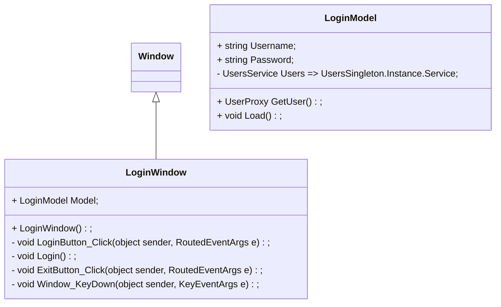

```mermaid
classDiagram

Window <|-- LoginWindow

class LoginWindow {
    + LoginWindow();
    + LoginModel Model;
    - void LoginButton_Click(object sender, RoutedEventArgs e);
    - void Login();
    - void ExitButton_Click(object sender, RoutedEventArgs e);
    - void Window_KeyDown(object sender, KeyEventArgs e);
}

class LoginModel {
    + string Username;
    + string Password;
    - UsersService Users => UsersSingleton.Instance.Service;
    + UserProxy GetUser();
    + void Load();
}

```