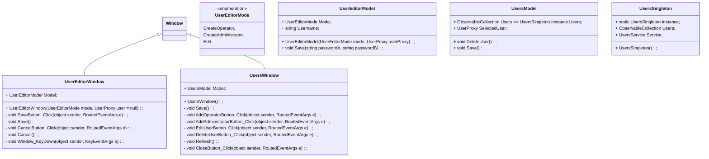

```mermaid
classDiagram

Window <|-- UserEditorWindow
Window <|-- UsersWindow

class UserEditorMode    {
    <<enumeration>>
    CreateOperator,
    CreateAdministrator,
    Edit
}

class UserEditorModel    {
    + UserEditorModel(UserEditorMode mode, UserProxy userProxy);
    + UserEditorMode Mode;
    + string Username;
    + void Save(string passwordA, string passwordB);
}

class UserEditorWindow     {
    + UserEditorWindow(UserEditorMode mode, UserProxy user = null);
    + UserEditorModel Model;
    - void SaveButton_Click(object sender, RoutedEventArgs e);
    - void Save();
    - void CancelButton_Click(object sender, RoutedEventArgs e);
    - void Cancel();
    - void Window_KeyDown(object sender, KeyEventArgs e);
}

class UsersModel {
    + ObservableCollection<UserProxy> Users => UsersSingleton.Instance.Users;
    + UserProxy SelectedUser;
    + void DeleteUser();
    + void Save();
}

class UsersSingleton {
    + UsersSingleton();
    + static UsersSingleton Instance;
    + ObservableCollection<UserProxy> Users;
    + UsersService Service;
}

class UsersWindow {
    + UsersWindow();
    + UsersModel Model;
    - void Save();
    - void AddOperatorButton_Click(object sender, RoutedEventArgs e);
    - void AddAdministratorButton_Click(object sender, RoutedEventArgs e);
    - void EditUserButton_Click(object sender, RoutedEventArgs e);
    - void DeleteUserButton_Click(object sender, RoutedEventArgs e);
    - void Refresh();
    - void CloseButton_Click(object sender, RoutedEventArgs e);
}

```