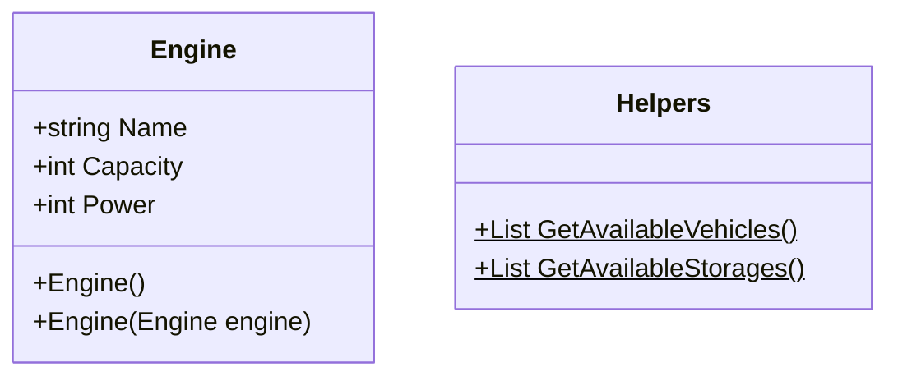

```mermaid
classDiagram

class Engine{
    +Engine()
    +Engine(Engine engine)
    +string Name
    +int Capacity
    +int Power
}

class Helpers {
    +List<Vehicle> GetAvailableVehicles()$
    +List<Storage> GetAvailableStorages()$
}

```