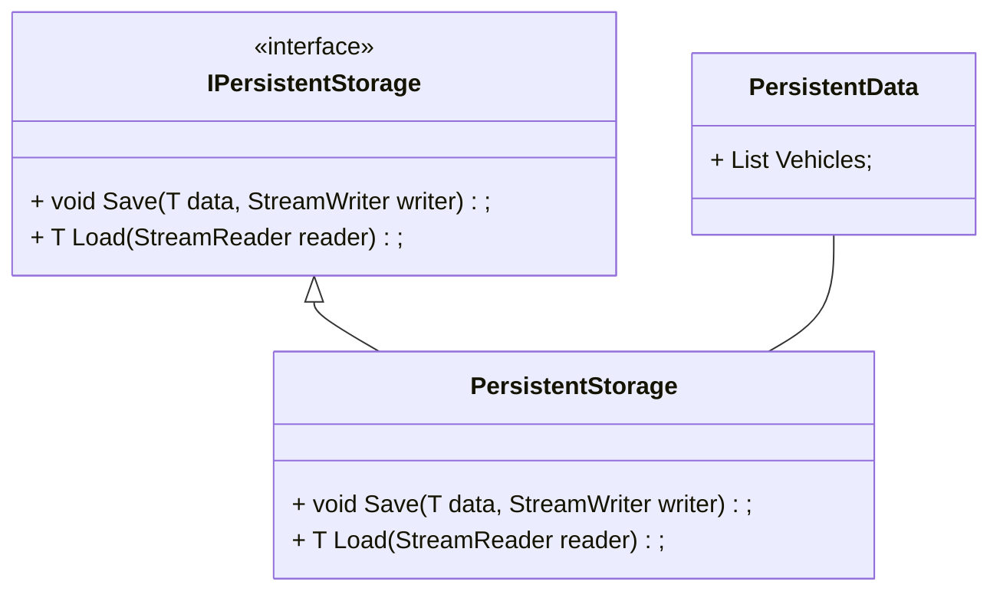

```mermaid
classDiagram
IPersistentStorage <|-- PersistentStorage
PersistentData -- PersistentStorage

class IPersistentStorage{
    <<interface>>
    + void Save(T data, StreamWriter writer);
    + T Load(StreamReader reader);
}

class PersistentData    {
    + List<Vehicle> Vehicles;
}

class PersistentStorage   {
    + void Save(T data, StreamWriter writer);
    + T Load(StreamReader reader);
}


```