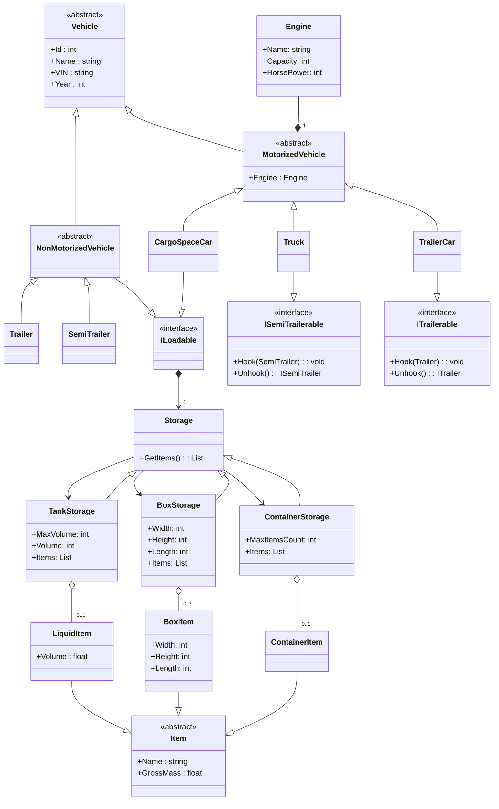
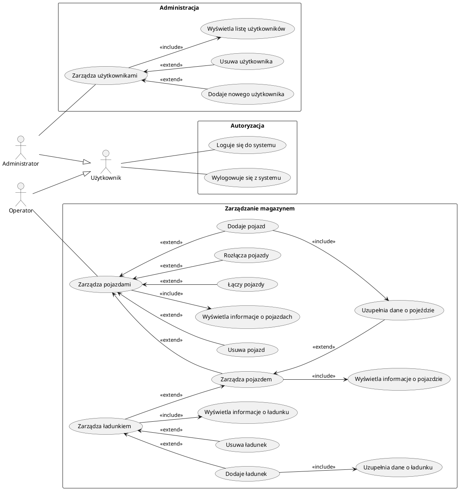

# Specyfikacja wymagań dla projektu Samochody ciężarowe, wersja 0.0.5
## Autor: Igor Nowicki

## 1. Opis systemu
System służy do przechowywania definicji pojazdów ciężarowych i ich zespołów, wraz z informacjami o załadunku. Przewidziana jest możliwość przechowywania pojazdów różnego rodzaju (samochody z przestrzenią ładunkową, ciągniki siodłowe, przyczepy, naczepy), z różnego rodzaju przestrzeniami ładunkowymi (zdefiniowane jako skrzyniowa, kontenerowa, cysterna). Program przewiduje mechanizm przechowywania danych na temat pojazdu pomiędzy sesjami poprzez zapis i odczyt z i do pliku dyskowego w formacie JSON. 

Program realizuje następujące działania:
- Logowanie i wylogowanie operatora
- Logowanie i wylogowanie administratora
- Wczytanie i zapis stanu z repozytorium z i do pamięci
- zapis stanu systemu z pamięci do repozytorium
- wprowadzenie nowego pojazdu
- skasowanie istniejącego pojazdu
- zarządzanie pojazdami przez operatora:
  * dodawanie pojazdów
  * edycja pojazdów
  * usuwanie pojazdów
  * wyświetlanie danych o pojazdach
  * łączenie i rozłączanie pojazdów w zespoły pojazdów według zdefiniowanych zasad
  * ładunek i rozładunek pojazdów z przestrzenią ładunkową według zdefiniowanych zasad

## 2. Model procesów biznesowych

### Diagramy klas

### Diagramy przypadków użycia

### 2.1. OBIEKTY BIZNESOWE

#### Pojazd (Vehicle)
Opis: Abstrakcyjny obiekt opisujący dowolną jednostkę jeżdżącą. Wyszczególnione są następujące obiekty pochodne:
- samochód z przestrzenią ładunkową (CargoSpaceCar)
- samochód typu przyczepowowego (TrailerCar)
- przyczepa (Trailer)
- ciągnik siodłowy (Truck)
- naczepa (SemiTrailer)

Każdy pojazd opisywany jest zestawem parametrów:
- Id (int) - Identyfikator (liczba całkowita dodatnia)
- Name (string) - Nazwa (tekst na podstawie pozycji katalogowej producenta)
- VIN (string) - Vehicle Identification Number (15 lub 17 znaków alfanumerycznych)
- Year - Rok produkcji (czterocyfrowa liczba całkowita w zakresie od roku 1900 do roku bieżącego)
- Engine - Parametry silnika (wymagane dla pojazdów silnikowych, brak dla pojazdów bezsilnikowych. Opis przedstawiony poniżej)
- CargoSpace - przestrzeń ładunkowa (wymagane dla przyczepy i naczepy)

#### Silnik (Engine)
Opis: Obiekt definiowany wewnątrz pojazdu silnikowego. Definiowany następującymi parametrami:
- Nazwa (tekst na podstawie pozycji katalogowej producenta)
- Pojemność (liczba całkowita dodatnia, cm3)
- Liczba koni mechanicznych (liczba całkowita dodatnia)

#### Przestrzeń ładunkowa (Storage)
Opis: Abstrakcyjny obiekt definiowany wewnątrz pojazdu z którego dziedziczą opisane poniżej typy przestrzeni ładunkowej.

#### Towar (Item)
Abstrakcyjny obiekt opisujący dowolną jednostkę towarową. Wyszczególnione są następujące obiekty pochodne:
- BoxItem - Towar typu skrzyniowego 
- ContainerItem - Towar typu kontenerowego 
- LiquidItem - Towar typu płynnego 

#### Skrzyniowa przestrzeń ładunkowa (BoxStorage)
Opis: Typ przestrzeni ładunkowej. Umożliwia załadunek towaru typu skrzyniowego. Opisywany następującymi parametrami:
- Width - Szerokość (w centymetrach, liczba całkowita dodatnia)
- Height - Wysokość (w centymetrach, liczba całkowita dodatnia)
- Length - Długość (w centymetrach, liczba całkowita dodatnia)
- Items - Lista towarów typu skrzyniowego.

#### Towar typu skrzyniowego (BoxItem)
Typ towaru, ładowany do skrzyniowej przestrzeni ładunkowej.
- Nazwa (Name) (tekst na podstawie pozycji katalogowej producenta)
- Masa brutto (GrossMass) (liczba zmiennoprzecinkowa, w tonach).
- Width - Szerokość (w cm)
- Height - Wysokość (w cm)
- Length - Długość (w cm)

#### Kontenerowa przestrzeń ładunkowa (ContainerStorage)
Opis: Typ przestrzeni ładunkowej. Umożliwia załadunek towaru typu kontenerowego. Opisywany następującymi parametrami:
- MaxItemsCount - Maksymalna liczba kontenerów (liczba całkowita dodatnia)
- Items - Lista kontenerów

#### Towar typu kontenerowego (ContainerItem)
Typ towaru, ładowany do kontenerowej przestrzeni ładunkowej.
Opisywany następującymi parametrami:
- Name - Nazwa (tekst na podstawie pozycji katalogowej producenta)
- GrossMass - Masa brutto (liczba zmiennoprzecinkowa, w tonach).

#### Cysternowa przestrzeń ładunkowa (TankStorage)
Opis: Typ przestrzeni ładunkowej. Umożliwia załadunek towaru typu płynnego. Opisywany listą parametrów:
- Capacity - Pojemność (w litrach, opisywana liczbą całkowitą dodatnią)
- Item - Towar typu płynnego.

#### Towar typu płynnego (LiquidItem)
Typ towaru, ładowany do cysternowej przestrzeni ładunkowej.
Opisywany listą parametrów:
- Name - Nazwa (tekst na podstawie pozycji katalogowej producenta)
- GrossMass - Masa brutto (liczba zmiennoprzecinkowa, w tonach).
- Volume - Objętość (w litrach, opisywana liczbą całkowitą dodatnią)

#### Pojazd silnikowy

Opis: Szczególny rodzaj pojazdu. Parametry silnika są wymagane do uzupełnienia. Jest możliwość podczepienia przyczepy.

#### Ciągnik siodłowy
Opis: Szczególny rodzaj pojazdu. Parametry silnika są wymagane do uzupełnienia. Jest możliwość podczepienia naczepy.

#### Przyczepa
Opis: Szczególny rodzaj pojazdu. Wymagana do uzupełnienia przestrzeń ładunkowa. Możliwa do podczepienia przez pojazd samobieżny.

### 2.2. AKTORZY BIZNESOWI
Aktorzy biznesowi przetwarzają obiekty biznesowe lub są z nimi w interakcji. Warto zauważyć, że mogą oni odzwierciedlać nie tylko konkretnych pracowników firmy (a raczej role, jakie pełnią w tej firmie), ale także np. zewnętrzne systemy biorące udział w procesie biznesowym. Szablon opisu aktora może wyglądać następująco:

ID:  A1
Nazwa: Operator
Opis: Podstawowy użytkownik aplikacji. Może przeglądać listy pojazdów i informacje na temat każdego z pojazdów. Może przeprowadzać załadunek i rozładunek pojazdów oraz łączenie i rozłączanie zespołów pojazdów.

ID:  A2
Nazwa: Administrator
Opis: Użytkownik z uprawnieniami administratora. Może zarządzać użytkownikami systemu – dodawać, usuwać, edytować informacje i wyświetlać listę zarejestrowanych użytkowników i administratorów systemu.

### 2.3. REGUŁY BIZNESOWE
Ta część dokumentu ma na celu zebranie w jednym miejscu zidentyfikowanych reguł biznesowych, czyli stwierdzeń definiujących lub ograniczających pewne aspekty działalności danego przedsiębiorstwa. Szablon opisu reguły biznesowej może wyglądać następująco:

ID Definicja reguły Typ Źródło
R1 Cysterna może być załadowana jednym rodzajem płynu. ograniczenie Rozmowa w trakcie zajęć
R2 Ilość ładunku nie może przekraczać maksymalnej ładowności przestrzeni ładunkowej ograniczenie Rozmowa w trakcie zajęć

### 2.4. PROCESY BIZNESOWE
W tym rozdziale należy umieścić (opracowane w dowolnym narzędziu) wybrane procesy biznesowe w notacji BPMN realizowane w danym przedsiębiorstwie. Procesy powinny odnosić się do wszystkich opisanych powyżej obiektów, aktorów i reguł biznesowych. Można też dołączyć procesy jako załącznik do dokumentu.

## 3. WYMAGANIA FUNKCJONALNE
Rozdział zawiera spis wymagań funkcjonalnych dla tworzonego produktu informatycznego. 

ID:  F1
Nazwa: Zarządzanie informacjami o pojazdach
Priorytet: Wysoki
Proces biznesowy: Użytkownik może zarządzać pojazdami.
Opis: Użytkownik może:
- wyświetlać listę pojazdów, 
- wyświetlać dane pojedynczego pojazdu, 
- stworzyć nowy pojazd, 
- zaktualizować dane pojazdu,
- skasować pojazd z listy,
- złączyć pojazd typu ciągnikowego z przyczepą
- złączyć pojazd typu siodłowego z naczepą
- przeprowadzić załadunek pojazdu
- przeprowadzić rozładunek pojazdu

Na etapie tworzenia lub aktualizacji pojazdu użytkownik uzupełnia następujące informacje:
- rodzaj pojazdu
- ogólne parametry pojazdu (wyszczególnione w obiektach biznesowych)
- obecność, rodzaj oraz dane na temat silnika (jw.)
- obecność, rodzaj oraz dane na temat przestrzeni towarowej (jw.)
ID:  F2
Nazwa: Zapis i odczyt z pliku
Priorytet: Wysoki
Proces biznesowy: Użytkownik może zapisać/odczytać dane do/z pliku.
Opis: Użytkownik może zapisać bieżący stan magazynu w formie pliku tekstowego. Użytkownik może wczytać stan magazynu z pliku tekstowego.
ID:  F3
Nazwa: Autoryzacja użytkownika
Priorytet: Wysoki
Proces biznesowy: Użytkownik autoryzuje się przed rozpoczęciem pracy.
Opis: Użytkownik loguje się na jedno z wielu kont. Dostępne są konta administratora oraz konta operatora.
ID:  F4
Nazwa: Zarządzanie informacjami o użytkownikach przez administratora systemu
Priorytet: Wysoki
Proces biznesowy: Administrator może zarządzać użytkownikami w systemie.
Opis: Administrator może wyświetlać listę użytkowników zarejestrowanych w systemie. Administrator może wyświetlać szczegółowe informacje na temat użytkowników. Administrator może edytować informacje o użytkowniku. Administrator może kasować użytkowników.

## 4. WYMAGANIA NIEFUNKCJONALNE
W tym rozdziale należy umieścić wszystkie wymagania niefunkcjonalne pamiętając, aby tak je sformułować, aby w przyszłości była możliwość ich weryfikacji. 

ID:  N1
Nazwa: Platforma Windows 10
Priorytet: Wysoki
Proces biznesowy: Program ma działać na platformie Windows 10.
Opis: Program jest projektowany pod kątem używania na komputerach z systemem Windows 10. System musi być przystosowany do uruchomienia administracji (wymagana zainstalowana wersja Java Virtual Machine).
ID:  N2
Nazwa: Interfejs graficzny
Priorytet: Wysoki
Proces biznesowy: Interfejs programu ma być w postaci graficznej (GUI).
Opis: Interfejs programu jest projektowany jako graficzny, z wykorzystaniem biblioteki Swing.
ID:  N3
Nazwa: Pamięć trwała
Priorytet: Wysoki
Proces biznesowy: Informacje o systemie mają być przechowywane pomiędzy sesjami w pliku JSON.
Opis: Musi być możliwe przechowywanie informacji na temat bieżącego stanu magazynu. Stan magazynu musi być przechowywany w postaci pliku tekstowego w formacie JSON we wskazanym przez użytkownika miejscu w systemie plików. Stan magazynu musi być możliwy do wczytania oraz zapisu w czasie pracy programu.

<!-- ## 5. ANALIZA WYMAGAŃ 
Jednym z ważniejszych etapów tworzenia specyfikacji systemu, jest analiza wymagań funkcjonalnych. Efektem tej analizy powinny być przypadki użycia, które przedstawia się za pomocą diagramów przypadków użycia z języka UML a następnie uszczegóławia za pomocą specjalnych formularzy (tabel), diagramów czynności, a czasami (jeżeli przypadek użycia jest opisany bardzo ogólnie) także innymi diagramami przypadków użycia.  Na diagramach przypadków użycia należy umieścić wszystkie zidentyfikowane przypadki użycia, ale szczegółowo opisane za pomocą formularzy musi być min. 5.
Jeśli zidentyfikowanych przypadków użycia jest dużo, zaleca się pogrupować je w moduły funkcjonalne, wtedy rozdział dotyczący przypadków użycia może zostać podzielony na mniejsze podrozdziały – oddzielnie dla każdego modułu funkcjonalnego.
5.1. <NAZWA MODUŁU FUNKCJONALNEGO>
5.1.1. Opis i priorytet
W miejscu tym należy umieścić krótki przegląd funkcji wchodzących w skład opisywanego modułu funkcjonalnego. 
5.1.2. Diagram przypadków użycia
W miejscu tym należy umieścić diagram przypadków użycia zawierających przypadki użycia dotyczące danego modułu. 
5.1.3. <Nazwa przypadku użycia>
W tej sekcji opisany jest przypadek użycia związany z danym modułem. Sekcja rozpoczyna się metryką przypadku użycia, po której następuje w formie tabelarycznej jego szczegółowy opis (scenariusz przypadku użycia).

Identyfikator:  Identyfikator przypadku użycia 
Nazwa:  Nazwa przypadku użycia 
Identyfikator wymagania: Identyfikator wymagania (lub wielu wymagań), które realizuje dany przypadek użycia
Wymaganie 
biznesowe:  Nazwy lub identyfikatory konkretnych działań w procesie biznesowym, do których odnosi się to wymaganie
Twórca:  Imię Nazwisko  Data utworzenia:  data utworzenia
Autor modyfikacji:  Imię Nazwisko (1) Data modyfikacji:  data (1) 
Powód modyfikacji:  Przyczyna zmian w dokumencie (1)
Autor modyfikacji:  Imię Nazwisko (2) Data modyfikacji:  data (2)
Powód modyfikacji:  Przyczyna zmian w dokumencie (2)

Aktorzy:  Aktor_1, Aktor_2 
Kto lub jaki system może wykonywać ten przypadek użycia. 
Opis przypadku użycia:  Opis na czy polega przypadek użycia 
Scenariusz podstawowy: 
Warunki początkowe:  Warunki początkowe wywołania przepływu podstawowego. 
Efekt końcowy:  Efekt końcowy przepływu podstawowego. 
Przepływ zdarzeń:  1. Opis kroku 1...
2. Opis kroku 2...
3. Opis kroku 3... 
Scenariusze alternatywne: 
Nazwa:  Nazwa przepływu alternatywnego (1) 
Warunki początkowe:  Warunki początkowe wywołania przepływu alternatywnego (1) 
Miejsce, w którym scenariusz alternatywny zastąpi scenariusz podstawowy. 
Efekt końcowy:  Efekt końcowy przepływu alternatywnego (1) 
Przepływ zdarzeń:  1. Opis kroku 1...
2. Opis kroku 2...
3. Opis kroku 3... 
Nazwa:  Nazwa przepływu alternatywnego (2) 
Warunki początkowe:  Warunki początkowe wywołania przepływu alternatywnego (2) 
Efekt końcowy:  Efekt końcowy przepływu alternatywnego (2) 
Przepływ zdarzeń:  1. Opis kroku 1...
2. Opis kroku 2...
3. Opis kroku 3... 
Informacje dodatkowe: 
Nazwa:  Nazwa informacji dodatkowej (1) 
Informacje dodatkowe rozwijają hasła użyte w scenariuszach doprecyzowując tym samym używane pojęcia, charakteryzując elementy interfejsu, jeśli jest do nich odwołanie w scenariuszu itp. – punkt opcjonalny. 
Opis:  Opis informacji dodatkowej (1) 
Nazwa:  Nazwa informacji dodatkowej (2) 
Opis:  Opis informacji dodatkowej (2) 
Wymagania specjalne: 
Nazwa:  Nazwa wymagania specjalnego (1) 
Opis wymagań specjalnych dla przypadku użycia, wymagań dodatkowych, które muszą być spełnione przez system, aby uznać przypadek użycia za poprawnie zrealizowany – punkt opcjonalny. 
Opis:  Opis wymagania specjalnego (1) 
Nazwa:  Nazwa wymagania specjalnego (2) 
Opis:  Opis wymagania specjalnego (2) 
Zależności zawierania i rozszerzania: 
Zawiera:  Wymienione PU, które są połączone z bieżącym PU relacją <<include>>
Odwołanie do innych przypadków użycia – punkt opcjonalny. 
Punkty rozszerzeń:  Wymienione PU, które są połączone z bieżącym PU relacją <<extend>>
Odwołanie do innych przypadków użycia – punkt opcjonalny. 

Jeżeli istnieje taka potrzeba, można w tym miejscu dodać diagram czynności uszczegóławiający dany przypadek użycia. -->

## 6. PROJEKT INTERFEJSU UŻYTKOWNIKA
W tym rozdziale należy umieścić projekt interfejsu użytkownika dla min. 5 przypadków użycia, szczegółowo opisanych za pomocą formularzy w poprzednim rozdziale. 

## 7. MODEL SYSTEMU
W tym rozdziale należy umieścić informacje dotyczące modelu danych wykorzystywanego w projektowanym systemie. Najbardziej pomocne mogą być tutaj diagramy klas. Można w tym miejscu umieścić także informacje (diagramy) na temat struktury bazy danych przechowującej dane w systemie.

