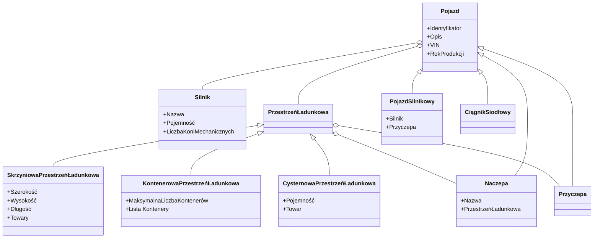

# Diagramy UML

Poniżej znajduje się diagram UML dla projektu Samochody Ciężarowe.



```plantUML
@startuml
:Administrator: --> (Use)
"Operator" as Admin
"Use the application" as (Use)
Admin --> (Admin the application)
@enduml
```

Wymagane są:

- diagramy Use Case
- diagramy klas

