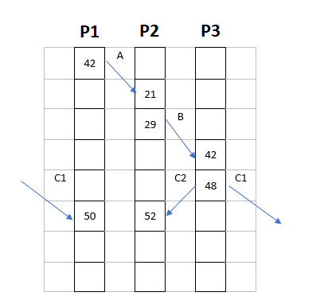
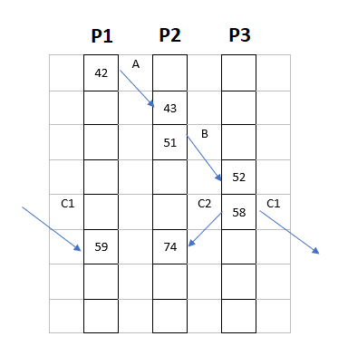

# Zadanie SSRz-W1i2

## Zad.1. Algorytm Lamporta

Proszę rozważyć trzy procesy, każdy działający na innej maszynie. Każda maszyna ma lokalny czasomierz. W przypadku bez korekty czasu maszyn, proces P1 wysyła komunikat A w chwili 42. Komunikat ten odbierany jest przez proces P2, wg jego lokalnego czasu w chwili 21. Następnie proces P2 w chwili 29 wysyła komunikat B do procesu P3. Proces P3 odbiera ten komunikat, wg jego lokalnego czasu, w chwili 42. Proces P3 w chwili 48 wysyła komunikat C do procesów P1 i P2. Komunikat ten jest odbierany przez proces P1 w chwili 50 wg jego czasu lokalnego, oraz w chwili 52 przez proces P2 wg jego czasu.

* Czasy których maszyn należy skorygować, kiedy i jak.
* Jakie będą czasy nadania i odbioru komunikatów po dokonaniu synchronizacji logicznej czasu wymienionych maszyn, zgodnie z algorytmem Lamporta?
* Przedstawić rozwiązanie na wykresie czasów maszyn i podać wyjaśnienie.

### Rozwiązanie

Tabela czasów procesów w zadaniu:



Z podręcznika *Systemy rozproszone. Zasady i paradygmaty (A. S. Tanenbaum, M. van Steen)*:

Warunki dla relacji uprzedniości zdarzeń:

1. Jeśli $a$ i $b$ są zdarzeniami w tym samym procesie i $a$ występuje przed $b$, to relacja $a\to b$ jest prawdziwa.
2. Jeśli $a$ jest zdarzeniem wysłania komunikatu przez pewien proces i $b$ jest zdarzeniem odebrania tego komunikatu przez inny proces, to relacja $a\to b$ jest również prawdziwa. Komunikat nie może być odebrany przed jego wysłaniem lub w tej samej chwili co jego nadanie, gdyż na jego wędrówkę zużywa się skończoną ilość czasu.

By zachować relację uprzedniości zdarzeń, w przypadku gdy proces odbierający informację ma równą bądź niższą wartość czasu, ustawia się go na wartość bezpośrednio wyższą niż w procesie wysyłającym informację. Aby to było możliwe, proces wraz z komunikatem wysyła również chwilę nadania komunikatu według lokalnego zegara - w dalszej części tekstu będzie to opisane jako X(N), gdzie X określa nazwę komunikatu, natomiast N - moment nadania.

* P1 nadaje komunikat A(42) do B. 
* P2 odbiera komunikat A(42) w chwili 21. **Należy skorygować czas P2 z 21 do 43.**
* Mija 8 tyknięć w procesie P2, jest czas 51.
* P2 nadaje komunikat B(51) do P3.
* Proces P3 odbiera komunikat B(51) w 42. **Należy skorygować czas P3 z 42 do 52.**
* Mija 6 tyknięć w procesie P3, jest czas 58.
* P3 wysyła komunikat C(58) do P1 oraz do P2.
* P1 odbiera komunikat C(58) 8 tyknięć po nadaniu komunikatu A(42), w chwili 50. **Należy skorygować czas P1 z 50 do 59.**
* P2 odbiera komunikat C(58) 23 tyknięcia po nadaniu wiadomości B(51) do P3, w chwili 74.

Graficzne przedstawienie:



## Zad.2. Synchronizacja czasu fizycznego.

Proszę rozpatrzyć działanie czterech maszyn w systemie rozproszonym. Maksymalny współczynnik odchylenia czasomierza pierwszej maszyny wynosi `3*10-5` , drugiej: `7*10-5` , trzeciej: `15*10–5` , czwartej: `15*10–5` .
Co ile sekund należy synchronizować zegary tych maszyn, aby maksymalne odchylenie między nimi nie było większe niż 10 ms ?
Jakie może być maksymalne odchylenie czasu pierwszej maszyny w przedziale między kolejnymi synchronizacjami? Odpowiedź należy uzasadnić.

### Rozwiązanie

Niech współczynniki odchylenia czasomierzów będą dane jako:

$$\begin{align*}\rho_1 &= 3\cdot10^{-5}\\
\rho_2 &= 7\cdot10^{-5}\\
\rho_3 &= 15\cdot10^{-5}\\
\rho_4 &= 15\cdot10^{-5}\end{align*}$$

Najwieksze odchylenie pomiędzy maszynami zachodzi wtedy, gdy trzecia i czwarta maszyna mają odchylenia w przeciwne strony, tj. jedna z nich się spóźnia, druga się spieszy - mamy wtedy współczynnik rozbieżoności czasów o wartości $\rho_3+\rho_4 = 3\cdot10^{-4}$. Jeśli chcemy, by odchylenie czasu nie przekraczało wartości $\delta = 10^{-3}$ s, musimy zapewniać synchronizację co $\frac\delta{\rho_3+\rho_4} = 3.33$ s.

## Zad.3. Przetwarzanie transakcji

Proszę rozpatrzyć możliwe plany współbieżnej realizacji następujących trzech transakcji:
a)

```
POCZĄTEK TRANSAKCJI
x:=0; 
x:=x+11; 
y:=1; 
y:=y+x;
KONIEC TRANSKACJI
```

b)

```
POCZĄTEK TRANSAKCJI
x:=1; 
x:=x+5; 
y:=2; 
y:=y+2x;
KONIEC TRANSKACJI
```

c)

```
POCZĄTEK TRANSAKCJI
x:=2; 
x:=x+7; 
y:=3;
KONIEC TRANSKACJI
```

Proszę określić pełną listę dopuszczalnych wartości (rozdzielając je kwantyfikatorami logicznymi "i" ew. "lub"), które mogą przyjąć na końcu zmienne x i y.

Proszę podać przykład niedopuszczalnego planu realizacji transakcji.

Odpowiedź należy uzasadnić.

### Rozwiązanie

Dopuszczalne wartości po przeprowadzeniu transakcji:

1. x = 11, y = 12 (transakcja a na końcu)
2. x = 6, y = 14 (transakcja b na końcu)
3. x = 9, y = 3 (transakcja c na końcu)

Przykład niedpuszczalnego planu realizacji transakcji współbieżnych (oznaczenia - pierwsza litera to indeks transakcji, cyfra to numer operacji wewnątrz transakcji):

```
c1) x:=2; 
a1) x:=0; 
b1) x:=1; 
a2) x:=x+11; 
a3) y:=1; 
a4) y:=y+x;
b2) x:=x+5; 
b3) y:=2; 
b4) y:=y+2x;
c2) x:=x+7; 
c3) y:=3;
```

Wynik końcowy: x = 24, y = 3.