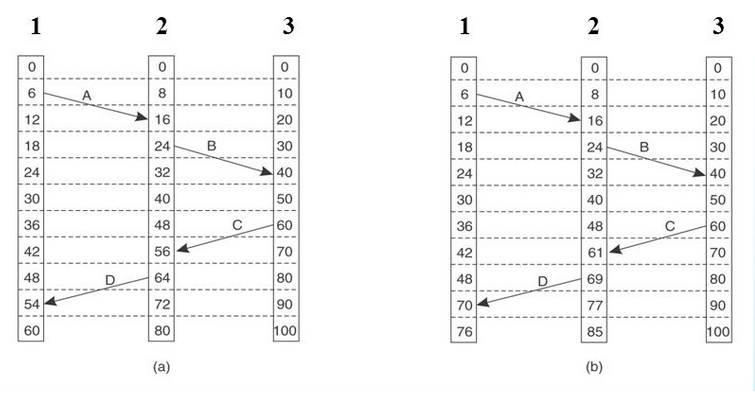
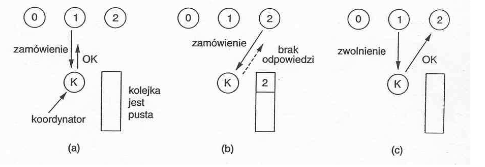
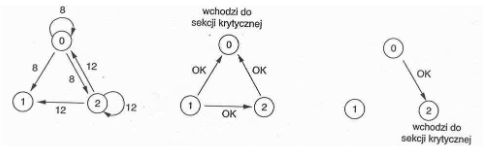
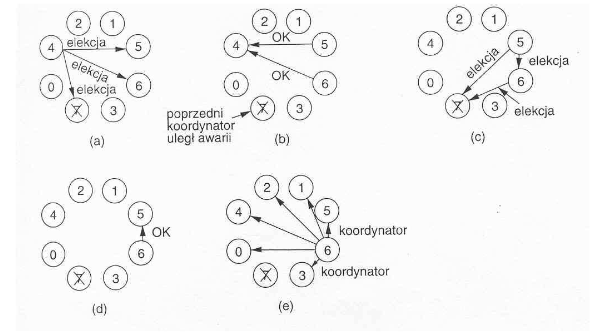
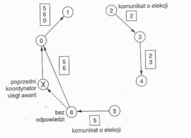
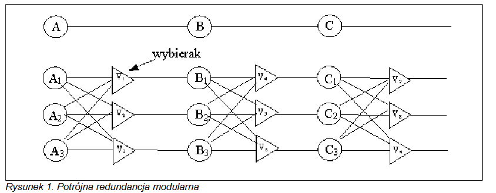
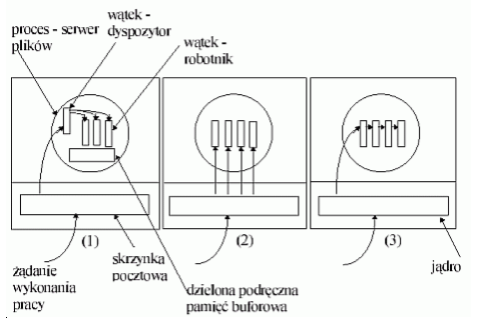
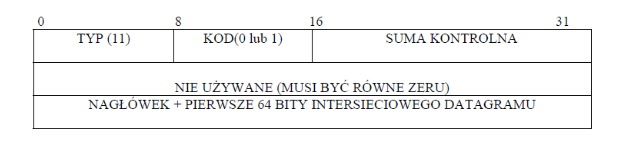
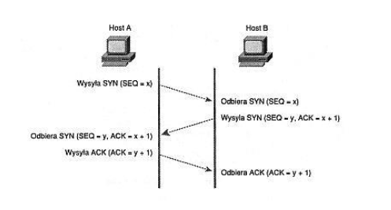

# Pytania podstawowe do egzaminu z przedmiotu SSR

## I. Budowa i funkcjonowanie systemów rozproszonych)

### 1. Wyjaśnić pojęcie przezroczystości w systemach rozproszonych.

Ważnym celem systemu rozproszonego jest ukrywanie faktu, że jego procesy i zasoby są fizycznie rozproszone na wielu komputerach. O systemie rozproszonym, który potrafi prezentować się swoim użytkownikom i aplikacjom tak, jakby był tylko jednym systemem komputerowym, mówimy, że jest **przezroczysty** (ang. _transparent_).

Rodzaje przezroczystości:

- **przezroczystość replikacji** - nawet jeśli nie ma dostępu do jednej z maszyn, użytkownik nie powinien obserwować braku dostępu do danych.
- **przezroczystość dostępu** - ukrywanie różnic w reprezentacji danych i metodach, którymi zasoby udostępnia się użytkowniom.
- **przezroczystość położenia** - użytkownicy nie są w stanie określić, w którym miejscu systemu zasób jest ulokowany fizycznie.
- **przezroczystość zwielokrotniania** - ukrywanie faktu, że istnieje kilka kopii zasobu
- **przezroczystość wędrówki** - maskowanie zmiany fizycznej lokalizacji zasobów
- **przezroczystość przemieszczenia** - maskowanie zmiany fizycznej lokalizacji zasobów w trakcie ich używania
- **przezroczystość pod względem awarii** - użytkownik nie zauważa awarii zasobu, podczas gdy system dokonuje usunięcia skutków uszkodzenia
- **przezroczystość trwałości** - maskowanie faktu, czy zasób jest w pamięci ulotnej, czy może gdzieś na dysku.

### 2. Czym różni się wieloprocesor od multikomputera?

Komputery mające pamięć dzieloną (wspólną) nazywamy **wieloprocesorami**, natomiast komputery które mają osobne pamięci, nazywamy **multikomputerami**.

Komputer wieloprocesorowy ma wiele procesorów i jedną współdzieloną między wszystkimi procesorami pamięć. Multikomputer ma wiele procesorów, z których każdy z nich korzysta z własnej pamięci.

W wieloprocesorze istnieje jedna fizyczna przestrzeń adresowa, użytkowana wspólnie przez wszystkie jednostki centralne.

W multiomputerze każda z maszyn ma własną, prywatną pamięć - np. zbiór komputerów osobistych połączonych za pomocą sieci.

### 3. Czy różni się synchronizacja czasu fizycznego od synchronizacji czasu logicznego?

W przypadku synchronizacji czasu fizycznego, komputery synchronizują czas tak, by był zgodny z czasem rzeczywistym - z zewnętrznym zegarem. W przypadku synchronizacji czasu logicznego, komputery synchronizują czas między sobą, bez względu na zewnętrzny zegar.

Synchronizacja czasu fizycznego polega na komunikacji z zewnętrznym serwisem czasu. Jeśli jeden z komputerów ma dostęp do serwisu, to pozostałe komputery starają się synchronizować czasy z tym komputerem. Jeśli wszystkie komputery mają dostęp do serwisu, to każdy z nich synchronizuje się z nim z osobna.

W przypadku synchronizacji czasu logicznego maszyny synchronizują się jedynie między sobą.

W obydwu przypadkach synchronizacji istotne jest przestrzeganie zasad przyczynowości, tj. relacji między przyczyną a skutkiem - skutek zawsze będzie miał czas późniejszy niż przyczyna. W związku z tym synchronizowany komputer **nie może cofać swojego czasu** - może go jedynie zachować albo zmienić na czas późniejszy.

### 4. Co to jest uniwersalny czas koordynowany i do czego jest stosowany?

Uniwersalny czas koordynowany - (UTC) Universal Coordinated Time. Czas atomowy skoordynowany z czasem astronomicznym przez dodawanie sekund przestępnych. Wzorzec dla wszystkich współczesnych cywilnych pomiarów czasu.

### 5. Wyjaśnić ideę algorytmu Cristiana synchronizacji czasu fizycznego.

Załóżmy, że jedna z maszyn ma dostęp do zewnętrznego serwisu czasu (np. posiada odbiornik WWV). Nazwiemy wtedy tę maszynę serwerem czasu. Każda z pozostałych maszyn okresowo, nie częściej niż co $\delta/2\rho$ s (gdzie $\delta$ to maksymalna dopuszczalna różnica czasu między maszynami, natomiast $\rho$ to współczynnik maksymalnego tempa odchylenia), wysyła do serwera czasu żądanie o bieżący czas. Serwer czasu odpowiada możliwie jak najszybciej za pomocą komunikatu zawierającego aktualny czas.

Po otrzymaniu odpowiedzi, nadawca może ustawić swój zegar. Jednak jeśli jego zegar się spieszy, nie może go cofnąć, ze względu na warunek przyczynowości - zdarzenie wysłania wiadomości musi zajść przed zdarzeniem odbioru. W związku z tym mierzone jest tempo spieszenia się, poprzez porównanie czasu odbioru z czasem wysłania. Na podstawie tego tempa, ustanawiane jest stopniowe korygowanie czasu maszyny, poprzez zmniejszenie lub zwiększenie tempa naliczania czasu.

### 6. Wyjaśnić ideę algorytmu Lamporta synchronizacji czasu logicznego.

Po pierwsze, stosujemy relację uprzedniości zdarzeń, tj. zasadę, że jeśli $a$ poprzedza $b$ (zapisywane jako $a\to b$), to czas $a$ musi być mniejszy niż czas $b$, również po korekcie czasu w maszynie. Jeśli mamy $a\to b$ oraz $b\to c$, to również możemy powiedzieć, że $a\to c$ - relacja jest **przechodnia**. Natomiast, jeśli zdarzenia $x$ i $y$ występują na różnych, niesynchronizowanych ze sobą maszynach, to nie możemy powiedzieć, by $x\to y$ lub $y\to x$. O takich zdarzeniach mówimy że są **współbieżne**.



Algorytm znaczników czasu Lamporta działa następująco. Maszyny wysyłają do siebie komunikaty z informacją o aktualnym czasie nadawcy. Jeśli odbiorca ma czas późniejszy niż odebrany, nic nie robi. Jeśli ma czas wcześniejszy lub równy, ustawia swój zegar na najmniejszy możliwy czas od odebranego komunikatu. Maszyny wysyłają sobie informacje co ustalony okres czasu, prowadząc do synchronizacji.

### 7. Na czym polega problem wzajemnego wyłączania i jak jest rozwiązywany w systemach rozproszonych?

W przypadku, gdy mamy wiele procesów (bądź maszyn) żądających dostępu do jednego zasobu, mamy problem sekcji krytycznej. Problem kolejności dostępu do zasobu jest rozwiązywany poprzez algorytmy wzajmnego wyłączania (wykluczania).

W systemach rozproszonych jest dodatkowy problem, bowiem nie można zastosować algorytmów wykorzystujących pamięć dzieloną - tak jak semafory i monitory.

### 8. Podać przykłady algorytmów rozwiązujących problem wzajemnego wyłączania w systemach rozproszonych?

Stosowane są m.in. następujące algorytmy:

1. **Algorytm scentralizowany**:

- Jeden proces jest koordynatorem.
- Proces, który chce wejść do sekcji krytycznej wysyła zamówienie do koordynatora.Koordynator odpowiada (udziela zezwolenia), gdy żaden inny proces nie jest w sekcji krytycznej.
- Proces, po odebraniu zezwolenia, wchodzi do sekcji krytycznej.
- Proces wychodząc z sekcji krytycznej wysyła komunikat do koordynatora.
  
- Cechy algorytmu scentralizowanego:
  - zapewnia wzajemne wyłączanie,
  - nie zachodzi głodzenie procesów,
  - łatwy w realizacji,
  - wrażliwy na awarie.

2. **Algorytm rozproszony**:

- Wymagane jest całkowite uporządkowanie czasowe zdarzeń - komunikatów (np. stosując algorytm Lamporta).
- Proces, który chce wejść do sekcji krytycznej wysyła do wszystkich procesów komunikat zawierający nazwę sekcji krytycznej, swój numer, bieżący czas.
- Każdy komunikat jest potwierdzany (zapewnienie niezawodności).
- Proces odbierający komunikat:
  1. Jeśli nie jest w sekcji krytycznej i nie chce do niej wejść – wysyła do nadawcy komunikat OK.
  2. Jeśli jest w sekcji krytycznej - nie odpowiada.
  3. Jeśli chce wejść do sekcji krytycznej - sprawdza znacznik czasu odebranego komunikatu i komunikatu, który sam wysłał. Jeśli odebrany komunikat ma znacznik czasu mniejszy - wysyła OK.
- Proces nadawca:
  - Czeka aż wszystkie procesy udzielą zezwolenia, wtedy wchodzi do sekcji krytycznej.
  - Wychodząc z sekcji krytycznej wysyła OK. do procesów, które ustawił w kolejce.
    
- Cechy algorytmu:
  - Zapewnienie wzajemnego wyłączania bez głodzenia.
  - Wrażliwy na awarie - brak odpowiedzi spowodowany awarią procesu jest traktowany jako brak zgody - blokowanie procesów próbujących wejść do sekcji krytycznej (jest możliwość rozwiązania).
  - Wymagana komunikacja grupowa lub każdy proces musi utrzymywać listę procesów znajdujących się w grupie, wchodzących i wychodzących - obciążenie systemu.

3. **Algorytm pierścienia logicznego z żetonem**

- Rozpatrzmy system rozproszony, w którym zbiór procesów jest połączonych szyną Wprowadza się logiczne (programowe) uporządkowanie procesów tworząc pierścień. W pierścieniu krąży żeton.
- Proces po otrzymaniu żetonu sprawdza, czy chce wejść do sekcji krytycznej,
  - nie - przekazuje żeton sąsiadowi,
  - tak - zatrzymuje żeton aż wyjdzie z sekcji krytycznej.
- Cechy algorytmu:
  - Zapewnia wzajemne wyłączanie.
  - Nie powoduje głodzenia procesów.
  - Powstają problemy związane z zaginięciem żetonu.
  - Wrażliwy na awarie procesów.

4. Algorytmy elekcji:

- Cel: wybór procesu, który będzie pełnił rolę koordynatora lub inicjatora w systemie rozproszonym.
- Założenia:

  - każdy proces ma niepowtarzalny numer,
  - każdy proces zna numery wszystkich pozostałych,
  - procesy nie wiedzą, które z nich aktualnie działają, a które są unieruchomione, próbuje się zlokalizować proces o największym numerze.

  1. **Algorytm tyrana**:

  - Działanie:
    1. Proces A zauważył, że koordynator nie odpowiada. A wysyła komunikat ELEKCJA do wszystkich procesów z większymi numerami.
    2. Brak odpowiedzi, to A zostaje koordynatorem.
    3. Nadchodzi komunikat od procesu B o większym numerze. Proces A przestaje działać w elekcji. B przejmuje sterowanie i kontynuuje elekcję (zgodnie z punktami 1, 2, 3 ).
    4. Proces, który wygrywa elekcję wysyła do pozostałych komunikat: KOORDYNATOR.

  

  2. **Algorytm pierścieniowy**

  - Założenie: procesy są fizycznie i logicznie uporządkowane. (Każdy proces przechowuje strukturę pierścienia).
  - Działanie:
    1. Proces A zauważył, że koordynator nie działa. Wysyła komunikat ELEKCJA do
       kolejnego nie wyłączonego procesu w pierścieniu. Komunikat zawiera jego numer.
    2. Proces B otrzymujący komunikat ELEKCJA, dopisuje swój numer i przesyła do
       następnego, itd.
    3. Proces A po odebraniu komunikatu z własnym numerem, wysyła komunikat:
       KOORDYNATOR z pełną listą procesów występujących aktualnie w pierścieniu i
       wskazujący proces o najwyższym nu-
       merze, który zostaje koordynatorem.
    4. Koordynator rozpoczyna działanie.

  

### 9. Omówić algorytm rotacyjnego (pierścienia logicznego z żetonem) rozwiązujący problem wzajemnego wyłączania w systemach rozproszonych.

Algorytm ten polega na wybraniu procesu, który będzie pełnił rolę koordynatora lub inicjatora w systemie rozproszonym. Opiera się na następujących założeniach:

    każdy proces ma niepowtarzalny numer,

    każdy proces zna numery wszystkich pozostałych,

    procesy nie wiedzą, które z nich aktualnie działają, a które są unieruchomione,

    próbuje się zlokalizować proces o najwyższym numerze.

Jako przykład może posłużyć algorytm tyrana:

Algorytm tyrana (z angielskiego bully algorithm), jest to algorytm elekcji, w którym jako koordynatora wybiera się proces o aktualnie najwyższym numerze. Dowolny z procesów, który dostrzega (np. wskutek odliczania czasu) awarię koordynatora, wysyła do pozostałych członków grupy komunikat ELEKCJA. Każdy proces o wyższym numerze niż dotychczasowi nadawcy komunikatu ELEKCJA przejmuje inicjatywę, uciszając procesy o niższych numerach komunikatem OK. Jeśli po usunięciu awarii poprzedni koordynator wznawia działanie w systemie, to przejmuje nadzór, mając najwyższy numer (stąd nazwa algorytmu – najsilniejszy na podwórku zwycięża).

### 10. Czemu służą algorytmy elekcji? Podać przykład?

Patrz wyżej.

### 11. Na czym polega synchronizacja czasu fizycznego?

Patrz punkt 5.

### 12. Na czym polega przetwarzanie transakcyjne?

Transakcje chronią zasób dzielony pred jednoczesnym dostępem kilku współbieżnych procesów. Transakcji używamy do ochrony danych dzielonych.

Proces rozpoczynający transakcję dostaje kopię rzeczywistych obiektów (potrzebnych mu) w przypadku zatwierdzenia commit zmiany są widoczne w obiektach rzeczywistych w przypadku wycofania rollback są tylko usuwane z prywatnej przestrzeni roboczej bez zmian na oryginał (problem kopiowania danych (czasochłonność))
W celu przyśpieszenia procesu transakcji: wykorzystanie indeksowania zawiera adresy dyskowe pliku (do przestrzeni prywatnej kopiuje się tylko indeks) Czytanie pliku- odwołanie do oryginalnego pliku ; aktualizacja bloku- stworzenie kopii bloku, wstawienie adresu do prywatnego indexu i aktualizacja bloku, , Dodanie bloku- dostawienie adresu bloku do pryw. Indexu, Zatwierdzenie transakcji- przeniesienie pryw indexu do przestrzeni procesu rodzicielskiego.

### 13. Podać i wyjaśnić właściwości transakcji.

1. Niepodzielność (atomicity)
2. Spójność (consistence)
3. Izolacja, uszeregowanie (isolation, serialization)
4. Trwałość (durabiIity)

### 14. Podać przykłady metod realizacji przetwarzania transakcyjnego?

Przykładami takimi są:

- rejestr zapisów wyprzedzających (lista zamiarów) - Pliki są modyfikowane w miejscu ich występowania, ale przed zmianą jakiegokolwiek bloku następuje zapisanie rekordu w specjalnym rejestrze zapisów wyprzedzających, przechowywanym w pamięci trwałej. Zapisy obejmują: transakcję, która dokonuje zmiany, jaki plik i blok jest zmieniany, starą i nową zawartość bloku.
- protokół zatwierdzania dwufazowego:
  Rozwiązanie problemu zapewnienia niepodzielność transakcji w sytuacji współpracy wielu procesów na różnych maszynach. Każdy z procesów może przechowywać część obiektów modyfikowanych przez transakcję.
  Idea:
  Jeden proces jest koordynatorem, pozostałe – podwładnymi. Zastosowanie specjalnego protokołu zatwierdzania, wykorzystującego wymianę komunikatów między procesem koordynatorem, a procesami podwładnymi.
  Potwierdzanie wszystkich działań zapisami w rejestrze.
  Uwagi:
  Rejestr przechowywany jest w pamięci trwałej.
  Zapis aktualnego stanu w rejestrze umożliwia kontynuację działań także w przypadku awarii – odporność na awarie.

### 15. Jak wykonywane jest przetwarzanie transakcyjne z wykorzystaniem metody prywatnej przestrzeni roboczej?

Proces rozpoczynający transakcję dostaje kopię rzeczywistych obiektów (potrzebnych mu) w przypadku zatwierdzenia commit zmiany są widoczne w obiektach rzeczywistych w przypadku wycofania rollback są tylko usuwane z prywatnej przestrzeni roboczej bez zmian na oryginał (problem kopiowania danych (czasochłonność))

W celu przyśpieszenia procesu transakcji: wykorzystanie indeksowania zawiera adresy dyskowe pliku (do przestrzeni prywatnej kopiuje się tylko indeks) Czytanie pliku- odwołanie do oryginalnego pliku ; aktualizacja bloku- stworzenie kopii bloku, wstawienie adresu do prywatnego indexu i aktualizacja bloku, , Dodanie bloku- dostawienie adresu bloku do pryw. Indexu, Zatwierdzenie transakcji- przeniesienie pryw indexu do przestrzeni procesu rodzicielskiego

### 16. Jak wykonywane jest przetwarzanie transakcyjne z wykorzystaniem rejestru zapisów wyprzedzających?

Pliki są modyfikowane w miejscu ich występowania, ale przed zmianą jakiegokolwiek bloku następuje zapisanie rekordu w specjalnym rejestrze zapisów wyprzedzających, przechowywanym w pamięci trwałej. Zapisy obejmują: transakcję, która dokonuje zmiany, jaki plik i blok jest zmieniany, starą i nową zawartość bloku.

### 17. Na czym polega problem nadzorowania współbieżności wykonywania transakcji w systemach rozproszonych?

Jeśli dwa zdarzenia A i B nie są związane relacją (tzn. A nie wystąpiło przed B ani B nie wystąpiło przed A), to mówimy, że takie dwa zdarzeniaq wystąpiły współbierznie. W tej sytuacji żadne zdarzenie nie może przyczynowo wpływać na drugie. Procesy muszą więc chronić wykorzystywane przez siebie obiekty (pliki, bazy danych i.t.p.) przed wykorzystaniem przez inne procesy.

### 18. Podać przykłady algorytmów nadzorowania współbieżności transakcji w systemach rozproszonych?

Algorytmy nadzorowania współbieżności nadzorują jednoczesne wykonywanie transakcji przez wiele procesów na różnych maszynach. Przykładami takich algorytmów są:

Zajmowanie – Proces wykonujący transakcje zamyka obiekt, np. plik przed wykorzystaniem go przez inne procesy. Operacja zajmowania zarządzana jest przez pewien proces lub procesy zarządzające. Zarządca aktualizuje listę zajętych obiektów. Nie pozwala innym obiektom na dostęp do obiektów zajętych. Możliwe jest rozróżnienie zajmowania obiektu do odczytu i do aktualizacji.

Optymistyczne nadzorowanie współbieżności – Polega na zapisywaniu informacji, które obiekty były aktualizowane. Wykonuje transakcje nie zważając na inne. W chwili zatwierdzania transakcji sprawdza czy inna transakcja nie zmodyfikowała plików po jej rozpoczęciu, jeśli tak – zaniechanie, jeśli nie – zatwierdzenie transakcji.

Znaczniki czasu – Każdej operacji jest przypisany znacznik czasu operacji elementarnej „Początek transakcji”. Zapewniona jeest niepowtarzalność znaczników czasu (np. przy wykorzystaniu algorytmu Lamporta). Każdy plik ma skojarzony znacznik czasu czytania i znacznik czasu pisania przez osatnio zatwierdzoną transakcję. Znacznik czytania i pisania pliku mniejsze od znacznika czasu danej transakcji - nie ma problemu..

Sytuacja odwrotna oznacza, że po rozpoczęciu transakcji, inna, późniejsza transakcja miała dostęp do pliku.

### 19. Jak można wykrywać blokady (zakleszczenia) w systemach rozproszonych?

Można to zrobić poprzez:

- Scentralizowane wykrywanie blokad

  - System: zbiór maszyn, jeden koordynator.
  - Każda maszyna utrzymuje graf własnych zasobów i procesów.
  - Koordynator tworzy graf całego systemu.
  - Sposoby przesyłania informacji:

    1. Maszyna wysyła komunikat po każdej zmianie krawędzi w grafie.
    2. Maszyna wysyła okresowo wykaz dodanych i usuniętych krawędzi.
    3. koordynator prosi maszyny o przesłanie informacji, gdy będzie mu to potrzebne.

  - Rozproszone wykrywanie blokad

    - Np. algorytm Chandy-Misra-Haasa
    - Proces może zamawiać wiele zasobów jednocześnie.
    - Sposób realizacji:
    - Proces oczekujący na zasób wysyła komunikat do procesu przetrzymującego ten zasób
    - Komunikat zawiera:
      - Numer procesu rozpoczynającego czekanie.
      - Numer procesu wysyłającego komunikat.
      - Numer procesu, do którego komunikat jest wysyłany.

Odbiorca komunikatu sprawdza czy sam nie czeka, jeśli poczeka to wysyła kolejny komunikat aktualizując 2-ie i 3-e pole.

Powrót komunikatu do pierwotnego nadawcy oznacza blokadę.

Sposób usunięcia blokady: np. usunięcie procesu, który zapoczątkował próbę.

### 20. Czy różni się praca wielowątkowa od jednowątkowej?

W przypadku pracy jednowątkowej proces ma własny licznik rozkazów, stos, zbiór rejestrów i przestrzeń adresową. Do komunikacji między procesami wykorzystywane są systemowe mechanizmy komunikacji( np. semafory, komunikaty).

W przypadku pracy wielowątkowej proces ma własny licznik rozkazów, stos i rejestry, ale wszystkie wątki mają wspólną przestrzeń adresową, ten sam zbiór otwartych plików, procesów pochodnych i.t.p.

### 21. Czy serwer wielowątkowy może działać efektywniej od jednowątkowego w przypadku jednego procesora? Odpowiedź uzasadnić.

W przypadku serwera jednowątkowego każdy nowy komunikat z zamówieniem, który nadchodzi podczas obsługiwania zamówienia przez serwer, będzie ustawiany w kolejce portu serwera.

Jeśli serwer jest wielowątkowy (zakładamy, że wątki są niezależne, tzn. gdy jeden wątek zostanie zablokowany z powodu operacji wejścia-wyjścia, drugi może podjąć działanie w procesorze). Wątek nr. 2 może więc przetwarzać zamówienie w czasie, gdy wątek nr. 1 jest zablokowany i na odwrót. Zwiększa to przepustowość serwera. Jest jednak mało prawdopodobne, aby operacje wejścia-wyjścia były wykonywane równolegle, gdyż urządzenia wejścia-wyjścia ograniczaszybkość przetwarzania zamówień. Wątki mogą być na przykład blokowane z powodu jednego napędu dysku. Gdybyśmy zastosowali pamięć podręczną bloków dyskowych (tzn. serwer przechowuje przeczytane dane w buforach swojej przestrzeni adresowej) to wątek serwera proszony o odzyskanie danych najpierw sprawdza zawartośćwspólnej pamięci podręcznej i jeśli je tam znajdzie, to unika kontaktu z dyskiem. Przy założeniu ok. 75% trafień przepustowość wzrasta kilkukrotnie.

Tak więc serwer wielowątkowy działa szybciej od jednowątkowego w przypadu jednego procesora, szybkość tą ograniczają jednak operacje wejścia-wyjścia.

### 22. Wyjaśnić zagadnienie planowania w systemie rozproszonym MACH.

### 23. Wykorzystanie bezczynnych stacji roboczych w systemie rozproszonym.

### 24. Omówić model puli procesorów jako systemu rozproszonego z uwzględnieniem teorii masowej obsługi.

### 25. Co to jest redundancja i jakie typy redundancji stosuje się w systemach rozproszonych?

Redundancja, w teorii informacji, nadmiar informacji przekraczający minimum potrzebne do rozwiązania danego problemu lub przekazu tej informacji, np. zapis liczby 1 jako 01,00 jest redundantny.

Redundancja informacji – przesyłanie dodatkowych bitów informacji, umożliwiających odtworzenie zniekształconych bitów. Kod Hamminga stosowany w transmisji.

Redundancja czasu – wykonanie operacji, a jeśli wykonana została błędnie, powtórzenie jej wykonania. Przykład użycie transakcji niepodzielnych.

Redundancja fizyczna – Specjalna budowa, dodatkowe wyposażenie, zwielokrotnianie elementów składowych, aby system działał mimo awarii niektórych elementów. Realizowane poprzez: aktywne zwielokratnianie lub poprzez zasoby rezerwowe.

### 26. Na czym polega tolerowanie awarii w systemach rozproszonych i jak jest realizowane?

W wypadku wystąpienia awarii system tolerujący awarię powinien działać nada, co najwyżej nieco gorzej. Pogorszenie może dotyczyć wydajności i/lub funkcjonalności. Powinno być ono w pewnym sensie proporcjonalne do awarii, które je powodują. Systemy rozproszone tolerujące awarię buduje się wykorzystując redundancję. Przykładami tolerancji awarii są np. aktywne zwielokrotnianie polegające na zwielokrotnianiu elementów działających równolegle (przy użyciu wybieraków) oraz używanie zasobów rezerwowych, które przejmują funkcje podstawowego zasobu w wypadku jego awarii.

### 27. Czym różni się stosowanie aktywnego zwielokrotnienia od zastosowania zasobów rezerwowych do tolerowania uszkodzeń?

Istota koncepcji zasobów rezerwowych polega na tym, że w dowolnej chwili całą pracę
wykonuje jeden serwer podstawowy. Jeśli serwer podstawowy ulega awarii, to jego funkcje
przejmuje serwer rezerwowy. W idealnych warunkach owo przejęcie powinno przebiegać bez
zakłóceń i być dostrzegalne tylko przez system operacyjny klienta, a nie przez programy
użytkowe. Podobnie jak aktywne zwielokrotnianie, schemat ten jest szeroko
rozpowszechniony po świecie.

Tolerowanie uszkodzeń uzyskiwane dzięki stosowaniu zasobów rezerwowych ma dwie
ważne zalety w porównaniu z efektami stosowania aktywnego zwielokrotniania:

- jest ono łatwiejsze w czasie normalnego działania, gdyż komunikaty podążają tylko
  do jednego serwera (podstawowego), a nie do całej grupy. Znika również problem
  porządkowania komunikatów,
- wymaga ono mniej maszyn, ponieważ w każdej chwili jest potrzebna tylko jedna
  jednostka podstawowa i jedna rezerwowa. (choć gdy rezerwa zostaje użyta jako jednostka
  podstawowa, natychmiast staje się potrzebna nowa rezerwa).
  Do wad należy zaliczyć złe działanie w przypadku występowania wad bizantyjskich, kiedy
  jednostka podstawowa fałszywie oświadcza, że działa poprawnie. Złożony i czasochłonny
  może być także proces przywracania jednostki podstawowej pracy

### 28. Na czym polega zastosowanie aktywnego zwielokrotnienia do tolerowania uszkodzeń?

Aktywne zwielokrotnianie (ang. active replication) jest dobrze znaną techniką zapewniania
tolerancji uszkodzeń za pomocą redundancji fizycznej. Aktywne zwielokrotnianie stosuje się
w układach elektronicznych w celu zwiększenia ich odporności na uszkodzenia.
Przykładem może być układ z poniższego rysunku:



W górnej części rysunku sygnał przechodzi po kolei przez urządzenia A, B i C. Jeśli któreś
z nich jest wadliwe, to prawdopodobnie wynik końcowy będzie zły.

W dolnej części rysunku każde urządzenie zostało potrojone. Po każdej części układu
występuje potrójny wybierak. Każdy wybierak jest układem z trzema wejściami i jednym
wyjściem. Jeśli dwa lub trzy wyjścia są takie same, to wyjście równa się wejściu. Jeśli
wszystkie trzy wejścia są różne, to wyjścia są nieokreślone. Projekt tego rodzaju nosi nazwę
TMR czyli potrójna redundancja modularna.

Przypuśćmy, że element A2 ulega uszkodzeniu. Każdy z wybieraków V1, V2 i V3 otrzymuje
dwa dobre (identyczne) wejścia i jedno oszukane, i każdy z nich wprowadza poprawną
wartość wyjściową do następnego odcinka. Skutki uszkodzenia elementu A2 zostają w istocie
zupełnie zamaskowane, więc wejścia B1,B2 i B3 są dokładnie takie, jakie byłyby przy
niewystąpieniu uszkodzenia.

Na każdym odcinku znajdują się trzy wybieraki ponieważ są składową układu i także
mogą być wadliwe. Załóżmy na przykład, że V1 działa błędnie. Wejście do B1 będzie
wówczas złe, lecz dopóki reszta działa poprawnie, dopóty B2 i B3 wytworzą takie same
wyjścia i każdy z wybieraków V4, V5 oraz V6 wyprodukuje poprawne wyniki dla trzeciego
odcinka. Wada elementu V1 nie powoduje innych skutków niż wada powstała w B1. W obu
przypadkach B1 wytwarza błędne wyjście, lecz w obu z nich zostaje ono potem
przegłosowane na własną niekorzyść.

Technika TMR daje dobrą orientację co do tego, czym jest system tolerujący uszkodzenia
jako przeciwieństwo systemu, w którym poszczególne składowe są niezawodne, lecz którego
organizacja nie dopuszcza wad. Technikę TMR można również stosować rekurencyjnie
używając jej na przykład do uzyskania dużej niezawodności wewnątrz układu w sposób
ukryty dla projektantów, którzy go wykorzystują.

### 29. Czym różnią się wady wyciszenia od wad bizantyjskich?

Przy wadzie bizantyjskiej procesor po jej wystąpieniu dalej działa, ale błędnie odpowiada na pytania i niewłaściwie współpracuje z innymi. Stwarza wrażenie poprawnej pracy. Natomiast przy wadzie wyciszającej procesor się zatrzymuje i nie odpowiada. Następuje wadliwe zatrzymanie.

### 30. Czym różni się system rozproszony budowany według modelu stacji roboczych od modelu puli procesorów?

System rozproszony realizujący model puli procesorów zawiera system usług dla stacji roboczej, do którego dołączono jedną lub więcej pul procesorów. Pula procesorów składa się ze zbioru tanich komputerów, z których każdy zawiera m.in. procesor, pamięć i interfejs sieciowy. Każdy procesor puli ma niezależne połączenie z siecią (podobnie jak stacje robocze i serwery), a ich architektura nie musi być jednolita.

Z punktu widzenia użytkownika model puli procesorów różni się od modelu usług dla stacji roboczej tym, że użytkownik może wykonywać pożyteczne prace za pomocą słabo wyposażonego w sprzęt komputera albo nawet sieciowego terminalu. Stacja robocza lub terminal użytkownika po prostu zapewnia dostęp do zasobów obliczeniowych systemu. Zadanie obliczeniowe może być wykonywane częściowo lub w całości przez pulę procesorów. Jeśli użytkownik zapoczątkuje więcej niż jedno zadanie lub zadanie wytwarza podzadania, to procesory puli mogą być przydzielone każdemu z nich i wszystkie zadania mogą wykonywać się równolegle. Procesory puli są przydzielane dynamicznie na podstawie bieżącego obciążenia obliczeniami i obciążenia pamięci oraz wymagań pamięciowych programu. Przykładem systemu realizującego model puli procesorów może być system Amoeba.

Druga modyfikacja polega na programowym rozszerzeniu modelu usług dla stacji roboczej, umożliwiającym przydzielenie zadań bezczynnym lub słabo wykorzystywanym stacjom roboczym jako płynnej puli dodatkowych komputerów, które mogą być używane podobnie jak pula procesorów w modelu puli procesorów. W każdej chwili, a zwłaszcza nocą, znaczna część stacji roboczych w sieci może pozostawać bezczynna lub tylko lekko obciążona pracami w rodzaju redagowania dokumentów. Takie stacje robocze mają zapas mocy obliczeniowej i mogą być używane do wykonywania zadań dla użytkowników zarejestrowanych na innych stacjach i których zadania wymagają więcej mocy obliczeniowej niż może im zapewnić jedna stacja robocza. Przykładem może być system Sprite - przeznaczony dla systemów rozproszonych, który umożliwia użytkownikom wykonywanie poszczególnych poleceń na bezczynnych lub nie w pełni wykorzystanych stacjach roboczych. Docelowa stacja jest wybierana przeźroczyście przez system. System Sprite uwzględnia możliwość migracji procesów, czyli przemieszczania wykonywanego programu z jednej maszyny do drugiej. Oznacza to, że w razie zarejestrowania się użytkownika na danej stacji lub gdy stacja ta zacznie być intensywniej wykorzystywana, gościnnie wykonywany program może powędrować bezpiecznie z powrotem do innej lub swojej maszyny, gdzie może być dalej wykonywany.

### 31. Jak mogą być wykorzystane dyski lokalne w modelu stacji rooczych? Podać wady i zalety różnych rozwiązań.

Dyski lokalne stacji roboczych można wykorzystać do:

- Stornicowania i przechowywania plików tymczasowych (są one tworzone w czasie sesji, np. w trakcie kompilacji) i nie muszą być wysyłane do serwera plików.
- Stronicowanie i przechowywanie plików tymczasowych oraz systemowych plików binarnych (na dyskach lokalnych poza plikami tymczasowymi przechowuje się dodatkowo najczęściej wykorzystywane binaria (kompilatory, edytory tekstu, itp)
- Stronicowanie i przechowywanie plików tymczasowych, systemowych plików binarnych oraz podręczna pamięć (w czasie sesji użytkownik ściąga z serwera pliki na dysk lokalny, odsyła osateczne wersje plików na serwer przed zakończeniem sesji. Zalety: redukcja obciążenia sieci, utrzymanie scentralizowanej pamięci długoterminowej. Wady: pojawia się problem utrzymania spójności pamięci podręcznych).
- Kompletny lokalny system plików (Każda maszyna ma własny system plików z możliwością montowania systemów plików innych maszyn. Zalety: gwarantowany czas odpowiedzi, małe obciążenie sieci. Wady: utrudnione dzielenie informacji, w ten sposób system realizuje idee operacyjnego systemu siecioweg, a nie systemu rozproszonego.).

### 32. Jak mogą być organizowane wątki w procesie? Podać przykłady.

Wątki mogą być zorganizowane na jeden z trzech sposobów:

- model dyspozytor-pracownik (dispatcher – worker) – Zamówienia są w buforze, jeden wątek dyspozytor sprawdza czy jest zamówienie i budzi uśpionego robotnika, aby obsłużył zamówienie. Robotnik pobiera zamówienie i je realizuje. W wielu wątkach jest wielu uśpionych robotników czekających na obudzenie.

- model zespołu (team model) – Nie ma dyspozytora, wszystkie wątki są równoprawne. Pobierają i przetwarzają zamówienia (wątki mogą być wyspecjalizowane).

- model potoku (pipeline model) – Jeden wątek pobiera i przetwarza częściowo zamówienie, po czym podaje je dalej i może zacząć pobierać następne zamówienie.



### 33. Rozpatrzyć zespół wątków realizujących pewne zadanie. Co mają wspólne w ramach zadania, a co każdy ma niezależne?

Każdy wątek posiada własny licznik rozkazów, zbiór rejestrów, stos, stan oraz wątki potomne. Współdzieli z innymi wątkami tego samego zadania: przestrzeń adresową, zmienne globalne oraz zasoby systemowe.

## II. Sieci

### 1. Jakie warstwy występują w modelu OSI (7 warstw), a jakie w modelu TCP/IP (4 warstwy)?

- **OSI**:

  - **warstwa fizyczna** - umożliwia przesyłanie pojedynczych bitów (są one jednostką usług i jednostką protokołu) między stacjami połączonymi łączem. Dostępne usługi tej warstwy to przesłanie ciągu bitów z zachowaniem ich sekwencji, wykrywanie nieprawidłowości transmisji przez odbiorcę (odrzucenie bitu) i wykrywanie stanów specjalnych łącza. Decydującym czynnikiem określającym parametry transmisji danych jest jakość łącza. Wpływa ona na opóźnienia transmisyjne, szybkość transmisji oraz na liczbę błędów. Warstwa ta szczegółowo określa fizyczne cechy interfejsu sieciowego stacji takie jak: elementy mechaniczne i elektryczne, złącza, poziomy napięć i inne aspekty elektryczne. Znanymi interfejsami łącza fizycznego są np.: RS-232, RS-449. Warstwa ta określa też cechy funkcjonalne takie jak: założenie, utrzymywanie i zdemontowanie łącza fizycznego;

  - **warstwa łącza danych** - definiuje reguły przesyłania i otrzymywania informacji, zapewnia prawidłową transmisję między stacjami lub węzłami sieci. Umożliwia wykrywanie i korygowanie błędów powstałych w warstwie fizycznej. Jeśli wiele stacji jest połączonych jednym nośnikiem to warstwa ta realizuje funkcję wykrywania stanu łącza oraz bezkolizyjnego dostępu do tego łącza (w wypadku gdyby wiele stacji chciało nadawać jednocześnie). Warstwa ta jest najniższą warstwą, która realizuje transmisję ramek (sekwencje bitów) o określonej strukturze oraz jawnie określonym początku i końcu. Protokoły tej warstwy dobiera się w zależności od jakości łączy. W wypadku gdy łącza są bardzo dobrej jakości pomija się wykrywanie błędów (można to przenieść do wyższych warstw) co daje znaczne przyspieszenie transmisji. W warstwie tej pracują mosty (bridges). Typowe protokoły tej warstwy to HDLC, sterowniki i metody dostępu w sieciach lokalnych (np.: Ethernet, Token Ring), NDIS (Microsoft), ODI (Novell) oraz sieci rozległe z szybką komutacją pakietów (Frame Relay, ATM);

  - **warstwa sieci** - umożliwia utworzenie (przy pomocy węzłów sieci) drogi transmisji między stacjami końcowymi oraz, co się z tym wiąże, wybór drogi lub dróg transmisji (routing). Funkcje tej warstwy umożliwiają unikanie przeciążeń w sieci. Znaczenie jej jest tym większe im więcej jest możliwych dróg przekazywania informacji oraz im bardziej są zróżnicowane charakterystyki poszczególnych fragmentów sieci. W warstwie tej pracują routery. Funkcje tej warstwy odczytują adres docelowy pakietu i kierują go bezpośrednio do stacji w sieci (jeśli adres dotyczy sieci lokalnej) lub przez router do innego segmentu sieci. Typowe protokoły tej warstwy to: IP, X.25, IPX (Novell);

  - **warstwa transportowa** - zapewnia transmisje z wymaganymi charakterystykami, takimi jak: przepustowość, stopa błędów, opóźnienia transmisyjne. Warstwa ta optymalizuje użycie usług sieciowych tak, aby wymagane warunki techniczne spełnić w sposób jak najbardziej ekonomiczny. Warstwa ta „przesłania" usługi oferowane przez niższe warstwy aby ukryć przed wyższymi warstwami szczegóły związane ze znajdującą się niżej siecią. Warstwa ta gwarantuje ponadto dostarczenie danych do odbiorcy oraz realizuje kontrolę błędów i inne operacje związane z niezawodnością transmisji jeśli nie są one realizowane w niższych warstwach (np.: Frame Relay, ATM). Warstwa ta oferuje usługi połączeniowe (ustalane jest łącze przez które pakiety wędrują do miejsca przeznaczenia i docierają tam w kolejności sekwencyjnej) lub bezpołączeniowe. W razie gdy pakiet nie dotrze do odbiorcy lub dojdzie uszkodzony to protokół warstwy transportowej zażąda retransmisji tego pakietu. Typowe protokoły tej warstwy to: TCP, UDP, SPX (Novell), NetBIOS / NetBEUI (Microsoft);

  - **warstwa sesji** - rozszerza funkcje warstwy transportowej o środki umożliwiające synchronizację dialogu i zarządzanie wymianą danych między jej usługobiorcami (aplikacjami). Ustala, który z partnerów ma prawo do nadawania oraz to, czy komunikacja jest naprzemienna, czy równoczesna w obu kierunkach. Warstwa ta umożliwia tworzenie punktów synchronizacji służących do powrotu przez obu uczestników dialogu do takiego punktu w razie wystąpienia nieprawidłowości (np. utrata wysłanych danych w wyniku awarii łącza);

  - **warstwa prezentacji** - w różnych systemach używane są różne postaci informacji, np. kod znaku, typ danych, itd. Warstwa ta zapewnia przekształcenie tych postaci w jednorodną formę sieciową. Przekształcenie to dotyczy składni (syntaktyki) a nie sensu (semantyki) informacji. W warstwie tej następuje również kompresja i szyfrowanie transmitowanych danych. Nadchodzące dane są zamieniane na postać, którą można przedstawić użytkownikowi (na ekranie lub wydruku);

  - **warstwa aplikacji** - oferuje całość usług komunikacyjnych procesom użytkowników. Dostępne są funkcje takie jak: ustalenie protokołu transmisji, zawieszanie i wznawianie połączenia, dotyczące synchronizacji działań i stwierdzanie autentyczności partnerów. Typowymi usługami tej warstwy są również: transfer plików i działanie zdalne na plikach, dostęp i działanie na zdalnych bazach danych, praca procesu użytkowego jako terminala zdalnego komputera, poczta elektroniczna i inne;

- **TCP/IP**:

  - **Warstwa aplikacji** – zawiera aplikacje do usuwania błędów w sieci, transmisji plików, zdalnego sterowania przepływem i działań internetowych.

  - **Warstwa transportowa** – odpowiada za sterowanie przepływem informacji, sprawdzanie danych oraz potwierdzanie otrzymania danych w sieci. Służy jako interfejs dla aplikacji sieciowych.

  - **Warstwa internetowa** – umożliwia logiczne adresowanie niezależne od sprzętu, co pozwala danym przenosić się między sieciami o różnej strukturze fizycznej. Zapewnia routing redukujący ruch oraz zapewniający dostarczanie przesyłek międzysieciowych. Łączy adresy fizyczne (używane w warstwie interfejsu sieciowego) z adresami logicznymi.

  - **Warstwa interfejsu sieciowego** – zapewnia interfejs z siecią fizyczną. Formatuje dane do transmisji przez nośnik oraz adresuje dane do podsieci, opierając się na adresach fizycznych. Zapewnia sprawdzanie błędów przesyłu w sieci fizycznej.

### 2. Jakie warstwy modelu OSI odpowiadają warstwie interfejsu sieciowego w modelu TCP/IP? (warstwy fizyczna i łącza danych)

Warstwie interfejsu sieciowego odpowiadają warstwy: Łącza danych i Warstwa Fizyczna.

### 3. Jaką długość w bitach mają adresy MAC, IPv4 i IPv6?

### 4. Jaka jest zasadnicza różnica między UDP i TCP?

UDP jest protokołem bezpołączeniowym, a TCP połączeniowym. W metodzie bezpołączeniowej system sieciowy odpowiada jedynie za przesłanie pakietów. Wykrywanie błędów i sterowanie przepływem realizowane jest przez nadawcę i odbiorcę. W przypadku, gdy zostanie wykryty fakt, że pakiet nie dotarł do odbiorcy to musi on wysłać żądanie retransmisji w celu otrzymania pakietu. Brak pakietu wykrywany jest podczas składania z nadesłanych pakietów pierwotnej informacji. W metodzie połączeniowej system sieciowy przejmuje odpowiedzialność za bezbłędne dostarczenie pakietów we właściwej kolejności i wykrywanie zagubionych lub uszkodzonych pakietów. Przed przesyłaniem danych między nadawcą i odbiorcą ustanawiany jest kanał komunikacyjny (kanał logiczny, połączenie wirtualne). Kanał ten stanowi ustalony tor, po którym pakiety mogą być przesyłane w sposób uporządkowany. Kanał określony jest przez stacje końcowe, tzn. ważne jest utrzymywanie kontaktu między stacjami, nie zaś rzeczywisty fizyczny tor w sieci.

### 5. Jakie są podstawowe zasady mechanizmu CSMA/CD?

Carrier Sense Multiple Access with Collision Detect (CSM/CD) oznacza, że wiele komputerów może korzystać z łącza, a każda maszyna sprawdza czy eter jest wolny. Polega to na tym, że zanim urządzenie działające w sieci (np. karta sieciowa) rozpocznie wysyłanie danych, sprawdza czy aktualnie jakieś inne urządzenie nie transmituje danych. Jeśli medium transmisji jest wolne urządzenie rozpoczyna transmisję równocześnie nasłuchując czy jakieś inne urządzenie nie rozpoczęło transmisji w tym samym czasie (sytuacja taka nazywana jest kolizją). Jeśli nastąpi kolizja, oba komputery czekają losowy kwant czasu nim zaczną ponownie nadawać.

### 6. Jakie ograniczenia ma długość pola danych w nagłówku Ethernet II?

protokół sieciowy umożliwiający konwersję logicznych adresów warstwy sieciowej na fizyczne adresy warstwy łącza danych. Protokół ten nie ogranicza się tylko do konwersji adresów IP na adres MAC stosowany w sieciach Ethernet,

Protokół ARP nie jest niezbędny do działania sieci komputerowych, może zostać zastąpiony przez statyczne wpisy w tablicy ARP, przyporządkowujące adresom warstwy sieciowej adresy fizyczne na stałe.

ARP działa w następujący sposób:

1. w celu ustalenia adresu fizycznego hosta docelowego wysyłane jest żądanie ARP request do wszystkich hostów znajdujących się w tej samej sieci. Zapytanie zawiera adres logiczny hosta docelowego oraz adres fizyczny hosta wysyłającego zapytanie
2. na zapytanie odpowiada tylko ten host, którego adres logiczny jest identyczny z adresem logicznym umieszczonym w zapytaniu. Odpowiedź zawiera adres logiczny i fizyczny hosta docelowego.
3. Odebrany adres fizyczny zapisywany jest w tablicy ARP i parowany z adresem logicznym hosta docelowego, dzięki czemu nie będzie wymagane ponowne odkrywanie adresu fizycznego do momentu wyczyszczenia tablicy Często po podłączeniu do sieci host rozsyła zapytanie ARP o własny adres. Ma to na celu dwie rzeczy, po pierwsze: ustalenie czy w sieci jest już podpięty system dysponującym identycznym adresem. Po drugie: każdy host obecny w danej sieci może zapisać w pamięci podręcznej dane o nowym hoście przyłączonym do sieci.

### 7. Jak jest realizowana multipleksacja protokołów w nagłówkach Ethernet II i IP?

### 8. Czym jest numer portu w protokołach warstwy transportowej?

### 9. W jaki sposób TCP zapewnia niezawodny transport?

TCP wykorzystuje sekwencyjną numerację bajtów oraz mechanizm pozytywnych potwierdzeń z retransmisją. Numer sekwencyjny przypisany do każdego przesyłanego bajtu danych pozwala na jego jednoznaczną identyfikację, a także jest używany w mechanizmie przesyłania potwierdzeń. Ponieważ kolejne bajty są numerowane począwszy od INS, a zatem numer pierwszego bajtu wysłanego w połączeniu wirtualnym wynosi INS+1 ( zazwyczaj INS=0). Nadawczy moduł TCP dokonuje retransmisji danych do czasu, aż otrzyma potwierdzenie poprawnego ich przyjęcia przez odbiorczy moduł TCP. Rozpoczęcie retransmisji uwarunkowane jest przekroczeniem wcześniej ustalonego czasu oczekiwania na nadejście potwierdzenia. Po stronie odbiorczej poprawność odbioru danych sprawdzana jest przy użyciu pola suma kontrolna znajdującego się w nagłówku segmentu. Jeżeli dane są akceptowane to moduł TCP wysyła zwrotnie pozytywne potwierdzenie. Jest ono zawarte w polu numer potwierdzenia. Wszystkie bajty danych o numerach sekwencyjnych mniejszych od wartości zawarte w tym polu zostały odebrane poprawnie.

W sytuacji, gdy dane zostały odebrane poprawnie, a nadawczy moduł TCP retransmitował je np. z powodu zaginięcia segmentu z pozytywnym potwierdzeniem, odbiorczy moduł TCP ma możliwość odrzucenia nadmiarowych danych (duplikatów).

### 10. W jaki sposób zachodzi proces nawiązywania połączenia za pomocą TCP?

### 11. Czym jest nr inicjujący w protokole TCP?

### 12. W jaki sposób zachodzi proces zakończenia połączenia za pomocą TCP?

Ponieważ połączenie TCP jest połączeniem full-duplex, to każdy z kierunków musi zostać zamknięty niezależnie. Zasadą jest, że jeden z końców wysyła pakiet FIN po zakończeniu przesyłania danych. Kiedy stacja odbierze segment FIN, musi powiadomić aplikację, że druga strona połączenia zakończyła ten kierunek przepływu danych. Odebranie FIN oznacza jedynie, że w tym kierunku połączenia nie będą płynęły już dane. TCP może nadal wysyłać dane po odebraniu FIN (połączenie półzamknięte). W celu pełnego zamknięcia połączenia druga strona musi wykonać podobną sekwencję operacji (FIN, oraz potwierdzenie ACK FIN).

### 13. W jaki sposób przebiega transmisja danych za pomocą TCP?

TCP opiera się na mechanizmie pozytywnych potwierdzeń. Wysłane pakiety muszą zostać potwierdzone przed upływem maksymalnego czasu oczekiwania na potwierdzenie albo zostają wysłane ponownie. W celu zwiększenia szybkości transmisji stosowany jest mechanizm przesuwnych okien. Nadawca i odbiorca ustalają ze sobą szerokośćokna. Okno jest to maksymalna ilość pakietów jaką można wysłać bez potwierdzenia. Następne datagramy są wysyłane dopiero po potwierdzeniu poprzednich. Odbiorca wysyła potwierdzenie otrzymania z numerem pakietu, którego oczekuje. Odpowiedzi mają ustawioną flagę ACK w pakiecie TCP.

### 14. Jaka jest rola flagi PUSH w protokole TCP?

Flaga PUSH wymusza jak najszybsze wysłanie dalej pakietu przez odbiorcę. Znacznik ten jest uwagą przekazywaną odbiorcy aby przekazał odebrane dane aplikacji, przekazane dane mają zawierać wszystko, co znajduje się w segmencie ze znacznikiem PUSH a także inne dane znajdujące się w kolejce. W oryginalnej specyfikacji TCP założono, że interfejs programowy będzie pozwalał procesowi wysyłającemu na przekazanie TCP informacji o tym, kiedy należy ustawić znacznik PUSH, można przez to zawiadomić klienta, że proces nie chce przechowywać danych w buforze wyjściowym w oczekiwaniu na nadejście kolejnych danych. Znacznika tego używa się najczęściej przy przesyłaniu danych interaktywnych.

### 15. Z których pól obliczana jest suma kontrolna w nagłówku Ethernet II?

### 16. Z których pól obliczana jest suma kontrolna w nagłówkach IP i TCP?

pozwala wykryć uszkodzenia nagłówka pakietu, które nastąpiły w wyniku błędów transmisji. Jest wyliczana z pól nagłówka 16. Komunikat ICMP „prośba o echo” ICMP Echo Request jest komunikatem protokołu ICMP, który zawiera pakiet danych do hosta oraz żądanie ich odesłania jako ICMP Echo Reply. Host musi odpowiedzieć na każde żądanie echa komunikatem ICMP Echo Reply zawierającym dokładnie te same dane co odebrany pakiet ICMP Echo Request. ICMP Echo Request jest stosowany do diagnostyki sieci, może też posłużyć do ataków takich jak Ping of death lub Ping flood.

### 17. Co to jest CRC i w którym protokole jest stosowany?

### 18. Jaka jest rola pól "identyfikacja" i "offset" w nagłówku IP

Pole identyfikacja (16 bitów) jest używane do jednoznacznego oznaczenia każdego fragmentu pierwotnego datagramu. Identyfikator zamieszczony w tym polu jest powtarzany we wszystkich fragmentach składających się na pierwotny datagram.

### 19. Jaka jest rola poszczególnych flag w nagłówku IP

`[6-bitowe]` - zawiera informację o przeznaczeniu zawartości segmentu. Kolejne bity oznaczają
a) URG - wskazuje na ważność pola PRIORYTET,
b) ACK - wskazuje na ważność pola NUMER POTWIERDZENIA,
c) PSH - funkcja wymuszająca przesyłanie segmentu,
d) RST - zresetuj połączenie,
e) SYN - zsynchronizuj kolejne numery,
f) FIN - nie pobieraj więcej danych od nadawcy - sygnał końca danych.

### 20. Do której warstwy modelu OSI należy protokół ICMP?

ICMP należy do warstwy internet stosu protokołów TCP/IP.

### 21. Czy 123.10.25.127 może być adresem unicast w sieci z maską 255.255.255.224?

Nie, adres ten jest broadcastem.

### 22. Jaka jest domyślna maska dla adresu IP 135.240.24.67?

Adres ma klasę B wiec moim zdaniem 255.255.0.0

### 23. Co to jest rekord zasobów?

Rekordy typu MX (Mail Exchanger), NS (name server), A (Address), PTR (Pointer) i CNAME (Canonical Name). Odpowiadają różnym rodzajom zasobów, które mają swoje wpisy w strukturze DNS.

### 24. Jaka jest zasadnicza różnica między strukturą stref DNS i strukturą nazw DNS?

Serwery nazw domenowych są głębsze (mają 7 poziomów) podczas gdy DNS ma 4 poziomy głębokości.

### 25. Do czego służy polecenie host systemu Linux?

### 26. Z którego rekordu zasobów korzysta klient SMTP przy wysyłaniu poczty?

Korzysta z rekordu MX servera DNS.

### 27. Jaką metrykę stosuje protokół RIP?

Protokół RIP (Routing Information Protocol) zaliczamy do kategorii protokołów dystansowo-wektorowych. Protokół ten zwykle wybiera trasy o najmniejszej liczbie "przeskoków", czyli najmniejszej liczbie routerów (węzłów), przez które muszą przejść datagramy na trasie od routera źródłowego do docelowego. Najdłuższa trasa może składać się z co najwyżej piętnastu przeskoków. Jeżeli wyznaczona trasa posiada więcej niż piętnaście przeskoków to protokół RIP przyjmuje, że router docelowy jest nieosiągalny. Z tego powodu protokół ten nie może być stosowany w systemach autonomicznych składających się z dużej liczby routerów.

### 28. Jakie trzy znaczenia ma adres 0.0.0.0 w tabeli routingu?

Oznacza to, że docelowa sieć jest bezpośrednio przyłączona do komputera i, że „bramą” do tej sieci jest interfejs sieciowy komputera.

### 29. Co to jest domena wyszukiwania odwrotnego?

Domena ta zajmuje się tłumaczeniem adresów IP na nazwy domenowe.

### 30. Co to są "root-servers" w usłudze DNS?

Na najwyższym poziomie systemu DNS znajdują się główne serwery nazw (root level servers), podłączone do dużych i szybkich sieci szkieletowych Internetu. Przechowują adresy serwerów nazw dla domen najwyższego poziomu (a więc .com, .edu, .org, itp. oraz domen krajowych) a ich adresy muszą być znane każdemu innemu serwerowi nazw.

### 31. Jakiego protokołu transportowego używa DNS?

DNS używa celu protokołu UDP a więc bezpołączeniowego.

### 32. W jaki sposób włącza/wyłącza się usługę w odpowiednim pliku w katalogu /etc/xinetd.d?

### 33. Maska IP, czym jest i do czego jest używana?

Maska podsieci, maska adresu (ang. subnetwork mask, address mask)

- liczba służąca do wyodrębnienia w adresie IP części sieciowej od części hosta. Po wykonaniu iloczynu bitowego maski i adresu IP komputera otrzymujemy adres IP całej sieci, do której należy ten komputer. Maska adresu jest liczbą o długości adresu (32 bity dla IPv4 lub 128 bitów dla IPv6), składającą się z ciągu bitów o wartości 1, po których następuje ciąg zer. Wartość maski musi być znana wszystkim routerom i komputerom znajdującym się w danej podsieci. W wyniku porównywania maski adresu (np. 255.255.255.0) z konkretnym adresem IP (np. 192.180.5.22) router otrzymuje informację o tym, która część identyfikuje podsieć (w tym przypadku 192.180.5), a która dane urządzenie (.22). Często można spotkać się ze skróconym zapisem maski, polegającym na podaniu liczby bitów mających wartość 1.

### 34. Co to jest adres IP broadcastu?

Adres IP zawierający w części hostowej same zera jest adresem całej sieci, natomiast adres zawierający same jedynki jest tzw. adresem broadcast. Służy on do adresowania informacji przeznaczonej dla wszystkich hostów w danej sieci, a nie tylko dla jednego z nich. W sieci lokalnej Ethernet w warstwie łącza danych rozgłoszeniowy jest adres MAC którego wszystkie bity mają wartości 1 (FF:FF:FF:FF:FF:FF). Jest on przeważnie wykorzystywany w protokole ARP (Address Resolution Protocol) do przekształcania adresów sieciowych (np. adresów IP) na adresy ethernetowe (MAC).

Załóżmy, że adres IP to 212.51.219.32, co w przeliczeniu na system binarny daje nam: 11010100.00110011.11011011.00100000, zaś maska podsieci to 255.255.255.192, binarnie: 11111111.11111111.11111111.11000000. oznacza to, że mamy 26 bitów sieci (26 jedynek) i 6 bitów hosta. Cała operacja sprowadza się do wstawienia w adres IP jedynek na ostatnich n pozycjach, na których w masce znajdują się zera, gdzie n oznacza liczbę bitów hosta. W tym przypadku 6 11010100.00110011.11011011.00100000 adresIP 11111111.11111111.11111111.11000000 maska 11010100.00110011.11011011.00111111 broadcast Używając logicznych wyrażeń bitowych operację tę możemy zapisać jako: broadcast = adresIP & (! maska) Zatem adres broadcast to 11010100.00110011.11011011.00111111, co w przeliczeniu na system dziesiętny daje 212.51.219.63.

### 35. Protokół IP do czego służy i w jakiej warstwie funkcjonuje?

jest to protokół transportowy sieci Internet. protokół komunikacyjny warstwy sieciowej modelu OSI (warstwy internet w modelu TCP/IP). Używany powszechnie w Internecie i sieciach lokalnych. Służy do: a) definiowanie datagramu (podstawowej jednostki przesyłania danych), czyli określenie dokładanego formatu wszystkich przesyłanych danych,

a) definiowanie schematu adresowania używanego w całym Internecie,  
a) trasowanie (rutowanie) datagramów skierowanych do odległych hostów, czyli wybieranie trasy którą będą przesyłane dane,  
a) dokonywanie fragmentacji i ponownej defragmentacji datagramów.

Protokół IP jest protokołem zawodnym

- nie gwarantuje, że pakiety dotrą do adresata, nie zostaną pofragmentowane, czy też zdublowane, a ponadto mogą dotrzeć do odbiorcy w innej kolejności niż zostały nadane. Niezawodność transmisji danych jest zapewniana przez protokoły warstw wyższych (np. TCP), znajdujących się w hierarchii powyżej warstwy sieciowej.

### 36. Metoda CSMA/CD na czym polega?

Carrier Sense Multiple Access with Collision Detect (CSM/CD) oznacza, że wiele komputerów może korzystać z łącza, a każda maszyna sprawdza czy eter jest wolny. Polega to na tym, że zanim urządzenie działające w sieci (np. karta sieciowa) rozpocznie wysyłanie danych, sprawdza czy aktualnie jakieś inne urządzenie nie transmituje danych. Jeśli medium transmisji jest wolne urządzenie rozpoczyna transmisję równocześnie nasłuchując czy jakieś inne urządzenie nie rozpoczęło transmisji w tym samym czasie (sytuacja taka nazywana jest kolizją). Jeśli nastąpi kolizja, oba komputery czekają losowy kwant czasu nim zaczną ponownie nadawać.

### 37. Protokół ARP, do czego jest używany i jak funkcjonuje?

protokół sieciowy umożliwiający konwersję logicznych adresów warstwy sieciowej na fizyczne adresy warstwy łącza danych. Protokół ten nie ogranicza się tylko do konwersji adresów IP na adres MAC stosowany w sieciach Ethernet,

Protokół ARP nie jest niezbędny do działania sieci komputerowych, może zostać zastąpiony przez statyczne wpisy w tablicy ARP, przyporządkowujące adresom warstwy sieciowej adresy fizyczne na stałe.

ARP działa w następujący sposób[1] :

    1. w celu ustalenia adresu fizycznego hosta docelowego wysyłane jest żądanie ARP request do wszystkich hostów znajdujących się w tej samej sieci. Zapytanie zawiera adres logiczny hosta docelowego oraz adres fizyczny hosta wysyłającego zapytanie
    2. na zapytanie odpowiada tylko ten host, którego adres logiczny jest identyczny z adresem logicznym umieszczonym w zapytaniu. Odpowiedź zawiera adres logiczny i fizyczny hosta docelowego.
    3. Odebrany adres fizyczny zapisywany jest w tablicy ARP i parowany z adresem logicznym hosta docelowego, dzięki czemu nie będzie wymagane ponowne odkrywanie adresu fizycznego do momentu wyczyszczenia tablicy Często po podłączeniu do sieci host rozsyła zapytanie ARP o własny adres. Ma to na celu dwie rzeczy, po pierwsze: ustalenie czy w sieci jest już podpięty system dysponującym identycznym adresem. Po drugie: każdy host obecny w danej sieci może zapisać w pamięci podręcznej dane o nowym hoście przyłączonym do sieci.

### 38. Dostarczanie bezpośrednie i pośrednie datagramów IP

- a) komputer docelowy znajduje się w lokalnej sieci - dane są dostarczane bezpośrednio do niego;
- b) komputer docelowy znajduje się w innej sieci - dane są dostarczane do lokalnego gateway'a.

### 39. Czy ramka jest zawarta (kapsułkowana) w datagramie?

### 40. Protokół ICMP do czego jest używany?

- opisany w RFC 792 protokół warstwy sieciowej OSI/TCP/IP wykorzystywany w diagnostyce sieci oraz trasowaniu. Pełni przede wszystkim funkcję kontroli transmisji w sieci. Jest wykorzystywany w programach ping oraz traceroute. Teoretycznie sieci powinny działać poprawnie przez cały czas, lecz tak nie jest. Gdy coś dzieje się nie tak w warstwie internetowej, role narzędzia do rozwiązywania problemów odgrywa protokół komunikacyjny zarządzania siecią Internet (ICMP — Internet Control Message Protocol). ICMP jest protokołem serwisowym, który zgłasza błędy łączności między hostami. W warstwie internetowej datagramy dostarczane są w sposób bezpołączeniowy. Protokół ICMP jest zestawem komunikatów, przesyłanych w datagramach IP i zdolnych do zgłaszania błędów w dostarczaniu innych datagramów IP.

### 41. Z czego się składa tabela routingu IP?

Każdy komputer, na którym uruchomiony jest protokół TCP/IP, podejmuje decyzje dotyczące routingu na podstawie tabeli routingu IP.

- Miejsce docelowe Miejsce docelowe jest docelowym hostem, adresem podsieci, adresem sieci lub trasą domyślną. Miejscem docelowym trasy domyślnej jest 0.0.0.0.
- Maska sieci Maska sieci w połączeniu z miejscem docelowym pozwala określić, kiedy jakaś trasa jest używana. Na przykład trasa hosta ma maskę 255.255.255.255, trasa domyślna ma maskę 0.0.0.0, a trasa podsieci lub sieci ma jakąś maskę między tymi ekstremami. Maska 255.255.255.255 oznacza, że dana trasa jest używana tylko dla dokładnych odpowiedników miejsca docelowego. Maska 0.0.0.0 oznacza, że dana trasa może zostać użyta dla dowolnego miejsca docelowego. Gdy maska jest zapisana w formie binarnej, bit 1 jest znaczący (musi pasować), a bit 0 nie jest znaczący (nie musi pasować). Przypuśćmy na przykład, że miejsce docelowe o adresie 172.16.8.0 ma maskę sieci 255.255.248.0. Ta maska sieci oznacza, że dwa pierwsze oktety muszą pasować w całości, pierwsze pięć bitów trzeciego oktetu musi pasować (248=11111000), a ostatni oktet nie ma znaczenia. Trzeci oktet adresu 172.16.8.0 (czyli 8) w układzie binarnym równa się 00001000. Bez zmiany pierwszych pięciu bitów (część pokazana jako pogrubiona) można dojść do wartości 15, czyli binarnie do wartości 00001111. Zatem trasa o miejscu docelowym 172.16.8.0 z maską 255.255.248.0 dotyczy wszystkich pakietów o miejscu docelowym od 172.16.8.0 do 172.16.15.255.
- Brama Brama jest adresem IP następnego routera, do którego pakiety muszą zostać wysłane. Dla łącza sieci LAN (takiego jak Ethernet lub token ring) brama musi być bezpośrednio osiągalna przez dany router przy użyciu interfejsu wskazanego w kolumnie Interfejs. Dla łącza LAN brama i interfejs określają, jak dane są przesyłane dalej przez dany router. W przypadku interfejsu wybierania numerów na żądanie bramy nie konfiguruje się. W przypadku łącza typu „punkt z punktem” sam interfejs określa, jak dane są przesyłane dalej przez dany router.
- Interfejs Interfejs wskazuje interfejs sieci LAN lub interfejs wybierania numerów na żądanie, który ma zostać użyty, aby osiągnąć następny router 9. Do czego jest używana brama (gatawey)? maszyna podłączona do sieci komputerowej, za pośrednictwem której komputery z sieci lokalnej komunikują się z komputerami w innych sieciach.

### 42. Do czego jest używana brama (gateway)?

W sieci TCP/IP domyślna brama (sieciowa) (ang. default gateway) oznacza router, do którego komputery sieci lokalnej mają wysyłać pakiety o ile nie powinny być one kierowane w sieć lokalną lub do innych, znanych im routerów. W typowej konfiguracji sieci lokalnej TCP/IP wszystkie komputery korzystają z jednej domyślnej bramy, która zapewnia im łączność z innymi podsieciami lub z Internetem. Maszyna bez podanego adresu bramy domyślnej może wymieniać pakiety tylko z komputerami w tej samej sieci lokalnej.

- Brama może również odbierać adresowane do siebie pakiety wybranych protokołów i interpretować je na poziomie aplikacji
- zwykle określa się ją wtedy jako serwer pośredniczący.
- Niektóre bramy zapewniają również przeniesienie pakietu z sieci o jednym protokole do sieci o innym protokole. Tak działają bramy przenoszące pakiety z sieci IPv4 do sieci IPv6

### 43. Co to jest trasa domyślna w tabeli routingu?

trasa domyślna jest używana, gdy w tabeli routingu nie zostaną znalezione inne trasy. Jeśli na przykład router lub host nie może znaleźć trasy sieciowej lub trasy hosta dla miejsca docelowego, używana jest trasa domyślna. Trasa domyślna upraszcza konfigurację hostów. Zamiast konfigurować hosty przy użyciu tras dla wszystkich identyfikatorów sieci w intersieci, pojedyncza trasa domyślna używana jest do przekazywania wszystkich pakietów z siecią docelową lub docelowym adresem w intersieci, które nie zostaną znalezione w tabeli routingu.

### 44. Na podstawie czego jest wyznaczana trasa datagramu IP?

### 45. Pole identyfikacja w nagłówku datagramu IP

`[16-bitowe]` - zawiera wartość identyfikacyjną przypisaną nadawanemu pakietowi przed fragmentacją (jeżeli miałaby ona miejsce). W przypadku fragmentacji określa ona przynależność fragmentu do datagramu.

### 46. Pole offset w nagłówku datagramu IP. Podaj przykład.

To pole okresla, gdzie w oryginalnym pakiecie powinien byc umieszczony dany fragment. Jednostka tutaj jest 8 bajtow (64 bity). Pierwszy fragment ma wartosc ofsetu zero.

### 47. Z czego obliczana jest suma kontrolna w nagłówku IP i nagłówku TCP?

pozwala wykryć uszkodzenia nagłówka pakietu, które nastąpiły w wyniku błędów transmisji. Jest wyliczana z pól nagłówka 16. Komunikat ICMP „prośba o echo” ICMP Echo Request jest komunikatem protokołu ICMP, który zawiera pakiet danych do hosta oraz żądanie ich odesłania jako ICMP Echo Reply. Host musi odpowiedzieć na każde żądanie echa komunikatem ICMP Echo Reply zawierającym dokładnie te same dane co odebrany pakiet ICMP Echo Request. ICMP Echo Request jest stosowany do diagnostyki sieci, może też posłużyć do ataków takich jak Ping of death lub Ping flood.

### 48. Komunikat ICMP "prośba o echo"

### 49. Komunikat ICMP "czas przekroczony"

Przekroczenie terminu komunikat wysyłany przy porzuceniu datagramu z powodu przekroczenia czasu życia datagramu Routery intersieci obliczają adres następnego etapu przy użyciu własnych tablic. Błędy w tych tablicach mogą spowodować pętle w trasowaniu do jakiegoś odbiorcy D. Pętle występują gdy router, zamiast kierować datagramy do D kierują je do siebie nawzajem. Datagram, który wszedł do pętli w trasowaniu, porusza się po niej w nieskończoność. Aby temu zapobiec każdy datagram IP zawiera licznik czasu życia, jest to pole o długości 13 bitów, które wskazuje w sekundach czas, przez jaki datagram pozostanie w sieci zanim zostanie odrzucony. Ilekroć dany datagram przechodzi przez router czas istnienia (TTL) zostaje zmniejszony o co najmniej jedną sekundę. Ponieważ router normalnie przekazuje schemat IP w czasie krótszym niż jedna sekunda, ustawienie (TTL) staje się liczbą przeskoków (etapów).

"Gdy router porzuca datagram w wyniku wyczerpania się licznika etapów albo z powodu przekroczenia czasu oczekiwania na jego fragmenty, wysyła do nadawcy komunikat ICMP `<przekroczenie czasu>`" o formacie przedstawionym na rys. 8



### 50. Czy składanie fragmentów datagramów IP może zachodzić w węzłach pośrednich?

Przekroczenie terminu komunikat wysyłany przy porzuceniu datagramu z powodu
przekroczenia czasu życia datagramu

Routery intersieci obliczają adres następnego etapu przy użyciu własnych tablic. Błędy w tych
tablicach mogą spowodować pętle w trasowaniu do jakiegoś odbiorcy D. Pętle występują gdy
router, zamiast kierować datagramy do D kierują je do siebie nawzajem. Datagram, który wszedł
do pętli w trasowaniu, porusza się po niej w nieskończoność. Aby temu zapobiec każdy datagram
IP zawiera licznik czasu życia, jest to pole o długości 13 bitów, które wskazuje w sekundach czas,
przez jaki datagram pozostanie w sieci zanim zostanie odrzucony. Ilekroć dany datagram
przechodzi przez router czas istnienia (TTL) zostaje zmniejszony o co najmniej jedną sekundę.
Ponieważ router normalnie przekazuje schemat IP w czasie krótszym niż jedna sekunda,
ustawienie (TTL) staje się liczbą przeskoków (etapów).

"Gdy router porzuca datagram w wyniku wyczerpania się licznika etapów albo z powodu
przekroczenia czasu oczekiwania na jego fragmenty, wysyła do nadawcy komunikat ICMP
`<przekroczenie czasu>` o formacie przedstawionym na rys. 8

### 51. Jak następuje nawiązywanie połączenia za pomocą protokołu TCP?

Ustanowienie połączenia odbywa się w następujących etapach :

- nadawczy moduł TCP wysyła do odbiorczego modułu TCP segment z bitem SYN=1 i z
  proponowanym numerem INS w polu numer sekwencyjny,
- odbiorczy moduł TCP, jeśli zgadza się na ustanowienie połączenia, to przesyła zwrotnie segment z
  bitami SYN=1 i ACK=1, a w polu numer sekwencyjny podaje numer INS, z którym rozpocznie
  działanie
- nadawczy moduł TCP wysyła segment z potwierdzeniem otrzymania zgody (ACK=1) na
  ustanowienie połączenia i równocześnie zawierający dane.

W ten sposób zostaje ustanowione połączenie wirtualne między dwoma modułami TCP i mogą
zostać przesyłane segmenty z danymi. Segmenty te mogą być przesyłane tym połączeniem w obu
kierunkach, ponieważ TCP umożliwia transfer danych między dwoma modułami w trybie
dupleksowym.



### 52. Jak się realizuje niezawodność przesyłania danych przy pomocy protokołu TCP?

Dla zapewnienia niezawodnej transmisji TCP wykorzystuje sekwencyjną numerację bajtów oraz
mechanizm pozytywnych potwierdzeń z retransmisją. Numer sekwencyjny przypisany do każdego
przesyłanego bajtu danych pozwala na jego jednoznaczną identyfikację, a także jest używany w
mechanizmie przesyłania potwierdzeń. Ponieważ kolejne bajty są numerowane począwszy od INS, a
zatem numer pierwszego bajtu wysłanego w połączeniu wirtualnym wynosi INS+1 ( zazwyczaj
INS=0).

Nadawczy moduł TCP dokonuje retransmisji danych do czasu, aż otrzyma potwierdzenie
poprawnego ich przyjęcia przez odbiorczy moduł TCP. Rozpoczęcie retransmisji uwarunkowane jest
przekroczeniem wcześniej ustalonego czasu oczekiwania na nadejście potwierdzenia.

Po stronie odbiorczej poprawność odbioru danych sprawdzana jest przy użyciu pola suma kontrolna
znajdującego się w nagłówku segmentu. Jeżeli dane są akceptowane to moduł TCP wysyła zwrotnie
pozytywne potwierdzenie. Jest ono zawarte w polu numer potwierdzenia. Wszystkie bajty danych o
numerach sekwencyjnych mniejszych od wartości zawarte w tym polu zostały odebrane poprawnie.
W sytuacji, gdy dane zostały odebrane poprawnie, a nadawczy moduł TCP retransmitował je
np. z powodu zaginięcia segmentu z pozytywnym potwierdzeniem, odbiorczy moduł TCP ma
możliwość odrzucenia nadmiarowych danych (duplikatów)

### 53. Co to jest port w protokole TCP?

Port protokołu – pojęcie związane z protokołami używanymi w Internecie do
identyfikowania procesów działających na odległych systemach.

Numery portów reprezentowane są przez liczby naturalne z zakresu od 0 do 65535 (216 − 1).
Niektóre numery portów (od 0 do 1023) są określone jako ogólnie znane, (ang.) well known
ports, i zarezerwowane na standardowo przypisane do nich usługi, takie jak np. WWW czy
poczta elektroniczna. Dzięki temu można identyfikować nie tylko procesy, ale ogólnie znane
usługi działające na odległych systemach.

- a) Port nadawcy – 16-bitowy numer identyfikujący port nadawcy.
- b) Port odbiorcy – 16-bitowy numer identyfikujący port odbiorcy.

zawierają numery portów procesów aplikacyjnych korzystających z usług TCP. Kombinacja
tych numerów z adresami sieciowymi określa parę gniazd tworzących połączenie protokołu
TCP.

### 54. Do czego służy pole numer porządkowy w nagłówka TCP?

`[32-bitowe]` - zawiera wartość identyfikacyjną przypisaną nadanemu pakietowi przed
fragmentacją (jeżeli miałaby ona miejsce). W przypadku fragmentacji określa ona
przynależność fragmentu do datagramu.

### 55. Flagi w nagłówku segmentu TCP

`[6-bitowe]` - zawiera informację o przeznaczeniu zawartości segmentu. Kolejne bity
oznaczają

- a) URG - wskazuje na ważność pola PRIORYTET,
- b) ACK - wskazuje na ważność pola NUMER POTWIERDZENIA,
- c) PSH - funkcja wymuszająca przesyłanie segmentu,
- d) RST - zresetuj połączenie,
- e) SYN - zsynchronizuj kolejne numery,
- f) FIN - nie pobieraj więcej danych od nadawcy - sygnał końca danych

### 56. Czy na bazie protokołu UDP funkcjonuje usługa połączeniowa przekazywania danych. W której warstwie działa UDP?

### 57. Co to jest strefa DNS?

Opis stref i transferów stref

- a) System nazw domen (DNS) umożliwia podział obszaru nazw DNS na strefy, w których są
  przechowywane informacje o nazwach jednej lub kilku domen DNS. Dla każdej nazwy
  domeny DNS zawartej w strefie strefa staje się autorytatywnym źródłem informacji o tej
  domenie.

Rozróżnianie między strefami i domenami

- a) Strefa rozpoczyna się jako baza danych dla jednej nazwy domeny DNS. Jeśli poniżej
  domeny użytej do utworzenia strefy są dodane inne domeny, mogą one być się częścią tej
  samej strefy lub mogą należeć do innej strefy. Po dodaniu poddomeny może ona być:
- Zarządzana i dołączona jako część pierwotnych rekordów strefy, lub
- Delegowana do innej strefy utworzonej w celu obsługi poddomeny

### 58. Różnica w organizacji struktury nazw domenowych DNS i serwerów DNS?

### 59. Jak zbudowany jest rekord SOA?

Rekordy domeny to zbiór informacji dotyczących konfiguracji domeny. W rekordach domeny
zapisane są poszczególne wpisy konfigurujące działanie domeny, np: przekierowanie na
serwery WWW, przekierowania na serwery pocztowe lub tworzenie subdomen.
Rekord SOA zawiera dane identyfikujące domenę. Każda domena posiada tylko jeden rekord
SOA.

```
name [ttl] [class] SOA origin person-in-charge (
serial
refresh
retry
expire
minimum)
```

Rekord SOA oznacza początek strefy DNS. Końcem strefy jest następny rekord SOA.
`name`
Pole to określa nazwę domeny. W przykładowym pliku hosts w polu tym jest symbol @
wskazujący, że źródłem danych bieżących jest komputer, na którym rezyduje plik hosts.
`IN`
Jedyna istniejąca klasa rekordów RR.
`SOA`
Typ omawianego rekordu.
`Origin`
W tym polu umieszcza się nazwę komputera, na którym zainstalowany jest plik danych DNS.
`Person in charge`
Adres pocztowy osoby odpowiedzialnej za serwer. Adres ma formę nielegalną z powodu
specjalnego znaczenia znaku @ wewnątrz RR. Przed wysłaniem E-maila do administratora
serwera należy adres skorygować, zastępując pierwszą kropkę znakiem @.
`Serial`
W polu tym wpisuje się numer wersji pliku. Kolejne tworzone wersje muszą mieć coraz
większe numery. Secondary Server na podstawie tego pola stwierdza czy nastąpiły zmiany na
Primary Serverze i czy zachodzi potrzeba dokonania aktualizacji plików. Serial jest liczbą
dziesiętną z maksimum czterema cyframi po przecinku. W praktyce dobrze sprawdza się
następująca konwencja tworzenia numeru wersji: cztery pierwsze cyfry to rok, dwie następne
to miesiac, dalej dzień i dwie ostatnie to numer kolejnej zmiany w danym dniu.
`Refresh`
Pole to określa co ile sekund Secondary Server powinien sprawdzać na Primary Serverze
(badając pole Serial) czy nie zachodzi konieczność aktualizacji danych.
`Retry`
Pole to mówi co ile sekund Secondary Server ma ponawiać próby dokanania aktualizacji
danych w przypadku kłopotów z połączeniem się z Primary Serverem.
`Expire`
Czas przez jaki "żyją" na Secondary Serwerze dane, których nie udaje się aktualizować
(autoryzować) na Primary Serverze.
`Minimum`
W tym polu określony jest domyślny czas ttl dla tych RR, które nie mają ttl w swojej linii.

```
@ IN SOA ldhpux.immt.pwr.wroc.pl. hostmaster.ldhpux.immt.pwr.wroc.pl.
(
1995050502 ; Serial
28800 ; Refresh (28800)
7200 ; Retry
604800 ; Expire
86400 ; Minimum TTL 1 day
)
```

### 60. Do czego służy rekord PTR?

TR - Domain Name Pointer
Format rekordu PTR jest następujący:

```
special_name [ttl] class PTR real_name
```

Rekord PTR pozwala przywiązać pewne nazwy specjalne do pewnych lokalizacji w obrębie
domeny. Rekordy PTR są używane w odwrotnym Name serwisie IN-ADDR.ARPA do
tłumaczenia adresów (nazw specjalnych) na nazwy rzeczywiste. W przykładzie poniżej
występuje przypisanie adresów komputerów do nazw. W pierwszej linii adres występuje w
postaci skróconej, w drugiej (dla komputera spoza bieżącej domeny) -w pełnej. Proszę
zwrócić uwagę na odwrotną w stosunku do adresu IP kolejność oktetów.
Przykładowe rekordy PTR:

```
; specjal_name [ttl] class PTR real_name
7.0 IN PTR monet.Podunk.Edu.
2.2.18.128.in-addr.arpa IN PTR blah.junk.COM.
```

### 61. Różnica między serwerem DNS podstawowym i pomocniczym?

Każdy serwer nazw zawiera dane o pewnej części całej przestrzeni adresowej DNS (ang.
DNS namespace). Dane z każdej domeny są zawsze przechowywane na co najmniej dwóch
serwerach. Jeden z nich tzw. podstawowy serwer nazw (ang. primary name serwer) jest
autorytatywnym źródłem informacji o danej domenie. Pozostałe (co najmniej jeden, a
najlepiej kilka) to serwery wtórne (ang. secondary), które przechowują kopię zawartości
serwera podstawowego. Istnienie kilku serwerów wtórnych dla danej domeny jest ważne,
ponieważ zwiększa niezawodność i odporność całego systemu na awarie.
Zatem serwer pomocniczy użwyany jest jedynie w przypadku awarii lub wyłacznia serwera
podstawowego.

## III. Zadania

### Zadanie 1

Proszę rozważyć trzy procesy, każdy działający na innej maszynie. Każda maszyna ma lokalny czasomierz. W przypadku bez korekty czasu maszyn, proces P1 wysyła komunikat A w chwili 40. Komunikat ten odbierany jest przez proces P2, wg jego lokalnego czasu w chwili 28. Następnie proces P2 w hwili 30 wysyła komunikat B do procesu P3. Proces P3 odbiera ten komunikat, wg jego lokalnego czasu, w chwili 42. Proces P3 w chwili 47 wysyła komunikat C do procesów P1 i P2. Komunikat ten jest odbierany przez proces P1 w chwili 47 wg jego czasu lokalnego, oraz w chwili 37 przez proces P2 wg jego czasu. Czasy których maszyn należy skorygować, kiedy i jak oraz jakie będą czasy nadania i odbioru komunikatów po dokonaniu synchronizacji logicznej czasu wymienionych maszyn, zgodnie z algorytmem Lamporta?

### Zadanie 2

Aplikacja używająca protokołu UDP, uruchomiona w sieci o MTU1=1494B, wysyła 3012 B danych użytkownika. Powstałe fragmenty następnie przesyłane są do drugiej sieci o MTU2=726B. Ile powstanie fragmentów oraz jakie jest ich przesunięcie i wielkoość. Podaj w notacji `W@Przes_Flaga`. Opisz ramkę, w której przesyłany jest trzeci fragment po drugiej fragmentacji.

### Zadanie 3

Jak jet zbudowana tabela routingu IP?

### Zadanie 4

Proszę rozpatrzyć możliwe plany współbieżnej realizacji następujących trzech transakcji:

```
a)  POCZĄTEK_TRANSAKCJI
    X = 3; Y = 0; X = X - Y; Y = Y - 2;
    KONIEC_TRANSAKCJI
b)  POCZĄTEK_TRANSAKCJI
    X = 2; Y = -3; X = X + 3; Y = X - Y + 1;
    KONIEC_TRANSAKCJI
c)  POCZĄTEK_TRANSAKCJI
    X = 0; X = X + 6; Y = 4; Y = Y + X;
    KONIEC_TRANSAKCJI
```

Proszę określić pełną listę dopuszczalnych wartości (rozdzielając je słowami "lub", ewentualnie "i"), które moggą przyjmować na końcu zmienne `x` i `y`. Proszę podać przykład niedopuszczalnego planu realizacji transakcji. Odpowiedź należy uzasadnić.

### Zadanie 5

Proszę porównać operacje czytania pliku za pomocą jednowątkowego serwera plików i serwa wielowątkowego. Otrzymane zamówienia na pracę, skierowanie go do wykonania i reszta niezbędnego przetwarzania zajmuje 8 ms, pod warunkiem, że potrzebne dane znajdują się w podręcznej pamięci bloków. Jeżeli istnieje konieczność wykonania operacji dyskowej, co stanowi jedną szóstą zamówień, potrzeba dodatkowo 60 ms, podczas których wątek jest uśpiony. Ile zamówień na sekundę może obsłużyć serwer jednowątkowy i jakie będzzie procentowe wykorzystanie czasu procesora? Ile zamówień na sekundę może obsłużyć serwer wielowątkowy i jakie będzie wówczas procentowe wykorzystanie czasu procesora? Proszę podać sposób rozwiązania i dokładnie uzasadnić.

### Zadanie 6

Z jakiej minimalnej sieci pochodzą komputery o adresach IP: `192.168.4.209` i `192.168.4.214`? Dokonaj obliczeń. Podaj adres IP tej sieci i maskę.

### Zadanie 7

Aplikacja używająca protokołu ICMP, uruchomiona w sieci o MTU1=1500B, wysyła 3022 B danych użytkownika. Powstałe fragmenty następnie przesyłane są do drugiej sieci o MTU2=730 B. Ile powstanie fragmentów oraz jakie jest ich przesunięcie i wielkość. Podaj w notacji `W@Przes_Flaga`. Opisz ramkę, w której przesyłany jest trzeci fragment po drugiej fragmentacji.

### Zadanie 8

Kiedy i w jakie sposób zachodzi przesyłanie bezpośrednie datagramu IP?

### Zadanie 9

Czy adres sprzętowy docelowy w ramce eternetowej ulega zmianie przy przesyłaniu pakietu danych przez kolejne routery? Odpowiedź uzasadnij.

### Zadanie 10

Co się dzieje z polem identyfikacja w nagłówku datagramu IP przy fragmentacji datagramu? Odpowiedź uzasadnij.
