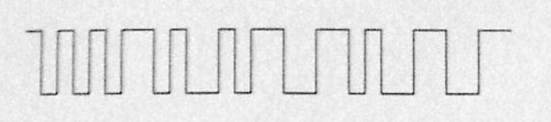
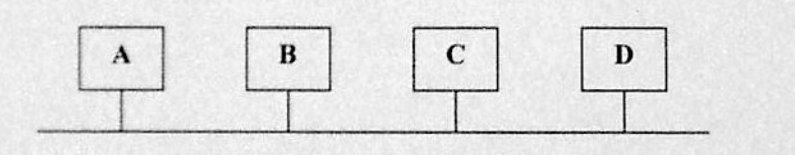

# III. Zadania

## Zadanie 1

Proszę rozważyć trzy procesy, każdy działający na innej maszynie. Każda maszyna ma lokalny czasomierz. W przypadku bez korekty czasu maszyn, proces P1 wysyła komunikat A w chwili 40\. Komunikat ten odbierany jest przez proces P2, wg jego lokalnego czasu w chwili 28\. Następnie proces P2 w hwili 30 wysyła komunikat B do procesu P3\. Proces P3 odbiera ten komunikat, wg jego lokalnego czasu, w chwili 42\. Proces P3 w chwili 47 wysyła komunikat C do procesów P1 i P2\. Komunikat ten jest odbierany przez proces P1 w chwili 47 wg jego czasu lokalnego, oraz w chwili 37 przez proces P2 wg jego czasu. Czasy których maszyn należy skorygować, kiedy i jak oraz jakie będą czasy nadania i odbioru komunikatów po dokonaniu synchronizacji logicznej czasu wymienionych maszyn, zgodnie z algorytmem Lamporta?

## Zadanie 2

Aplikacja używająca protokołu UDP, uruchomiona w sieci o MTU1=1494B, wysyła 3012 B danych użytkownika. Powstałe fragmenty następnie przesyłane są do drugiej sieci o MTU2=726B. Ile powstanie fragmentów oraz jakie jest ich przesunięcie i wielkość. Podaj w notacji `W@Przes_Flaga`. Opisz ramkę, w której przesyłany jest trzeci fragment po drugiej fragmentacji.

## Zadanie 3

Aplikacja używająca protokołu ICMP, uruchomiona w sieci o MTU1=1500B, wysyła 3022 B danych użytkownika. Powstałe fragmenty następnie przesyłane są do drugiej sieci o MTU2=730 B. Ile powstanie fragmentów oraz jakie jest ich przesunięcie i wielkość. Podaj w notacji `W@Przes_Flaga`. Opisz ramkę, w której przesyłany jest trzeci fragment po drugiej fragmentacji.

## Zadanie 4

Proszę rozpatrzyć możliwe plany współbieżnej realizacji następujących trzech transakcji:

```
a)  POCZĄTEK_TRANSAKCJI
    X = 3; Y = 0; X = X - Y; Y = Y - 2;
    KONIEC_TRANSAKCJI
b)  POCZĄTEK_TRANSAKCJI
    X = 2; Y = -3; X = X + 3; Y = X - Y + 1;
    KONIEC_TRANSAKCJI
c)  POCZĄTEK_TRANSAKCJI
    X = 0; X = X + 6; Y = 4; Y = Y + X;
    KONIEC_TRANSAKCJI
```

Proszę określić pełną listę dopuszczalnych wartości (rozdzielając je słowami "lub", ewentualnie "i"), które moggą przyjmować na końcu zmienne `x` i `y`. Proszę podać przykład niedopuszczalnego planu realizacji transakcji. Odpowiedź należy uzasadnić.

## Zadanie 5

Proszę porównać operacje czytania pliku za pomocą jednowątkowego serwera plików i serwa wielowątkowego. Otrzymane zamówienia na pracę, skierowanie go do wykonania i reszta niezbędnego przetwarzania zajmuje 8 ms, pod warunkiem, że potrzebne dane znajdują się w podręcznej pamięci bloków. Jeżeli istnieje konieczność wykonania operacji dyskowej, co stanowi jedną szóstą zamówień, potrzeba dodatkowo 60 ms, podczas których wątek jest uśpiony. Ile zamówień na sekundę może obsłużyć serwer jednowątkowy i jakie będzzie procentowe wykorzystanie czasu procesora? Ile zamówień na sekundę może obsłużyć serwer wielowątkowy i jakie będzie wówczas procentowe wykorzystanie czasu procesora? Proszę podać sposób rozwiązania i dokładnie uzasadnić.

## Zadanie 6

Z jakiej minimalnej sieci pochodzą komputery o adresach IP: `192.168.4.209` i `192.168.4.214`? Dokonaj obliczeń. Podaj adres IP tej sieci i maskę.

## Zadanie 7

Kiedy i w jakie sposób zachodzi przesyłanie bezpośrednie datagramu IP?

## Zadanie 8

Czy adres sprzętowy docelowy w ramce eternetowej ulega zmianie przy przesyłaniu pakietu danych przez kolejne routery? Odpowiedź uzasadnij.

## Zadanie 9

Co się dzieje z polem identyfikacja w nagłówku datagramu IP przy fragmentacji datagramu? Odpowiedź uzasadnij.

## Zadanie 10

W trakcie sesji FTP serwer wysyła do klienta fragment pliku o długości 1460 bajtów. Numer sekwencyjny (SeqNo) segmentu TCP mieszczącego te dane wynosi 7300. W jaki sposób klient potwierdzi, że otwrzymał ten segment od serwera?

## Zadanie 11

Jakie polecenie systemu Linux wypisze adresy interfejsów, przez które pakiet **opuszcza** routery znajdujące się na trasie do wskazanego komputera i z powrotem? Z którego pola nagłówka IP korzysta to polecenie? Ile najwięcej adresów może być wypisanych?

## Zadanie 12

Jakie polecenie systemu Linux wypisze interfejsy, przez które pakiet **wpływa** do routerów znajdujących się na trasie do komputera `213.135.45.252`? Które pole nagłówka IP jest tu w istotny sposób wykorzystywane? Jaki jest rozmiar tego pola w bitach?

## Zadanie 12

W trakcie sesji TCP strona A otrzymała od strony B segment potwierdzający odebranie danych wysłanych przez A. W segmencie tym pole "Window Size" miało wartość 10 KB. Ile kolejnych segmentów o maksymalnym rozmiarze może wysłać strona A bez oczekiwania na następne potwierdzenie od B? Zakłada się, że maksymalny rozmiar pola danych w segmentach wysyłanych przez A ma wynosić 1460 B.

## Zadanie 13

Pole "suma kontrola" w nagłówku TCP jest liczone z:
- [ ] nagłówka TCP
- [ ] nagłówka TCP i danych
- [ ] nagłówka TCP, danych i pseudonagłówka

## Zadanie 14

Przy nawiązywaniu połączenia za pomocą protokołu TCP w nagłówku drugiego segmentu są ustawione flagi:

- [ ] SYN
- [ ] SYN i ACK
- [ ] FIN i ACK

## Zadanie 15

Rekord zasobów typu SOA zawiera:

- [ ] adres e-mail administratora strefy
- [ ] czas odświeżania informacji dla zapasowych serwerów DNS
- [ ] adresy IP zapasowych serwerów DNS

## Zadanie 16

Rekord zasobów typu PTR zawiera:

- [ ] translację adresu IP na nazwę DNS
- [ ] translację nazwy DNS na adres IP
- [ ] adres IP serwera danej strefy

## Zadanie 16

Następujące trzy transakcje są realizowane współbieżnie:

- a) `x=3;y=2;x=x-y;y=x-1;`
- b) `x=2;y=0;x=x+7;y=x+y;`
- c) `x=0;x=x+6;y=1;y=y+x;`

- Podać pełną listę dopuszczalnych wartości tych zmiennych (rozdzielając je operatorami logicznymi "i" oraz "lub").
- Czy następujący plan realizacji transakcji jest dopuszczalny ze względu na właściwość izolacji?

```
{x=0;x=x+6;x=3;y=2;x=x-y;y=x-1;x=2;y=0;x=x+7;y=x+y;y=1;y=y+x;}
{x=0;x=x+6;y=1;y=y+x;x=3;y=2;x=x-y;y=x-1;x=2;y=0;x=x+7;y=x+y;}
{x=2;y=0;x=x+7;x=0;y=x+y;x=x+6;y=1;y=y+x;x=3;y=2;x=x-y;y=x-1;}
```

## Zadanie 17

Proszę porównać operacje czytania pliku za pomocą jednowątkowego i wielowątkowego serwera plików. Otrzymanie zamówienia na pracę, skierowanie go do wykonania i reszta niezbędnego przetwarzania zajmuje 8 ms, pod warunkiem, że potrzebne dane znajdują się w podręcznej pamięci bloków. Operacja dyskowa, występująca w jednej czwartej zamówień, zajmuje dodatkowo 48 ms, podczas których wątek jest uśpiony.

**Serwer jednowątkowy**

Ile zamówień na sekundę może obsłużyć serwer jednowątkowy? (z dokładnością do 1 zamówienia/sek)? Dla uproszczenia przyjmujemy, że po każdym zamówieniu wymagającym dostępu do dysku przychodzą trzy zamówienia bezdyskowe.

`125, 50, 40`

Jakie będzie procentowe wykorzystanie czasu procesora (z dokładnością do 1%):

`100%, 60%, 40%`

**Serwer wielowątkowy**

Ile zamówień na sekundę może obsłużyć serwer wielowątkowy? (z dokładnością do 1 zamówienia/sek)? Dla uproszczenia obliczeń proszę przyjąć, że po każdym zamówieniu wymagającym dostępu do dysku przychodzą trzy zamówienia bezdyskowe.

`125, 83, 67`

Jakie będzie procentowe wykorzystanie czasu procesora, (z dokładnością do 1%):

`100%, 67%, 50%`


## Zadanie 18

Wydzielić z sieci klasy C o adresie 192.168.1.0 trzy **jak najmniejsze** podsieci, w taki sposób, aby w pierwszej umieścić 25, w drugiej 30, a w trzeciej 120 komputerów. **Uwaga: podana kolejność nie może być zmieniona!** Dla każdej podsieci należy podać: adres, maskę (w wersji kropkowo-dziesiętnej), adres broadcast i pełny zakres adresów hostów.

## Zadanie 19

Skonstruować potok, który wypisze liczbę nasłuchujących serwerów UDP na lokalnej maszynie.

## Zadanie 20

Odbiorca otrzymał sygnał pokazany na rysunku. Wiadomo, że wykorzystywany jest kod Manchester, a także algorytm CRC, w którym wielomianem dzielnikiem (generatorem) jest $x^3+x^2+1$. Co zrobi odbiorca z otrzymaną informacją? Odpowiedź uzasadnij.



## Zadanie 21

Wiadomo, że konfiguracja komputerów pracujących w sieci przedstawionej na rysunku jest następująca:

- A: adres IP = 192.168.26.133; adres MAC = 8:0:20:b:b0:83
- B: adres IP = 192.168.26.134; adres MAC = 8:0:20:b:b0:84
- C: adres IP = 192.168.26.135; adres MAC = 8:0:20:b:b0:85
- D: adres IP = 192.168.26.136; adres MAC = 8:0:20:b:b0:86



W sieci tej zaobserwowano ramkę, której początek podany jest niżej:

```
ffff ffff ffff 0800 200b b083 0806 0001
0800 0604 0001 0800 200b b083 c0a8 1a85
ffff ffff ffff c0a8 1a87
```

Co dokładnie zawiera ta ramka? Jaką odpowiedź powinien odebrać komputer, który tę ramkę wysłał?

## Zadanie 22

Komputery A i B znajdują się w różnych podsieciach. Osoba korzystająca z komputera A poinformowała o braku łączności z komputerem B. Sprawdzając konfiguracje komputera A otrzymano następujące dane:

```
Adres IP:           130.100.183.100
Maska:              255.255.248.0
Default gateway:    130.100.184.101
```

Czy na ich podstawie można określić przyczynę braku łączności między komputerami A i B?

