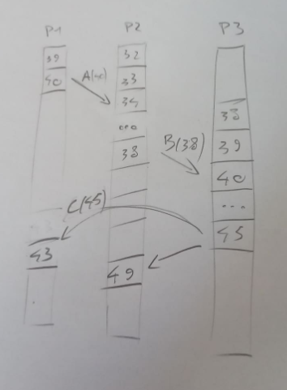
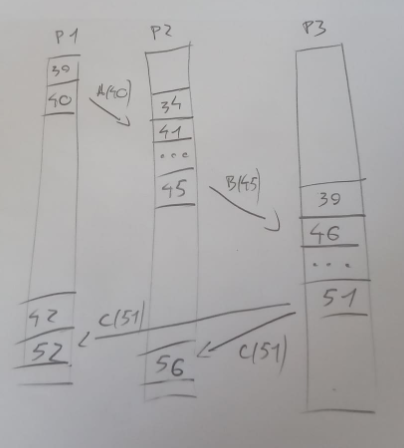

Proszę rozważyć trzy procesy, każdy działający na innej maszynie. Każda maszyna ma lokalny czasomierz. W przypadku bez korekty czasu maszyn, 


- proces P1 wysyła komunikat A w chwili 40. 
- Komunikat ten odbierany jest przez proces P2, wg jego lokalnego czasu w chwili 34. 
- Następnie proces P2 w chwili 38 wysyła komunikat B do procesu P3. 
- Proces P3 odbiera ten komunikat, wg jego lokalnego czasu, w chwili 40. 
- Proces P3 w chwili 45 wysyła komunikat C do procesów P1 i P2. 
- Komunikat ten jest odbierany przez proces P1 w chwili 43 wg jego czasu lokalnego, 
- oraz w chwili 49 przez proces P2 wg jego czasu. 

Czasy których maszyn należy skorygować, kiedy i jak oraz jakie będą czasy nadania i odbioru komunikatów po dokonaniu synchronizacji logicznej czasu wymienionych maszyn, zgodnie z algorytmem Lamporta? Przedstawić rozwiązanie na wykresie czasów maszyn i podać wyjaśnienie.
 
```
P1(40) -> A(40) -> P2(34)
P2(38) -> B(38) -> P3(40)
P3(45) -> C(45) -> P1(43)
P3(45) -> C(45) -> P2(49)
```

Wykres przed synchronizacją:



Synchronizacja wygląda następująco:
 
```
P1(40) -> A(40) -> P2(34) + 7 do P2
P2(45) -> B(45) -> P3(46) + 6 do P3
P3(51) -> C(51) -> P1(43) + 9 do P1
P3(51) -> C(51) -> P2(56)
```

Wykres po synchronizacji:



Po odebraniu wiadomości A w lokalnym czasie 34 proces P2 zostaje zsynchronizowany do czasu 41 przez dodanie 7 kwantów czasu. Następnie, W nowym czasie 45 P2 wysyła komunikat B(45) do procesu P3. P3 odbiera go w lokalnym czasie 40 i zostaje zsynchronizowany do czasu 46. W nowym czasie P3 wysyła komunikat C(51) do P1 oraz do P2. P1 odbiera go w lokalnym czasie 43 i zostaje zsynchronizowany do czasu 52 przez dodanie 9 kwantów czasu. Proces P2 odbiera go w czasie 56, nie zostaje zsynchronizowany.