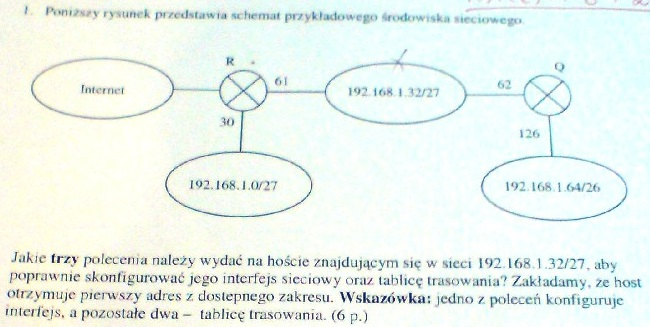
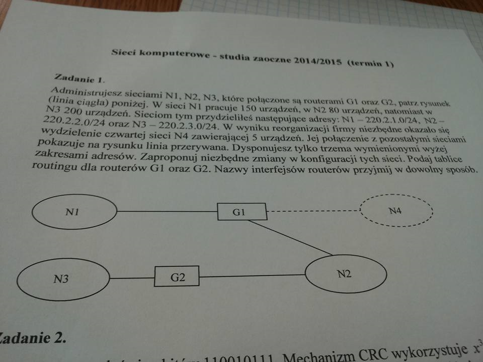

# Zadania

## Konfiguracja sieci IP

### Zadanie 1

Poniższy rysunek przedstawia schemat przykładowego środowiska sieciowego.

Jakie trzy polecenia należy wydać na hoście w sieci 192.168.1.128/27, aby skonfigurować jego interfejs sieciowy i tablicę trasowania?

### Zadanie 2

Poniższy rysunek przedstawia schemat przykładowego środowiska sieciowego.

Jakie **trzy** polecenia należy wydać na hoście w sieci 192.168.1.64/26 aby skonfigurować jego interfejs sieciowy i tablicę trasowania?

### Zadanie 3

Poniższszy rysunek przedstawia schemat przykładowego środowiska sieciowego.

Jakie **trzy** polecenia należy wydać na hoście znajdującym się w sieci 192.168.1.32/27, aby poprawnie skonfigurować jego interfejs sieciowy oraz tablicę trasowania? Zakładamy, że host otrzymuje pierwszy adres z dostępnego zakresu. **Wskazówka:** jedno z poleceń konfiguruje interfejs, a pozostałe dwa - tablicę trasowania.

## Interfejsy sieciowe

### Zadanie 1 

Utworzyć polecenie systemu Linux wypisujące interfejsy, przez które pakiet **wpływa** do routerów znajdujących się na trasie do wskazanego komputera? **Podać adresy tych interfejsów.** Z jakiego pola nagłówka IP korzysta to polecenie?

### Zadanie 2

Utworzyć polecenie systemu Linux wypisujące interfejsy, przez które pakiet **opuszcza** routery znajdujące się na trasie do wskazanego komputera i z powrotem? **Podać adresy tych interfejsów**. Z jakiego pola nagłówka IP korzysta to polecenie?

## Synchronizacja

### Zadanie 1

Rozważmy działanie trzech maszyn w systemie rozproszonym. Maksymalny współczynnik odchylenia zegara pierwszej maszyny: `5*10-5`, drugiej: `10*10-5`, trzeciej: `15*10-5`. Co ile sekund należy synchronizować zegary tych maszyn, aby maksymalne odchylenie między nimi było nie większe niż 60 milisekund? Ile **milisekund** wyniesie maksymalne odchylenie czasu drugiej maszyny między kolejnymi synchronizacjami?

### Zadanie 2

Rozważmy działanie trzech maszyn w systemie rozproszonym. Maksymalny współczynnik odchylenia zegara pierwszej maszyny wynosi `10*10-5`, drugiej `5*10-5`, trzeciej `10*10-5`. Co ile sekund należy synchronizować zegary tych maszyn, aby maksymalne odchylenie między nimi było nie większe niż 60 milisekund? Ile **milisekund** wyniesie maksymalne odchylenie czasu drugiej maszyny między kolejnymi synchronizacjami?

### Zadanie 3

Należy rozpatrzyć dzialanie trzech maszyn w systemie rozproszonym. Maksymalny współczynnik odchylenia zegara pierwszej maszyny wynosi `5*10-5`, drugiej - `4*10-5`, trzeciej - `10*10-5`. Co ile sekund należy synchronizować zegary tych maszyn, aby maksymalne odchylenie między nimi było nie większe niż 45 milisekund? Jakie będzie maksymalne odchylenie czasu drugiej maszyny między kolejnymi synchronizacjami?

### Zadanie 4

Rozważmy działanie trzech maszyn w systemie rozproszonym. Maksymalny współczynnik odchylenia zegara pierwszej maszyny wynosi `5*10^-5`, drugiej `10*10^-5`, trzeciej `20*10^-5`. Co ile sekund należy synchronizować zegary tych maszyn, aby maksymalne odchylenie między nimi było nie większe niż 60 milisekund? Ile milisekund wyniesie maksymalne odchylenie czasu pierwszej maszyn między kolejnymi synchronizacjami?

## Komunikaty ICMP

### Zadanie 1

W sieć, dla której MTU=296 (protokół PPP) wysyłany jest komunikat ICMP zawierający 900 bajtów danych. **Zakłada się, że nagłówek IP ma standardową długość 20 oktetów, a pole danych pakietu IP zawiera nagłówek ICMP o długości 8 oktetów.** Określić długość i przesunięcie każdego fragmentu stosując notację `długość @ przesunięcie MF/LF''`.

### Zadanie 2

W sieć, dla której MTU=576 (protokół X25) wysyłany jest komunikat ICMP zawierający 1800 bajtów danych. **Zakłada się, że nagłówek IP ma standardową długość 20 oktetów, a pole danych pakietu IP zawiera nagłówek ICMP o długości 8 oktetów.** Określić długość i przesunięcie każdego fragmentu stosując notację `długość @ przesunięcie MF/LF''`.

## Egzamin

### Zadanie 1

Administrujesz sieciami N1, N2, N3, które połączone są routerami G1 oraz G2, patrz rysunek (linia ciągła) poniżej. W sieci N1 pracuje 150 urządzeń, w N2 80 urządzeń, natomiast w N3 - 200 urządzeń. Sieciom tym przydzieliłeś następujące adresy:

- N1: 220.2.1.0/24,
- N2: 220.2.2.0/24,
- N3: 220.2.3.0/24.

W wyniku reorganizacji firmy niezbędne okazało się wydzielenie czwartej sieci N4 zawierającej 5 urządzeń. Jej połączenie z pozostałymi sieciami pokazuje na rysunku linia przerywana. Dysponujesz tylko trzema wymienionymi wyżej zakresami adresów. Zaproponuj niezbędne zmiany w konfiguracji tych sieci. Podaj tablice routingu dla routerów G1 oraz G2. Nazwy interfejsów routerów przyjmij w dowolny sposób.

## Zadanie 2

Nadawca ma wysłać ciąg bitów `110010111`. Mechanizm CRC wykorzystuje $x^3+1$ jako wielomian dzielnik (generator). Podaj ciąg bitów, który powinien pojawić się u odbiorcy.

## Zadanie 3

Plik o rozmiarze 1MB ma być przesłany do innego komputera. Kompresja tego pliku o 50% trwa 1 sekundę, natomiast kompresja o 60% trwa 2 sekundy. Jaka powinna być przepustowość łącza (mierzona liczbą bitów na sekundę), aby łączny czas kompresji i wysyłania tego pliku był taki sam w obu przypadkach?

## Zadanie 4

Wyjaśnij, jak wyznaczany jest w protokole TCP czas oczekiwania na potwierdzenie (ang. *timeout*). Omów niedostatki algorymu Jacobsena.

## Zadanie 5

Trzy segmenty sieci Ethernet połączone są (jeden za drugim) dwoma bridge'ami. Wyjaśnij, co będzie się działo, jeśli dwa skrajne segmenty połączone zostaną trzecim bridgem.

## Zadanie 6

Które pola w nagłówku datagramu IP i kiedy mogą być modyfikowane przez router?