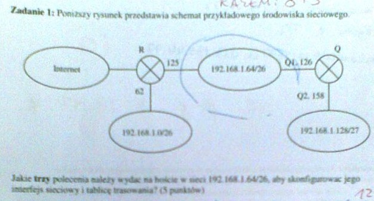
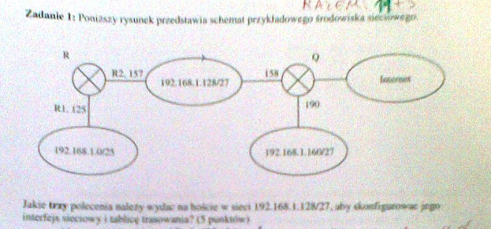

# Zadania

## Konfiguracja sieci IP

### Zadanie 1

Poniższy rysunek przedstawia schemat przykładowego środowiska sieciowego.

Jakie trzy polecenia należy wydać na hoście w sieci 192.168.1.128/27, aby skonfigurować jego interfejs sieciowy i tablicę trasowania?

### Zadanie 2

Poniższy rysunek przedstawia schemat przykładowego środowiska sieciowego.

Jakie **trzy** polecenia należy wydać na hoście w sieci 192.168.1.64/26 aby skonfigurować jego interfejs sieciowy i tablicę trasowania?

## Interfejsy sieciowe

### Zadanie 1 

Utworzyć polecenie systemu Linux wypisujące interfejsy, przez które pakiet **wpływa** do routerów znajdujących się na trasie do wskazanego komputera? **Podać adresy tych interfejsów.** Z jakiego pola nagłówka IP korzysta to polecenie?

### Zadanie 2

Utworzyć polecenie systemu Linux wypisujące interfejsy, przez które pakiet **opuszcza** routery znajdujące się na trasie do wskazanego komputera i z powrotem? **Podać adresy tych interfejsów**. Z jakiego pola nagłówka IP korzysta to polecenie?

## Synchronizacja

### Zadanie 1

Rozważmy działanie trzech maszyn w systemie rozproszonym. Maksymalny współczynnik odchylenia zegara pierwszej maszyny: `5*10-5`, drugiej: `10*10-5`, trzeciej: `15*10-5`. Co ile sekund należy synchronizować zegary tych maszyn, aby maksymalne odchylenie między nimi było nie większe niż 60 milisekund? Ile **milisekund** wyniesie maksymalne odchylenie czasu drugiej maszyny między kolejnymi synchronizacjami?

### Zadanie 2

Rozważmy działanie trzech maszyn w systemie rozproszonym. Maksymalny współczynnik odchylenia zegara pierwszej maszyny wynosi `10*10-5`, drugiej `5*10-5`, trzeciej `10*10-5`. Co ile sekund należy synchronizować zegary tych maszyn, aby maksymalne odchylenie między nimi było nie większe niż 60 milisekund? Ile **milisekund** wyniesie maksymalne odchylenie czasu drugiej maszyny między kolejnymi synchronizacjami?

### Zadanie 3

Należy rozpatrzyć dzialanie trzech maszyn w systemie rozproszonym. Maksymalny współczynnik odchylenia zegara pierwszej maszyny wynosi `5*10-5`, drugiej - `4*10-5`, trzeciej - `10*10-5`. Co ile sekund należy synchronizować zegary tych maszyn, aby maksymalne odchylenie między nimi było nie większe niż 45 milisekund? Jakie będzie maksymalne odchylenie czasu drugiej maszyny między kolejnymi synchronizacjami?

### Zadanie 4

Rozważmy działanie trzech maszyn w systemie rozproszonym. Maksymalny współczynnik odchylenia zegara pierwszej maszyny wynosi `5*10^-5`, drugiej `10*10^-5`, trzeciej `20*10^-5`. Co ile sekund należy synchronizować zegary tych maszyn, aby maksymalne odchylenie między nimi było nie większe niż 60 milisekund? Ile milisekund wyniesie maksymalne odchylenie czasu pierwszej maszyn między kolejnymi synchronizacjami?

## Komunikaty ICMP

### Zadanie 1

W sieć, dla której MTU=296 (protokół PPP) wysyłany jest komunikat ICMP zawierający 900 bajtów danych. **Zakłada się, że nagłówek IP ma standardową długość 20 oktetów, a pole danych pakietu IP zawiera nagłówek ICMP o długości 8 oktetów.** Określić długość i przesunięcie każdego fragmentu stosując notację `długość @ przesunięcie MF/LF''`.

### Zadanie 2

W sieć, dla której MTU=576 (protokół X25) wysyłany jest komunikat ICMP zawierający 1800 bajtów danych. **Zakłada się, że nagłówek IP ma standardową długość 20 oktetów, a pole danych pakietu IP zawiera nagłówek ICMP o długości 8 oktetów.** Określić długość i przesunięcie każdego fragmentu stosując notację `długość @ przesunięcie MF/LF''`.
